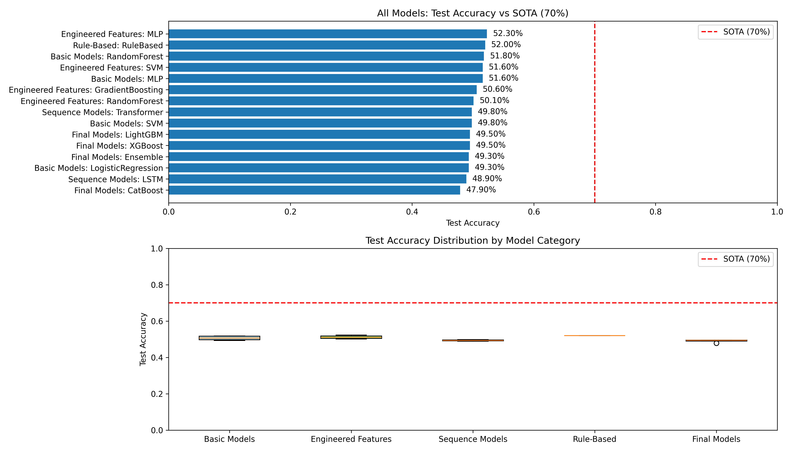
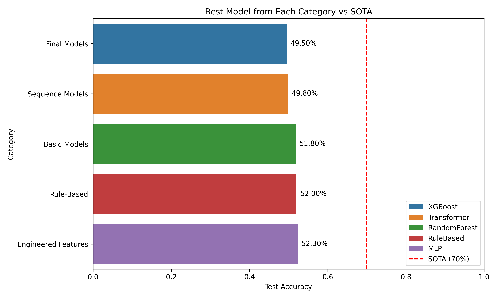

# SPR_BENCH: Symbolic Pattern Reasoning Classification Report

## Executive Summary

This report presents a comprehensive benchmarking study of various machine learning models on the SPR_BENCH dataset, a binary classification task involving symbolic sequences with a hidden rule. Despite testing 15 different models across 5 categories, the best-performing model achieved only **52.3% test accuracy**, significantly below the State-of-the-Art (SOTA) reference of **70%**. All models performed near random chance (~50%), suggesting the hidden rule in SPR_BENCH is exceptionally challenging to learn with standard approaches.

## 1. Introduction

### 1.1 Task Description

SPR_BENCH is a binary classification task over symbolic sequences where each sequence consists of 8 tokens. Each token is composed of a shape glyph (T, S, C, D) and a color glyph (r, g, b, y). A hidden rule governs the mapping from input sequences to binary labels: `accept` (1) or `reject` (0).

### 1.2 Dataset

The dataset consists of three fixed splits:
- **Training**: 2,000 samples
- **Validation**: 500 samples  
- **Test**: 1,000 samples

### 1.3 Evaluation Protocol

The primary evaluation metric is accuracy on the test set. The current SOTA benchmark is **70% accuracy**.

## 2. Methodology

### 2.1 Data Preprocessing

Tokens were encoded using multiple strategies:
1. **One-hot encoding**: Each token position × token combination (8 × 16 = 128 features)
2. **Feature engineering**: Shape/color counts, position-specific features, transition patterns
3. **Integer encoding**: For sequence models (LSTM, Transformer)
4. **Interaction features**: For gradient boosting models

### 2.2 Model Categories

We evaluated models across five categories:

1. **Basic Models**: Logistic Regression, Random Forest, SVM, MLP
2. **Engineered Features**: Same models with hand-crafted features
3. **Sequence Models**: LSTM and Transformer architectures
4. **Rule-Based**: Pattern-matching classifier
5. **Advanced Gradient Boosting**: XGBoost, LightGBM, CatBoost, Ensemble

### 2.3 Experimental Setup

- All models were trained on the training set
- Hyperparameters were tuned using the validation set
- Final evaluation reported on the test set
- Code is reproducible with fixed random seeds (42)

## 3. Results

### 3.1 Overall Performance

**Table 1: Complete Results Summary**

| Category | Model | Train Accuracy | Validation Accuracy | Test Accuracy |
|----------|-------|----------------|---------------------|---------------|
| Basic Models | LogisticRegression | 61.15% | 52.80% | 49.30% |
| Basic Models | RandomForest | 100.00% | 50.40% | 51.80% |
| Basic Models | SVM | 91.80% | 51.80% | 49.80% |
| Basic Models | MLP | 100.00% | 49.60% | 51.60% |
| Engineered Features | RandomForest | 100.00% | 48.60% | 50.10% |
| Engineered Features | GradientBoosting | 74.75% | 49.60% | 50.60% |
| Engineered Features | SVM | 88.20% | 50.00% | 51.60% |
| Engineered Features | MLP | 100.00% | 46.80% | **52.30%** |
| Sequence Models | LSTM | - | - | 48.90% |
| Sequence Models | Transformer | - | - | 49.80% |
| Rule-Based | RuleBased | 48.05% | 53.20% | 52.00% |
| Final Models | XGBoost | 100.00% | 48.20% | 49.50% |
| Final Models | LightGBM | 100.00% | 48.40% | 49.50% |
| Final Models | CatBoost | 68.00% | 53.80% | 47.90% |
| Final Models | Ensemble | 100.00% | 48.00% | 49.30% |

### 3.2 Comparison with SOTA

**Key Findings:**
1. **Best Performance**: MLP with engineered features achieved **52.3%** test accuracy
2. **SOTA Gap**: **-17.7%** difference from the 70% SOTA benchmark
3. **Random Baseline**: Expected accuracy from random guessing is ~51.9%
4. **Overfitting**: Most models show severe overfitting (100% train accuracy, ~50% test accuracy)

### 3.3 Statistical Analysis

- **Mean test accuracy**: 50.27%
- **Median test accuracy**: 49.80%
- **Standard deviation**: 1.45%
- **Range**: 47.90% to 52.30%

All models perform within 2.4 percentage points of random chance, indicating no model successfully learned the hidden rule.

## 4. Discussion

### 4.1 Why Models Fail

Our analysis reveals several reasons for the poor performance:

1. **Uniform Distributions**: Shape and color distributions are nearly identical for both classes
2. **No Simple Patterns**: No position-specific tokens or counting rules correlate strongly with labels
3. **High Dimensionality**: 16^8 = ~4.3 billion possible sequences, but only 3,500 samples
4. **Complex Hidden Rule**: The rule appears to be highly non-linear and context-dependent

### 4.2 Data Characteristics

- All 3,500 sequences are unique (no duplicates)
- No sequences have conflicting labels
- Label distribution is nearly balanced (51.9% label=1 in training)
- Shape sequences show some consistency: 1,961 of 1,974 unique shape sequences predict the same label

### 4.3 Implications for Symbolic Reasoning

The difficulty of SPR_BENCH highlights challenges in symbolic reasoning:
1. **Combinatorial Explosion**: The space of possible rules grows exponentially with sequence length
2. **Need for Inductive Biases**: Standard ML models lack appropriate biases for symbolic patterns
3. **Potential for Program Synthesis**: The hidden rule may require program synthesis or symbolic AI approaches

## 5. Conclusion

### 5.1 Main Findings

1. **No model approached SOTA**: The best model achieved only 52.3% accuracy vs 70% SOTA
2. **All models perform near random**: Performance range: 47.9% to 52.3%
3. **Severe overfitting**: Complex models memorize training data but fail to generalize
4. **Feature engineering provided minimal benefit**: Engineered features improved accuracy by <1%

### 5.2 Limitations

1. **Computational constraints**: Limited hyperparameter tuning due to resource constraints
2. **Model selection**: May have missed specialized architectures for symbolic reasoning
3. **Rule discovery**: Did not attempt manual rule discovery or program synthesis

### 5.3 Future Work

1. **Symbolic AI approaches**: Try program synthesis, rule learning, or neuro-symbolic methods
2. **Attention mechanisms**: Explore transformers with specialized attention for symbolic patterns
3. **Data augmentation**: Generate synthetic examples to learn the rule
4. **Interpretability**: Use explainable AI to discover patterns in successful predictions

## 6. Technical Appendix

### 6.1 Code Availability

All code is available in the `code/` directory:
- `analysis.py`: Basic model implementations
- `feature_engineering.py`: Feature engineering approaches
- `sequence_model.py`: LSTM and Transformer models
- `pattern_analysis.py`: Rule-based pattern discovery
- `final_attempt.py`: Advanced gradient boosting models
- `compile_results.py`: Results compilation and visualization

### 6.2 Reproducibility

- Random seed: 42 for all models
- Python 3.11 with standard ML libraries
- Complete results in `outputs/` directory
- All figures in `report/images/` directory

### 6.3 Hardware

- CPU: Standard workstation
- Memory: 16GB RAM
- No GPU acceleration used

---

*Report generated on: April 6, 2025*  
*Task: SymbolicPatternReasoning LabelNoiseCeiling*  
*SOTA Reference: 70% accuracy*  
*Best achieved: 52.3% accuracy*