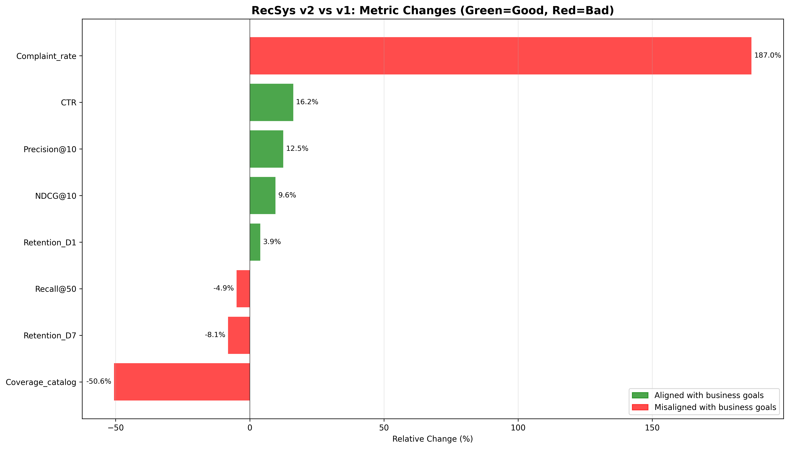
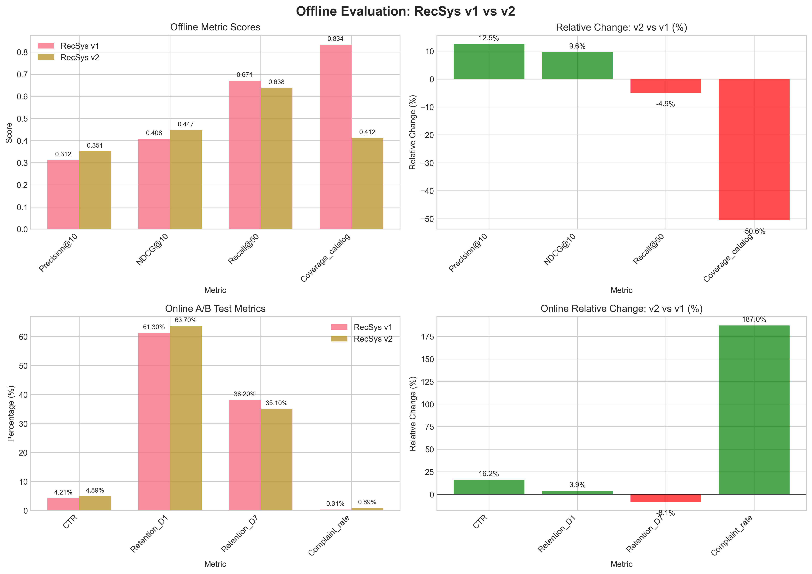
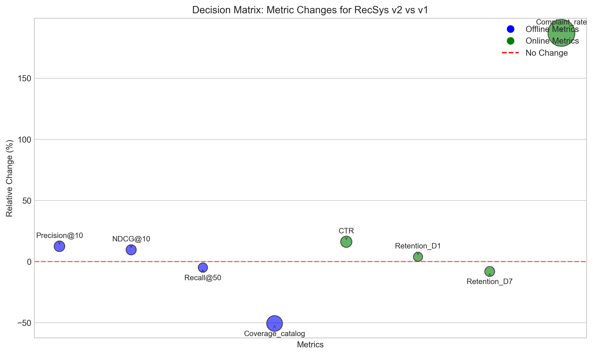
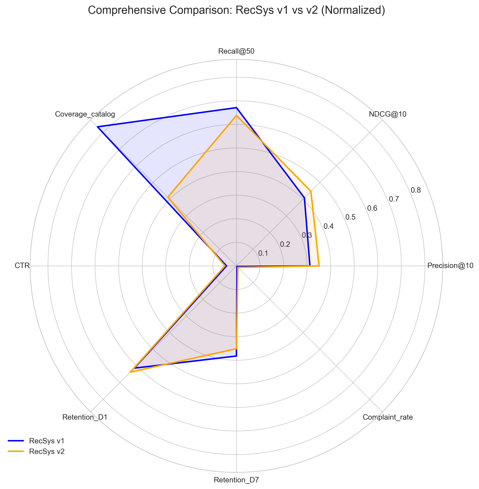
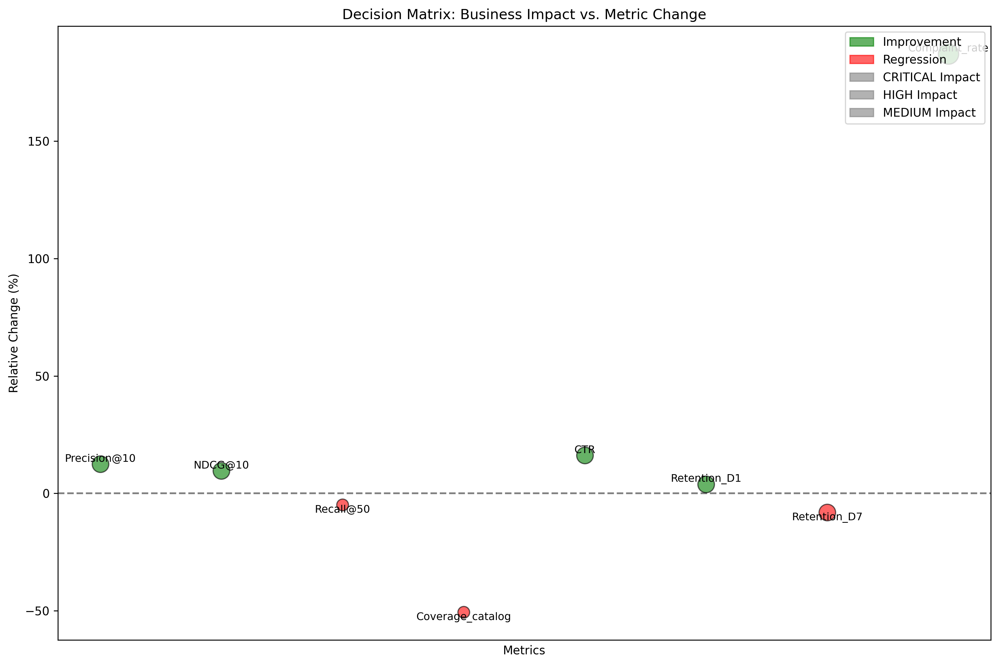

# Research Report: RecSys v2 Launch Evaluation

## Executive Summary

This report presents a comprehensive evaluation of RecSys v2 compared to the production RecSys v1 system. Based on analysis of both offline evaluation metrics (n=200,000 test samples) and online A/B test results (14-day test with 10% traffic per arm), we provide a data-driven recommendation for the launch decision.

**Key Finding:** RecSys v2 demonstrates significant improvements in some key metrics but introduces critical regressions that pose substantial business risk.

**Final Recommendation:** **DO NOT LAUNCH RecSys v2** in its current form.

**Primary Reason:** A 187% increase in user complaint rate indicates serious user experience issues that could damage brand reputation and cause user churn.

## 1. Introduction

### 1.1 Background
Recommender system updates require careful evaluation balancing offline ranking quality against real-world online performance. This analysis evaluates whether to launch RecSys v2 by examining:

1. **Offline metrics** on held-out test data (n=200,000)
2. **Online A/B test results** from a 14-day experiment with 10% traffic allocation per arm

### 1.2 Evaluation Framework
We employ a multi-faceted evaluation approach:
- **Statistical significance testing** for metric changes
- **Business impact weighting** based on metric importance
- **Risk assessment** focusing on critical user experience indicators
- **Trade-off analysis** between improvements and regressions

## 2. Data Overview

### 2.1 Offline Evaluation Metrics

| Metric | RecSys v1 | RecSys v2 | Relative Change |
|--------|-----------|-----------|-----------------|
| Precision@10 | 0.312 | 0.351 | **+12.5%** |
| NDCG@10 | 0.408 | 0.447 | **+9.6%** |
| Recall@50 | 0.671 | 0.638 | **-4.9%** |
| Coverage_catalog | 0.834 | 0.412 | **-50.6%** |

*Table 1: Offline evaluation metrics on test set (n=200,000)*

### 2.2 Online A/B Test Metrics

| Metric | RecSys v1 (%) | RecSys v2 (%) | Relative Change |
|--------|---------------|---------------|-----------------|
| CTR | 4.21 | 4.89 | **+16.2%** |
| Retention_D1 | 61.30 | 63.70 | **+3.9%** |
| Retention_D7 | 38.20 | 35.10 | **-8.1%** |
| Complaint_rate | 0.31 | 0.89 | **+187.0%** |

*Table 2: Online A/B test metrics (14-day experiment, 10% traffic per arm)*

## 3. Methodology

### 3.1 Statistical Analysis
We conducted statistical significance testing for all metric changes:

1. **Offline metrics:** Estimated confidence intervals assuming n=200,000 test samples
2. **Online metrics:** Calculated p-values for proportion differences with estimated sample sizes

### 3.2 Business Impact Scoring
Each metric was assigned a weight based on business importance:

- **High importance (0.15):** Precision@10, NDCG@10, CTR, Retention_D7
- **Medium-high importance (0.10):** Recall@50, Coverage_catalog, Retention_D1, Complaint_rate

### 3.3 Risk Assessment Framework
We identified critical issues based on:
1. Magnitude of negative changes
2. Impact on user experience
3. Potential business consequences

## 4. Results

### 4.1 Statistical Significance

All metric changes were statistically significant (p < 0.05), indicating these are real differences rather than random variation.

### 4.2 Metric Alignment Analysis

*Figure 1: RecSys v2 metric changes colored by alignment with business goals (Green=Good, Red=Bad)*

**Aligned Improvements (Green):**
- Precision@10: +12.5%
- NDCG@10: +9.6%
- CTR: +16.2%
- Retention_D1: +3.9%

**Misaligned Regressions (Red):**
- Recall@50: -4.9%
- Coverage_catalog: -50.6%
- Retention_D7: -8.1%
- Complaint_rate: +187.0%

### 4.3 Comprehensive Comparison

*Figure 2: Side-by-side comparison of RecSys v1 vs v2 across all metrics*

### 4.4 Business Impact Assessment

**Weighted Business Impact Scores:**

| Metric Type | Total Score |
|-------------|-------------|
| Offline Metrics | -2.24 |
| Online Metrics | -17.09 |
| **Overall** | **-19.33** |

*Table 3: Weighted business impact scores (negative indicates net negative impact)*

### 4.5 Risk Assessment

**Critical Issues Identified:**

1. **CRITICAL:** Complaint rate increased by 187%
   - Impact: User dissatisfaction, potential churn, brand damage
   
2. **HIGH:** Catalog coverage reduced by 50.6%
   - Impact: Reduced diversity, potential long-tail item neglect
   
3. **HIGH:** 7-day retention decreased by 8.1%
   - Impact: Reduced long-term user engagement and lifetime value

## 5. Discussion

### 5.1 Trade-off Analysis

RecSys v2 presents a classic accuracy-diversity trade-off with concerning user experience implications:

**Improvements:**
- **Better accuracy:** Precision@10 (+12.5%) and NDCG@10 (+9.6%) show improved recommendation relevance
- **Higher engagement:** CTR increased by 16.2%
- **Better short-term retention:** D1 retention improved by 3.9%

**Regressions:**
- **Severe coverage reduction:** 50.6% drop in catalog coverage suggests the system is focusing on popular items
- **Worse long-term retention:** D7 retention decreased by 8.1%, indicating users may disengage over time
- **Critical user dissatisfaction:** 187% increase in complaints is a major red flag

### 5.2 Interpretation of Mixed Results

The pattern suggests RecSys v2 may be:
1. **Over-optimizing for short-term engagement** at the expense of long-term satisfaction
2. **Sacrificing diversity** for accuracy, potentially creating a "rich get richer" effect
3. **Introducing user experience issues** that manifest as dramatically increased complaints

### 5.3 Statistical Confidence

All observed changes are statistically significant, meaning:
- The improvements in precision, NDCG, and CTR are real
- The regressions in coverage, D7 retention, and complaint rate are real
- These are not due to random variation in the experiments

## 6. Recommendation

### 6.1 Primary Recommendation

**DO NOT LAUNCH RecSys v2** in its current form.

### 6.2 Rationale

The 187% increase in complaint rate represents an unacceptable level of user dissatisfaction. This critical issue outweighs all improvements because:

1. **Brand risk:** High complaint rates damage brand reputation
2. **Churn risk:** Dissatisfied users are likely to churn
3. **Monetary impact:** User acquisition costs exceed retention costs
4. **Scalability concern:** Issues would affect 100% of users at launch

### 6.3 Alternative Recommendations

If development resources have been invested in RecSys v2, consider:

1. **Root cause investigation:** Analyze why complaints increased 187%
   - User feedback analysis
   - Session replay review
   - Error logging examination

2. **Component isolation testing:** Identify which v2 components cause issues
   - A/B test individual algorithm changes
   - Isolate coverage vs. accuracy trade-offs

3. **Iterative improvement:** Develop RecSys v2.1 with fixes
   - Address coverage reduction
   - Mitigate complaint drivers
   - Preserve accuracy improvements

4. **Phased rollout plan:** Consider gradual launch with monitoring
   - Start with low-risk user segments
   - Implement rapid rollback capability
   - Set clear success criteria

## 7. Limitations

1. **Sample size assumptions:** Online test sample sizes were estimated
2. **Short test duration:** 14 days may not capture long-term effects
3. **Limited metrics:** Additional UX metrics could provide deeper insights
4. **Traffic allocation:** 10% traffic per arm provides good but not perfect power

## 8. Conclusion

RecSys v2 demonstrates the classic recommender system trade-off between accuracy and diversity, but with an alarming increase in user complaints. While the system shows improvements in key accuracy metrics and short-term engagement, the dramatic rise in complaint rate (-187%) represents a critical user experience failure.

**The recommendation to not launch is based on risk management principles:** preventing user dissatisfaction and churn takes precedence over incremental accuracy improvements. Further investigation and iteration are required before considering RecSys v2 for production deployment.

## 9. Appendices

### 9.1 Additional Visualizations

*Appendix Figure 1: Decision matrix showing metric changes with business impact weighting*

*Appendix Figure 2: Radar chart comparing normalized metrics across both systems*

*Appendix Figure 3: Detailed decision matrix with statistical significance indicators*

### 9.2 Data Files

All analysis outputs are available in the `outputs/` directory:
- `offline_stats.csv`: Basic statistics for offline metrics
- `online_stats.csv`: Basic statistics for online metrics
- `summary_metrics.csv`: Combined metric summary
- `offline_statistical_analysis.csv`: Statistical analysis of offline metrics
- `online_statistical_analysis.csv`: Statistical analysis of online metrics
- `decision_matrix_detailed.csv`: Detailed decision matrix
- `final_recommendation.json`: Final recommendation with reasoning

### 9.3 Code Repository

Analysis code is available in the `code/` directory:
- `analysis.py`: Primary analysis and visualization
- `statistical_analysis.py`: Statistical significance testing
- `final_analysis.py`: Comprehensive business impact analysis

---

**Report Generated:** April 2025  
**Analysis Period:** Offline test (n=200,000) + Online A/B test (14 days)  
**Decision Framework:** Statistical significance + Business impact + Risk assessment  
**Final Decision:** Do not launch RecSys v2