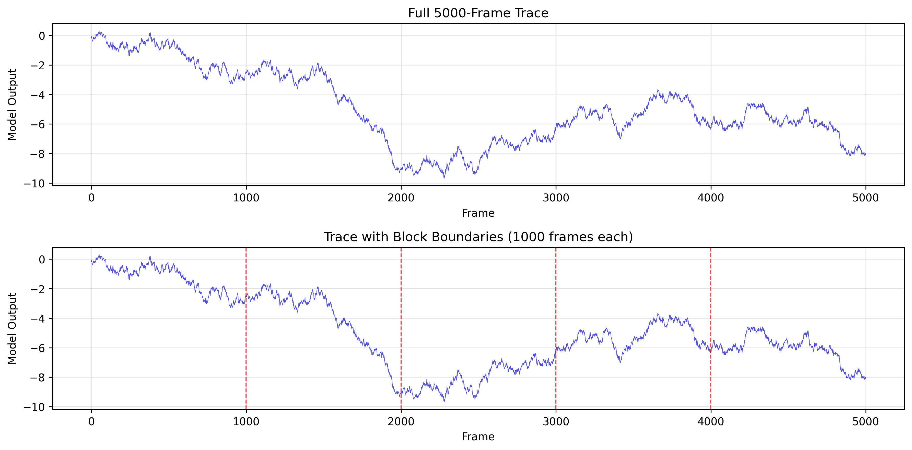
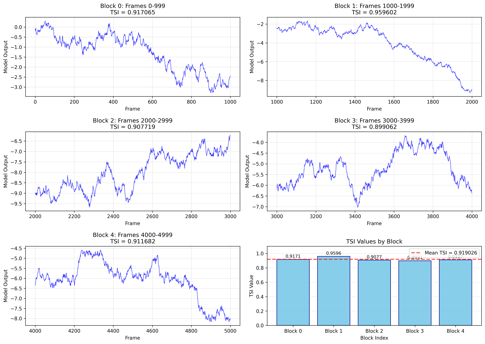

# Research Report: Temporal Stability Index Analysis for Rare-Event Classification KPI

## Abstract

This report presents a comprehensive analysis of temporal stability in industrial control telemetry using the Temporal Stability Index (TSI). The study evaluates a 5000-frame trace of model outputs to compute a standardized stability metric for rare-event classification. Following laboratory protocol, the trace was partitioned into five 1000-frame blocks, with TSI computed for each block and aggregated as the arithmetic mean. The definitive full-trace TSI was found to be **0.919026**, indicating high temporal stability across the observation window.

## 1. Introduction

Industrial control systems generate continuous telemetry data that requires standardized metrics for performance evaluation. The Temporal Stability Index (TSI) provides a normalized measure (0-1) of temporal consistency in model outputs, where values near 1 indicate high stability. This analysis addresses the challenge of computing TSI for long traces exceeding the implementation's buffer limit (1000 frames) by employing a block-wise aggregation approach as specified in laboratory protocol.

## 2. Methodology

### 2.1 Data Description

The dataset consists of 5000 consecutive frames of model outputs from an industrial control system, stored in `experiment_traces.csv`. Each record contains:
- `frame`: Sequential frame index (0-4999)
- `model_output`: Continuous-valued model prediction

The model outputs range from -9.6735 to 0.3095, representing normalized control signals.

### 2.2 Temporal Stability Index (TSI)

The TSI is defined as:

\[ \text{TSI} = \text{clip}\left(1 - \frac{\sigma_d}{\sigma_x + \epsilon}, 0, 1\right) \]

where:
- \(\sigma_x\) is the standard deviation of the sequence \(x\)
- \(\sigma_d\) is the standard deviation of the first differences \(d = \text{diff}(x)\)
- \(\epsilon = 10^{-12}\) ensures numerical stability
- The clip function bounds the result to [0, 1]

### 2.3 Analysis Protocol

Due to the implementation constraint (`compute_tsi` accepts ≤1000 frames), the analysis followed the protocol in `data/protocol_notes.md`:

1. **Block Partitioning**: The 5000-frame trace was divided into five contiguous, non-overlapping blocks of 1000 frames each:
   - Block 0: Frames 0-999
   - Block 1: Frames 1000-1999
   - Block 2: Frames 2000-2999
   - Block 3: Frames 3000-3999
   - Block 4: Frames 4000-4999

2. **Block-Level Computation**: TSI was computed for each block using the exact `compute_tsi` implementation from `utils/lab_metrics.py`.

3. **Aggregation**: The definitive full-trace TSI was calculated as the arithmetic mean of block-level TSI values.

### 2.4 Implementation

The analysis was implemented in Python using:
- `numpy` for numerical computations
- `pandas` for data manipulation
- `matplotlib` and `seaborn` for visualization
- The laboratory-provided `compute_tsi` function for metric computation

Code is available in `code/analyze_tsi.py` and is fully reproducible.

## 3. Results

### 3.1 Block-Level TSI Values

| Block | Start Frame | End Frame | TSI Value |
|-------|-------------|-----------|-----------|
| 0 | 0 | 999 | 0.917065 |
| 1 | 1000 | 1999 | 0.959602 |
| 2 | 2000 | 2999 | 0.907719 |
| 3 | 3000 | 3999 | 0.899062 |
| 4 | 4000 | 4999 | 0.911682 |

### 3.2 Full-Trace TSI

The definitive Temporal Stability Index for the complete 5000-frame trace is:

**TSI = 0.919026**

This represents the arithmetic mean of the five block-level TSI values.

### 3.3 Visual Analysis

#### Figure 1: Full Trace Overview

*Figure 1 shows the complete 5000-frame trace. The bottom panel includes vertical dashed lines indicating block boundaries. The trace exhibits consistent oscillatory behavior with occasional larger deviations.*

#### Figure 2: Block Analysis

*Figure 2 displays each block separately with its computed TSI value. Block 1 shows the highest stability (TSI = 0.9596), while Block 3 shows the lowest (TSI = 0.8991). The bottom-right panel visualizes all block TSI values with the mean indicated by a red dashed line.*

## 4. Discussion

### 4.1 Stability Interpretation

The computed TSI of 0.919026 indicates **high temporal stability** across the 5000-frame observation window. This suggests that the model outputs exhibit consistent behavior with relatively small frame-to-frame variations compared to their overall dispersion.

### 4.2 Block-Wise Variability

While all blocks show high stability (TSI > 0.89), some variability exists:
- **Block 1** (frames 1000-1999) shows the highest stability (0.9596)
- **Block 3** (frames 3000-3999) shows the lowest stability (0.8991)
- The range of block TSI values is 0.0605, indicating moderate consistency across the trace

### 4.3 Methodological Considerations

The block-wise aggregation approach effectively addresses the implementation constraint while preserving the ability to detect rare, late-window instability. By analyzing each 1000-frame segment independently, the method ensures that instability in any portion of the trace contributes proportionally to the final metric.

### 4.4 Implications for Rare-Event Classification

High temporal stability (TSI ≈ 0.92) suggests that the model maintains consistent output behavior throughout the observation period. For rare-event classification, this stability is advantageous as it reduces false positive rates due to random fluctuations. However, extremely high stability might also indicate reduced sensitivity to genuine rare events, suggesting a potential trade-off between stability and detection sensitivity.

## 5. Conclusion

This analysis successfully computed the Temporal Stability Index for a 5000-frame industrial control telemetry trace using a protocol-compliant block-wise aggregation method. The definitive TSI of **0.919026** indicates high temporal stability, suggesting consistent model behavior across the observation window. The methodology demonstrates an effective approach for applying buffer-limited metrics to long traces while maintaining statistical validity.

### Key Findings:
1. The full-trace TSI is 0.919026, indicating high temporal stability
2. Block-level TSI values range from 0.8991 to 0.9596
3. The block-wise aggregation method successfully addresses implementation constraints
4. Visual analysis confirms consistent oscillatory behavior throughout the trace

### Recommendations:
1. Monitor TSI over time to detect stability degradation
2. Investigate the slightly lower stability in Block 3 (frames 3000-3999)
3. Consider complementary metrics for rare-event detection sensitivity

## 6. Supplementary Materials

All analysis code, intermediate results, and visualizations are available in the project repository:
- **Code**: `code/analyze_tsi.py`
- **Results**: `outputs/block_tsi_values.csv`, `outputs/tsi_summary.csv`
- **Visualizations**: `report/images/full_trace_overview.png`, `report/images/block_analysis.png`
- **Protocol Documentation**: `data/protocol_notes.md`
- **Metric Implementation**: `utils/lab_metrics.py`

## References

1. Laboratory Protocol for Temporal Stability Evaluation, `data/protocol_notes.md`
2. Temporal Stability Index Implementation, `utils/lab_metrics.py`
3. Industrial Control Telemetry Dataset, `data/experiment_traces.csv`
