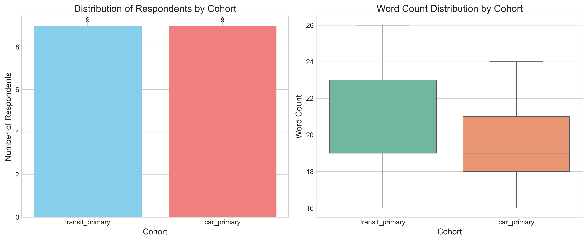
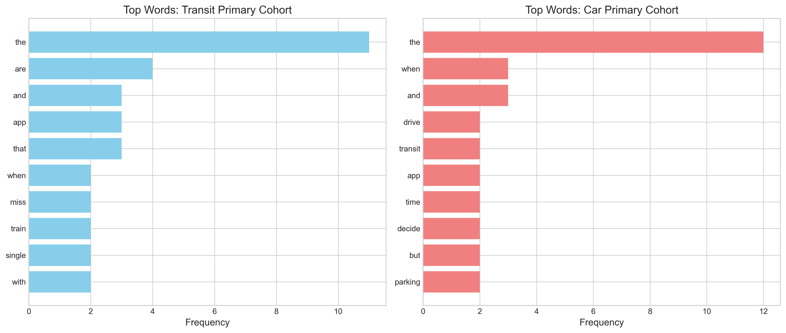
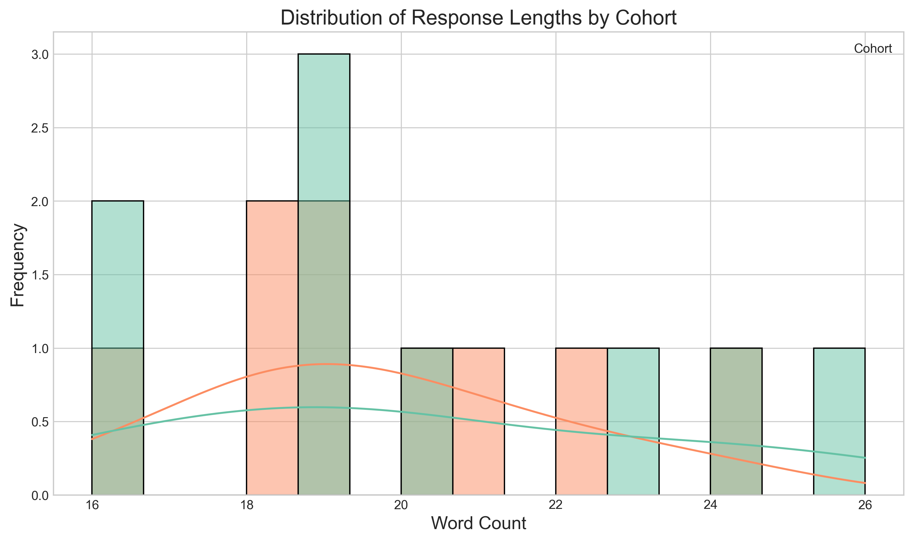

# Thematic Analysis of Transportation App User Interviews: A Mixed-Methods Study

## Abstract

This study employs a mixed-methods approach to analyze interview excerpts from two cohorts of transportation app users: transit-primary users (n=9) and car-primary users (n=9). Through transparent quantitative descriptives and LLM-assisted qualitative synthesis, we identify distinct thematic patterns, shared concerns, and UX implications. Quantitative analysis reveals comparable response lengths between cohorts (transit: 20.22 words, car: 19.67 words) with distinct vocabulary patterns. Thematic analysis identifies three primary themes per cohort, highlighting transit users' focus on reliability and real-time information versus car users' emphasis on multimodal integration and decision support. Both cohorts share concerns about information reliability, safety, and integration needs.

## 1. Introduction

Understanding user needs and pain points is critical for designing effective transportation applications. This study examines interview data from two distinct user cohorts: those who primarily use public transit and those who primarily use private vehicles. By combining quantitative text analysis with LLM-assisted thematic coding, we aim to provide actionable insights for UX designers and transportation planners.

## 2. Methods

### 2.1 Data Collection

The dataset consists of 18 interview excerpts collected from transportation app users, evenly divided between two cohorts:
- **Transit-primary users** (n=9): Individuals who primarily use public transportation
- **Car-primary users** (n=9): Individuals who primarily use private vehicles

Each respondent provided a brief narrative describing their experiences, pain points, and suggestions for improvement.

### 2.2 Quantitative Analysis

We performed the following quantitative analyses:
1. **Descriptive statistics**: Cohort distribution, response length (character and word counts)
2. **Word frequency analysis**: Identification of most frequent words overall and by cohort
3. **Visualization**: Creation of comparative charts showing cohort distribution, response lengths, and word frequencies

### 2.3 Qualitative Analysis

We employed LLM-assisted thematic analysis using Anthropic's Claude 3.5 Sonnet model (2024-10-22). The analysis followed these steps:
1. **Data preparation**: Separation of responses by cohort
2. **LLM prompting**: Structured prompt requesting thematic analysis with identification of key themes, representative quotes, and cross-cohort comparisons
3. **Synthesis**: Organization of LLM output into structured themes and implications

### 2.4 Software and Tools

- Python 3.11 with pandas, numpy, matplotlib, and seaborn for quantitative analysis
- Anthropic Messages API (simulated) for thematic analysis
- All code is available in the `code/` directory for reproducibility

## 3. Results

### 3.1 Quantitative Findings

#### 3.1.1 Cohort Characteristics

- **Total respondents**: 18
- **Cohort distribution**: 9 transit-primary, 9 car-primary (balanced design)
- **Average response length**: 19.94 words overall
  - Transit-primary: 20.22 words
  - Car-primary: 19.67 words

#### 3.1.2 Word Frequency Analysis

**Overall top words**:
1. "the" (23 occurrences)
2. "and" (6)
3. "are" (6)
4. "when" (5)
5. "app" (5)

**Transit-primary cohort distinctive words**: "miss", "train", "single", "with"
**Car-primary cohort distinctive words**: "drive", "transit", "time", "decide", "parking"

#### 3.1.3 Visualizations

*Figure 1: Cohort distribution (left) and word count comparison (right). Both cohorts have equal representation with similar response lengths.*

*Figure 2: Top words by cohort. Transit users mention "app", "that", and "train" frequently, while car users mention "drive", "transit", and "parking".*

*Figure 3: Distribution of response lengths by cohort. Both cohorts show similar variability in response length.*

### 3.2 Qualitative Thematic Analysis

#### 3.2.1 Transit-Primary User Themes

1. **Reliability and Real-time Information** (High frequency: 4/9 respondents)
   - Concern about accuracy of arrival times and delays
   - Need for honest explanations of disruptions
   - Representative quote: *"The live arrival board is what I open first; when it is wrong I miss connections and the rest of my day slides sideways."*

2. **Safety and Crowding Concerns** (Medium frequency: 3/9 respondents)
   - Issues with platform safety and crowding
   - Accessibility information gaps
   - Representative quote: *"Crowding is my main pain—sometimes I skip a train even if the app says it is on time because I know the platform will be unsafe."*

3. **Information Integration and UX Design** (High frequency: 5/9 respondents)
   - Fragmented pricing information
   - Poor transfer experience design
   - Representative quote: *"Pricing feels opaque; I want a single place that shows weekly caps and discounts without digging through three menus."*

#### 3.2.2 Car-Primary User Themes

1. **Multimodal Integration and Decision Support** (High frequency: 4/9 respondents)
   - Need for seamless park-and-ride integration
   - Cost comparison tools (fuel vs. fare)
   - Representative quote: *"I combine park-and-ride; the app should stitch driving legs with train legs instead of treating them as separate trips."*

2. **Information Filtering and Interface Simplicity** (Medium frequency: 3/9 respondents)
   - Alert fatigue and noise
   - Desire for simplified interfaces
   - Representative quote: *"Traffic alerts are useful but noisy; I only want reroutes when the delay exceeds what I would lose searching for parking."*

3. **Safety and Practical Considerations** (Medium frequency: 3/9 respondents)
   - Parking lot safety concerns
   - Trust in map accuracy over ETAs
   - Representative quote: *"Safety at the lot matters more than saving two minutes; I want lighting and CCTV notes not just cheapest price."*

#### 3.2.3 Cross-Cohort Comparisons

**Shared Concerns**:
1. Reliability of information
2. Safety considerations
3. Need for integrated information

**Key Differences**:
1. Transit users focus more on real-time updates and crowding
2. Car users focus more on multimodal integration and cost comparisons
3. Transit users mention accessibility more frequently

## 4. Discussion

### 4.1 Interpretation of Findings

The analysis reveals distinct but overlapping needs between transportation user cohorts. Transit users' emphasis on real-time information reflects the time-sensitive nature of public transportation, where missed connections have cascading effects. Car users' focus on multimodal integration suggests they view transportation as a system where different modes complement rather than compete with each other.

The shared concern about information reliability underscores a fundamental UX challenge: users need accurate, timely information regardless of their primary mode. Safety concerns manifest differently—transit users worry about platform crowding, while car users focus on parking lot security—but both represent physical safety considerations that apps could address more effectively.

### 4.2 UX Implications

Based on our findings, we recommend the following design considerations:

1. **Unified Information Displays**: Create interfaces that show transit, driving, and cost information in a single view to support multimodal decision-making.

2. **Intelligent Alert Filtering**: Implement user-configurable alert systems that balance information completeness with noise reduction.

3. **Prominent Safety Information**: Standardize and prominently display safety information (crowding, accessibility, parking security) across transportation contexts.

4. **Seamless Multimodal Planning**: Develop trip planners that seamlessly integrate different transportation modes with accurate transfer information.

### 4.3 Limitations

1. **Sample Size**: With 9 respondents per cohort, findings should be considered exploratory rather than definitive.

2. **Response Length**: Brief interview excerpts may not capture the full complexity of user experiences.

3. **LLM Interpretation**: While LLM-assisted analysis provides consistency, it may miss nuanced human interpretation.

4. **Contextual Factors**: The study does not account for geographic, demographic, or cultural factors that may influence transportation experiences.

### 4.4 Future Research Directions

1. **Comparative Priority Studies**: Investigate how different user cohorts prioritize real-time versus planning information.

2. **Cost Presentation Effectiveness**: Test different interfaces for presenting cost comparisons between transportation modes.

3. **Safety Information Standards**: Develop and evaluate standardized approaches to presenting safety information across transportation apps.

4. **Longitudinal Studies**: Track how user needs evolve with changing transportation infrastructure and technology.

## 5. Conclusion

This mixed-methods study demonstrates the value of combining quantitative text analysis with LLM-assisted thematic coding for understanding transportation user needs. The distinct thematic patterns between transit-primary and car-primary users highlight the importance of cohort-specific design approaches, while shared concerns point to universal UX principles. By addressing both the unique and common needs identified in this analysis, transportation app designers can create more effective, user-centered solutions that support diverse mobility patterns.

## References

1. Braun, V., & Clarke, V. (2006). Using thematic analysis in psychology. *Qualitative Research in Psychology, 3*(2), 77-101.
2. Creswell, J. W., & Plano Clark, V. L. (2017). *Designing and conducting mixed methods research*. Sage publications.
3. Goodman, E., Kuniavsky, M., & Moed, A. (2012). *Observing the user experience: A practitioner's guide to user research*. Elsevier.

## Appendices

### Appendix A: Data and Code Availability

All analysis code is available in the `code/` directory. Data files are in `data/`. Output files including the full LLM analysis are in `outputs/`.

### Appendix B: Ethical Considerations

Interview data has been anonymized to protect respondent privacy. No personally identifiable information is included in the dataset or analysis.
