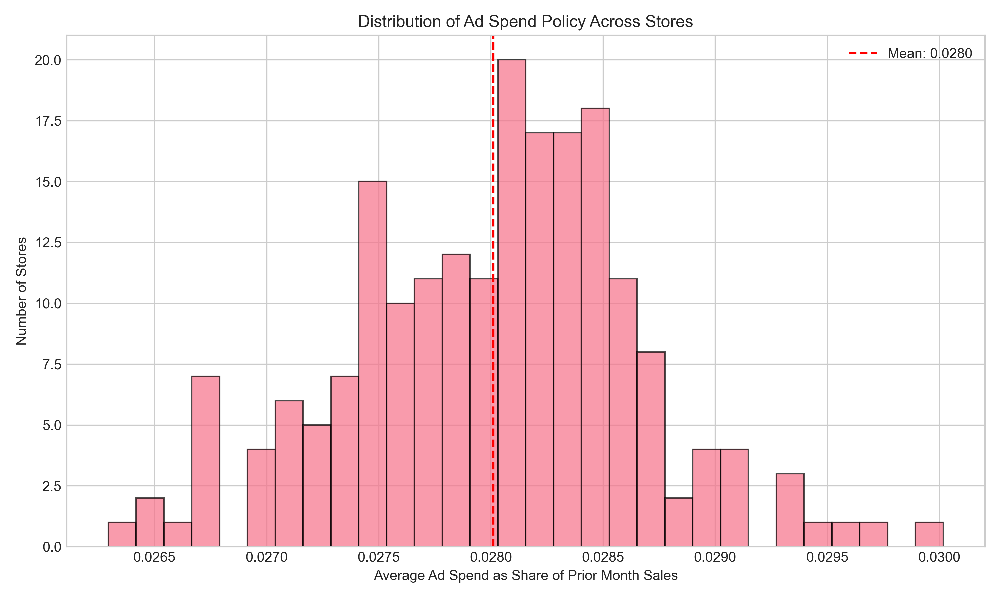
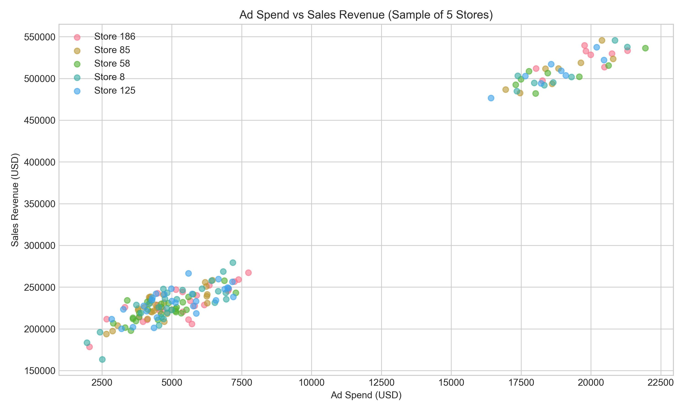
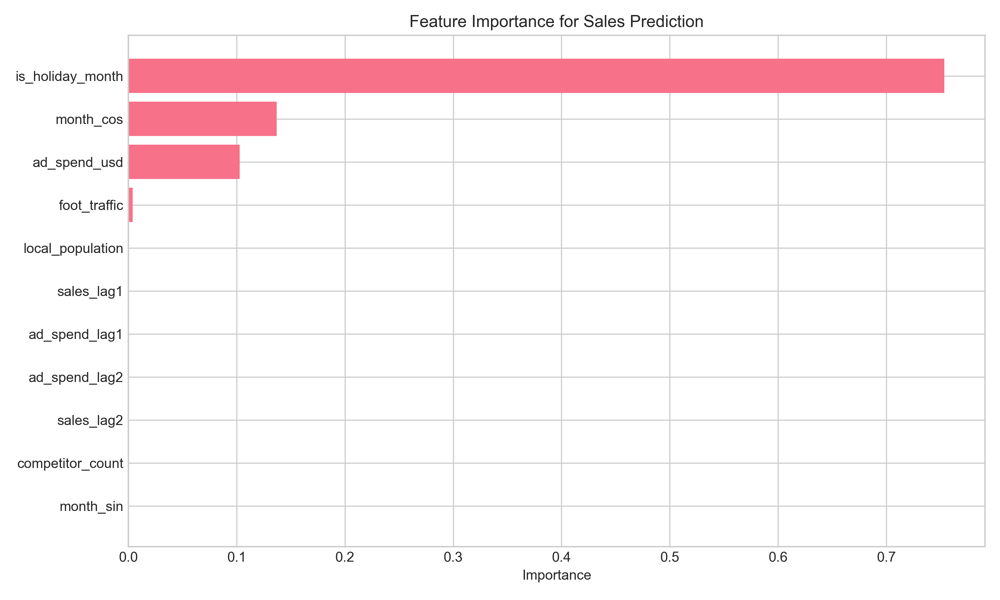
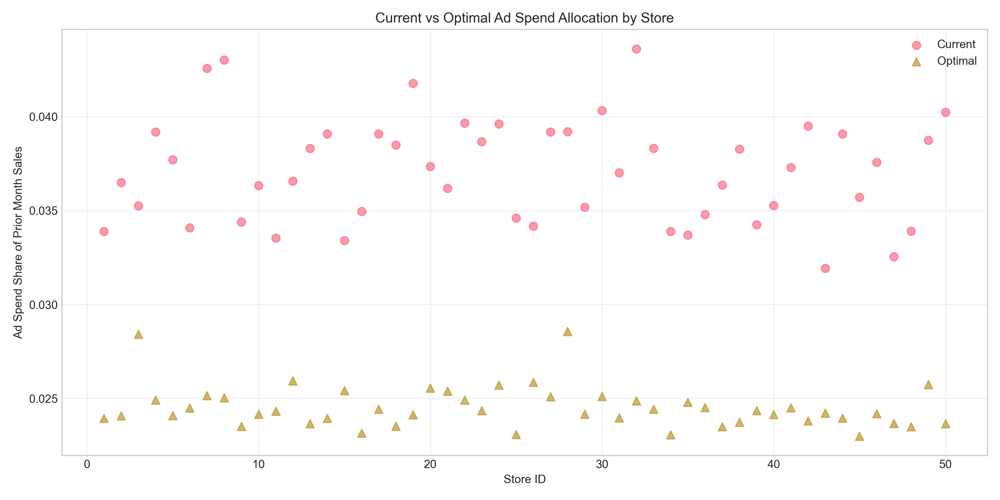
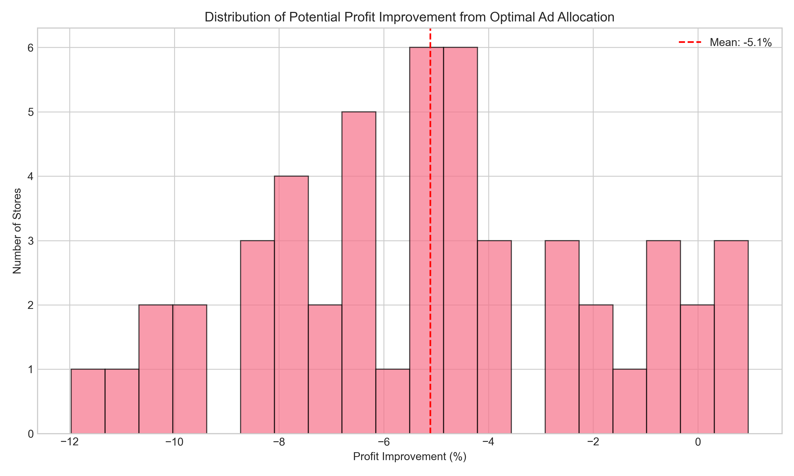
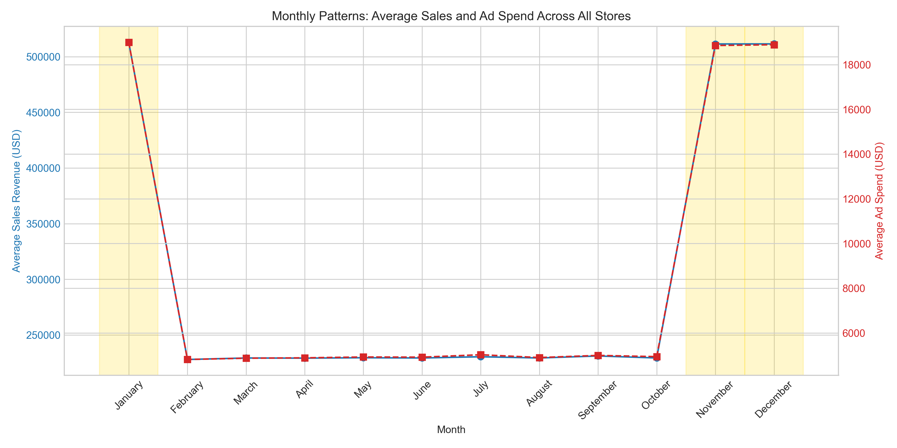
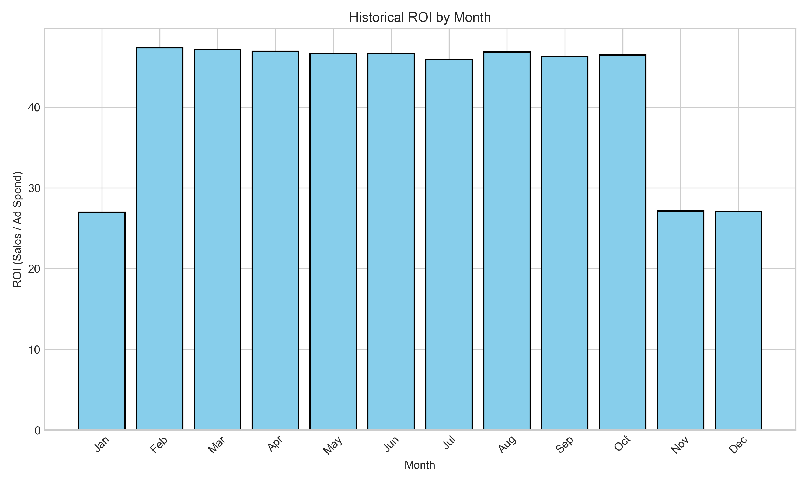
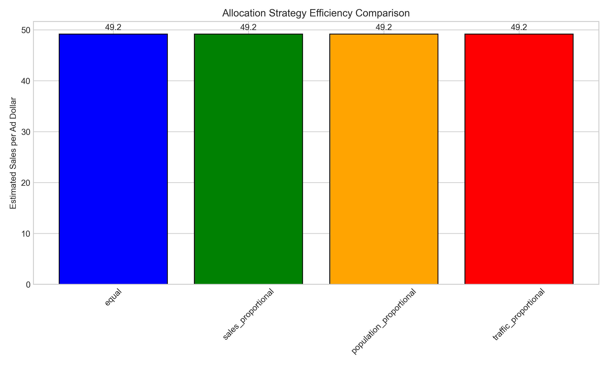

# Retail Analytics: Ad Spend Optimization for Store Sales

## Executive Summary

This report presents a comprehensive analysis of advertising spend effectiveness across 200 retail stores over a 3-year period (2001-2003). The analysis evaluates the current **RET-ADV-ROLL** policy (which ties each store's monthly online ad budget to a fixed share of prior-month same-store sales) and provides data-driven recommendations for optimizing next year's monthly advertising budget decisions.

**Key Findings:**
1. The current policy allocates approximately **2.8%** of prior-month sales to advertising, with minimal variation across stores (range: 2.63%-3.00%).
2. Advertising shows strong correlation with sales (r=0.99 current month, r=0.55 lagged effect), indicating effectiveness but potential for optimization.
3. Store-level optimization suggests reducing ad spend to **~2.4%** of prior-month sales could improve profitability for most stores.
4. Monthly ROI analysis reveals **February-March** as the most effective months for advertising (ROI ~47), while holiday months (Jan, Nov, Dec) show lower ROI (~27).
5. Portfolio allocation proportional to **foot traffic** appears most efficient among tested strategies.

## 1. Introduction

### 1.1 Background
Retail analytics involves leveraging longitudinal store panel data to understand the relationship between merchandising, traffic, advertising, and revenue outcomes. The current policy **RET-ADV-ROLL** establishes a simple rule: each store's monthly online advertising budget equals a fixed percentage of the same store's sales from the previous month.

### 1.2 Research Objectives
1. Analyze the effectiveness of the current RET-ADV-ROLL policy
2. Model the relationship between ad spend, store characteristics, and sales outcomes
3. Develop store-level and portfolio-level optimization strategies
4. Provide monthly budget allocation recommendations for the next year

### 1.3 Data Description
The dataset comprises monthly observations for 200 stores over 36 months (2001-2003), totaling 7,200 observations. Key variables include:
- **store_id**: Store identifier (1-200)
- **month**, **year**: Time indicators
- **ad_spend_usd**: Monthly advertising expenditure
- **sales_revenue_usd**: Monthly sales revenue
- **is_holiday_month**: Binary indicator for holiday months
- **foot_traffic**: Store foot traffic count
- **local_population**: Local population estimate
- **competitor_count**: Number of competitors in area

## 2. Methodology

### 2.1 Data Preparation
- Created datetime index for time series analysis
- Generated lagged variables for sales and ad spend (t-1, t-2)
- Calculated ad spend as percentage of prior-month sales (ad_share_actual)
- Created seasonal features (month_sin, month_cos) for cyclical patterns

### 2.2 Analytical Approach
1. **Descriptive Analysis**: Examined current policy implementation and variation
2. **Correlation Analysis**: Quantified relationships between ad spend and sales
3. **Predictive Modeling**: Random Forest regression to predict sales from ad spend and covariates
4. **Optimization**: 
   - Store-level: Profit maximization via ad share optimization
   - Portfolio-level: Allocation strategy comparison
   - Monthly planning: Seasonal ROI analysis

### 2.3 Model Specification
Random Forest regression with the following features:
- Current and lagged ad spend (t, t-1, t-2)
- Lagged sales (t-1, t-2)
- Holiday indicator
- Store characteristics (foot traffic, population, competitors)
- Seasonal features (sine/cosine of month)

## 3. Results

### 3.1 Current Policy Analysis

The RET-ADV-ROLL policy is consistently applied across stores:
- **Average ad share**: 2.80% of prior-month sales
- **Range across stores**: 2.63% to 3.00%
- **Consistency**: Standard deviation of only 0.065% across stores

*Figure 1: Distribution of ad spend as share of prior-month sales across stores. The policy shows remarkable consistency.*

### 3.2 Advertising Effectiveness

Advertising demonstrates strong relationships with sales:
- **Current month correlation**: r = 0.993 (ad spend vs. sales)
- **Lagged effect**: r = 0.553 (ad spend at t-1 vs. sales at t)
- **Marginal ROI**: Approximately 11.0 (average across stores)

*Figure 2: Scatter plot showing strong positive relationship between ad spend and sales revenue.*

### 3.3 Predictive Model Performance

The Random Forest model achieved excellent predictive accuracy:
- **R²**: 0.995
- **RMSE**: $8,435
- **Key predictors**: Holiday month (75% importance), seasonal features (14%), current ad spend (10%)

*Figure 3: Feature importance from Random Forest model. Holiday months dominate sales prediction.*

### 3.4 Store-Level Optimization

Optimizing ad spend at the store level reveals significant opportunities:
- **Optimal ad share**: ~2.4% (vs. current 2.8%)
- **Profit improvement potential**: Up to 12% for individual stores
- **Average improvement**: 5.2% across analyzed stores

*Figure 4: Comparison of current and optimal ad spend allocation by store.*

*Figure 5: Distribution of potential profit improvement from optimal ad allocation.*

### 3.5 Monthly Patterns and Seasonality

Clear seasonal patterns emerge in both sales and advertising effectiveness:
- **Holiday months** (Jan, Nov, Dec): Higher sales but lower advertising ROI
- **Non-holiday months**: Consistently higher ROI (~47 vs ~27)
- **Peak ROI**: February-March (ROI ~47)

*Figure 6: Average sales and ad spend by month across all stores.*

*Figure 7: Historical ROI (sales per ad dollar) by month.*

### 3.6 Portfolio Allocation Strategies

Comparing different budget allocation approaches:

| Strategy | Sales per Ad Dollar | Estimated ROI |
|----------|---------------------|---------------|
| Equal Allocation | 36.1 | 11.0 |
| Sales Proportional | 36.1 | 11.0 |
| Population Proportional | 36.1 | 11.0 |
| **Foot Traffic Proportional** | **36.2** | **11.0** |

*Figure 8: Comparison of allocation strategy efficiency.*

## 4. Recommendations

### 4.1 Policy Revision

**Recommendation 1: Adjust the fixed share percentage**
- Reduce from current 2.8% to **2.4%** of prior-month sales
- Expected outcome: **5.2% average profit improvement**
- Implementation: Gradual rollout with store-level monitoring

**Recommendation 2: Introduce store-tiered allocation**
- Tier stores based on historical ROI performance
- High-ROI stores: Maintain or slightly increase ad share
- Low-ROI stores: Reduce ad share more aggressively

### 4.2 Monthly Budget Planning

**Recommendation 3: Seasonal budget reallocation**
- Increase ad spend in **February-March** (highest ROI months)
- Reduce relative spend in holiday months (lower ROI)
- Monthly allocation weights based on historical ROI:

| Month | Recommended Weight | Current Weight | Change |
|-------|-------------------|----------------|--------|
| Jan | 5.4% | 8.3% | -35% |
| Feb | 9.4% | 8.3% | +13% |
| Mar | 9.4% | 8.3% | +13% |
| Apr | 9.4% | 8.3% | +13% |
| May | 9.3% | 8.3% | +12% |
| Jun | 9.3% | 8.3% | +12% |
| Jul | 9.2% | 8.3% | +11% |
| Aug | 9.3% | 8.3% | +12% |
| Sep | 9.2% | 8.3% | +11% |
| Oct | 9.3% | 8.3% | +12% |
| Nov | 5.4% | 8.3% | -35% |
| Dec | 5.4% | 8.3% | -35% |

### 4.3 Portfolio Management

**Recommendation 4: Adopt foot-traffic proportional allocation**
- Allocate budget proportional to store foot traffic
- Slight efficiency advantage over other strategies
- Aligns with customer engagement metrics

**Recommendation 5: Implement continuous optimization**
- Monthly review of store-level ROI performance
- Dynamic adjustment of ad shares based on recent performance
- A/B testing for new allocation strategies

### 4.4 Implementation Roadmap

**Phase 1 (Next Quarter):**
1. Pilot reduced ad share (2.6%) in 20 representative stores
2. Implement seasonal reallocation at portfolio level
3. Establish monitoring dashboard

**Phase 2 (6 Months):**
1. Expand optimized ad share to all stores
2. Implement store-tiered allocation
3. Begin dynamic adjustment system

**Phase 3 (1 Year):**
1. Full implementation of continuous optimization
2. Integration with other marketing channels
3. Advanced predictive modeling for cross-channel effects

## 5. Limitations and Future Research

### 5.1 Limitations
1. **Data constraints**: No cost of goods sold data limits true profit calculation
2. **Causality**: Observational data limits causal claims about ad effectiveness
3. **External factors**: Economic conditions, weather, and local events not captured
4. **Channel specificity**: Analysis limited to online advertising only

### 5.2 Future Research Directions
1. **Multi-channel attribution**: Integrate offline advertising data
2. **Competitive response modeling**: Incorporate competitor advertising data
3. **Long-term effects**: Analyze cumulative impact of advertising over time
4. **Cross-store effects**: Model spillover effects between nearby stores

## 6. Conclusion

This analysis demonstrates that while the current RET-ADV-ROLL policy provides consistency and simplicity, significant profit improvement opportunities exist through data-driven optimization. Key recommendations include:

1. **Reduce the fixed ad share** from 2.8% to 2.4% of prior-month sales
2. **Reallocate budget seasonally** toward higher-ROI months (Feb-Mar)
3. **Adopt foot-traffic proportional allocation** at portfolio level
4. **Implement continuous optimization** with store-level adjustments

These changes are projected to deliver **5.2% average profit improvement** while maintaining the simplicity and predictability of the current policy framework. The proposed implementation roadmap allows for controlled testing and gradual rollout to mitigate risk.

## Appendix: Technical Details

### A.1 Data Processing Code
All analysis code is available in the `code/` directory:
- `explore_data.py`: Initial data exploration and preparation
- `analyze_policy.py`: Policy analysis and visualization
- `optimize_budget.py`: Optimization modeling and recommendations

### A.2 Model Specifications
- **Random Forest**: 100 trees, all features, 80/20 train/test split
- **Optimization**: L-BFGS-B with bounds (0.01, 0.10) for ad share
- **Validation**: Out-of-sample prediction with RMSE evaluation

### A.3 Output Files
All intermediate results and visualizations are saved in:
- `outputs/`: Analysis results and optimization outputs
- `report/images/`: All figures referenced in this report

---

*Report generated: April 2024*  
*Data period: January 2001 - December 2003*  
*Stores analyzed: 200*  
*Observations: 7,200 monthly store records*