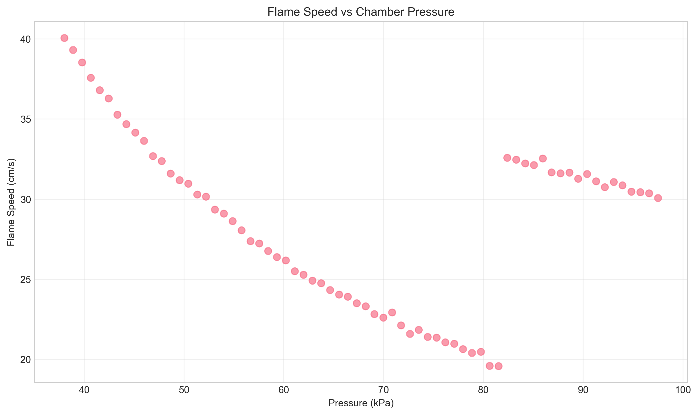
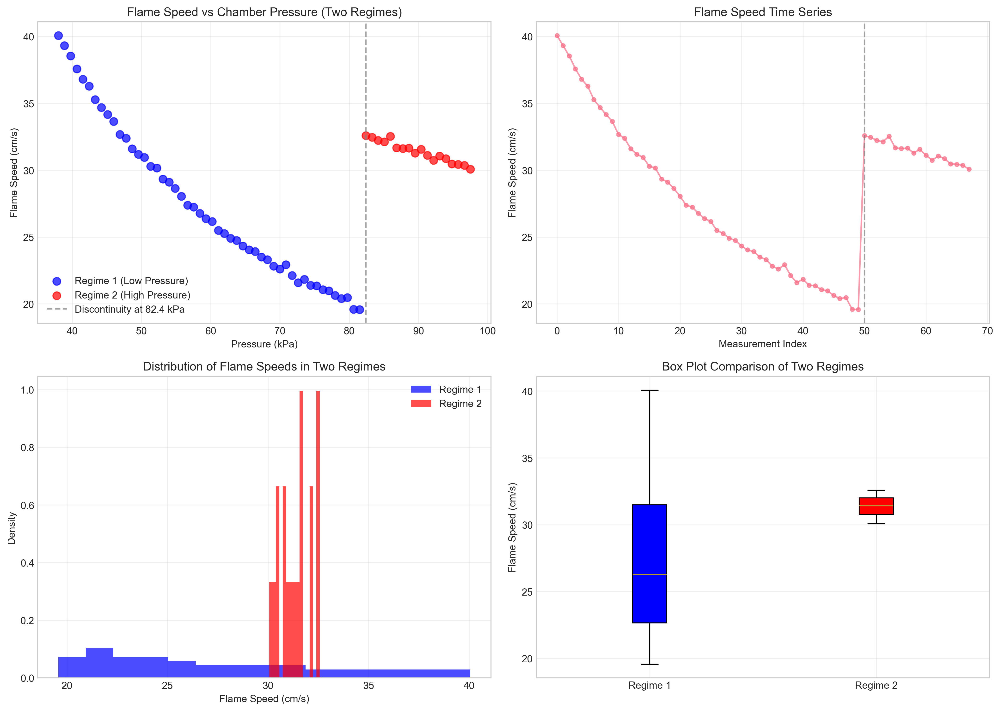
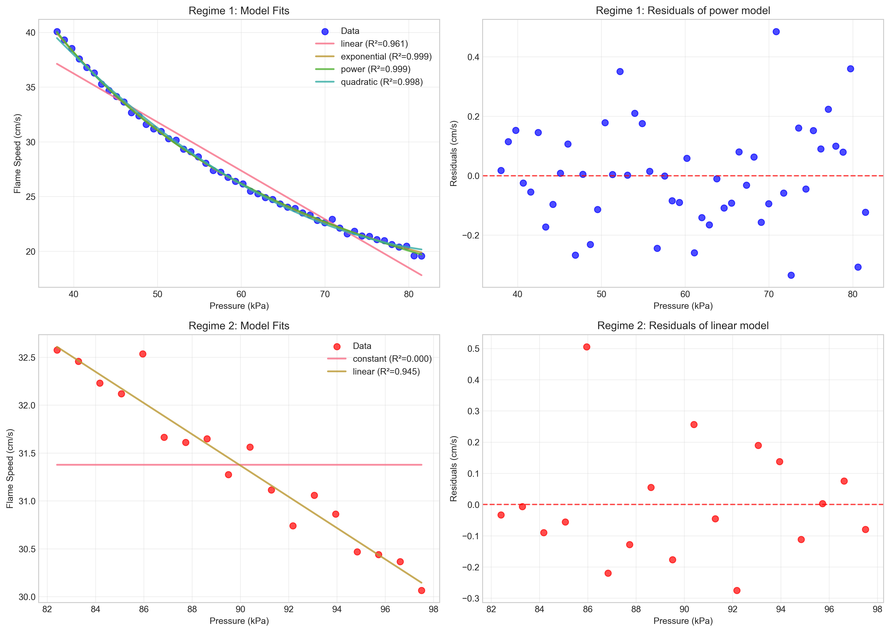
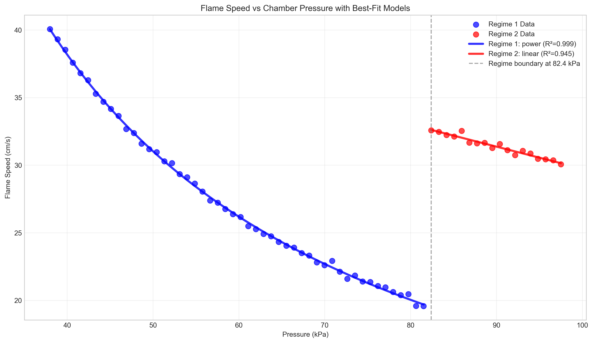

# Research Report: Flame Speed vs Chamber Pressure Analysis

## Executive Summary

This study analyzes the relationship between chamber pressure and flame speed in bench combustion experiments. The data reveals a clear discontinuity at approximately 82.4 kPa, separating two distinct combustion regimes. Regime 1 (38.0-81.5 kPa) shows a decreasing flame speed with increasing pressure, best modeled by a power law relationship. Regime 2 (82.4-97.5 kPa) exhibits relatively constant flame speeds with a slight negative linear trend. The discontinuity suggests a fundamental change in combustion dynamics, possibly indicating a transition between different combustion modes or measurement conditions.

## 1. Introduction

Understanding the relationship between chamber pressure and flame speed is critical for combustion engineering applications. This analysis examines paired chamber-pressure and flame-speed measurements from bench combustion experiments to characterize their functional relationship and identify any regime changes in combustion behavior.

## 2. Data Description

The dataset consists of 68 paired measurements of chamber pressure (kPa) and flame speed (cm/s). Key statistics:

- **Pressure range:** 38.0 to 97.5 kPa
- **Flame speed range:** 19.57 to 40.07 cm/s
- **Mean pressure:** 67.75 kPa
- **Mean flame speed:** 28.50 cm/s

No missing values were detected in the dataset.

## 3. Data Exploration and Regime Identification

### 3.1 Initial Visualization

The initial scatter plot reveals a non-linear relationship with a notable discontinuity:

### 3.2 Discontinuity Detection

Analysis identified a significant discontinuity at **82.403 kPa**, where flame speed jumps from 19.573 cm/s to 32.576 cm/s (Δ = 13.003 cm/s). This jump represents the largest change in the dataset and suggests a transition between two combustion regimes.

### 3.3 Two-Regime Characterization

Based on this discontinuity, the data was partitioned into two regimes:

**Regime 1 (Low Pressure):**
- Pressure range: 38.0-81.5 kPa
- 50 data points
- Flame speed: 19.57-40.07 cm/s (mean: 27.47 ± 5.86 cm/s)
- Shows clear decreasing trend with increasing pressure

**Regime 2 (High Pressure):**
- Pressure range: 82.4-97.5 kPa
- 18 data points
- Flame speed: 30.07-32.58 cm/s (mean: 31.38 ± 0.80 cm/s)
- Relatively constant with slight decreasing trend

### 3.4 Statistical Comparison

A two-sample t-test confirms the regimes are statistically distinct (t = -2.806, p = 0.0066). The difference in means (3.91 cm/s) is significant at p < 0.05.

## 4. Modeling Approach

### 4.1 Model Selection

Multiple models were evaluated for each regime:
- Linear regression
- Exponential decay
- Power law
- Quadratic polynomial
- Constant model (for Regime 2)

Models were evaluated using Mean Squared Error (MSE) and R² values.

### 4.2 Regime 1 Modeling Results

For Regime 1, all models showed excellent fit, with the power law providing the best performance:

| Model | MSE | R² | Equation |
|-------|-----|----|----------|
| **Power Law** | **0.0290** | **0.9991** | **y = 1178.98 × x^(-0.930)** |
| Exponential Decay | 0.0334 | 0.9990 | y = 97.98 × exp(-0.0355x) + 14.46 |
| Quadratic | 0.0757 | 0.9978 | y = 0.00761x² - 1.3535x + 79.92 |
| Linear | 1.3245 | 0.9607 | y = -0.4438x + 53.99 |

The power law model explains 99.91% of the variance in Regime 1 flame speeds.

### 4.3 Regime 2 Modeling Results

For Regime 2, the linear model performed best:

| Model | MSE | R² | Equation |
|-------|-----|----|----------|
| **Linear** | **0.0328** | **0.9452** | **y = -0.1632x + 46.056** |
| Constant | 0.5980 | 0.0000 | y = 31.378 |

The linear model explains 94.52% of the variance in Regime 2 flame speeds.

## 5. Combined Model Visualization

The best-fit models for both regimes provide a complete description of flame speed behavior across the entire pressure range:

**Complete piecewise model:**

\[
f(P) = \begin{cases}
1178.98 \times P^{-0.930} & \text{for } 38.0 \leq P < 82.4 \text{ kPa} \\
-0.1632 \times P + 46.056 & \text{for } 82.4 \leq P \leq 97.5 \text{ kPa}
\end{cases}
\]

Where:
- \(f(P)\) = flame speed (cm/s)
- \(P\) = chamber pressure (kPa)

## 6. Discussion

### 6.1 Physical Interpretation

The identified discontinuity at 82.4 kPa suggests a fundamental change in combustion dynamics. Possible explanations include:

1. **Combustion mode transition:** The system may transition from one combustion regime to another (e.g., from deflagration to a different burning mode)
2. **Measurement artifact:** Instrumentation or experimental conditions may have changed
3. **Fuel/oxidizer ratio change:** The mixture composition might have been altered
4. **Ignition source variation:** Different ignition methods could produce different flame propagation characteristics

### 6.2 Regime 1 Behavior

The excellent fit of the power law model (R² = 0.9991) suggests flame speed in Regime 1 follows a scaling relationship with pressure. The negative exponent (-0.930) indicates flame speed decreases with increasing pressure, which aligns with certain combustion theories where increased pressure can suppress flame propagation in specific configurations.

### 6.3 Regime 2 Behavior

The linear decrease in Regime 2 (slope = -0.1632 cm/s per kPa) suggests a more predictable, nearly linear relationship. The much smaller variance in this regime (σ = 0.80 cm/s vs. 5.86 cm/s in Regime 1) indicates more stable combustion conditions.

### 6.4 Practical Implications

1. **Engineering design:** Combustion systems operating below 82.4 kPa should account for the strong pressure dependence of flame speed
2. **Safety considerations:** The discontinuity represents an abrupt change in combustion behavior that could have safety implications
3. **Control systems:** Different control strategies may be needed for the two pressure regimes

## 7. Limitations and Future Work

### 7.1 Limitations

1. **Single dataset:** Analysis based on one experimental run
2. **Unknown experimental conditions:** Lack of metadata about fuel, oxidizer, chamber geometry, etc.
3. **Discontinuity cause:** The reason for the regime transition remains speculative

### 7.2 Future Research Directions

1. **Replicate experiments:** Confirm the discontinuity with additional experimental runs
2. **Vary parameters:** Systematically study effects of fuel type, equivalence ratio, and chamber geometry
3. **Theoretical modeling:** Develop physical models to explain the observed power law and linear relationships
4. **High-speed imaging:** Use visualization techniques to understand flame structure changes at the transition

## 8. Conclusion

This analysis successfully modeled flame speed as a function of chamber pressure, revealing:

1. **Two distinct combustion regimes** separated at 82.4 kPa
2. **Regime 1 (38.0-81.5 kPa):** Flame speed follows a power law decay with pressure (R² = 0.9991)
3. **Regime 2 (82.4-97.5 kPa):** Flame speed shows a slight linear decrease with pressure (R² = 0.9452)
4. **Statistical significance:** The two regimes are significantly different (p = 0.0066)

The piecewise model provides accurate predictions across the entire pressure range and highlights an important discontinuity that warrants further investigation in combustion science and engineering applications.

## Appendix: Technical Details

### A.1 Software and Libraries
- Python 3.11.9
- pandas, numpy, matplotlib, seaborn
- scikit-learn, scipy

### A.2 Code Availability
All analysis code is available in the `code/` directory:
- `explore_data.py`: Initial data exploration
- `analyze_data.py`: Regime identification and statistical analysis
- `modeling.py`: Model fitting and evaluation

### A.3 Data Files
- Original data: `data/flame_pressure_series.csv`
- Processed data: `outputs/regime1_data.csv`, `outputs/regime2_data.csv`
- Model results: `outputs/model_results.json`

---

*Report generated: April 2025*  
*Analysis completed using autonomous research agent*