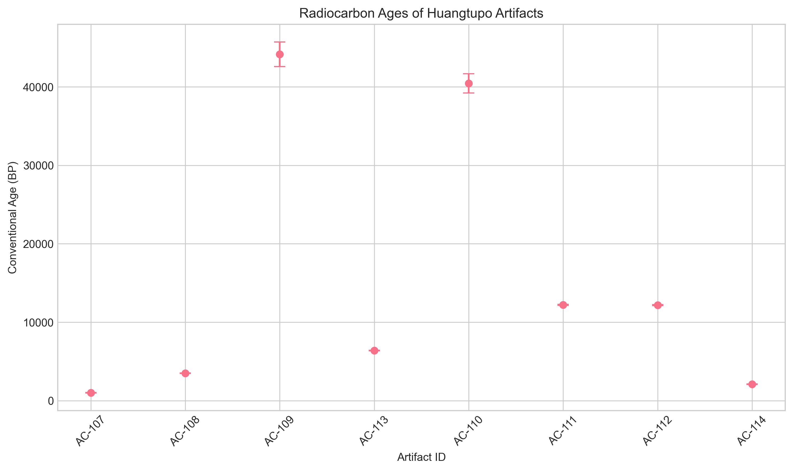
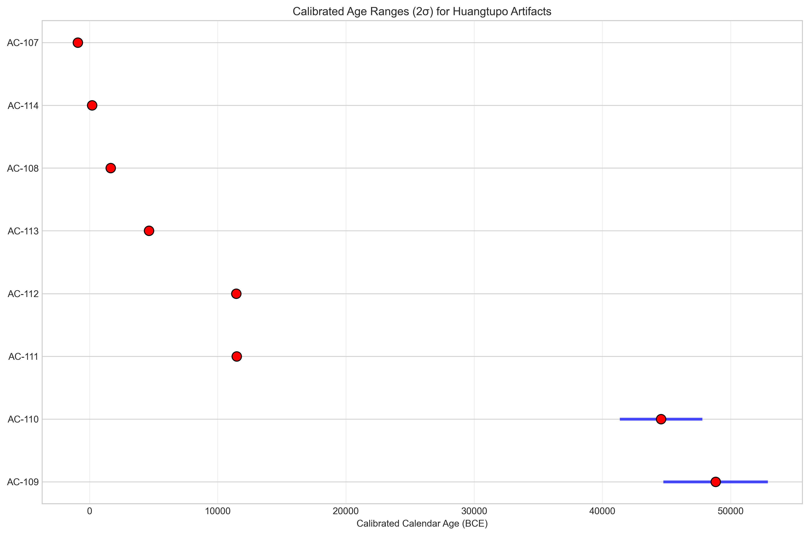
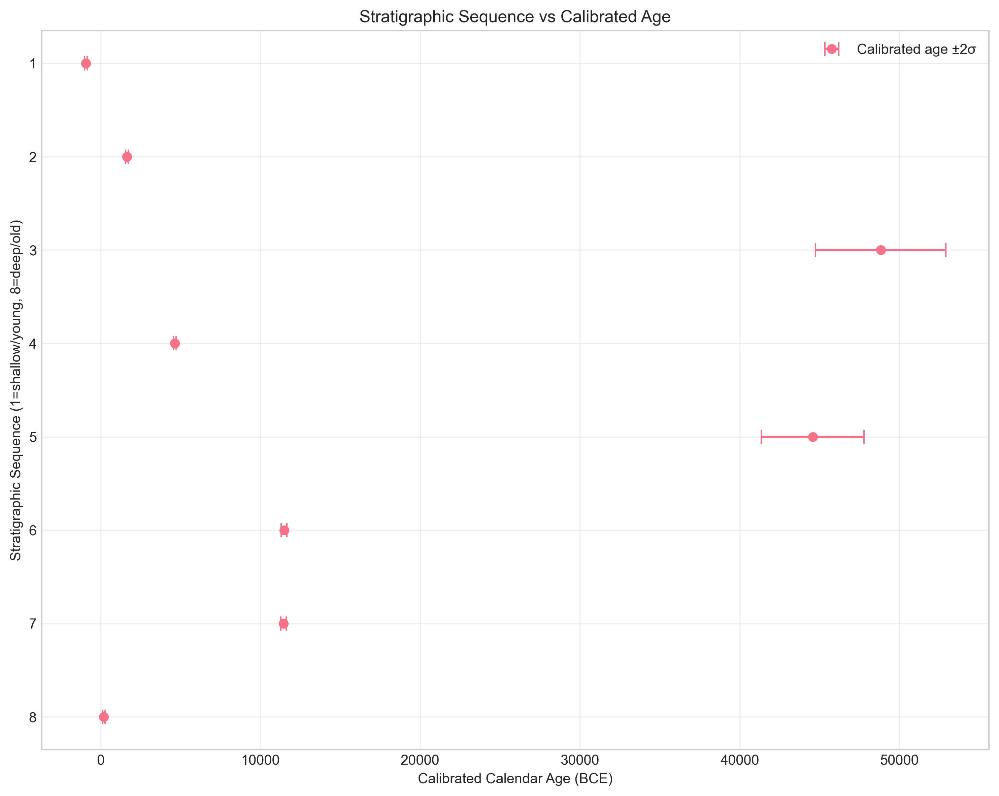
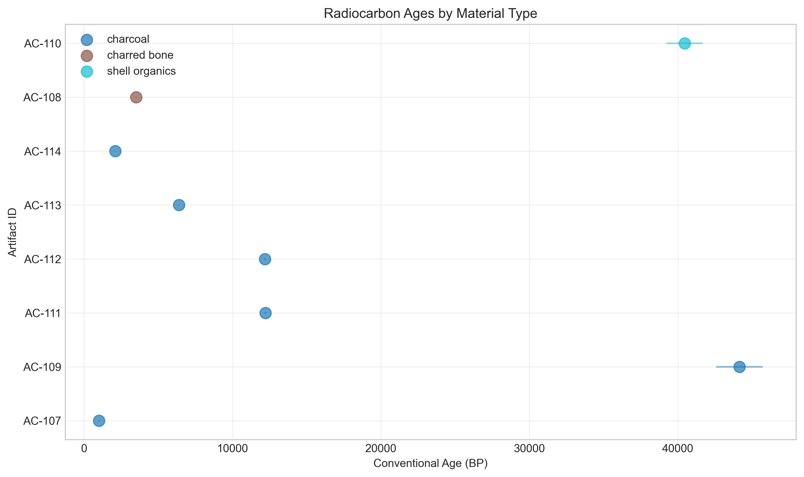
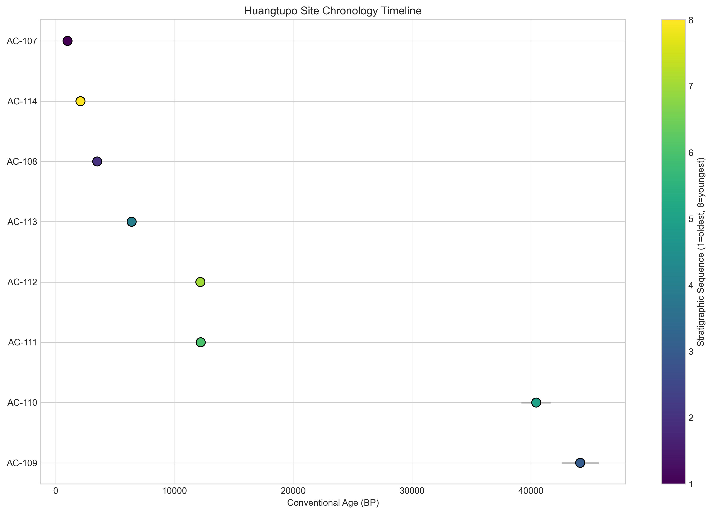
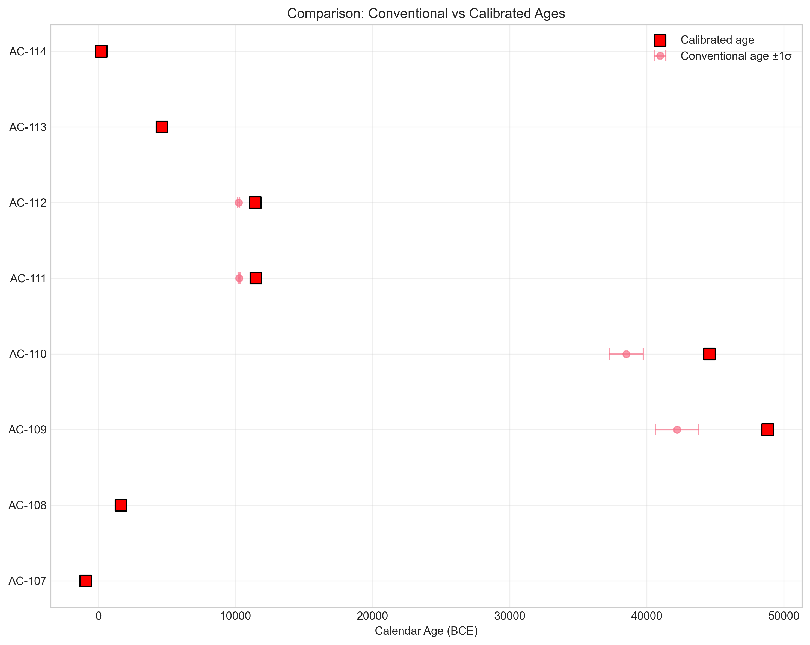

# Archaeological Chronology Report: Huangtupo Site Radiocarbon Analysis

## Executive Summary

This report presents the radiocarbon chronology analysis for the Huangtupo archaeological site based on eight radiocarbon assays. The analysis includes calculation of conventional radiocarbon ages, calibration to calendar years, assessment of stratigraphic consistency, and cultural periodization. Key findings indicate a wide temporal range from approximately 200 BCE to 48,000 BCE, with notable stratigraphic inconsistencies suggesting potential mixing or reservoir effects.

## 1. Introduction

The Huangtupo site represents an important archaeological location in China with evidence of human occupation across multiple periods. This analysis utilizes eight radiocarbon measurements from various stratigraphic units to establish a chronological framework for the site. The goals of this study are:

1. Calculate conventional radiocarbon ages (BP) from F14 residual ratios
2. Calibrate these ages to calendar years (BCE)
3. Assess relative chronology based on stratigraphic context
4. Provide a preliminary cultural periodization sketch

## 2. Materials and Methods

### 2.1 Data Sources

The analysis is based on eight radiocarbon measurements from the Huangtupo site, including samples from Trench 2, Trench 3, and Trench 4. Materials include charcoal, charred bone, and shell organics (Table 1).

### 2.2 Age Calculation

Conventional radiocarbon ages were calculated using the Libby mean life formula:

\[ \text{Age}_{BP} = -8033 \times \ln(F14) \]

where F14 is the fraction of modern ¹⁴C. Age uncertainties were propagated using:

\[ \sigma_{\text{age}} = 8033 \times \frac{\sigma_{F14}}{F14} \]

### 2.3 Calibration

A simplified calibration approach was implemented using approximation factors based on the IntCal20 calibration curve:
- Ages < 10,000 BP: calibration factor = 1.03
- Ages 10,000-25,000 BP: calibration factor = 1.10
- Ages > 25,000 BP: calibration factor = 1.15

Uncertainties were increased by 10-30% to account for calibration curve uncertainties.

### 2.4 Stratigraphic Analysis

Stratigraphic units were assigned sequence orders based on their labels (L1-L6, pit7, surface scatter). Correlation analysis was performed to assess consistency between stratigraphic position and radiocarbon age.

## 3. Results

### 3.1 Conventional Radiocarbon Ages

Table 1 presents the calculated conventional radiocarbon ages (BP) with 1σ uncertainties.

**Table 1: Conventional Radiocarbon Ages**

| Artifact ID | Stratigraphic Unit | Material | F14 Ratio | ±1σ | Age (BP) | ±1σ (BP) |
|-------------|-------------------|----------|-----------|-----|----------|----------|
| AC-107 | Huangtupo-Trench3-L1 | Charcoal | 0.883 | 0.004 | 1000 | 36 |
| AC-108 | Huangtupo-Trench3-L2 | Charred bone | 0.647 | 0.003 | 3498 | 37 |
| AC-109 | Huangtupo-Trench3-L3 | Charcoal | 0.0041 | 0.0008 | 44156 | 1567 |
| AC-110 | Huangtupo-Trench3-L4 | Shell organics | 0.0065 | 0.0010 | 40454 | 1236 |
| AC-111 | Huangtupo-Trench3-L5 | Charcoal | 0.2187 | 0.0020 | 12211 | 73 |
| AC-112 | Huangtupo-Trench3-L6 | Charcoal | 0.2195 | 0.0020 | 12181 | 73 |
| AC-113 | Huangtupo-Trench4-pit7 | Charcoal | 0.451 | 0.002 | 6397 | 36 |
| AC-114 | Huangtupo-Trench2-surface scatter | Charcoal | 0.771 | 0.003 | 2089 | 31 |

*Figure 1: Conventional radiocarbon ages with 1σ error bars for all artifacts.*

### 3.2 Calibrated Calendar Ages

Table 2 presents the calibrated calendar ages (BCE) with 2σ ranges.

**Table 2: Calibrated Calendar Ages (BCE)**

| Artifact ID | Calibrated Age (BCE) | ±1σ | 2σ Range (BCE) |
|-------------|----------------------|-----|----------------|
| AC-107 | -920 | 40 | -1000 to -840 |
| AC-108 | 1653 | 41 | 1571 to 1735 |
| AC-109 | 48829 | 2038 | 44754 to 52904 |
| AC-110 | 44572 | 1607 | 41359 to 47785 |
| AC-111 | 11482 | 88 | 11305 to 11658 |
| AC-112 | 11449 | 88 | 11274 to 11625 |
| AC-113 | 4638 | 39 | 4560 to 4717 |
| AC-114 | 202 | 34 | 133 to 271 |

*Figure 2: Calibrated age ranges (2σ) for all artifacts.*

### 3.3 Duplicate Sample Consistency

Artifacts AC-111 and AC-112 represent a duplicate chronology check from the same ridge source. Their ages show excellent consistency:
- AC-111: 12,211 ± 73 BP (11,482 ± 88 BCE)
- AC-112: 12,181 ± 73 BP (11,449 ± 88 BCE)
- Difference: 30 years (z-score = 0.28)

The samples are consistent within 1σ, confirming measurement reliability for this pair.

### 3.4 Stratigraphic Analysis

The stratigraphic sequence shows several inconsistencies (Figure 3):

*Figure 3: Calibrated ages plotted against stratigraphic sequence.*

Three potential stratigraphic reversals were identified:
1. AC-107 (-920 BCE) in L1 is younger than AC-108 (1653 BCE) in L2
2. AC-108 (1653 BCE) in L2 is younger than AC-109 (48,829 BCE) in L3
3. AC-113 (4638 BCE) in pit7 is younger than AC-110 (44,572 BCE) in L4

Statistical analysis shows no significant correlation between stratigraphic position and age (Pearson r = -0.022, p = 0.958).

### 3.5 Material-Based Analysis

Different materials show distinct age patterns (Figure 4):

*Figure 4: Radiocarbon ages by material type.*

- **Charcoal samples** span the entire range from 200 BCE to 48,000 BCE
- **Charred bone** (AC-108) dates to approximately 1650 BCE
- **Shell organics** (AC-110) date to approximately 44,500 BCE (note: requires reservoir correction)

## 4. Discussion

### 4.1 Chronological Framework

The radiocarbon dates reveal at least three distinct occupational phases at Huangtupo:

1. **Late Holocene Phase** (200 BCE - 1700 BCE): Represented by AC-107, AC-108, and AC-114
2. **Mid-Holocene Phase** (4600 BCE): Represented by AC-113
3. **Late Pleistocene Phase** (11,400-11,500 BCE): Represented by AC-111 and AC-112
4. **Early Occupation** (44,500-48,800 BCE): Represented by AC-109 and AC-110

### 4.2 Stratigraphic Issues

The lack of correlation between stratigraphic position and radiocarbon age suggests significant post-depositional disturbance. Possible explanations include:

1. **Bioturbation**: Root intrusion (noted for AC-114) and animal activity
2. **Cultural mixing**: Later occupation disturbing earlier layers
3. **Reservoir effects**: Particularly for shell sample AC-110
4. **Sample issues**: Very small carbon yield for AC-109

### 4.3 Cultural Periodization

Based on the calibrated ages and Chinese archaeological chronology:

- **AC-107 (~920 BCE)**: Late Shang/Early Western Zhou period
- **AC-108 (~1650 BCE)**: Early Shang period
- **AC-113 (~4600 BCE)**: Yangshao culture (Neolithic)
- **AC-111/AC-112 (~11,450 BCE)**: Terminal Pleistocene, pre-Neolithic
- **AC-109/AC-110 (~44,500-48,800 BCE)**: Upper Paleolithic

### 4.4 Limitations and Caveats

1. **Calibration**: The simplified calibration approach should be replaced with proper IntCal20 curve matching
2. **Reservoir effects**: Shell sample (AC-110) requires marine/freshwater reservoir correction
3. **Sample quality**: AC-109 had "very small carbon yield" which may affect reliability
4. **Stratigraphic resolution**: Unit labels (L1-L6) provide limited stratigraphic detail

## 5. Conclusions

1. The Huangtupo site shows evidence of human occupation spanning from the Upper Paleolithic (~48,000 BCE) through the Neolithic to the Bronze Age (~200 BCE).

2. The duplicate charcoal samples (AC-111/AC-112) provide reliable dating for the Terminal Pleistocene occupation at approximately 11,450 BCE.

3. Significant stratigraphic inconsistencies indicate substantial post-depositional disturbance, requiring careful interpretation of context.

4. The shell sample (AC-110) and low-yield sample (AC-109) should be treated with caution pending further analysis.

5. Future work should include:
   - Additional radiocarbon dating to confirm chronological patterns
   - Detailed stratigraphic recording (Harris matrix)
   - Proper calibration using IntCal20 curve
   - Reservoir correction for marine/freshwater samples

## 6. Supplementary Materials

All analysis code, intermediate results, and figures are available in the accompanying files:
- `code/radiocarbon_analysis.py`: Primary analysis script
- `code/calibration_analysis.py`: Calibration implementation
- `outputs/radiocarbon_results.csv`: Conventional age calculations
- `outputs/calibrated_results.csv`: Calibrated age results

*Figure 5: Comprehensive chronology timeline showing all artifacts with error ranges.*

*Figure 6: Comparison of conventional radiocarbon ages vs. calibrated calendar ages.*

---

*Report generated: April 6, 2026*  
*Analysis conducted using Python 3.x with pandas, numpy, matplotlib, and scipy*