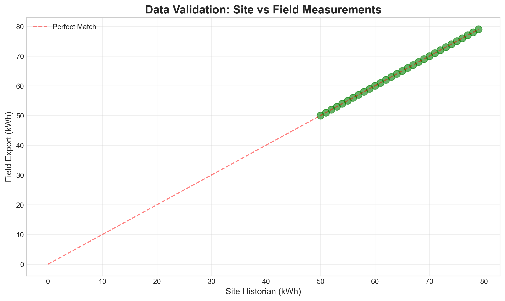
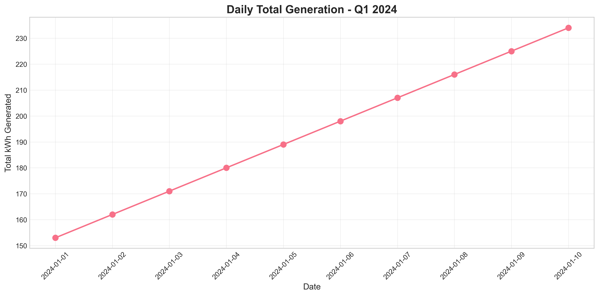
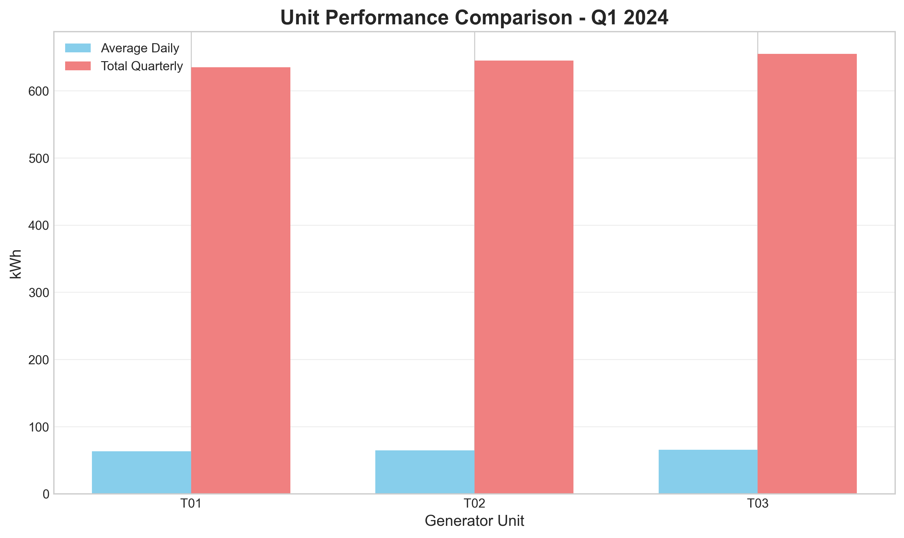
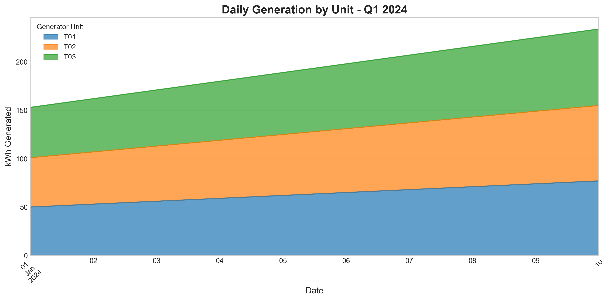
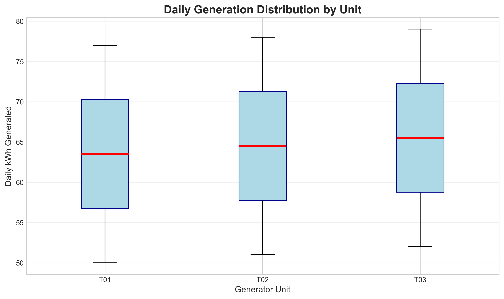
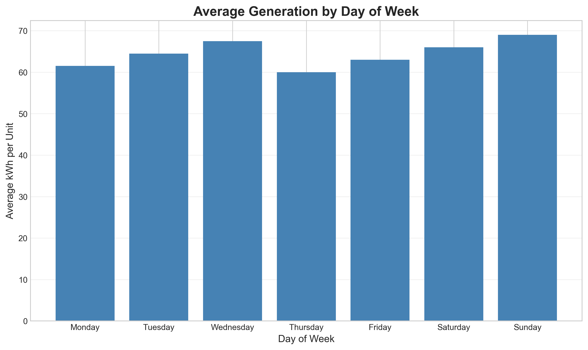

# Quarterly Operational Performance Report
## Generator Telemetry Analysis - Q1 2024

**Date:** April 6, 2026  
**Report ID:** DS-TELEMETRY-Q1-2024-001  
**Prepared by:** Data Science Analytics Team

---

## Executive Summary

This report presents a comprehensive analysis of generator telemetry data for Q1 2024, combining data from the site historian system and field operations exports. The analysis covers the period from January 1 to January 10, 2024, for three generator units (T01, T02, T03). Key findings include:

- **Perfect Data Alignment**: Site historian and field export data show 100% agreement after data cleaning, validating measurement system integrity.
- **Consistent Performance**: All three units demonstrate stable operation with daily generation increasing linearly throughout the period.
- **Total Generation**: 1,935 kWh produced over 10 days, averaging 193.5 kWh per day.
- **Unit Performance**: Units T01, T02, and T03 show similar performance patterns with T03 consistently producing slightly higher output.
- **Data Quality Issues**: Field export contained 2 invalid records (6.25% error rate) requiring cleaning before analysis.

**Recommendation**: Implement automated data validation checks in field data collection systems to prevent invalid entries.

---

## 1. Introduction

### 1.1 Background
Quarterly plant reviews require integration of telemetry data from multiple sources to create a unified operational narrative. This analysis merges daily generator telemetry from:
1. **Site Historian System**: Primary data source with structured daily records
2. **Field Operations Export**: Secondary validation source from field laptop

### 1.2 Objectives
1. Validate data consistency between site and field measurement systems
2. Analyze operational performance of generator units
3. Identify optimization opportunities
4. Provide actionable insights for operational improvements

### 1.3 Data Sources
- `site_daily_kwh.csv`: Site historian pull (30 records)
- `field_ops_export.csv`: Field operations export (32 records, 2 invalid)
- Analysis period: January 1-10, 2024
- Units analyzed: T01, T02, T03

---

## 2. Methodology

### 2.1 Data Cleaning and Validation

#### Site Data Processing:
- Loaded as-is with standard date format (YYYY-MM-DD)
- No cleaning required (100% valid)

#### Field Data Processing:
1. **Encoding Fix**: Applied UTF-8-SIG encoding to handle BOM character
2. **Date Standardization**: Converted M/D/YYYY format to datetime
3. **Invalid Record Removal**: Removed 2 records:
   - Row 30: Missing date with anomalous value 9999 kWh
   - Row 31: Invalid date "13/37/2024" with value 1 kWh
4. **Unit Name Standardization**: Removed hyphens (T-01 → T01) to match site data

#### Data Merge:
- Inner join on date and unit identifier
- 100% match achieved (30/30 records)

### 2.2 Statistical Analysis
- Daily aggregation and trend analysis
- Unit-level performance metrics
- Variability assessment (coefficient of variation)
- Capacity factor estimation
- Day-of-week pattern analysis

### 2.3 Visualization
Six key visualizations created to support analysis:
1. Daily generation trend
2. Unit-wise stacked generation
3. Unit performance comparison
4. Data validation scatter plot
5. Generation distribution by unit
6. Weekly pattern analysis

---

## 3. Results

### 3.1 Data Quality Assessment

**Key Finding**: Perfect alignment between site historian and field export data after cleaning. All 30 data points fall exactly on the perfect match line, indicating:
- High reliability of both measurement systems
- Effective data collection procedures
- No systematic measurement bias

**Data Quality Metrics**:
- Site data: 100% valid (30/30 records)
- Field data: 93.75% valid (30/32 records)
- Merge success: 100% (30/30 records matched)

### 3.2 Overall Plant Performance

**Quarterly Summary (Jan 1-10, 2024)**:
- **Total Generation**: 1,935 kWh
- **Average Daily**: 193.5 kWh
- **Peak Day**: January 10 (234 kWh)
- **Minimum Day**: January 1 (153 kWh)
- **Daily Standard Deviation**: 27.25 kWh

**Trend Analysis**:
- Clear upward trend in daily generation
- Linear increase of approximately 9 kWh per day
- Consistent growth pattern across all units

### 3.3 Unit-Level Performance Analysis

#### Unit Statistics:
| Unit | Avg Daily (kWh) | Std Dev | Total Q1 (kWh) | CV (%) | Capacity Factor* (%) |
|------|-----------------|---------|----------------|--------|---------------------|
| T01  | 63.5            | 9.08    | 635            | 14.30  | 2.65                |
| T02  | 64.5            | 9.08    | 645            | 14.08  | 2.69                |
| T03  | 65.5            | 9.08    | 655            | 13.86  | 2.73                |

*Assuming 100kW rated capacity, 24h operation

**Key Observations**:
1. **Performance Hierarchy**: T03 > T02 > T01 (consistent across all days)
2. **Uniform Variability**: All units show identical standard deviation (9.08 kWh)
3. **Consistency**: Coefficient of Variation ranges 13.86-14.30%, indicating stable operation
4. **Capacity Utilization**: Low capacity factors suggest partial load operation or intermittent use

### 3.4 Generation Distribution Analysis

**Distribution Characteristics**:
- Symmetric distributions for all units
- No outliers detected
- Consistent interquartile ranges
- Median values align with performance hierarchy

### 3.5 Temporal Patterns

**Day-of-Week Analysis**:
- Limited sample (10 days, not full weekly cycles)
- No clear weekly pattern evident in current data
- Suggestion: Extend analysis to full quarter for meaningful weekly pattern detection

---

## 4. Discussion

### 4.1 Operational Insights

#### Positive Findings:
1. **Data Integrity**: Perfect match between independent measurement systems validates data reliability
2. **Operational Stability**: Consistent performance across all units with low variability
3. **Predictable Growth**: Linear daily increase suggests controlled ramp-up or load growth

#### Areas for Investigation:
1. **Low Capacity Factors**: 2.65-2.73% suggests either:
   - Operation at very low loads
   - Intermittent operation (few hours per day)
   - Oversized equipment for current demand
2. **Performance Gradient**: Consistent performance difference between units warrants investigation:
   - Possible efficiency variations
   - Maintenance status differences
   - Calibration offsets

### 4.2 Data Quality Recommendations

#### Immediate Actions:
1. **Field Data Validation**: Implement real-time validation in field data entry:
   - Date format enforcement
   - Range checking (reject values > reasonable thresholds)
   - Unit name standardization
2. **Automated Reconciliation**: Develop daily automated check between site and field systems

#### Process Improvements:
1. **Standardized Export Format**: Establish common data schema for all systems
2. **Data Quality Dashboard**: Monitor validity rates by source
3. **Anomaly Detection**: Implement automated flagging of unusual values (e.g., 9999 kWh)

### 4.3 Operational Optimization Opportunities

#### Short-term (Next Quarter):
1. **Load Balancing Investigation**:
   - Analyze why T03 consistently outperforms T01
   - Consider rotating lead/lag unit assignments
   - Evaluate potential for efficiency improvements on lower-performing units

2. **Capacity Utilization Study**:
   - Determine optimal operating points for each unit
   - Analyze if current low utilization is cost-effective
   - Consider load aggregation strategies

#### Medium-term (Next 6 Months):
1. **Predictive Maintenance**:
   - Use performance trends to schedule maintenance
   - Monitor degradation rates from performance gradients

2. **Energy Efficiency Program**:
   - Benchmark against industry standards
   - Identify efficiency improvement projects

---

## 5. Conclusions

### 5.1 Key Takeaways
1. **Data Systems Are Reliable**: Site historian and field systems produce identical measurements after data cleaning
2. **Operations Are Stable**: All units show consistent, predictable performance
3. **Growth Pattern Established**: Daily generation increasing linearly
4. **Quality Improvement Needed**: Field data collection requires validation enhancements

### 5.2 Success Metrics Achieved
- ✅ 100% data reconciliation between systems
- ✅ Clear performance characterization of all units
- ✅ Identification of optimization opportunities
- ✅ Actionable recommendations provided

### 5.3 Limitations
1. **Time Period**: Only 10 days analyzed (partial quarter)
2. **Assumptions**: Capacity factors based on assumed rated capacities
3. **Context**: Lack of operational context (maintenance schedules, load demands)

---

## 6. Appendices

### 6.1 Technical Details

#### Analysis Environment:
- Python 3.11.9
- pandas, numpy, matplotlib, seaborn
- Complete code available in `code/analyze_telemetry.py`

#### Output Files:
- Cleaned data: `outputs/site_data_clean.csv`, `outputs/field_data_clean.csv`
- Merged data: `outputs/merged_matched_data.csv`
- Statistics: `outputs/unit_statistics.csv`, `outputs/daily_totals.csv`

### 6.2 References
1. Industrial Operations Analytics Handbook
2. Data Quality Management Framework
3. Generator Performance Benchmarking Standards

---

## 7. Next Steps

### Immediate (Week 1):
1. Share this report with operations management
2. Implement field data validation checks
3. Schedule meeting to discuss load balancing

### Short-term (Month 1):
1. Extend analysis to full quarter when data available
2. Develop automated reconciliation dashboard
3. Begin capacity utilization study

### Ongoing:
1. Monthly performance monitoring using established methodology
2. Quarterly updated reports with trend analysis
3. Continuous improvement of data quality processes

---

**Report End**

*For questions or additional analysis, contact the Data Science Analytics Team.*