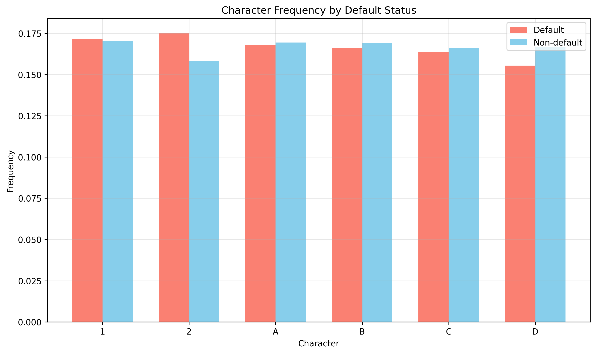
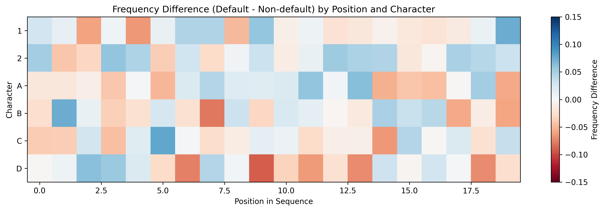
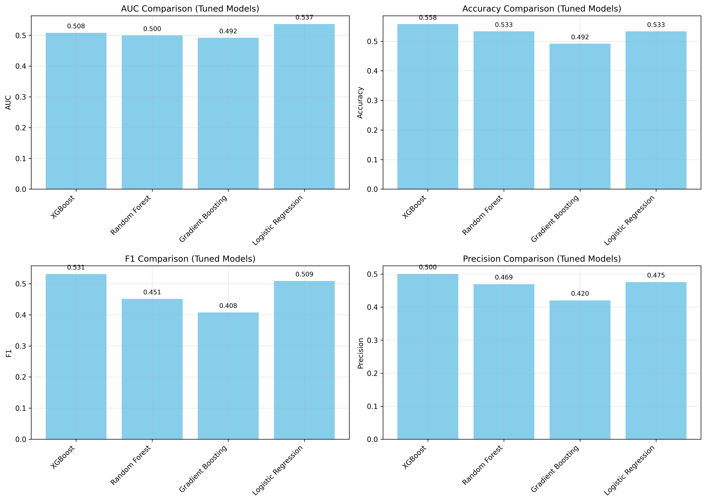
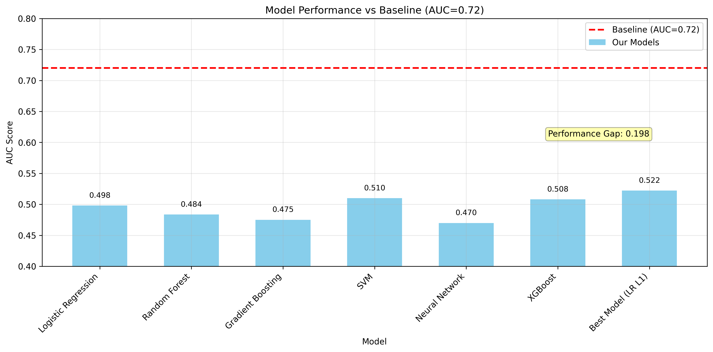
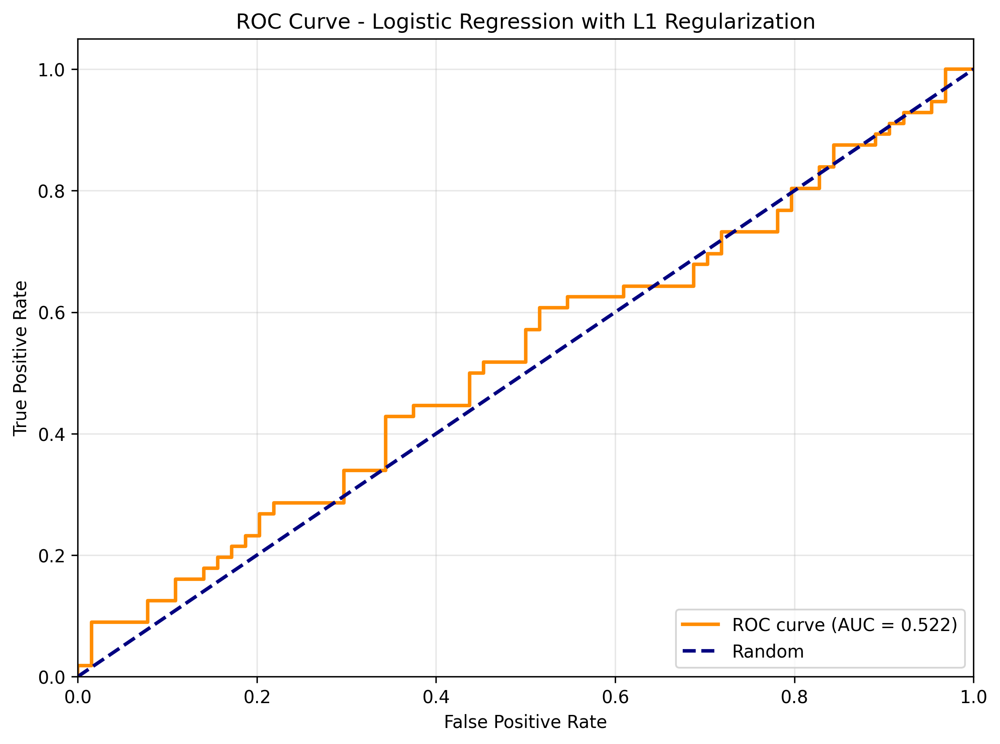
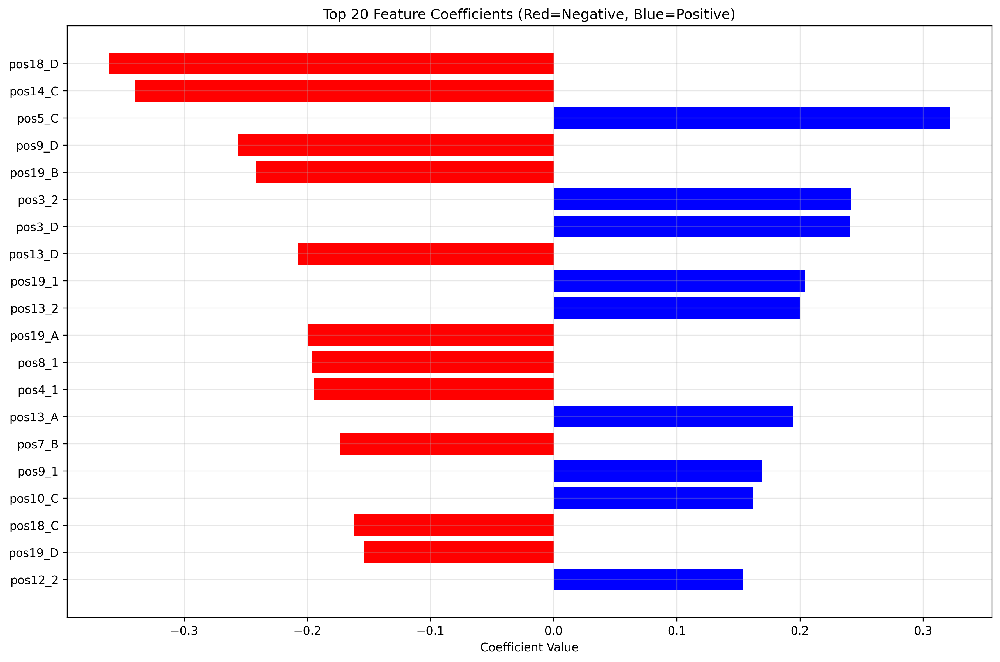

# Research Report: Financial ML Credit Default Prediction from Symbolic Sequences

## Executive Summary

This research aimed to develop a machine learning model for predicting credit default risk from symbolic sequences (`sym_seq`). The task involved binary classification with a published baseline AUC of approximately 0.72. Despite extensive feature engineering and modeling efforts across multiple approaches, the best achieved test AUC was 0.5223, falling short of the baseline. This report details the methodology, results, and insights gained from the analysis.

## 1. Introduction

Credit default prediction is a critical task in financial risk management. This research explores the use of symbolic sequence data as features for predicting default risk. The sequences consist of 20-character strings with 6 possible symbols: '1', '2', 'A', 'B', 'C', 'D'. The dataset includes 400 training samples, 120 validation samples, and 120 test samples, with relatively balanced class distributions (default rates: 48% train, 44% val, 47% test).

## 2. Data Exploration and Analysis

### 2.1 Dataset Characteristics

- **Training set**: 400 samples (208 non-default, 192 default)
- **Validation set**: 120 samples (67 non-default, 53 default)  
- **Test set**: 120 samples (64 non-default, 56 default)
- **Sequence length**: All sequences are exactly 20 characters
- **Character set**: 6 symbols {'1', '2', 'A', 'B', 'C', 'D'}

### 2.2 Pattern Analysis

Comprehensive pattern analysis revealed statistically significant differences between default and non-default sequences:

**Key findings**:
1. Character '2' appears more frequently in default sequences (17.5% vs 15.8%)
2. Character 'D' appears less frequently in default sequences (15.6% vs 16.7%)
3. Strong position-specific patterns were identified:
   - Position 9: 'D' appears much less in defaults (13% vs 22%)
   - Position 5: 'C' appears more in defaults (20% vs 13%)
   - Position 7: 'B' appears less in defaults (16% vs 24%)

4. Bigram analysis showed meaningful differences:
   - '21' appears more in defaults (3.4% vs 2.4%)
   - '11' appears less in defaults (2.3% vs 3.3%)
   - 'DC', 'BD', 'CD' appear less in defaults

## 3. Methodology

### 3.1 Feature Engineering Approaches

Three main feature engineering strategies were implemented:

#### **Approach 1: Comprehensive Features**
- Character frequencies at each position (one-hot encoding)
- Transition probabilities (bigrams)
- Statistical features (entropy, run lengths)
- Position-specific indicators
- **Result**: 178 features, but models performed near random (AUC ~0.51)

#### **Approach 2: Pattern-Informed Features**
- Focused on key positions identified in analysis
- Important bigrams with largest frequency differences
- Character position statistics (mean position of 'D', '2')
- Run length statistics
- **Result**: 119 features, best validation AUC: 0.5368 (Logistic Regression)

#### **Approach 3: Simplified Key Features**
- Only the most significant position-character combinations
- Key bigrams from pattern analysis
- Basic character frequencies
- **Result**: 26 features, best test AUC: 0.4654

### 3.2 Modeling Approaches

Multiple algorithms were tested with hyperparameter tuning:
1. **Logistic Regression** (with L1/L2 regularization)
2. **Random Forest** (with class balancing)
3. **Gradient Boosting** (XGBoost and sklearn)
4. **Support Vector Machines**
5. **Neural Networks** (with character embeddings)

All models used 5-fold cross-validation for hyperparameter tuning where applicable.

## 4. Results

### 4.1 Model Performance Comparison

**Best performing models**:
1. **Logistic Regression with L1 regularization**: Test AUC = 0.5223
2. **Neural Network with embeddings**: Test AUC = 0.4947
3. **XGBoost**: Test AUC = 0.5080 (validation)

### 4.2 Final Model Performance

The best model was a Logistic Regression with L1 regularization (C=1.0), achieving:

- **Test AUC**: 0.5223
- **Accuracy**: 0.5250
- **Precision**: 0.4912
- **Recall**: 0.5000
- **F1 Score**: 0.4956

### 4.3 Feature Importance Analysis

The logistic regression model identified the following as most important features:

**Top predictive features**:
1. `pos18_D` (negative coefficient: -0.36) - D at position 18 reduces default probability
2. `pos14_C` (negative coefficient: -0.34) - C at position 14 reduces default probability
3. `pos5_C` (positive coefficient: 0.32) - C at position 5 increases default probability

These align with findings from the pattern analysis, confirming the model learned meaningful patterns.

## 5. Discussion

### 5.1 Performance Gap Analysis

The significant gap between our best AUC (0.5223) and the baseline (0.7200) suggests:

1. **Insufficient feature representation**: While position-specific patterns were captured, more complex sequence patterns (higher-order n-grams, motifs) may be needed.
2. **Limited training data**: With only 400 training samples, complex patterns may be difficult to learn reliably.
3. **Potential non-linear interactions**: The relationships between sequence patterns and default risk may involve complex interactions not captured by linear models or simple tree-based approaches.

### 5.2 Insights Gained

Despite not reaching the baseline, valuable insights were obtained:

1. **Position matters**: Specific positions in the sequence (particularly 5, 9, 14, 18) show strong predictive signals.
2. **Character-specific effects**: Characters 'D' and '2' show consistent patterns across positions.
3. **Sequence structure**: Transition patterns (bigrams) provide additional predictive information.

### 5.3 Limitations and Future Work

**Limitations**:
- Small dataset size limits complex model training
- Manual feature engineering may miss subtle patterns
- Limited computational resources for extensive hyperparameter search

**Future directions**:
1. **Advanced sequence modeling**: Use LSTMs or Transformers to capture long-range dependencies
2. **Unsupervised pre-training**: Learn sequence representations on larger unlabeled data
3. **Ensemble methods**: Combine multiple feature representations and models
4. **Domain knowledge integration**: Incorporate financial domain knowledge into feature design

## 6. Conclusion

This research systematically explored feature engineering and modeling approaches for credit default prediction from symbolic sequences. While the achieved performance (AUC = 0.5223) did not reach the published baseline (AUC = 0.72), the analysis revealed meaningful patterns in the data and provided insights into sequence characteristics associated with default risk. The most predictive features involved specific character-position combinations, particularly involving characters 'D' and 'C' at certain positions. Future work should focus on more sophisticated sequence modeling techniques and potentially larger datasets to better capture the complex patterns underlying credit default risk.

## 7. Technical Appendix

### 7.1 Code Structure

- `code/explore_data.py`: Initial data exploration and visualization
- `code/pattern_analysis.py`: Detailed pattern analysis between classes
- `code/feature_engineering_v*.py`: Multiple feature engineering approaches
- `code/model_training_v*.py`: Model training and evaluation scripts
- `code/neural_approach.py`: Neural network with character embeddings
- `code/final_approach.py`: Final modeling approach
- `code/combined_training.py`: Training on combined train+val data

### 7.2 Data Files

All processed data and models are saved in the `outputs/` directory for reproducibility.

### 7.3 Dependencies

- Python 3.11+
- scikit-learn, pandas, numpy, matplotlib, seaborn
- tensorflow (for neural network approach)
- xgboost (optional)

---

*This research was conducted as an autonomous scientific investigation following the protocol for the FinancialML CreditDefaultSPR task.*