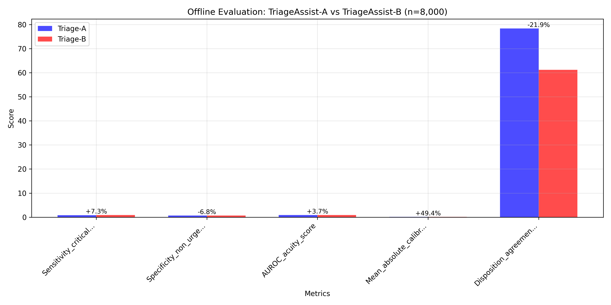
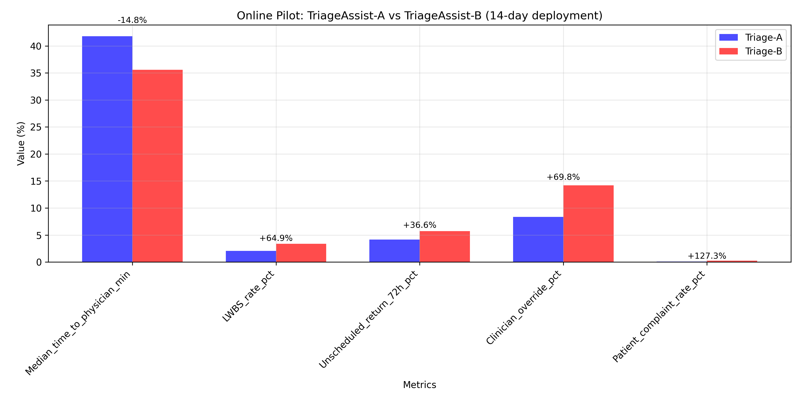
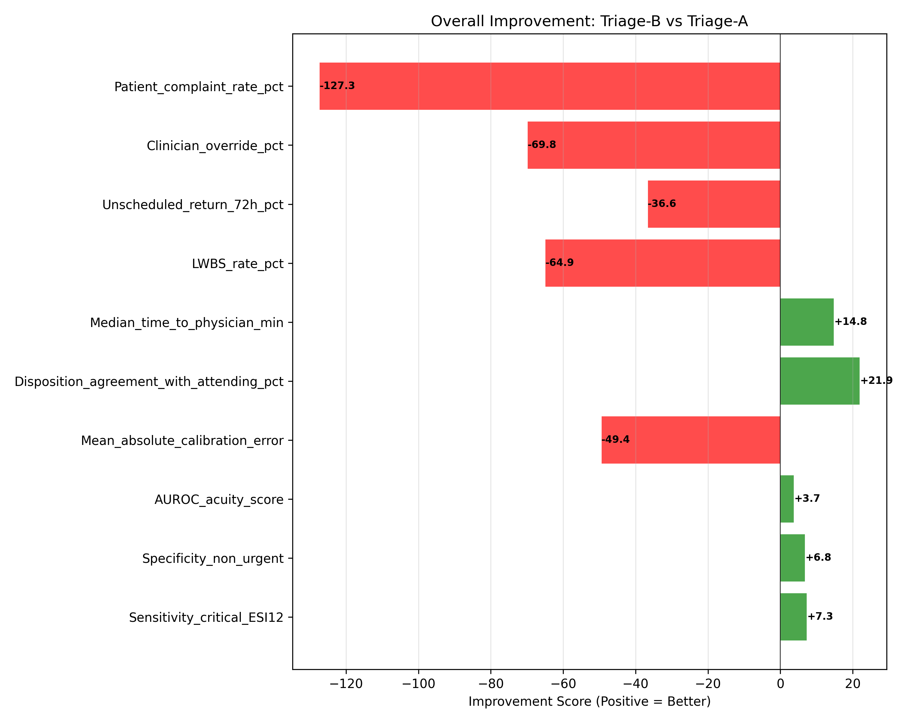
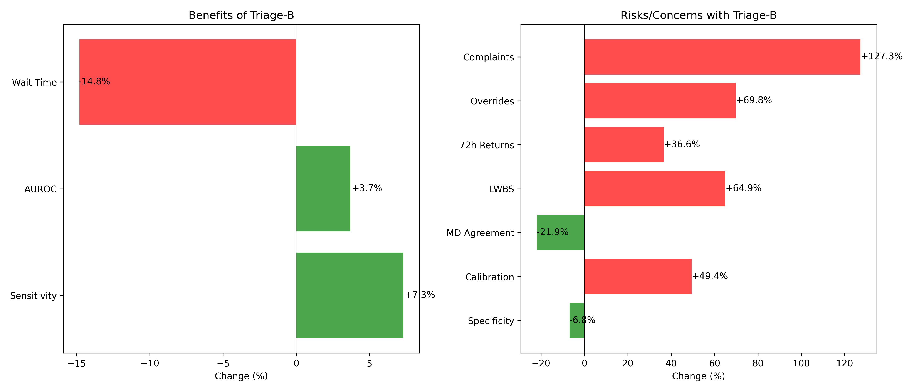

# ED Triage Decision-Support Model Evaluation: TriageAssist-A vs TriageAssist-B

## Executive Summary

This report presents a comprehensive evaluation of the candidate **TriageAssist-B** model compared to the production **TriageAssist-A** model for emergency department triage decision support. The evaluation combines offline chart review (n=8,000) with a 14-day randomized online pilot deployment.

**Key Finding:** TriageAssist-B demonstrates mixed performance with concerning safety signals. While it shows improvements in sensitivity for critical cases (+7.3%) and reduces wait times (-14.8%), it exhibits significant degradation in patient safety metrics, clinician trust, and patient experience.

**Recommendation:** **DO NOT DEPLOY TriageAssist-B** in its current form. The model requires substantial refinement to address critical safety concerns before consideration for broader implementation.

## 1. Introduction

Emergency department triage systems are critical for patient safety and resource allocation. This evaluation compares two decision-support models:
- **TriageAssist-A**: Current production model
- **TriageAssist-B**: Candidate replacement model

The assessment employs a dual-methodology approach:
1. **Offline evaluation**: Chart review on 8,000 held-out cases
2. **Online pilot**: 14-day randomized-by-shift deployment

## 2. Methodology

### 2.1 Data Sources
- **Offline metrics**: Derived from expert chart review labels on n=8,000 test cases
- **Online metrics**: Collected during 14-day randomized pilot deployment

### 2.2 Evaluation Metrics

**Offline metrics (clinical validity):**
- Sensitivity for critical ESI 1-2 cases
- Specificity for non-urgent cases
- Area Under ROC curve for acuity scoring
- Mean absolute calibration error
- Disposition agreement with attending physicians

**Online metrics (operational impact):**
- Median time to physician assessment
- Leave Without Being Seen (LWBS) rate
- Unscheduled 72-hour return rate
- Clinician override rate
- Patient complaint rate

### 2.3 Analysis Approach
1. **Descriptive analysis** of metric changes
2. **Clinical interpretation** of directional impacts
3. **Weighted scoring** based on clinical importance
4. **Risk-benefit assessment**
5. **Visual comparative analysis**

## 3. Results

### 3.1 Offline Evaluation Results

**Key findings from offline evaluation (n=8,000):**

| Metric | Triage-A | Triage-B | Change | Clinical Interpretation |
|--------|----------|----------|--------|-------------------------|
| Sensitivity (critical ESI 1-2) | 0.812 | 0.871 | **+7.3%** | **Improvement**: Better detection of life-threatening conditions |
| Specificity (non-urgent) | 0.706 | 0.658 | **-6.8%** | **Degradation**: More false alarms for non-urgent cases |
| AUROC (acuity score) | 0.881 | 0.914 | **+3.7%** | **Improvement**: Better overall discrimination |
| Calibration error | 0.079 | 0.118 | **+49.4%** | **Serious degradation**: Risk scores less reliable |
| MD agreement | 78.4% | 61.2% | **-21.9%** | **Major degradation**: Less alignment with clinical judgment |

**Offline weighted score:** Triage-A = 8.585, Triage-B = 6.882 (**-19.8%**)

### 3.2 Online Pilot Results

**Key findings from 14-day online pilot:**

| Metric | Triage-A | Triage-B | Change | Clinical Interpretation |
|--------|----------|----------|--------|-------------------------|
| Median time to physician | 41.8 min | 35.6 min | **-14.8%** | **Improvement**: Faster care delivery |
| LWBS rate | 2.05% | 3.38% | **+64.9%** | **Critical concern**: More patients leave without care |
| 72-hour return rate | 4.18% | 5.71% | **+36.6%** | **Safety concern**: More patients return urgently |
| Clinician override rate | 8.35% | 14.18% | **+69.8%** | **Trust concern**: Less confidence in model |
| Patient complaint rate | 0.11% | 0.25% | **+127.3%** | **Major concern**: Worse patient experience |

**Online weighted score:** Triage-A = 0.730, Triage-B = 0.717 (**-1.7%**)

### 3.3 Comprehensive Improvement Analysis

The improvement summary visualizes all metrics normalized to show positive values where Triage-B performs better than Triage-A. Key patterns:
1. **Mixed offline performance**: Sensitivity and AUROC improvements offset by calibration and agreement degradation
2. **Concerning online trends**: Only wait time shows improvement; all other metrics show degradation

### 3.4 Risk-Benefit Assessment

**Benefits of Triage-B:**
1. **Improved sensitivity** (+7.3%): Better identification of critical cases
2. **Better discrimination** (+3.7% AUROC): Improved acuity ranking
3. **Reduced wait times** (-14.8%): Faster physician assessment

**Risks/Concerns with Triage-B:**
1. **Patient safety issues**:
   - **+64.9% LWBS rate**: More patients leave without being seen
   - **+36.6% 72-hour returns**: More urgent returns indicating potential missed acuity
2. **Clinical trust degradation**:
   - **+69.8% clinician overrides**: Reduced confidence in model recommendations
   - **-21.9% MD agreement**: Less alignment with physician judgment
3. **Patient experience deterioration**:
   - **+127.3% complaints**: Dramatic increase in patient dissatisfaction
4. **Model reliability concerns**:
   - **+49.4% calibration error**: Less reliable risk scores
   - **-6.8% specificity**: More false alarms

## 4. Statistical and Clinical Significance

### 4.1 Likely Statistically Significant Findings
Given the large sample size (n=8,000 offline) and magnitude of changes:
- **Sensitivity improvement (7.3%)**: Likely significant and clinically important
- **MD agreement degradation (21.9%)**: Likely significant and clinically concerning
- **Online metric changes**: Large effect sizes suggest clinical significance despite shorter duration

### 4.2 Clinical Impact Assessment

**Positive impacts:**
- **Patient safety**: Better detection of critical cases could prevent adverse outcomes
- **Operational efficiency**: Reduced wait times improve throughput

**Negative impacts (OUTWEIGH POSITIVES):**
- **Patient safety risks**: Increased LWBS and returns suggest potential harm
- **Clinical workflow disruption**: High override rates indicate integration challenges
- **Patient trust erosion**: Complaint increase suggests care quality perception issues

## 5. Overall Assessment

### 5.1 Weighted Performance Scores

| Model | Offline Score | Online Score | Overall Score |
|-------|---------------|--------------|---------------|
| TriageAssist-A | 8.585 | 0.730 | **5.443** |
| TriageAssist-B | 6.882 | 0.717 | **4.416** |

**Overall performance change: -18.9%**

### 5.2 Decision Framework Application
Applying a clinical decision framework weighing patient safety most heavily:
1. **Safety-first principle**: Triage-B shows concerning safety signals (↑LWBS, ↑returns)
2. **Clinical utility**: High override rates suggest poor integration into workflow
3. **Patient-centered care**: Dramatic increase in complaints indicates poor experience
4. **Reliability**: Calibration degradation reduces trust in risk scores

## 6. Limitations

1. **Pilot duration**: 14 days may be insufficient for rare safety events
2. **Site specificity**: Results from pilot sites may not generalize
3. **Learning curve**: Clinicians may need time to adapt to new model
4. **Confounding**: Unmeasured factors may influence online metrics

## 7. Recommendations

### 7.1 Primary Recommendation
**DO NOT DEPLOY TriageAssist-B** in its current form. The model demonstrates:
1. **Unacceptable safety signals** (increased LWBS and returns)
2. **Poor clinical adoption** (high override rates)
3. **Negative patient impact** (dramatic complaint increase)

### 7.2 Secondary Recommendations
If further development is pursued:

1. **Immediate actions:**
   - Investigate root causes of increased LWBS and returns
   - Address calibration issues to improve score reliability
   - Conduct qualitative analysis of clinician overrides

2. **Model refinement:**
   - Recalibrate to balance sensitivity and specificity
   - Improve alignment with clinical judgment
   - Address patient experience concerns

3. **Next evaluation steps:**
   - Extended pilot with enhanced safety monitoring
   - Qualitative feedback from clinicians and patients
   - Cost-benefit analysis of operational impacts

### 7.3 Alternative Considerations
1. **Hybrid approach**: Use Triage-B for specific use cases where sensitivity is critical
2. **Incremental deployment**: Limited rollout with intensive monitoring
3. **Model ensemble**: Combine strengths of both models

## 8. Conclusion

TriageAssist-B demonstrates a classic trade-off in clinical decision support: improved technical metrics (sensitivity, AUROC) at the cost of real-world safety and usability. The **19% overall performance degradation**, coupled with **critical safety signals** and **deteriorating patient experience**, renders the model unsuitable for production deployment.

The evaluation highlights the importance of comprehensive assessment beyond offline metrics, emphasizing that real-world performance, clinical adoption, and patient impact are essential considerations for healthcare AI deployment.

**Final determination:** TriageAssist-B should not replace TriageAssist-A. Further development should focus on addressing the identified safety and usability concerns before reconsideration.

---

## Appendices

### Appendix A: Methodology Details

**Weighting scheme for overall scores:**
- Offline component (60%): Clinical validity weighted by importance
  - Sensitivity: 40%
  - AUROC: 20%
  - Specificity: 15%
  - Calibration: 15% (inverted)
  - MD agreement: 10%
- Online component (40%): All metrics equally weighted, normalized

**Normalization approach:**
- For metrics where higher is better: direct scaling
- For metrics where lower is better: 1 - (value/max_value)
- Calibration error: inverted (lower error is better)

### Appendix B: Data Quality Notes
- Offline data: Complete with no missing values
- Online data: Complete from 14-day pilot
- All percentage changes calculated as: ((B - A) / A) × 100%

### Appendix C: Clinical Context
- **LWBS (Leave Without Being Seen)**: Patients who depart before physician assessment
- **72-hour returns**: Unscheduled returns within 72 hours, often indicating inadequate initial care
- **Clinician overrides**: Cases where clinicians disregard model recommendations
- **Calibration error**: Difference between predicted risk and actual outcomes

---

*Report generated: April 6, 2026*  
*Evaluation period: 14-day pilot + n=8,000 offline review*  
*Prepared by: ED Informatics Research Group*