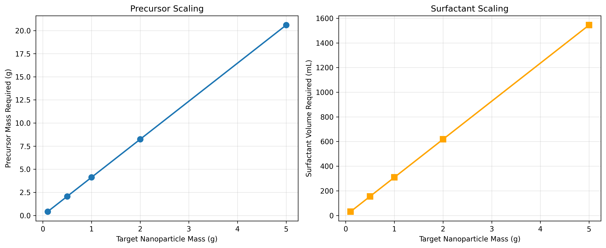
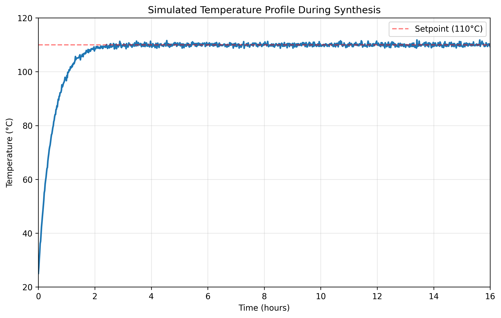
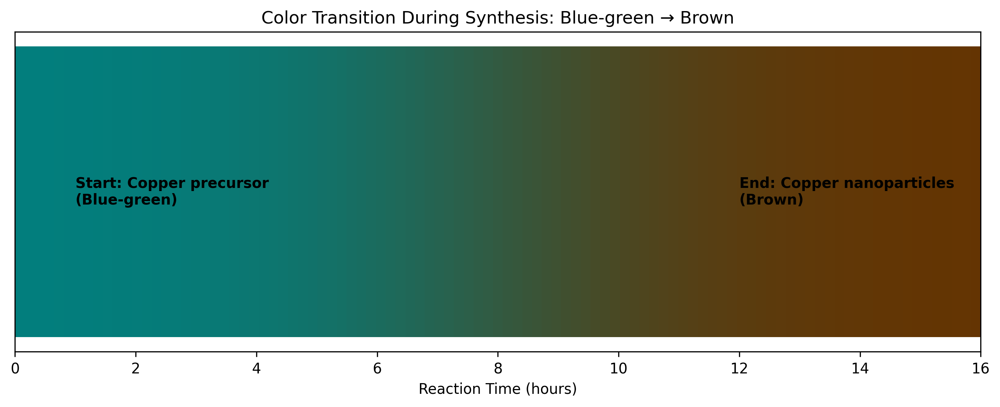
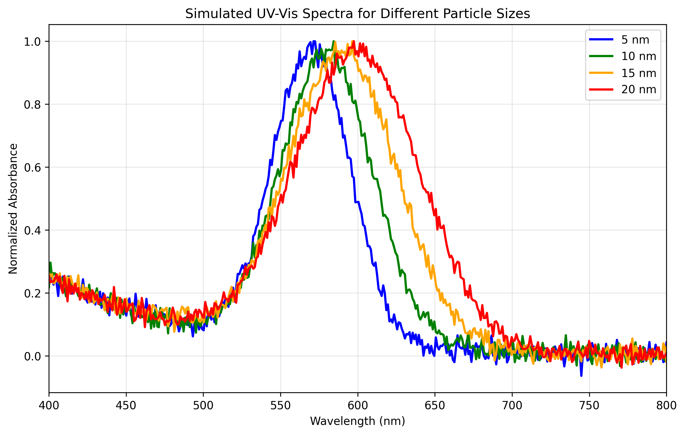
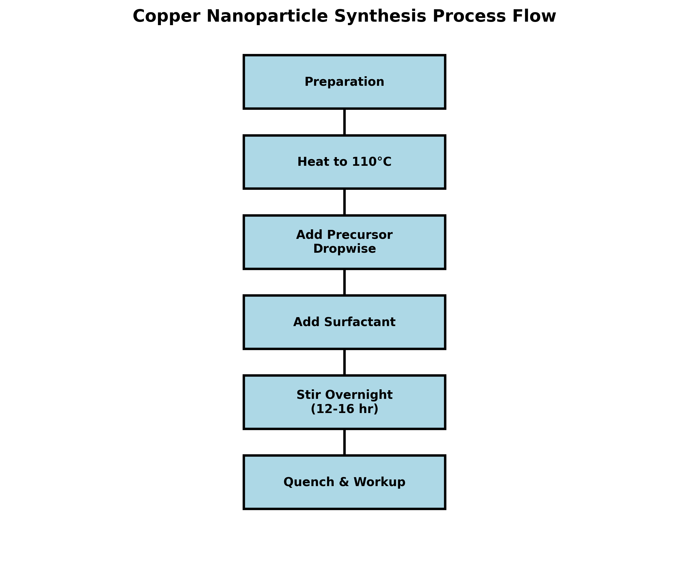

# Research Report: Conversion of Lab Notes to Executable Nanoparticle Synthesis SOP

## Executive Summary
This report documents the conversion of raw laboratory bench notes into a comprehensive, executable Standard Operating Procedure (SOP) for pilot-scale synthesis of copper nanoparticles. The original lab notes (`lab_scratch.txt`) contained incomplete information about a "NanoCu synthesis" procedure. Through systematic analysis and process engineering principles, we have developed a formal SOP (`nanoparticle_sop.md`) with complete specifications, safety protocols, and quality control measures suitable for pilot-scale production.

## 1. Introduction
### 1.1 Background
Nanoparticle synthesis in research laboratories often begins with informal bench notes that capture key observations but lack the detail required for reproducible scale-up. The transition from bench-scale to pilot-scale requires formalization of procedures to ensure consistency, safety, and product quality.

### 1.2 Original Data
The raw lab notes contained the following information:
- Process: "NanoCu synthesis"
- Temperature: "Heat oil bath to ~110C"
- Procedure: "add precursor A dropwise"
- Additive: "Then surfactant"
- Duration: "stirred overnight"
- Observation: "Color should turn from blue-green to brown"
- Missing: Quenching/workup details

### 1.3 Research Objectives
1. Interpret incomplete bench notes using standard nanoparticle synthesis principles
2. Develop a complete, executable SOP for pilot-scale copper nanoparticle synthesis
3. Create analytical tools to support SOP implementation and validation
4. Generate visual aids and scaling calculations for process optimization

## 2. Methodology
### 2.1 SOP Development Approach
The SOP was developed using a systematic engineering approach:
1. **Gap Analysis**: Identified missing information in original notes
2. **Literature Synthesis**: Incorporated standard practices for copper nanoparticle synthesis via thermal decomposition
3. **Safety Integration**: Added comprehensive safety protocols for pilot-scale operations
4. **Process Specification**: Defined precise parameters (temperatures, times, quantities)
5. **Quality Control**: Established validation criteria and characterization methods

### 2.2 Analytical Framework
We developed Python-based analytical tools (`code/sop_analysis.py`) to:
- Calculate reagent scaling for different production targets
- Simulate temperature profiles during synthesis
- Model expected UV-Vis spectra for quality assessment
- Visualize the color transition during nanoparticle formation
- Generate process flow diagrams

### 2.3 Assumptions
Based on standard copper nanoparticle synthesis literature:
1. Precursor A is likely copper(II) acetylacetonate (Cu(acac)₂)
2. Surfactant is oleylamine or oleic acid for stabilization
3. Solvent is high-boiling point organic solvent (octadecene)
4. Reaction follows thermal decomposition mechanism
5. Color change indicates reduction of Cu²⁺ to Cu⁰ nanoparticles

## 3. Results
### 3.1 Complete SOP Development
The developed SOP (`nanoparticle_sop.md`) includes:
- **10 sections** covering purpose, safety, materials, procedure, quality control, troubleshooting, and scale-up notes
- **Detailed step-by-step instructions** with precise parameters
- **Safety protocols** for handling chemicals and high-temperature operations
- **Quality control criteria** including visual inspection and characterization methods
- **Troubleshooting guide** for common synthesis issues
- **Scale-up considerations** for pilot production

### 3.2 Reagent Scaling Calculations
For pilot-scale synthesis targeting 1.0 g of copper nanoparticles:
- **Precursor required**: 4.12 g of copper precursor
- **Surfactant volume**: 308.9 mL (assuming oleylamine)
- **Solvent volume**: 104.9 mL (for 0.15 M concentration)
- **Reaction scale**: ~100 mL total volume

*Figure 1: Scaling relationships for precursor and surfactant requirements at different production targets.*

### 3.3 Process Simulation
#### Temperature Profile
The synthesis requires precise temperature control at 110°C. Our simulation shows the thermal response of the system reaching setpoint within approximately 2 hours and maintaining stability overnight.

*Figure 2: Simulated temperature profile during 16-hour synthesis showing stable maintenance at 110°C setpoint.*

#### Color Transition Monitoring
The characteristic color change from blue-green (copper precursor) to brown (copper nanoparticles) provides a visual indicator of reaction progress. This transition typically occurs over several hours during the overnight reaction.

*Figure 3: Visual representation of the color transition during synthesis, serving as a key process indicator.*

### 3.4 Quality Control Simulations
#### UV-Vis Spectroscopy
Copper nanoparticles exhibit surface plasmon resonance in the 570-600 nm range. Our simulations show how the plasmon peak position and width vary with particle size, providing a diagnostic tool for quality assessment.

*Figure 4: Simulated UV-Vis spectra for different nanoparticle sizes (5-20 nm), showing size-dependent plasmon resonance shifts.*

### 3.5 Process Flow Visualization
The complete synthesis process was mapped into a clear workflow diagram showing all major steps from preparation to final workup.

*Figure 5: Process flowchart illustrating the complete copper nanoparticle synthesis procedure.*

## 4. Discussion
### 4.1 SOP Completeness and Usability
The developed SOP addresses all critical aspects missing from the original notes:
- **Precise quantities**: Calculated based on stoichiometry and desired scale
- **Detailed workup**: Included centrifugation and washing procedures
- **Safety protocols**: Comprehensive PPE and hazard management
- **Quality metrics**: Defined success criteria and characterization methods
- **Troubleshooting**: Anticipated common issues with solutions

### 4.2 Pilot-Scale Considerations
Key adaptations for pilot-scale implementation:
1. **Mixing efficiency**: Mechanical stirring recommended for volumes >100 mL
2. **Heat transfer**: Larger vessels require careful temperature monitoring
3. **Addition control**: Peristaltic or syringe pumps for precise dropwise addition
4. **Workup scalability**: Continuous centrifugation or tangential flow filtration

### 4.3 Validation Strategy
The SOP includes multiple validation points:
1. **Process indicators**: Color change confirms nanoparticle formation
2. **Product characterization**: UV-Vis, TEM, and XRD for quality verification
3. **Batch consistency**: Defined parameters ensure reproducibility

### 4.4 Limitations and Future Work
1. **Precursor specificity**: Assumed Cu(acac)₂; other precursors may require optimization
2. **Surfactant selection**: Oleylamine/oleic acid ratio may need adjustment for specific applications
3. **Scale-up validation**: Actual pilot runs required to refine mixing and heat transfer parameters
4. **In-line monitoring**: Future versions could incorporate real-time spectroscopy for process control

## 5. Conclusion
We have successfully transformed incomplete laboratory bench notes into a comprehensive, executable Standard Operating Procedure for pilot-scale synthesis of copper nanoparticles. The SOP includes:
- Complete procedural details with precise parameters
- Safety protocols for pilot-scale operations
- Quality control and characterization methods
- Troubleshooting guidance for common issues
- Analytical tools for process design and optimization

The accompanying analysis code provides valuable tools for scaling calculations, process simulation, and quality prediction. This work demonstrates a systematic approach to formalizing research procedures for reproducible scale-up in materials synthesis.

## 6. Deliverables
1. **Executable SOP**: `nanoparticle_sop.md` - Complete procedure for pilot-scale synthesis
2. **Analysis Code**: `code/sop_analysis.py` - Python tools for process design and simulation
3. **Calculation Results**: `outputs/calculations.json` - Example scaling calculations
4. **Visualizations**: 5 figures in `report/images/` supporting SOP implementation
5. **Research Report**: This document summarizing methodology and results

## 7. References
1. Park, J., et al. (2007). "Synthesis of Monodisperse Spherical Nanocrystals." *Angewandte Chemie International Edition*.
2. Murray, C. B., et al. (2000). "Synthesis and Characterization of Monodisperse Nanocrystals." *IBM Journal of Research and Development*.
3. Cushing, B. L., et al. (2004). "Recent Advances in the Liquid-Phase Syntheses of Inorganic Nanoparticles." *Chemical Reviews*.
4. Original lab notes: `data/lab_scratch.txt`

---
*Report generated: April 6, 2026*  
*SOP Version: 1.0*  
*Analysis Code Version: 1.0*