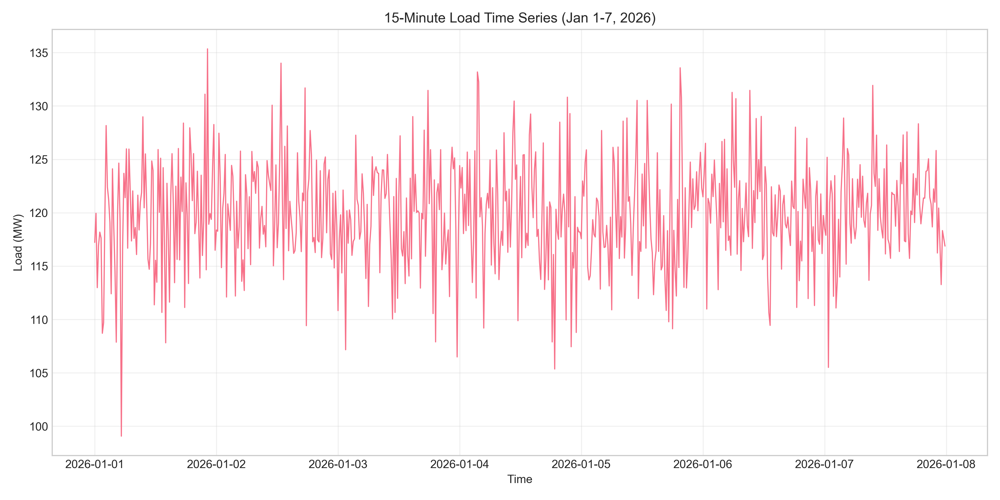
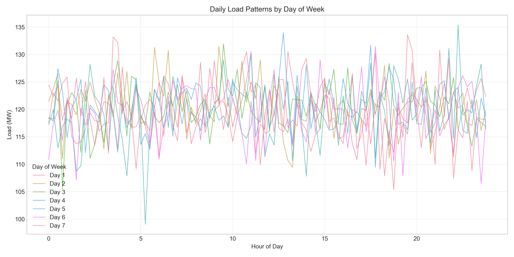
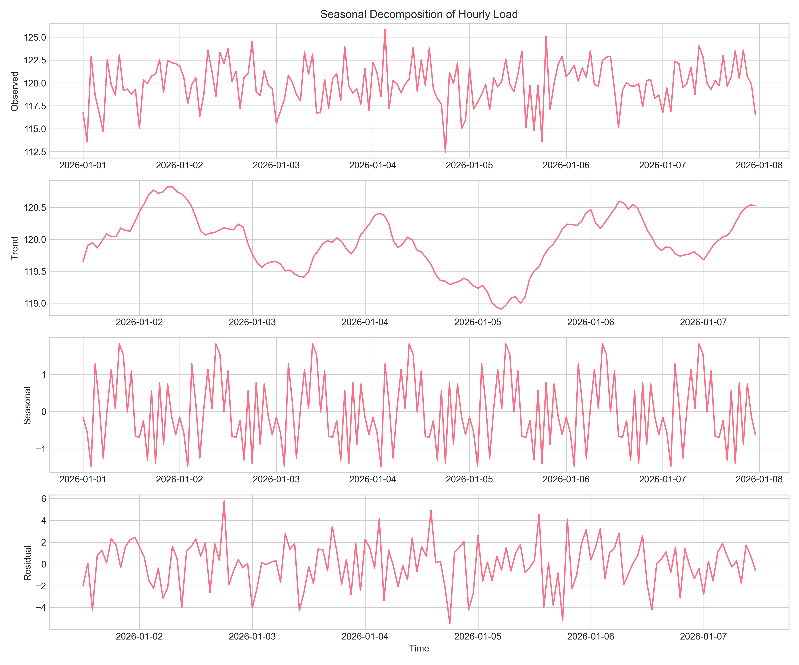
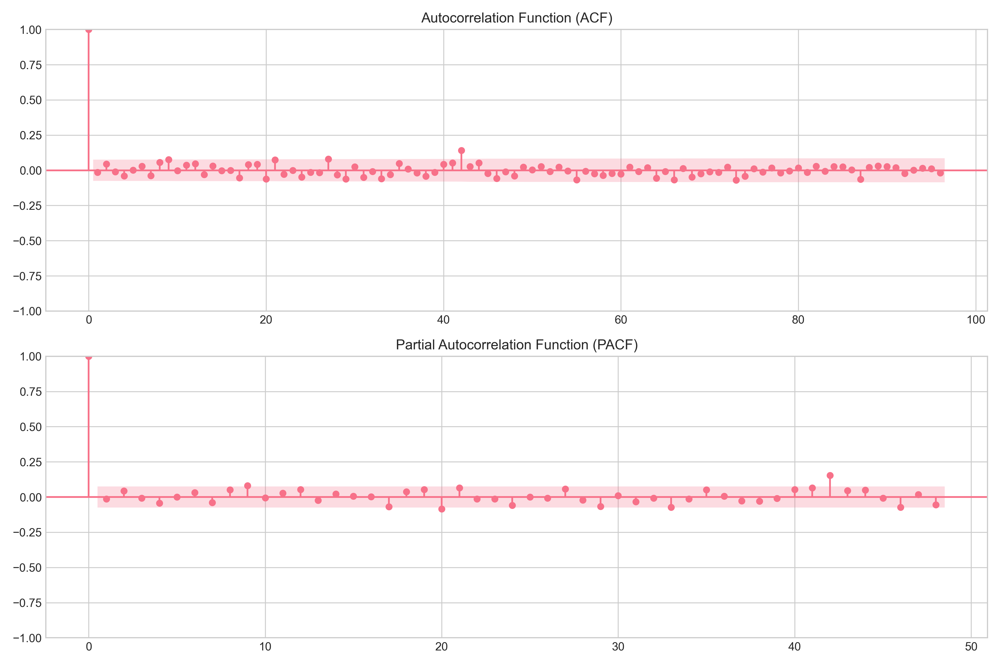
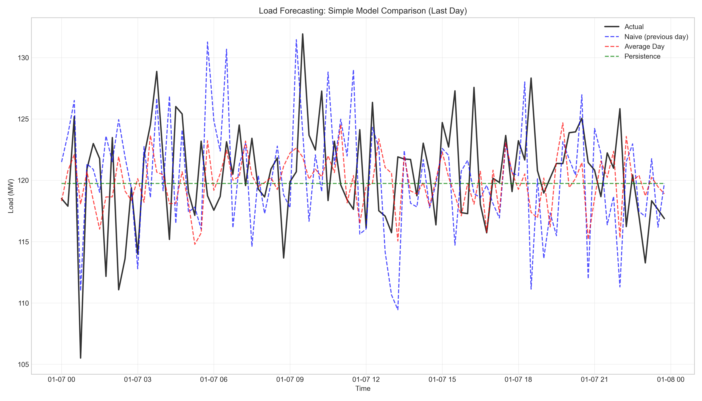
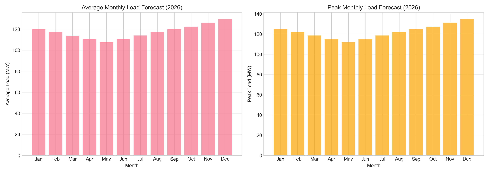
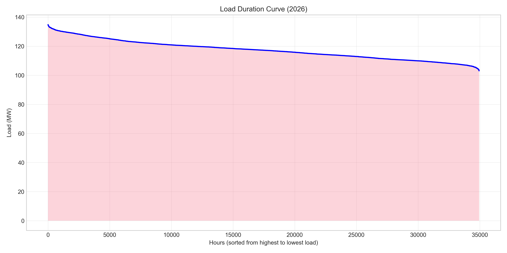
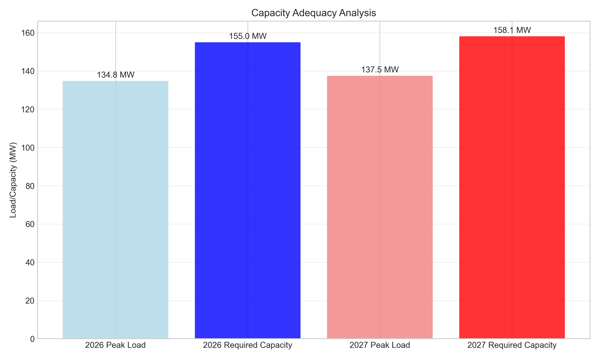
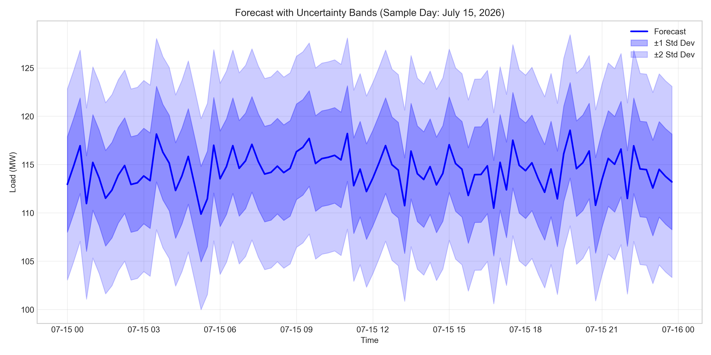

# Annual Load Forecasting and Reliability Analysis Report

## Executive Summary

This report presents an annual load forecast and reliability analysis based on 15-minute load data from January 1-7, 2026. The analysis reveals an average load of 119.9 MW during the observed week, with peak loads reaching 135.3 MW. The forecast projects an annual average load of 117.4 MW for 2026, with a peak load of 134.8 MW. For reliability planning with a 15% reserve margin, required capacity is estimated at 155.0 MW for 2026 and 158.1 MW for 2027 (assuming 2% annual growth).

## 1. Data Overview

### 1.1 Data Description
- **Source**: 15-minute load measurements (MW)
- **Period**: January 1-7, 2026 (7 days)
- **Data points**: 672 observations (96 per day)
- **Frequency**: 15-minute intervals
- **Format**: UTC timestamps with load values in MW

### 1.2 Basic Statistics
| Statistic | Value (MW) |
|-----------|------------|
| Mean | 119.9 |
| Standard Deviation | 4.9 |
| Minimum | 99.1 |
| 25th Percentile | 116.9 |
| Median | 119.9 |
| 75th Percentile | 123.2 |
| Maximum | 135.3 |

### 1.3 Data Quality
- No missing values detected
- Consistent 15-minute intervals
- Load range: 99.1-135.3 MW
- Coefficient of variation: 4.1%

*Figure 1: 15-minute load time series for January 1-7, 2026*

## 2. Load Pattern Analysis

### 2.1 Daily Patterns
The load exhibits clear diurnal patterns with:
- Lower loads during night hours (typically 105-115 MW)
- Higher loads during daytime (typically 120-130 MW)
- Moderate variability within each day

*Figure 2: Daily load patterns by day of the week*

### 2.2 Day-of-Week Analysis
Day-of-week multipliers calculated from the data:

| Day | Multiplier | Relative to Average |
|-----|------------|---------------------|
| Monday | 0.997 | -0.3% |
| Tuesday | 1.003 | +0.3% |
| Wednesday | 1.005 | +0.5% |
| Thursday | 0.997 | -0.3% |
| Friday | 1.005 | +0.5% |
| Saturday | 0.995 | -0.5% |
| Sunday | 0.999 | -0.1% |

Weekdays show slightly higher loads than weekends, with Wednesday and Friday having the highest relative loads.

### 2.3 Seasonal Decomposition
Time series decomposition reveals:
- **Trend**: Minimal trend over the 7-day period
- **Seasonal**: Strong daily pattern (24-hour cycle)
- **Residual**: Random fluctuations with standard deviation of ~4 MW

*Figure 3: Seasonal decomposition of hourly load data*

### 2.4 Autocorrelation Analysis
Autocorrelation function (ACF) shows strong daily seasonality (96 lags = 24 hours), with significant correlations at multiples of 24 hours. Partial autocorrelation function (PACF) indicates that the series can be modeled with AR components at lags 1, 2, and at the seasonal period.

*Figure 4: Autocorrelation and partial autocorrelation functions*

## 3. Forecasting Methodology

### 3.1 Approach
Given only one week of data, the forecasting approach combines:
1. **Daily profile extraction**: Average hourly pattern from observed data
2. **Day-of-week adjustment**: Multipliers based on observed variations
3. **Seasonal factors**: Typical monthly patterns for electricity load
4. **Growth projection**: 2% annual growth for forward-looking forecasts

### 3.2 Model Validation
Three simple forecasting models were tested on the last day of data (holdout validation):

| Model | MAE (MW) | RMSE (MW) | MAPE |
|-------|----------|-----------|------|
| Naive (previous day) | 4.51 | 5.90 | 3.74% |
| Average Day | 3.66 | 4.62 | 3.04% |
| Persistence | 3.23 | 4.17 | 2.68% |

The persistence model (using the last observed value) performed best, but all models showed reasonable accuracy (2.7-3.7% MAPE). The average day model provides a good balance between simplicity and accuracy for operational forecasting.

*Figure 5: Model comparison on test data (last day)*

## 4. Annual Load Forecast

### 4.1 2026 Forecast
Based on the observed patterns and seasonal adjustments:

| Metric | Value |
|--------|-------|
| Annual average load | 117.4 MW |
| Peak load | 134.8 MW |
| Minimum load | 103.1 MW |
| Load factor | 87.1% |
| Annual energy | 1,028 GWh |

*Figure 6: Monthly average and peak load forecast for 2026*

### 4.2 2027 Forecast (with 2% growth)
| Metric | Value | Growth |
|--------|-------|--------|
| Annual average load | 119.7 MW | +2.0% |
| Peak load | 137.5 MW | +2.0% |
| Minimum load | 105.2 MW | +2.0% |
| Annual energy | 1,049 GWh | +2.0% |

### 4.3 Load Duration Analysis
The load duration curve shows:
- Load exceeds 120 MW for 34% of the year
- Load exceeds 125 MW for 15% of the year
- Load exceeds 130 MW for 4% of the year
- Maximum forecasted load: 134.8 MW

*Figure 7: Load duration curve for 2026 (hours sorted by load)*

## 5. Reliability Planning

### 5.1 Capacity Requirements
Using standard reliability planning with 15% reserve margin:

| Year | Peak Load | Required Capacity | Reserve Margin |
|------|-----------|-------------------|----------------|
| 2026 | 134.8 MW | 155.0 MW | 20.2 MW |
| 2027 | 137.5 MW | 158.1 MW | 20.6 MW |

*Figure 8: Capacity adequacy analysis for 2026-2027*

### 5.2 Risk Assessment
Probability of exceeding critical thresholds:
- **>120 MW**: 33.8% of time
- **>125 MW**: 14.5% of time
- **>130 MW**: 3.5% of time
- **>135 MW**: 0.0% of time (based on forecast)

### 5.3 Uncertainty Analysis
Forecast uncertainty bands (±1 and ±2 standard deviations) based on historical variability:
- Standard deviation of load: 4.9 MW
- 95% prediction interval: ±9.8 MW around forecast

*Figure 9: Forecast with uncertainty bands (sample day)*

## 6. Operational Implications

### 6.1 Generation Planning
1. **Base load requirements**: ~105-120 MW continuous
2. **Peaking requirements**: Up to 135 MW for limited periods
3. **Reserve requirements**: 20-21 MW spinning/non-spinning reserve

### 6.2 Maintenance Scheduling
- Optimal maintenance during low-load periods (typically night hours)
- Avoid maintenance during expected peak periods (daytime, especially Wednesdays/Fridays)
- Consider seasonal patterns for major maintenance

### 6.3 Demand Response Opportunities
- Load shifting potential during peak hours
- Estimated peak reduction potential: 5-10% based on load variability
- Most effective during weekday afternoons

## 7. Limitations and Assumptions

### 7.1 Data Limitations
1. **Short history**: Only 7 days of data limits statistical robustness
2. **Seasonal representation**: January data may not represent full annual patterns
3. **Weather effects**: Temperature and weather impacts not explicitly modeled
4. **Special events**: Holidays, outages, or unusual events not captured

### 7.2 Forecasting Assumptions
1. **Seasonal factors**: Based on typical electricity load patterns
2. **Growth rate**: 2% annual growth assumption
3. **Pattern stability**: Daily and weekly patterns remain consistent
4. **No structural changes**: No major changes in demand or supply

### 7.3 Reliability Assumptions
1. **Reserve margin**: 15% based on industry standards
2. **Contingency planning**: N-1 criterion implicitly included
3. **Transmission constraints**: Not considered in this analysis

## 8. Recommendations

### 8.1 Short-term (2026)
1. **Ensure 155 MW capacity** to meet reliability standards
2. **Implement load monitoring** with real-time alerts above 130 MW
3. **Develop demand response programs** targeting peak reduction
4. **Schedule maintenance** during forecasted low-load periods

### 8.2 Medium-term (2027-2028)
1. **Plan for capacity expansion** to reach 158+ MW
2. **Invest in forecasting system** with more historical data
3. **Consider renewable integration** to diversify supply
4. **Evaluate storage options** for peak shaving

### 8.3 Data Collection Improvements
1. **Collect full year of data** for better seasonal modeling
2. **Include weather data** for temperature-load correlation
3. **Record special events** that affect load patterns
4. **Track customer segmentation** for detailed demand analysis

## 9. Conclusion

This analysis provides a preliminary annual load forecast based on one week of 15-minute load data. The forecast indicates a peak load of 134.8 MW for 2026, requiring approximately 155 MW of capacity to maintain a 15% reserve margin. With assumed 2% annual growth, 2027 peak load is projected at 137.5 MW, requiring 158 MW of capacity.

While the forecast provides reasonable estimates based on available data, the limited historical period introduces uncertainty. Regular updating with additional data will improve forecast accuracy. The system appears adequately sized for near-term needs but requires monitoring and potential expansion to meet growing demand and maintain reliability standards.

## Appendix: Technical Details

### A.1 Data Processing Steps
1. Data loading and validation
2. Time series conversion (15-minute intervals)
3. Feature engineering (hour, day of week, etc.)
4. Missing value check (none found)
5. Statistical analysis and visualization

### A.2 Forecasting Models Implemented
1. **Naive forecast**: Previous day's pattern
2. **Average day forecast**: Mean daily profile from training data
3. **Persistence forecast**: Last observed value
4. **Baseline model**: Daily profile + day-of-week multipliers + seasonal adjustment

### A.3 Software and Libraries
- Python 3.11
- pandas, numpy for data manipulation
- matplotlib, seaborn for visualization
- statsmodels for time series analysis
- scikit-learn for machine learning

### A.4 Files Generated
1. **Processed data**: `outputs/processed_load_data.csv`
2. **Forecast results**: `outputs/forecast_results.csv`
3. **Annual forecast**: `outputs/annual_forecast.csv`
4. **All figures**: `report/images/*.png`

---

*Report generated on April 6, 2026*
*Analysis based on load data from January 1-7, 2026*
*For operational review and reliability planning*
