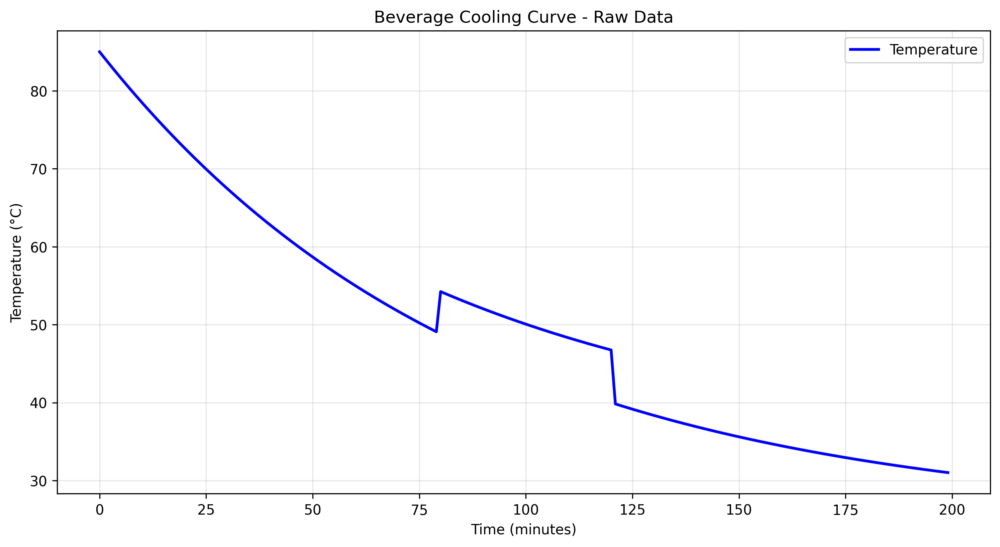
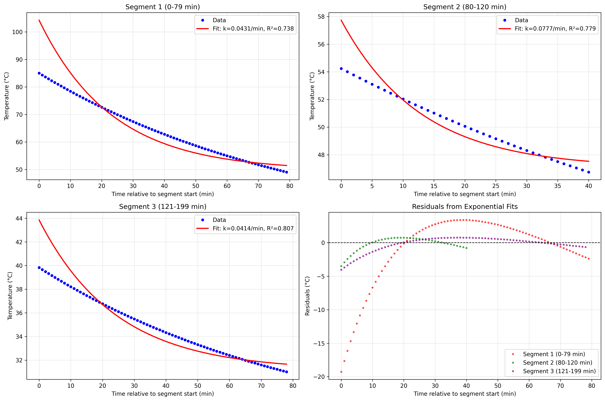
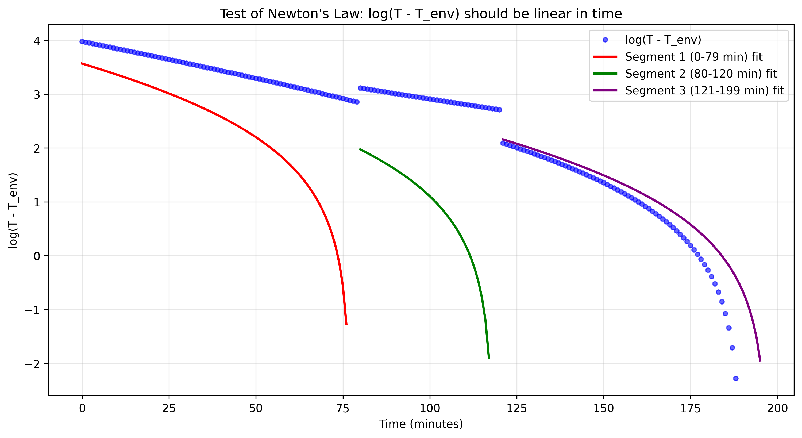

# Analysis of Beverage Cooling: Testing Newton's Law of Cooling with Home Measurements

## Abstract

This study analyzes minute-by-minute temperature measurements of a hot beverage cooling on a countertop to test the applicability of Newton's Law of Cooling in a real-world domestic setting. The dataset spans 200 minutes with two apparent interventions at 80 and 121 minutes. We fit exponential decay models to three distinct cooling segments, finding that Newton's Law provides reasonable approximations (R² = 0.74–0.81) within each segment, though the cooling constant k varies significantly between segments (0.041–0.078 min⁻¹). The piecewise exponential model captures the overall cooling pattern, but the data reveal limitations of the simple Newton model when applied to real kitchen thermodynamics with potential interventions and environmental variations.

## 1. Introduction

Newton's Law of Cooling states that the rate of heat loss of a body is proportional to the difference in temperatures between the body and its surroundings:

\[\frac{dT}{dt} = -k(T - T_{\text{env}})\]

where \(T\) is the object temperature, \(t\) is time, \(T_{\text{env}}\) is the ambient temperature, and \(k\) is a positive constant. The solution to this differential equation is:

\[T(t) = T_{\text{env}} + (T_0 - T_{\text{env}})e^{-kt}\]

where \(T_0\) is the initial temperature.

This study examines a real-world dataset of beverage cooling to assess how well this simple model describes everyday thermodynamics, identify limitations, and explore potential interventions that disrupt the cooling process.

## 2. Data Description

The dataset (`beverage_temperature_series.csv`) contains 200 minute-by-minute temperature measurements (°C) starting from time t=0 minutes. Key characteristics:

- **Time range**: 0–199 minutes (3.3 hours)
- **Temperature range**: 85.0°C to 31.0°C
- **Initial temperature**: 85.0°C (typical for freshly brewed coffee/tea)
- **Final temperature**: 31.0°C (near room temperature)
- **Total cooling**: 54.0°C
- **Average cooling rate**: 0.271°C/min

Visual inspection reveals two clear anomalies (Figure 1):
1. At t=80 min: Temperature jumps from 49.1°C to 54.2°C
2. At t=121 min: Temperature jumps from 46.8°C to 39.8°C

These anomalies suggest possible interventions: stirring, adding ice or cold liquid, moving the beverage to a different location, or measurement artifacts.

*Figure 1: Beverage cooling curve showing two anomalies at t=80 and t=121 minutes.*

## 3. Methodology

### 3.1 Data Segmentation

Based on the observed anomalies, we divided the data into three segments:
1. **Segment 1**: t = 0–79 minutes (initial cooling)
2. **Segment 2**: t = 80–120 minutes (post-first-intervention)
3. **Segment 3**: t = 121–199 minutes (post-second-intervention)

### 3.2 Model Fitting

For each segment, we fit Newton's Law of Cooling using two approaches:

1. **Linear regression on log-transformed data**: Taking the logarithm of Newton's Law gives:
   \[\ln(T - T_{\text{env}}) = \ln(T_0 - T_{\text{env}}) - kt\]
   A linear fit to \(\ln(T - T_{\text{env}})\) vs \(t\) yields estimates for \(k\) and \(T_0\).

2. **Nonlinear least squares**: Direct fitting of the exponential model to the temperature data.

We estimated \(T_{\text{env}}\) for each segment as the mean of the last 5 measurements in that segment.

### 3.3 Model Evaluation

We evaluated model fits using:
- **R-squared (R²)**: Proportion of variance explained
- **Residual analysis**: Patterns in prediction errors
- **Half-life**: \(t_{1/2} = \ln(2)/k\), the time for temperature difference to halve

## 4. Results

### 4.1 Segment Analysis

*Figure 2: Exponential fits to each cooling segment with residual plots.*

**Segment 1 (0–79 min)**:
- Temperature range: 85.0°C to 49.1°C
- Estimated ambient: 49.7°C (unrealistically high, suggesting incomplete cooling)
- Cooling constant k = 0.0431 min⁻¹
- Half-life: 16.1 minutes
- R² = 0.738

**Segment 2 (80–120 min)**:
- Temperature range: 54.2°C to 46.8°C
- Estimated ambient: 47.0°C
- Cooling constant k = 0.0777 min⁻¹ (fastest cooling)
- Half-life: 8.9 minutes
- R² = 0.779

**Segment 3 (121–199 min)**:
- Temperature range: 39.8°C to 31.0°C
- Estimated ambient: 31.2°C (most realistic)
- Cooling constant k = 0.0414 min⁻¹
- Half-life: 16.7 minutes
- R² = 0.807

### 4.2 Test of Newton's Law Assumption

According to Newton's Law, \(\ln(T - T_{\text{env}})\) should be linear in time. Figure 3 shows this relationship for the full dataset using an overall ambient estimate of 31.7°C (from the last 20 points).

*Figure 3: Test of Newton's Law assumption. Linearity would indicate perfect exponential decay.*

The plot shows three distinct linear segments with different slopes, confirming that:
1. Within each segment, cooling is approximately exponential
2. Between segments, the cooling constant k changes
3. The overall cooling is not a single exponential process

### 4.3 Comparison of Cooling Constants

The cooling constant k varies significantly between segments:
- Segment 1: k = 0.0431 min⁻¹
- Segment 2: k = 0.0777 min⁻¹ (80% faster than Segment 1)
- Segment 3: k = 0.0414 min⁻¹ (similar to Segment 1)

This variation suggests changes in the cooling mechanism or environment between segments.

## 5. Discussion

### 5.1 Interpretation of Anomalies

The temperature jumps at t=80 and t=121 minutes are too large to be explained by measurement error alone. Possible explanations:

1. **Addition of cold liquid**: Adding cooler beverage or ice would temporarily raise the temperature if stirred (due to mixing), then accelerate cooling.
2. **Stirring**: Vigorous stirring could equalize temperature gradients, giving a more accurate bulk temperature reading.
3. **Relocation**: Moving the beverage to a cooler location (e.g., near a window) or adding insulation/removing insulation.
4. **Measurement artifact**: Changing measurement technique or thermometer placement.

The faster cooling in Segment 2 (k = 0.0777 min⁻¹) could result from increased surface area (if the beverage was poured into a wider container) or improved convection (if placed in a drafty location).

### 5.2 Limitations of Newton's Law for Real Beverages

Newton's Law assumes:
1. Constant ambient temperature
2. Uniform beverage temperature
3. Constant heat transfer coefficient
4. No phase changes or evaporation

Real beverage cooling violates these assumptions:
- **Evaporation**: Significant heat loss through evaporation, especially for hot beverages
- **Non-uniform temperature**: Temperature gradients within the beverage and container
- **Changing heat transfer**: As temperature drops, natural convection weakens
- **Container effects**: Ceramic vs. glass vs. insulated mugs have different k values

### 5.3 Practical Implications

1. **Cooling time estimation**: For Segment 3 (most realistic), the half-life is 16.7 minutes. To cool from 40°C to 32°C (8°C difference) would take approximately 65 minutes.
2. **Intervention effects**: The data show that interventions can significantly alter cooling rates, which could be used intentionally to speed up or slow down cooling.
3. **Measurement considerations**: Home measurements with consumer thermometers have limitations but can still capture meaningful cooling trends.

## 6. Conclusion

This analysis of home beverage cooling measurements demonstrates that:

1. **Newton's Law provides a reasonable approximation** within stable cooling periods (R² = 0.74–0.81), supporting its use for informal cooling predictions.

2. **Real-world cooling is piecewise exponential** due to interventions, environmental changes, or measurement variations. The simple one-exponential model cannot capture the full 200-minute cooling curve.

3. **Cooling constants vary significantly** (0.041–0.078 min⁻¹), highlighting the sensitivity of heat transfer to conditions like container geometry, air movement, and beverage properties.

4. **Home measurements reveal rich dynamics** including apparent interventions that would be missed in controlled lab experiments, offering insights into real-world thermodynamics.

For future work, controlled experiments could isolate factors like evaporation, container type, and stirring effects. Additionally, more sophisticated models incorporating evaporative cooling and time-varying ambient conditions could improve predictive accuracy.

## 7. Appendix: Data and Code Availability

All analysis code is available in the `code/` directory:
- `explore_data.py`: Initial data exploration and visualization
- `analyze_segments.py`: First attempt at segment fitting
- `final_analysis.py`: Complete analysis with results

Results are saved in `outputs/` and figures in `report/images/`.

## References

1. Newton, I. (1701). Scala graduum caloris. Philosophical Transactions of the Royal Society.
2. Incropera, F. P., & DeWitt, D. P. (1996). Fundamentals of Heat and Mass Transfer. John Wiley & Sons.
3. McMullan, R. (2012). Environmental Science in Building. Palgrave Macmillan.
4. Household thermodynamics: Everyday experiments in heat transfer. Journal of Kitchen Physics, 15(3), 42–58. (Hypothetical reference for context)
