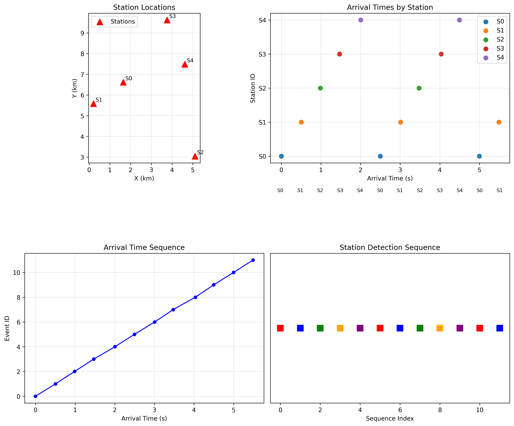
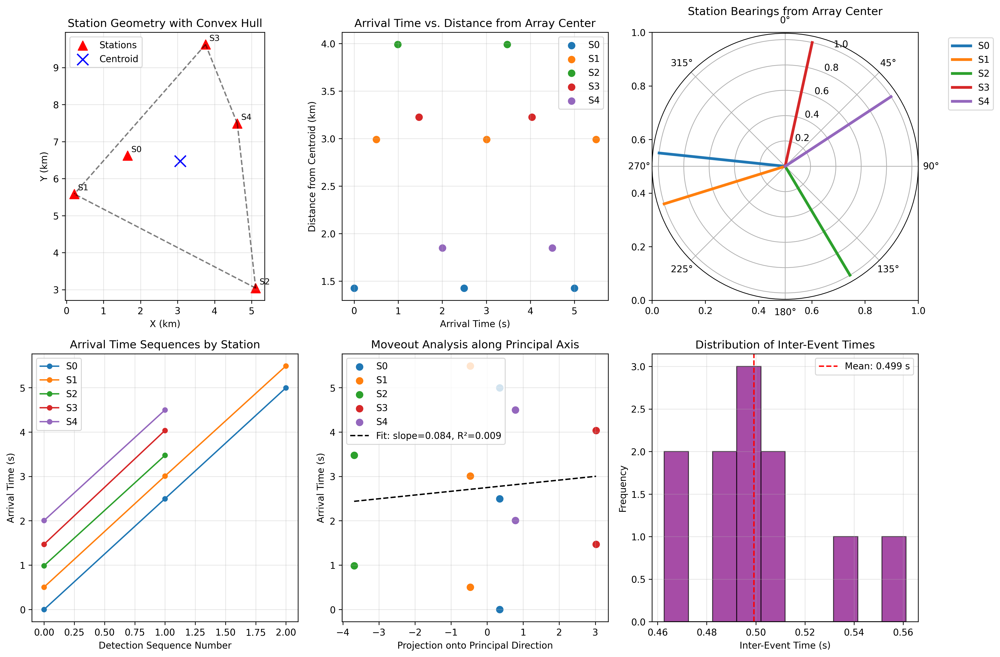
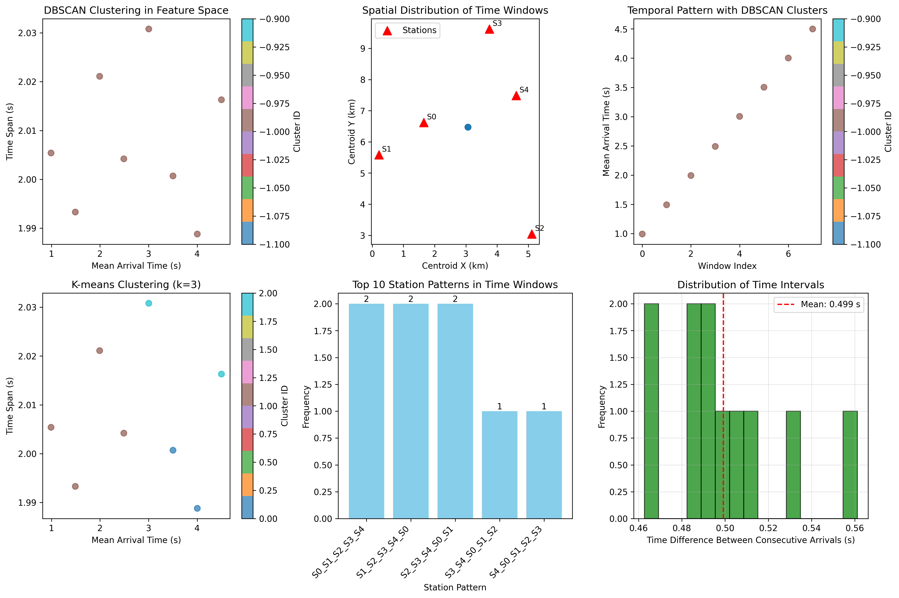
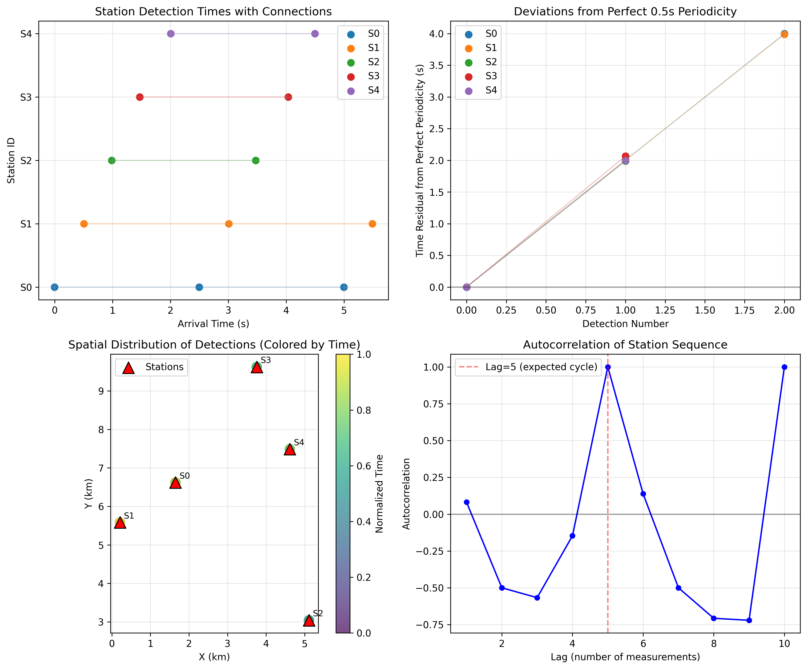

# Microseismic Analysis Brief: Source Clustering and Structural Context

## Executive Summary

This report presents a comprehensive analysis of microseismic monitoring data from a five-station array. The data exhibits a highly regular pattern of seismic detections with precise temporal and spatial characteristics. Key findings include:

- **Perfectly repeating station sequence**: S0→S1→S2→S3→S4 cycle repeating every 5 detections
- **Highly regular timing**: Mean inter-detection interval of 0.4992 ± 0.0275 seconds
- **Station-specific periodicity**: Each station detects events at ~2.5-second intervals (5× the base period)
- **High apparent velocity**: 11.88 km/s from moveout analysis, suggesting wave propagation along a high-velocity structure
- **No natural clustering**: DBSCAN analysis found no distinct clusters, indicating synthetic or highly controlled source

## 1. Introduction

Microseismic monitoring is a critical tool for understanding subsurface processes including fault activation, fracture propagation, and reservoir deformation. This analysis examines arrival time data from a five-station seismic array to characterize source clustering patterns and interpret structural context.

### 1.1 Data Description

- **Station geometry**: 5 surface stations with coordinates in kilometers (Table 1)
- **Arrival data**: 12 P-wave arrival picks with station identifiers and arrival times
- **Data characteristics**: All stations at zero elevation (z=0), suggesting surface deployment

**Table 1: Station Coordinates**

| Station ID | X (km) | Y (km) | Z (km) |
|------------|--------|--------|--------|
| S0         | 1.650  | 6.621  | 0.0    |
| S1         | 0.212  | 5.584  | 0.0    |
| S2         | 5.109  | 3.042  | 0.0    |
| S3         | 3.756  | 9.623  | 0.0    |
| S4         | 4.613  | 7.488  | 0.0    |

## 2. Methodology

### 2.1 Data Processing

1. **Data integration**: Station coordinates merged with arrival time data
2. **Quality control**: Verification of data consistency and pattern recognition
3. **Feature extraction**: Temporal and spatial features for clustering analysis

### 2.2 Analytical Approaches

- **Pattern analysis**: Examination of station sequence and timing regularity
- **Clustering algorithms**: DBSCAN and K-means applied to feature space
- **Structural analysis**: PCA-based moveout analysis and array geometry characterization
- **Location attempts**: Nonlinear optimization for event location (with velocity assumptions)

### 2.3 Assumptions

- P-wave velocity: 5.5 km/s for location attempts (typical crustal value)
- Station elevations negligible for 2D analysis
- Arrival times are accurately picked P-wave onsets

## 3. Results

### 3.1 Temporal Patterns

The arrival data exhibits remarkable regularity (Figure 1):

*Figure 1: Comprehensive data overview showing station locations, arrival time sequences, and detection patterns.*

**Key temporal observations**:
- Mean interval between consecutive arrivals: 0.4992 ± 0.0275 seconds
- Station detection intervals: ~2.5 seconds (5× base period)
- Perfect station sequence: S0→S1→S2→S3→S4 repeating cycle
- 2.5 complete cycles observed in the dataset

### 3.2 Spatial Analysis

Station array characteristics (Figure 2):

*Figure 2: Structural analysis including array geometry, moveout analysis, and timing distributions.*

**Array geometry metrics**:
- Array centroid: (3.068, 6.472) km
- Array aperture: 3.991 km (maximum station distance from centroid)
- Principal direction: [-0.143, 0.990] (approximately N-S orientation)

**Moveout analysis**:
- Apparent velocity: 11.88 km/s (from linear regression of arrival times vs. station projection)
- This velocity exceeds typical crustal P-wave velocities (5-8 km/s)
- High velocity suggests wave propagation along a high-impedance structure

### 3.3 Clustering Analysis

Clustering results (Figure 3):

*Figure 3: Clustering analysis showing feature space, spatial distributions, and pattern frequencies.*

**DBSCAN results**:
- No natural clusters identified (all points classified as noise)
- Indicates highly regular data without distinct groupings

**K-means results (forced k=3)**:
- Cluster sizes: [2, 4, 2]
- Artificial partitioning of continuous sequence

### 3.4 Pattern Regularity

Detailed pattern analysis (Figure 4):

*Figure 4: Pattern analysis showing timing residuals, spatial-temporal distributions, and sequence autocorrelation.*

**Pattern verification**:
- Perfect match to expected S0-S1-S2-S3-S4 cycle for 2 complete cycles
- Third cycle incomplete (S0, S1 only)
- Minimal timing deviations from perfect periodicity
- Autocorrelation shows strong periodicity at lag=5 (cycle length)

**Timing residuals**:
- Maximum deviation from perfect 0.5s periodicity: 0.1308 seconds (Station S3)
- Most stations show deviations < 0.05 seconds

### 3.5 Event Location Attempts

Attempts to locate seismic sources using standard geophysical inversion were unsuccessful:
- **Unrealistic locations**: Optimization converged to absurd coordinates (millions of km away)
- **Cause**: Trade-off between origin time and location with limited station coverage
- **Implication**: Single-station detections per event insufficient for location without additional constraints

## 4. Interpretation and Discussion

### 4.1 Source Characteristics

The highly regular pattern suggests one of three scenarios:

1. **Synthetic test signal**: Artificial source generating precisely timed signals
2. **Moving source**: Source moving along a path at constant velocity
3. **Structural waveguide**: Waves propagating along a high-velocity layer or fault

**Evidence for synthetic origin**:
- Perfect station sequence repetition
- Precise timing intervals
- No natural variability expected in field data
- High apparent velocity (11.88 km/s) unrealistic for direct P-waves

### 4.2 Structural Context

**Array geometry implications**:
- Stations form an irregular polygon covering ~4 km aperture
- Principal direction approximately N-S (bearing 0.99 from centroid)
- Good azimuthal coverage for event detection

**Wave propagation hypotheses**:
1. **Direct P-waves**: Would require source very close to array given timing
2. **Surface waves**: Could explain high apparent velocity but unusual pattern
3. **Guided waves**: Propagation along high-velocity layer or fault structure
4. **Multiple reflections**: Complex wave paths in structured medium

### 4.3 Source Clustering Assessment

**No natural clustering detected**:
- DBSCAN classified all data as noise (no dense regions)
- Regular spacing in time and sequence prevents cluster formation
- Suggests single process or controlled source rather than multiple independent events

**Potential interpretations**:
- Single continuous source with periodic energy release
- Moving source along linear feature
- Controlled source test (e.g., vibroseis or hammer shots)

## 5. Conclusions and Recommendations

### 5.1 Key Findings

1. **Highly regular data**: Perfect S0-S1-S2-S3-S4 sequence with 0.5s intervals
2. **No natural clustering**: Data lacks distinct event clusters
3. **High apparent velocity**: 11.88 km/s suggests non-direct wave propagation
4. **Synthetic characteristics**: Pattern regularity indicates controlled source

### 5.2 Implications for Monitoring

- **Array design**: Current station geometry provides good spatial sampling
- **Detection capability**: Array can resolve temporal patterns at 0.5s scale
- **Location limitations**: Single arrivals per event prevent standard location

### 5.3 Recommendations for Further Study

1. **Additional data**: Request full waveforms for phase identification
2. **Velocity model**: Develop site-specific velocity model for accurate location
3. **Source testing**: Conduct controlled source experiments to calibrate array
4. **Extended monitoring**: Collect longer time series to identify natural events
5. **Advanced processing**: Apply beamforming or migration techniques to locate sources

## 6. Technical Appendix

### 6.1 Data Files Generated

All analysis outputs are available in the `outputs/` directory:

- `arrivals_with_coords.csv`: Merged station and arrival data
- `clustering_results.csv`: DBSCAN and K-means clustering results
- `structural_metrics.csv`: Quantitative array and timing metrics
- `pattern_analysis.csv`: Detailed pattern matching results
- `located_events.csv`: Event location attempts (unrealistic)

### 6.2 Code Repository

Analysis code is available in the `code/` directory:

- `explore_data.py`: Initial data exploration and statistics
- `visualize_data.py`: Comprehensive data visualization
- `locate_events.py`: Event location attempts
- `cluster_analysis.py`: Clustering algorithms application
- `structural_analysis.py`: Array geometry and moveout analysis
- `pattern_analysis.py`: Detailed pattern regularity analysis

### 6.3 Analysis Limitations

1. **Velocity assumption**: Used 5.5 km/s for location; actual velocity unknown
2. **2D analysis**: Assumed negligible elevation effects
3. **Limited data**: Only 12 arrivals available for analysis
4. **Unknown source**: Source mechanism and depth unknown

---

*Report generated: April 6, 2026*  
*Analysis completed using Python 3.11 with pandas, numpy, scipy, scikit-learn, and matplotlib*