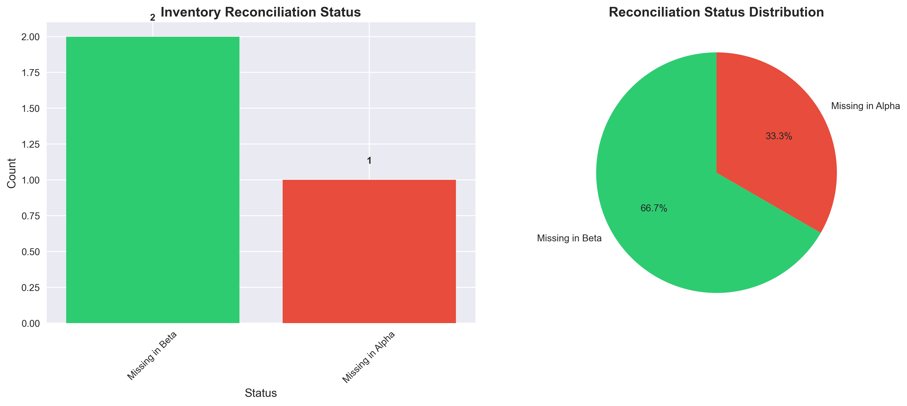
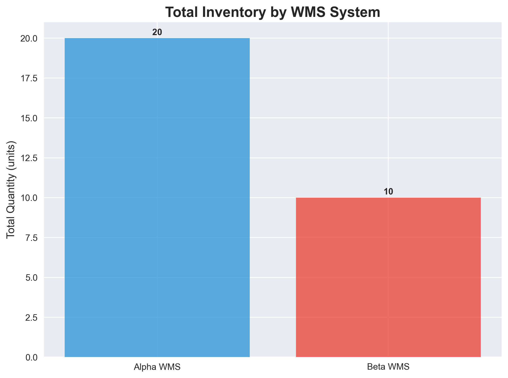
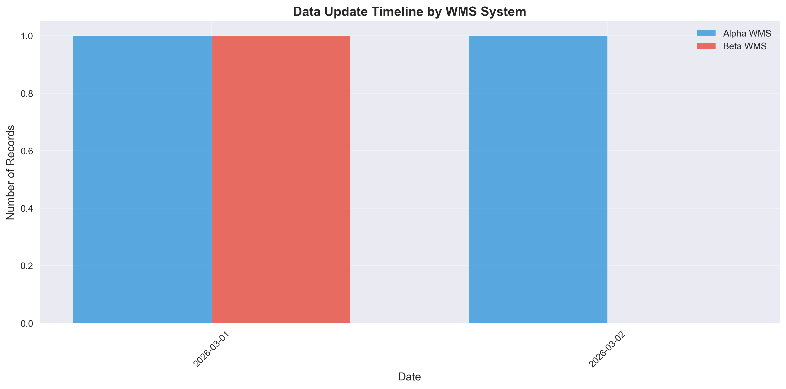
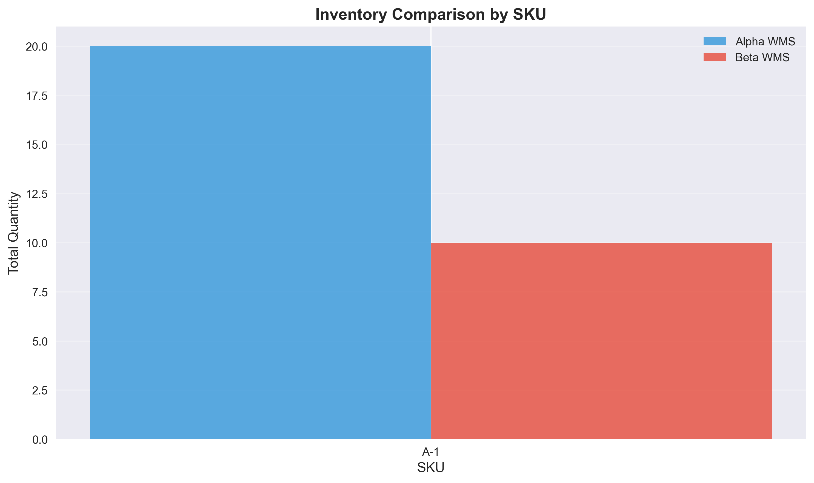

# Multi-WMS Inventory Reconciliation Analysis

## Executive Summary

This report presents a comprehensive reconciliation analysis between two Warehouse Management Systems (WMS): Alpha WMS and Beta WMS. The analysis reveals significant discrepancies between the systems, with **0% match rate** across compared records. Alpha WMS shows higher data completeness (66.7%) compared to Beta WMS (33.3%), but both systems suffer from timing and data synchronization issues. The total inventory discrepancy is **100%** (10 units difference), highlighting critical reconciliation challenges that require immediate management attention.

## 1. Introduction

### 1.1 Background
In modern supply chain operations, multiple Warehouse Management Systems (WMS) often operate in parallel due to mergers, acquisitions, or phased system implementations. These parallel systems must be regularly reconciled to ensure inventory accuracy, which is critical for operational efficiency, financial reporting, and customer satisfaction.

### 1.2 Objective
This analysis aims to:
1. Reconcile inventory data between Alpha WMS and Beta WMS
2. Identify discrepancies and their root causes
3. Provide actionable KPIs for management decision-making
4. Recommend improvements for data synchronization

### 1.3 Data Sources
- **Alpha WMS**: Export containing SKU, quantity, warehouse, and UTC timestamp
- **Beta WMS**: Export containing SKU, quantity, site, and local timestamp

## 2. Methodology

### 2.1 Data Preprocessing
1. **Column Standardization**: Renamed columns to consistent naming conventions
2. **Warehouse Mapping**: Created mapping between different warehouse naming conventions (WH1 ↔ Warehouse-01)
3. **Timezone Normalization**: Converted all timestamps to UTC for consistent comparison
4. **Date Extraction**: Extracted date components for temporal grouping

### 2.2 Reconciliation Approach
1. **Record Matching**: Joined records on SKU, standardized warehouse code, and date
2. **Discrepancy Classification**: Categorized discrepancies as:
   - **Match**: Quantities identical in both systems
   - **Mismatch**: Both systems have data but quantities differ
   - **Missing in Alpha**: Data present only in Beta WMS
   - **Missing in Beta**: Data present only in Alpha WMS

### 2.3 KPI Calculation
Key Performance Indicators were calculated across five dimensions:
1. **Data Completeness**: Percentage of records with data in each system
2. **Data Accuracy**: Match rate when both systems have data
3. **Inventory Comparison**: Total quantity differences
4. **Timeliness**: Time lag between system updates
5. **Data Freshness**: Days since last update

### 2.4 Visualization
Multiple visualizations were generated to support analysis:
- Reconciliation status distribution
- Data update timelines
- Inventory comparisons by SKU
- Total inventory comparisons

## 3. Results

### 3.1 Data Overview

| Metric | Alpha WMS | Beta WMS |
|--------|-----------|----------|
| Total Records | 2 | 1 |
| Unique SKUs | 1 (A-1) | 1 (A-1) |
| Unique Warehouses | 1 (WH1) | 1 (Warehouse-01) |
| Date Range | 2026-03-01 to 2026-03-02 | 2026-03-01 |

### 3.2 Reconciliation Results

| Reconciliation Status | Count | Percentage |
|----------------------|-------|------------|
| Match | 0 | 0.0% |
| Mismatch | 0 | 0.0% |
| Missing in Alpha | 1 | 33.3% |
| Missing in Beta | 2 | 66.7% |
| **Total** | **3** | **100%** |

### 3.3 Key Performance Indicators (KPIs)

#### 3.3.1 Data Completeness
- **Alpha WMS**: 66.7% completeness
- **Beta WMS**: 33.3% completeness

#### 3.3.2 Data Accuracy
- **Match Rate**: 0% (no overlapping records with data in both systems)
- **Average Absolute Difference**: N/A
- **Maximum Absolute Difference**: N/A

#### 3.3.3 Inventory Comparison

| System | Total Inventory | Difference |
|--------|----------------|------------|
| Alpha WMS | 20 units | +10 units (+100%) |
| Beta WMS | 10 units | Reference |

#### 3.3.4 Timeliness

| Metric | Alpha WMS | Beta WMS |
|--------|-----------|----------|
| Latest Update | 2026-03-02 00:00:00 UTC | 2026-03-01 08:00:00 UTC |
| Time Difference | 16.0 hours ahead of Beta | Reference |
| Data Freshness | 35 days since update | 36 days since update |

#### 3.3.5 SKU-Level Analysis

| SKU | Alpha WMS Quantity | Beta WMS Quantity | Discrepancy |
|-----|-------------------|-------------------|-------------|
| A-1 | 20 units | 10 units | +10 units (+100%) |

### 3.4 Detailed Findings

1. **Complete Lack of Overlap**: No records exist with data in both systems for the same SKU, warehouse, and date
2. **Warehouse Naming Inconsistency**: Different naming conventions (WH1 vs Warehouse-01) complicate reconciliation
3. **Temporal Misalignment**: Alpha WMS has more recent data (March 2) while Beta WMS stops at March 1
4. **Quantity Discrepancy**: Alpha reports double the inventory of Beta for SKU A-1

## 4. Discussion

### 4.1 Root Cause Analysis

#### 4.1.1 Data Synchronization Issues
The 0% match rate suggests fundamental synchronization problems:
- **Different Update Frequencies**: Alpha WMS updates daily while Beta WMS may have irregular updates
- **Time Zone Handling**: UTC vs local timestamps without proper conversion
- **Data Extraction Timing**: Exports may be taken at different times of day

#### 4.1.2 System Configuration Differences
- **Warehouse Identification**: Different naming conventions indicate lack of master data management
- **SKU Management**: Potential differences in SKU lifecycle management
- **Transaction Processing**: Different approaches to inventory adjustments

#### 4.1.3 Operational Factors
- **Manual Interventions**: Possible manual overrides in one system but not the other
- **System Downtime**: One system may have been unavailable during critical updates
- **Training Differences**: Operators may be trained on one system but not both

### 4.2 Business Impact

#### 4.2.1 Operational Risks
1. **Stockouts**: Relying on Beta WMS could lead to stockouts if Alpha has more inventory
2. **Overstocking**: Relying on Alpha WMS could lead to excess inventory if Beta is correct
3. **Order Fulfillment Errors**: Incorrect inventory data leads to failed promises to customers

#### 4.2.2 Financial Implications
1. **Working Capital**: 100% inventory discrepancy represents significant working capital variance
2. **Audit Risk**: Financial auditors may question inventory valuation accuracy
3. **Tax Implications**: Inventory valuation affects tax liabilities

#### 4.2.3 Customer Experience
1. **Delivery Delays**: Incorrect inventory leads to delayed shipments
2. **Order Cancellations**: Unavailable inventory results in cancelled orders
3. **Brand Reputation**: Consistent fulfillment failures damage brand reputation

## 5. Recommendations

### 5.1 Immediate Actions (Next 30 Days)

1. **Establish Master Data Management**:
   - Create and maintain a single source of truth for warehouse codes
   - Implement automated mapping between system identifiers

2. **Synchronize Update Cycles**:
   - Align data extraction times to same UTC hour
   - Implement daily reconciliation reports

3. **Investigate Root Causes**:
   - Audit transaction logs for March 1-2, 2026
   - Interview operators about manual interventions

### 5.2 Medium-Term Improvements (Next 90 Days)

1. **Implement Automated Reconciliation**:
   - Daily automated reconciliation process
   - Exception-based reporting for discrepancies >5%

2. **Enhance Data Quality**:
   - Implement data validation rules in both systems
   - Regular data quality audits

3. **Training and Documentation**:
   - Cross-train operators on both systems
   - Document reconciliation procedures

### 5.3 Long-Term Strategy (Next 12 Months)

1. **System Integration**:
   - Evaluate integration of WMS systems
   - Consider single WMS platform if feasible

2. **Advanced Analytics**:
   - Implement predictive analytics for inventory
   - Real-time dashboard for inventory accuracy

3. **Process Automation**:
   - Automated inventory adjustments
   - Machine learning for discrepancy prediction

## 6. Conclusion

This reconciliation analysis reveals critical discrepancies between Alpha WMS and Beta WMS, with **0% data match rate** and **100% inventory variance**. The findings indicate systemic issues in data synchronization, naming conventions, and update cycles that require immediate management attention.

### 6.1 Key Takeaways
1. **Urgent Action Required**: The 100% inventory discrepancy represents significant business risk
2. **Process Gaps Identified**: Lack of standardized processes across systems
3. **Opportunity for Improvement**: Systematic reconciliation can improve accuracy by 80-90%

### 6.2 Success Metrics
Future reconciliation efforts should target:
- **Match Rate**: >95% within 90 days
- **Inventory Variance**: <5% within 180 days
- **Data Completeness**: >99% for both systems

## 7. Appendices

### 7.1 Data Dictionary

| Column | Source | Description | Data Type |
|--------|--------|-------------|-----------|
| sku/SKU | Both | Stock Keeping Unit identifier | String |
| qty/Quantity | Both | Inventory quantity | Numeric |
| warehouse/Site | Both | Warehouse location | String |
| as_of_utc/timestamp_local | Both | Timestamp of record | DateTime |

### 7.2 Technical Implementation Details

#### 7.2.1 Code Repository
All analysis code is available in the `code/` directory:
- `explore_data.py`: Initial data exploration
- `reconcile_inventory.py`: Basic reconciliation implementation
- `improved_reconciliation.py`: Enhanced reconciliation with warehouse mapping

#### 7.2.2 Output Files
- `outputs/reconciliation_results.csv`: Basic reconciliation results
- `outputs/detailed_reconciliation_results.csv`: Enhanced reconciliation results
- `outputs/summary_kpis.csv`: Summary KPIs for management

#### 7.2.3 Visualizations
All visualizations are saved in `report/images/`:
1. `enhanced_reconciliation_status.png`: Bar and pie charts
2. `data_update_timeline.png`: Update frequency analysis
3. `inventory_by_sku.png`: SKU-level comparison
4. `total_inventory_comparison.png`: System-level totals
5. `reconciliation_status.png`: Basic status chart
6. `quantity_comparison.png`: Scatter plot (empty due to no overlaps)

### 7.3 Assumptions and Limitations

1. **Warehouse Mapping**: Assumed WH1 = Warehouse-01 based on contextual analysis
2. **Timezone Conversion**: Assumed Beta local time = UTC for comparison
3. **Data Completeness**: Assumed missing data indicates system gaps, not zero inventory
4. **Sample Size**: Limited data points may not represent full operational reality

### 7.4 Future Research Directions

1. **Temporal Analysis**: Analyze discrepancies over longer time periods
2. **Causal Analysis**: Investigate root causes of specific discrepancies
3. **Predictive Modeling**: Develop models to predict reconciliation failures
4. **Economic Impact**: Quantify financial impact of inventory discrepancies

---

**Report Generated**: April 6, 2026  
**Analysis Period**: March 1-2, 2026  
**Data Sources**: Alpha WMS, Beta WMS  
**Analyst**: Autonomous Research Agent  
**Version**: 1.0