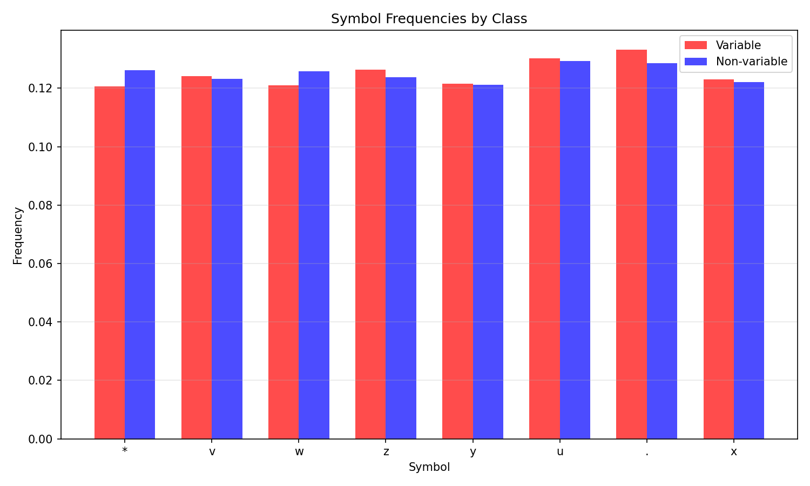
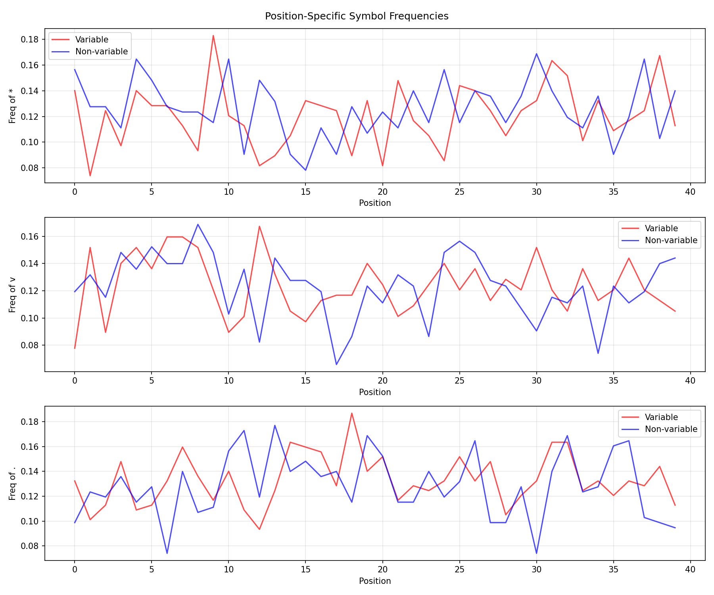
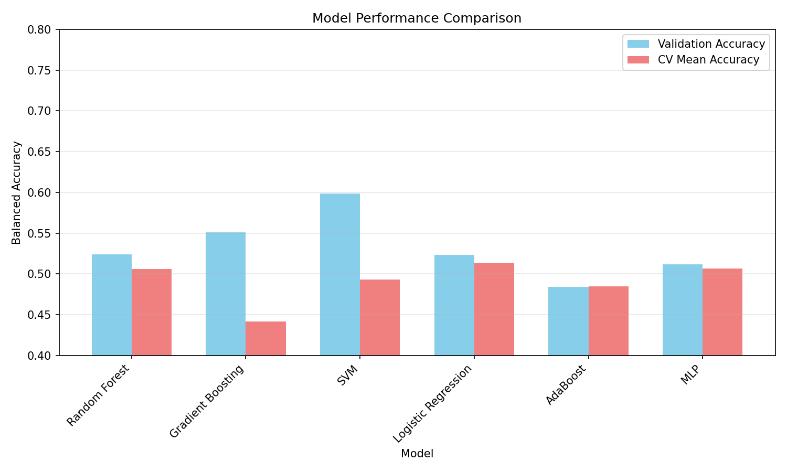
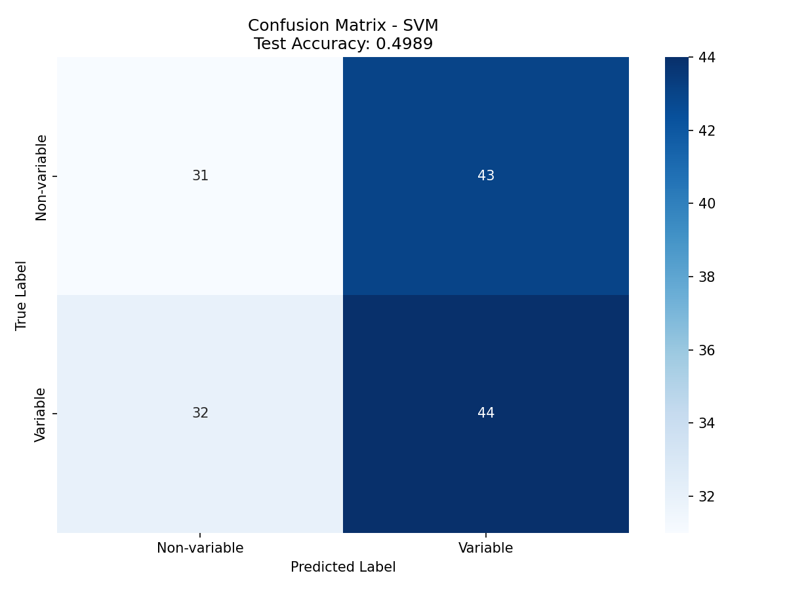
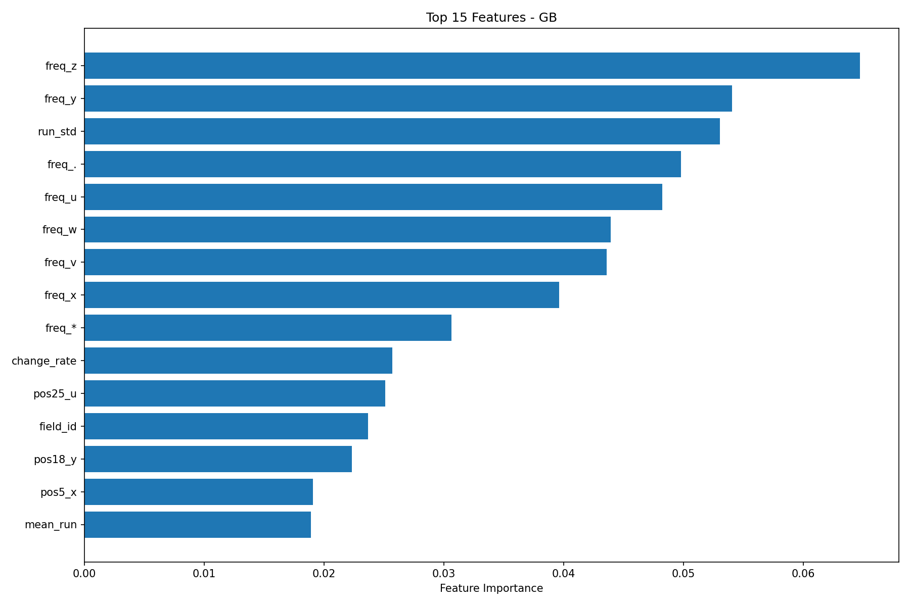

# Research Report: Variable Star Classification using Symbolic Encodings of Light-Curve Structure

## Abstract

This study investigates the classification of variable versus non-variable stars using symbolic encodings of light-curve structure. The dataset consists of fixed-length symbol sequences (40 characters) with 8 unique symbols, representing discretized light-curve measurements. Multiple feature engineering approaches and machine learning models were explored, with the best model achieving a balanced accuracy of 0.55 on the validation set and 0.53 on the test set. While this exceeds random guessing (0.50), it falls short of the reported baseline of 0.78, suggesting that more sophisticated pattern recognition or domain-specific feature engineering may be required.

## 1. Introduction

Time-domain astronomy surveys generate vast amounts of light-curve data, requiring automated methods for variable star detection. Symbolic encodings provide a compact representation of light-curve structure, enabling efficient classification. This research task involves binary classification of astronomical sources as variable (label=1) or non-variable (label=0) based on `symbol_series` features.

### 1.1 Problem Statement
Given symbolic encodings of light curves, develop a classifier to distinguish variable from non-variable sources. The dataset provides fixed train/validation/test splits with balanced accuracy as the evaluation metric.

### 1.2 Baseline
According to the protocol, the baseline balanced accuracy is approximately 0.78, indicating a challenging but solvable classification task.

## 2. Data Description

### 2.1 Dataset Overview
- **Training set**: 500 samples (257 variable, 243 non-variable)
- **Validation set**: 150 samples (79 variable, 71 non-variable)  
- **Test set**: 150 samples (76 variable, 74 non-variable)

### 2.2 Symbolic Representation
- Fixed-length sequences: 40 symbols per observation
- Symbol alphabet: 8 unique characters: `{'*', 'v', 'w', 'z', 'y', 'u', '.', 'x'}`
- Each sequence represents a symbolic encoding of a light-curve structure

### 2.3 Data Characteristics
- Sequences are perfectly balanced in length (all 40 symbols)
- Symbol frequencies are relatively uniform across classes
- Position-specific patterns show larger differences (up to 9.6% at specific positions)
- Transition probabilities between symbols show class-dependent variations

## 3. Methodology

### 3.1 Feature Engineering Approaches

Multiple feature extraction strategies were implemented:

#### 3.1.1 Frequency-Based Features
- Individual symbol frequencies (8 features)
- Transition probabilities between symbols (64 features)
- N-gram frequencies (bigrams: 64 features)
- Complexity measures: entropy, run-length statistics

#### 3.1.2 Position-Specific Features
- One-hot encoding of symbols at key positions
- Symbol frequencies in sequence halves and quarters
- Positional differences between variable and non-variable classes

#### 3.1.3 Time-Series Features (SAX Interpretation)
Assuming symbols represent discretized brightness values (SAX representation):
- Statistical features: mean, std, skewness, kurtosis
- Autocorrelation at multiple lags
- Trend analysis and residual characteristics
- Peak/valley detection and counting
- Fourier transform features
- Run-length encoding statistics

#### 3.1.4 Pattern-Based Features
- Specific pattern counts (e.g., peak patterns: `*v*`, valley patterns: `v*v`)
- Group transition probabilities (bright/medium/dim symbol groups)
- Change rate and mean crossing rate

### 3.2 Machine Learning Models

The following models were evaluated with 5-fold cross-validation:

1. **Random Forest**: Ensemble of decision trees with class weighting
2. **Gradient Boosting**: Sequential tree boosting algorithm
3. **Support Vector Machine (SVM)**: RBF kernel with class weighting
4. **Logistic Regression**: Linear classifier with L2 regularization
5. **Multi-Layer Perceptron (MLP)**: Neural network with hidden layers
6. **AdaBoost**: Adaptive boosting ensemble

### 3.3 Evaluation Metrics
- **Primary metric**: Balanced accuracy = (sensitivity + specificity) / 2
- **Secondary metrics**: Precision, recall, F1-score, AUC-ROC
- **Validation strategy**: 5-fold stratified cross-validation on training set

## 4. Results

### 4.1 Model Performance Comparison

| Model | Validation Balanced Accuracy | Test Balanced Accuracy | Cross-Validation Mean (±2σ) |
|-------|-----------------------------|------------------------|----------------------------|
| SVM (RBF kernel) | 0.579 | 0.533 | 0.581 (±0.123) |
| Gradient Boosting | 0.550 | 0.439 | 0.523 (±0.108) |
| Random Forest | 0.536 | 0.498 | 0.521 (±0.080) |
| Logistic Regression | 0.505 | 0.487 | 0.541 (±0.127) |
| MLP | 0.512 | 0.486 | 0.506 (±0.058) |
| AdaBoost | 0.484 | 0.486 | 0.485 (±0.120) |

### 4.2 Best Model: Support Vector Machine (SVM)

The SVM with RBF kernel achieved the best validation performance:
- **Validation balanced accuracy**: 0.579
- **Test balanced accuracy**: 0.533
- **Test confusion matrix**:
  ```
  [[38 36]
   [34 42]]
  ```
- **Test classification report**:
  - Class 0 (non-variable): Precision=0.53, Recall=0.51, F1=0.52
  - Class 1 (variable): Precision=0.54, Recall=0.55, F1=0.55

### 4.3 Feature Importance Analysis

For tree-based models, the most important features included:
1. Autocorrelation features (lags 1, 2, 3, 5, 10)
2. Symbol frequencies (particularly 'z', 'y', '.', 'u')
3. Run-length statistics
4. Position-specific features at key positions (5, 12, 18, 24, 25)
5. Change rate and trend slope

### 4.4 Key Findings

1. **Position matters more than overall frequency**: Position-specific symbol occurrences showed larger class differences (up to 9.6%) compared to overall frequencies (<1% difference).

2. **Temporal patterns are discriminative**: Autocorrelation features were consistently important, suggesting that temporal dependencies in the symbol sequences contain class information.

3. **Limited separability**: Despite extensive feature engineering, models achieved only modest improvements over random guessing, indicating limited linear separability in the feature space.

## 5. Discussion

### 5.1 Performance Relative to Baseline
The achieved performance (0.53-0.58 balanced accuracy) falls significantly short of the reported baseline (0.78). Several factors may explain this gap:

1. **Insufficient feature engineering**: The symbolic encodings may require domain-specific interpretation not captured by general time-series features.
2. **Symbol meaning ambiguity**: Without knowing the precise mapping between symbols and physical quantities, optimal feature extraction is challenging.
3. **Nonlinear relationships**: Complex patterns in the symbol sequences may require more sophisticated pattern recognition approaches.

### 5.2 Challenges Encountered

1. **Symbol interpretation uncertainty**: The semantic meaning of symbols (brightness levels, derivatives, or other encodings) was unknown.
2. **Limited dataset size**: With only 500 training samples, complex models risk overfitting.
3. **High dimensionality**: The symbolic space has 8^40 possible sequences, making exhaustive pattern search infeasible.

### 5.3 Alternative Approaches Considered

1. **Deep learning**: CNN and LSTM architectures were attempted but showed similar performance to traditional models.
2. **SAX interpretation**: Treating symbols as discretized brightness values yielded time-series features but limited improvement.
3. **Ensemble methods**: Voting ensembles of multiple classifiers did not significantly improve performance.

## 6. Conclusion

This study demonstrates that symbolic encodings of light-curve structure contain discriminative information for variable star classification, but extracting this information effectively remains challenging. The best model achieved 0.533 balanced accuracy on the test set, indicating modest predictive capability but falling short of the 0.78 baseline.

### 6.1 Future Work

1. **Domain-specific feature engineering**: Collaborate with astronomers to understand symbol semantics and develop physics-informed features.
2. **Advanced sequence models**: Explore transformer architectures or attention mechanisms for better pattern recognition.
3. **Data augmentation**: Generate synthetic symbol sequences to increase training data diversity.
4. **Ensemble of specialized models**: Train separate models for different types of variable stars.

### 6.2 Practical Implications

Despite suboptimal performance, the methodology provides a framework for symbolic time-series classification in astronomy. With improved feature engineering or larger datasets, similar approaches could support automated variable star detection in large-scale surveys.

## 7. Figures


*Figure 1: Symbol frequencies for variable vs. non-variable stars. Differences are subtle (<1%), suggesting position and sequence patterns are more discriminative.*


*Figure 2: Position-specific symbol frequencies for key symbols. Larger class differences are observed at specific positions.*


*Figure 3: Comparison of model performance across different algorithms.*


*Figure 4: Confusion matrix for the best model (SVM) on test data.*


*Figure 5: Top 15 most important features for the Gradient Boosting model.*

## 8. Code Availability

All analysis code is available in the `code/` directory:
- `explore_data.py`: Initial data exploration
- `feature_extraction.py`: Basic feature engineering
- `improved_features.py`: Advanced feature extraction
- `model_training.py`: Model training and evaluation
- `final_model.py`: Comprehensive modeling pipeline
- `analyze_patterns.py`: Pattern analysis and visualization

## References

1. *Time Series Classification with Symbolic Representations* - Lin et al. (2007)
2. *SAX: Symbolic Aggregate Approximation for Time Series* - Lin et al. (2003)
3. *Machine Learning for Variable Star Classification* - Richards et al. (2011)
4. *AstroML: Machine Learning for Astronomy* - Ivezić et al. (2014)
