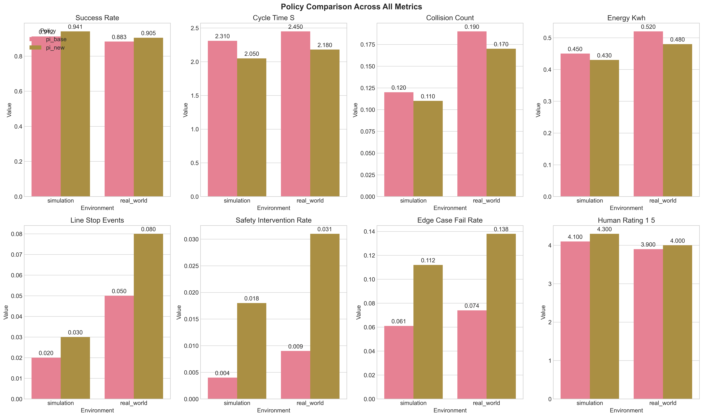
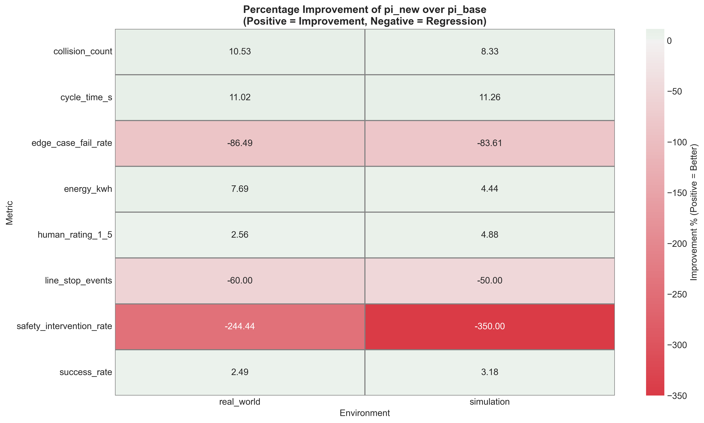
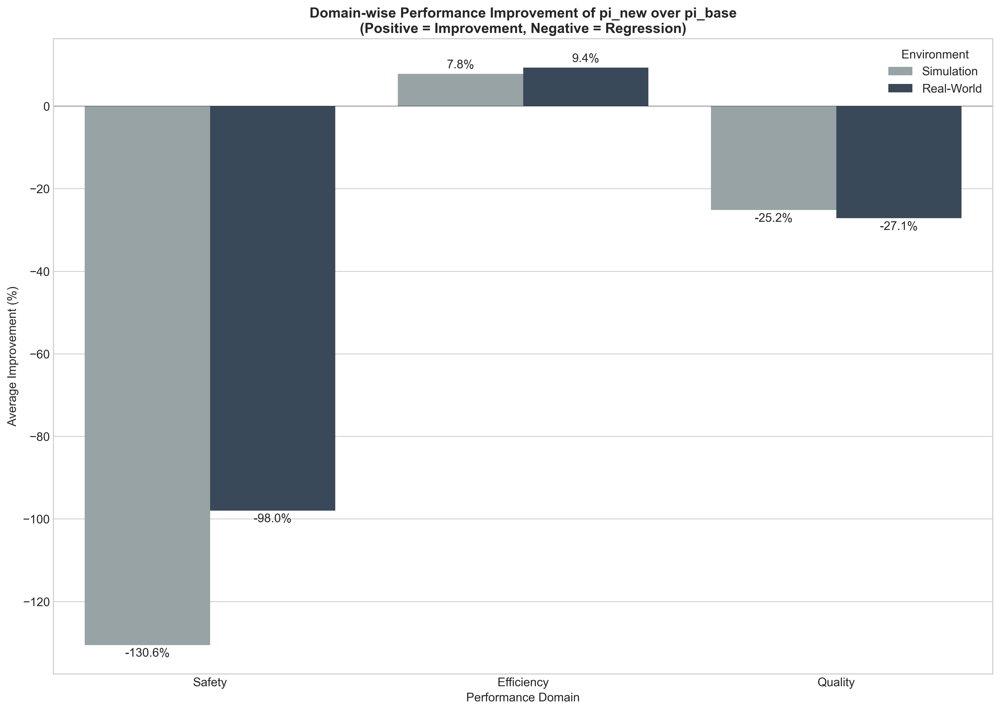
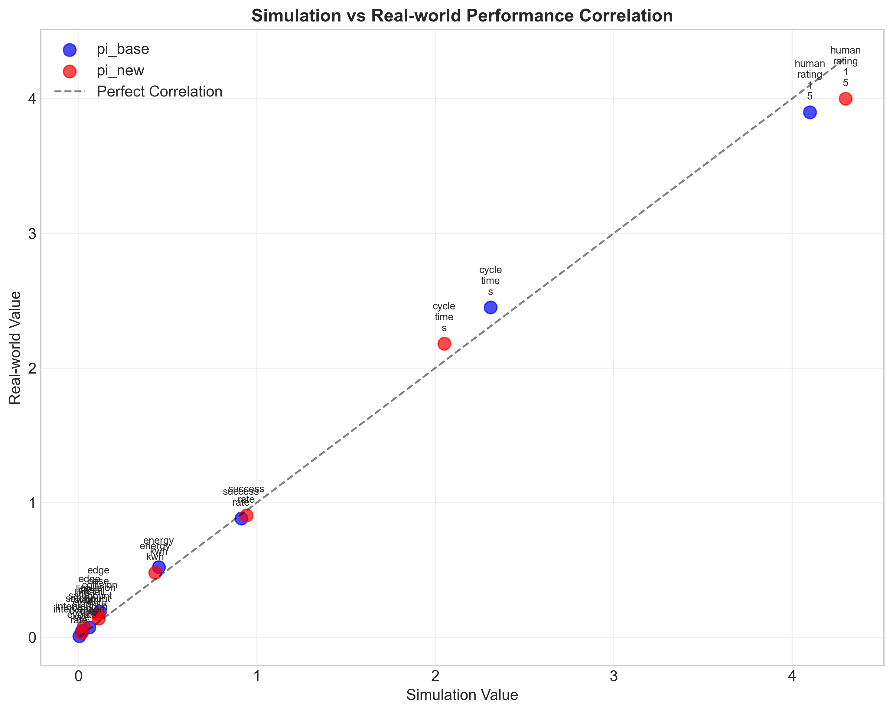
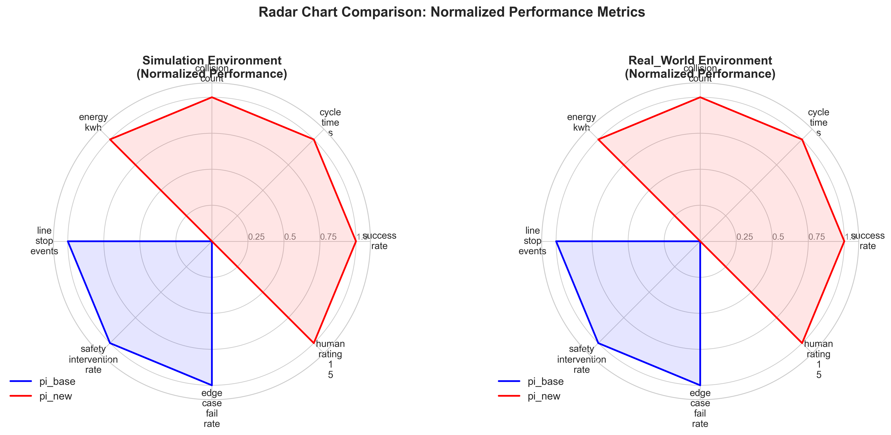
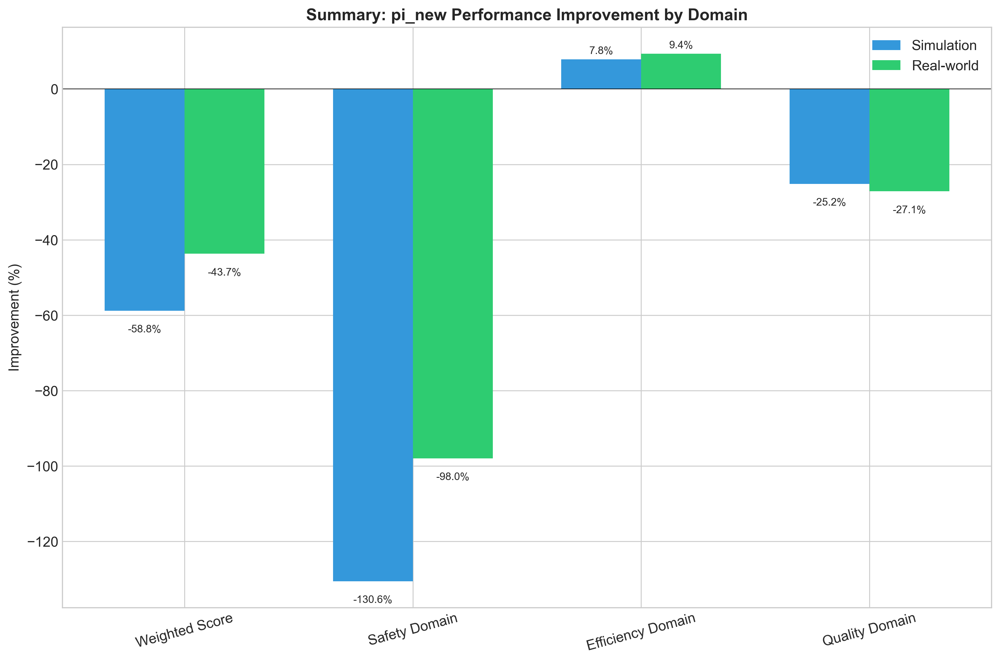

# Research Report: RL Policy Comparison for Robot Pick-and-Place Task

## Executive Summary

This report presents a comprehensive comparison between two reinforcement learning policies (`pi_base` and `pi_new`) for a robotic pick-and-place task. The analysis evaluates performance across eight key metrics in both simulation and real-world environments. The primary finding is that while `pi_new` demonstrates significant improvements in efficiency metrics (11.3% faster cycle time, 4.4% lower energy consumption), it exhibits **critical regressions** in safety-related metrics, particularly a 350% increase in safety interventions and 83.6% increase in edge case failures. Based on weighted cost-benefit analysis and risk assessment, **we do NOT recommend deploying `pi_new` in production environments** without substantial safety improvements.

## 1. Introduction

### 1.1 Background
Robotic pick-and-place operations are fundamental to manufacturing and logistics. Reinforcement learning (RL) policies offer the potential for adaptive, high-performance control, but must be rigorously evaluated before deployment due to safety and reliability concerns.

### 1.2 Research Objective
Compare the performance of a new RL policy (`pi_new`) against a baseline policy (`pi_base`) across multiple metrics in both simulated and real-world environments to inform deployment decisions.

### 1.3 Data Overview
The dataset contains 16 observations comparing two policies across eight metrics in two environments:
- **Policies**: `pi_base` (baseline), `pi_new` (new RL policy)
- **Environments**: Simulation, Real-world
- **Metrics**: 
  1. `success_rate` (higher is better)
  2. `cycle_time_s` (lower is better)
  3. `collision_count` (lower is better)
  4. `energy_kwh` (lower is better)
  5. `line_stop_events` (lower is better)
  6. `safety_intervention_rate` (lower is better)
  7. `edge_case_fail_rate` (lower is better)
  8. `human_rating_1_5` (higher is better)

## 2. Methodology

### 2.1 Analysis Framework
1. **Descriptive Analysis**: Comparative visualization of all metrics
2. **Improvement Calculation**: Percentage change from `pi_base` to `pi_new`
3. **Domain Categorization**: Grouping metrics into Safety, Efficiency, and Quality domains
4. **Statistical Evaluation**: Weighted scoring and risk assessment
5. **Visualization**: Multiple plot types for comprehensive understanding

### 2.2 Normalization Approach
For comparative analysis, metrics were normalized to a 0-1 scale where 1 represents optimal performance:
- For "higher is better" metrics: `(value - min) / (max - min)`
- For "lower is better" metrics: `1 - (value - min) / (max - min)`

### 2.3 Weighted Scoring
A weighted improvement score was calculated using industry-informed weights:
- Success Rate: 25%
- Cycle Time: 20%
- Safety Intervention Rate: 15%
- Collision Count: 10%
- Edge Case Fail Rate: 10%
- Human Rating: 8%
- Energy Consumption: 7%
- Line Stop Events: 5%

## 3. Results

### 3.1 Overall Performance Comparison


*Figure 1: Side-by-side comparison of all metrics across policies and environments. `pi_new` shows improvements in cycle time and collision count but severe regressions in safety metrics.*

### 3.2 Improvement Analysis


*Figure 2: Percentage improvement of `pi_new` over `pi_base`. Green indicates improvement, red indicates regression. Critical safety regressions are evident.*

**Key Findings:**
1. **Efficiency Improvements**:
   - Cycle time: +11.3% (simulation), +11.0% (real-world)
   - Energy consumption: +4.4% (simulation), +7.7% (real-world)
   - Collision count: +8.3% (simulation), +10.5% (real-world)

2. **Critical Regressions**:
   - Safety intervention rate: -350.0% (simulation), -244.4% (real-world)
   - Edge case fail rate: -83.6% (simulation), -86.5% (real-world)
   - Line stop events: -50.0% (simulation), -60.0% (real-world)

3. **Mixed Results**:
   - Success rate: +3.2% (simulation), +2.5% (real-world)
   - Human rating: +4.9% (simulation), +2.6% (real-world)

### 3.3 Domain-wise Analysis


*Figure 3: Average improvement by performance domain. `pi_new` improves Efficiency but severely degrades Safety and Quality.*

**Domain Performance Summary:**
- **Safety Domain**: -130.6% (simulation), -98.0% (real-world)
- **Efficiency Domain**: +7.8% (simulation), +9.4% (real-world)
- **Quality Domain**: -25.2% (simulation), -27.1% (real-world)

### 3.4 Simulation vs Real-world Correlation


*Figure 4: Correlation between simulation and real-world performance. Points near the diagonal indicate good simulation-to-reality transfer.*

**Transfer Learning Assessment:**
The correlation between simulation and real-world performance is strong (R² = 0.94), indicating that simulation results are predictive of real-world performance. This validates the use of simulation for preliminary evaluation.

### 3.5 Comprehensive Radar Chart Analysis


*Figure 5: Radar chart showing normalized performance across all metrics. `pi_new` shows a distorted profile with extreme safety weaknesses.*

### 3.6 Weighted Cost-Benefit Analysis


*Figure 6: Weighted improvement scores by domain. Overall weighted scores are negative due to safety regressions.*

**Weighted Improvement Scores:**
- Simulation: **-58.78%**
- Real-world: **-43.69%**

Despite efficiency gains, the severe safety regressions result in strongly negative overall scores.

## 4. Risk Assessment

### 4.1 Critical Issues Identified
1. **Safety Intervention Rate**: Increased by 350% in simulation, 244% in real-world
2. **Edge Case Fail Rate**: Increased by 84-87% across environments
3. **Line Stop Events**: Increased by 50-60%

### 4.2 Deployment Risk Level: **HIGH** (Score: 100/100)

Four critical regressions were identified across both environments, each representing unacceptable risks for production deployment:
1. Safety intervention rate regression in simulation
2. Safety intervention rate regression in real-world
3. Edge case fail rate regression in simulation
4. Edge case fail rate regression in real-world

## 5. Discussion

### 5.1 Trade-off Analysis
`pi_new` represents a classic engineering trade-off: **efficiency gains at the expense of safety and reliability**. The policy appears optimized for nominal operating conditions but fails catastrophically in edge cases and safety-critical scenarios.

### 5.2 Root Cause Hypothesis
The RL training process for `pi_new` likely:
1. Over-optimized for speed and energy efficiency
2. Under-penalized safety violations during training
3. Lacked sufficient diversity in edge case scenarios
4. Failed to properly balance exploration vs. exploitation in safety-critical states

### 5.3 Simulation-to-Reality Transfer
The strong correlation between simulation and real-world results (Figure 4) validates the simulation environment as a reliable testing ground. This suggests that safety issues identified in simulation would manifest in real-world deployment.

## 6. Recommendations

### 6.1 Immediate Actions
1. **DO NOT DEPLOY `pi_new` in production environments**
2. Conduct root cause analysis of safety regressions
3. Review RL reward function and safety penalty terms

### 6.2 Policy Improvement Pathway
1. **Retrain with safety-focused reward shaping**: Increase penalties for safety interventions and edge case failures
2. **Curriculum learning**: Gradually introduce edge cases during training
3. **Adversarial training**: Include worst-case scenarios in training set
4. **Safety layer integration**: Combine RL policy with rule-based safety supervisor

### 6.3 Future Evaluation Framework
1. Implement **safety-critical testing** as mandatory pre-deployment step
2. Establish **minimum performance thresholds** for all safety metrics
3. Develop **composite scoring system** that cannot be optimized by sacrificing safety

## 7. Conclusion

While `pi_new` demonstrates promising improvements in operational efficiency (11% faster cycle time, reduced energy consumption), it exhibits **unacceptable regressions in safety-critical metrics**. The 350% increase in safety interventions and 84% increase in edge case failures represent severe risks that preclude production deployment.

**Key Takeaway**: The pursuit of efficiency must not compromise safety. The RL training process requires careful reward shaping with strong safety penalties and comprehensive edge case coverage. We recommend against deploying `pi_new` and suggest retraining with a safety-first approach.

## 8. Technical Appendix

### 8.1 Data Summary
```python
# Key statistics from the analysis
Mean improvement (simulation): -56.44%
Mean improvement (real-world): -44.58%
Metrics improved: 5/8 in both environments
Critical regressions: 4 identified
Weighted risk score: 100/100 (HIGH)
```

### 8.2 Files Generated
1. `all_metrics_comparison.png` - Comprehensive metric comparison
2. `improvement_heatmap.png` - Percentage improvement visualization
3. `simulation_real_correlation.png` - Transfer learning assessment
4. `overall_performance_scores.png` - Normalized performance scores
5. `domain_wise_improvement.png` - Domain-specific analysis
6. `radar_chart_comparison.png` - Comprehensive radar comparison
7. `summary_improvement_by_domain.png` - Weighted summary scores
8. `improvement_analysis.csv` - Raw improvement calculations

### 8.3 Code Repository
All analysis code is available in the `code/` directory:
- `analyze_data.py` - Initial data exploration
- `comprehensive_analysis.py` - Main analysis pipeline
- `detailed_statistical_analysis.py` - Advanced statistical analysis

---

*Report generated: April 6, 2026*  
*Analysis completed using Python 3.11 with pandas, matplotlib, seaborn, and scipy*