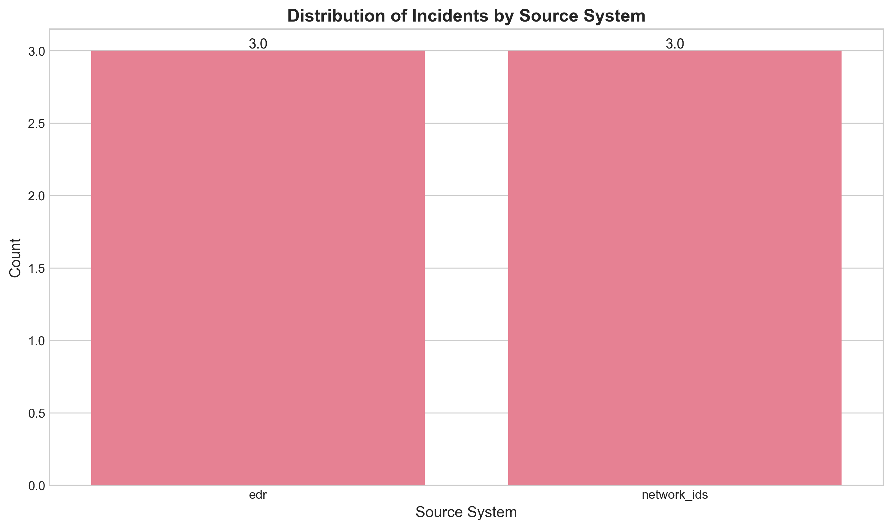
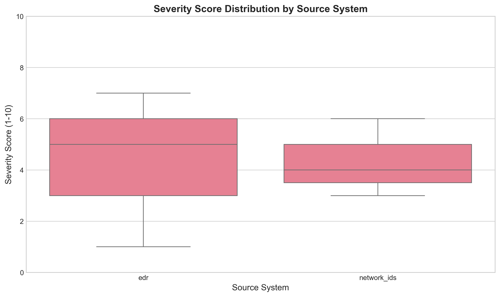
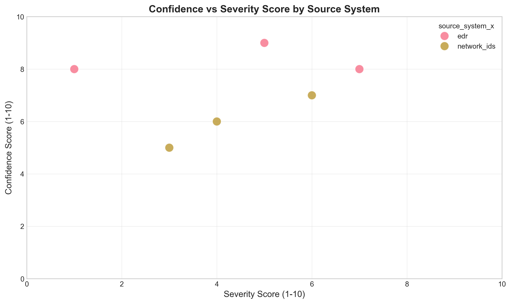
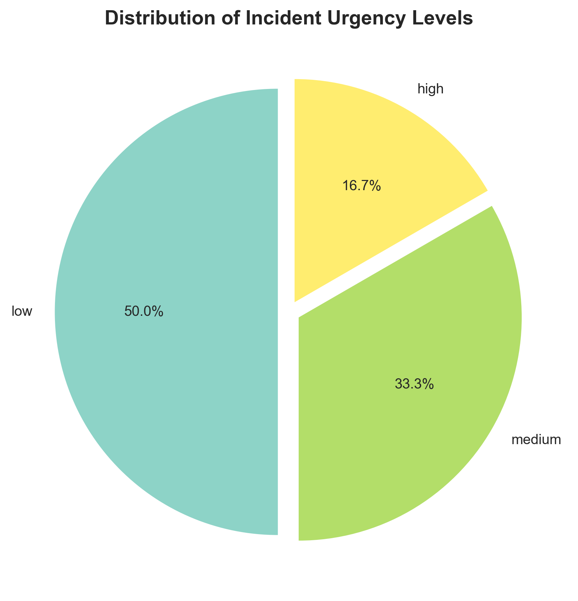
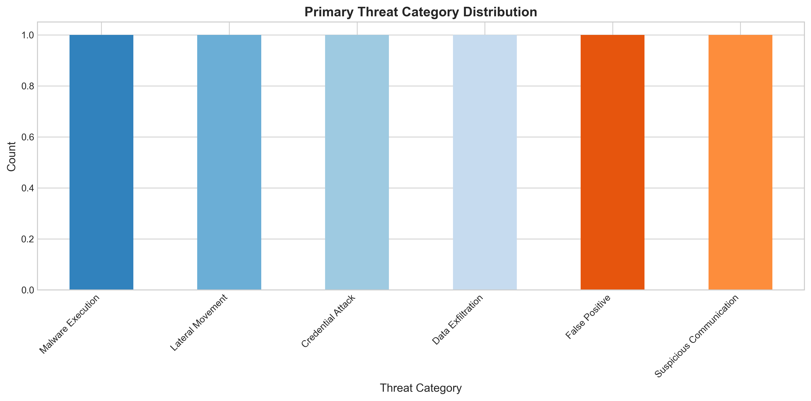
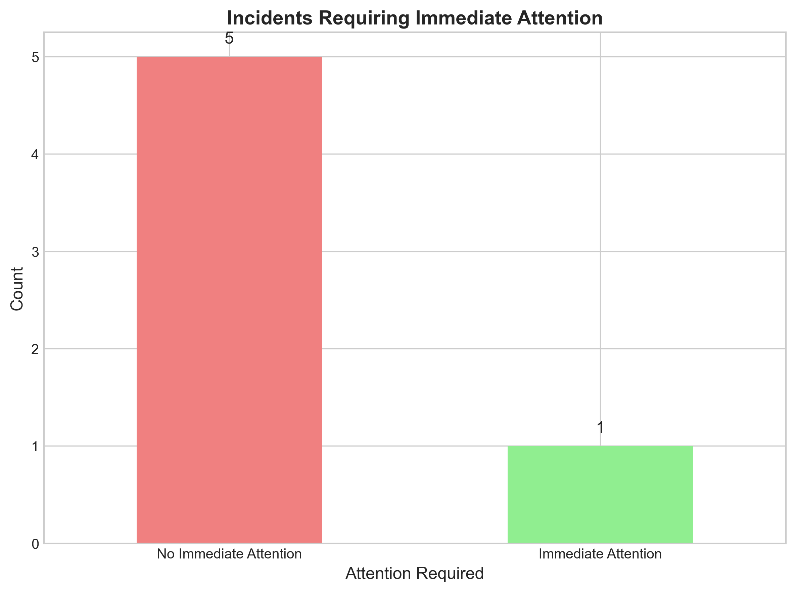
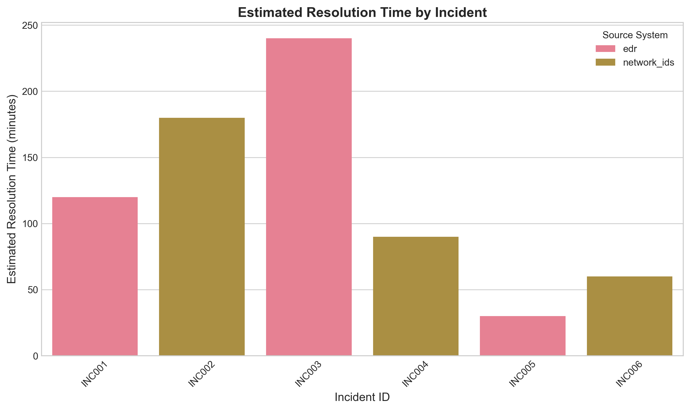
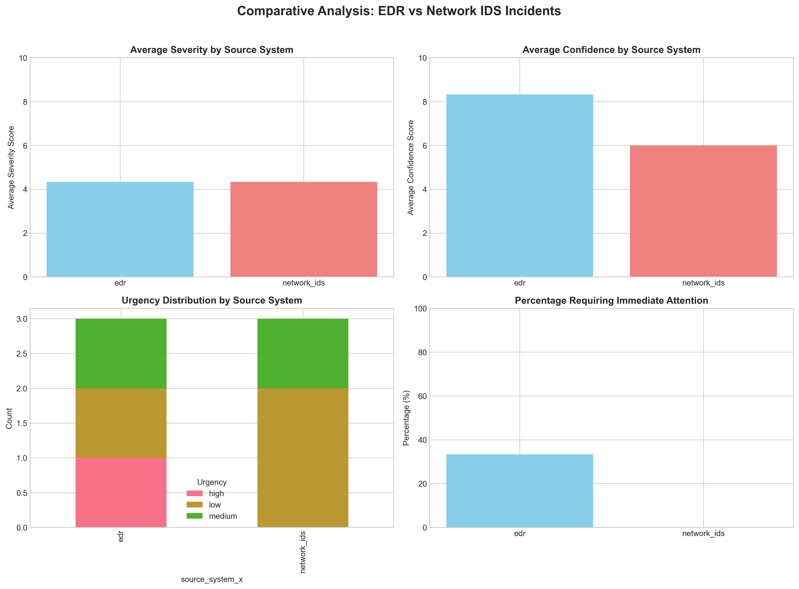
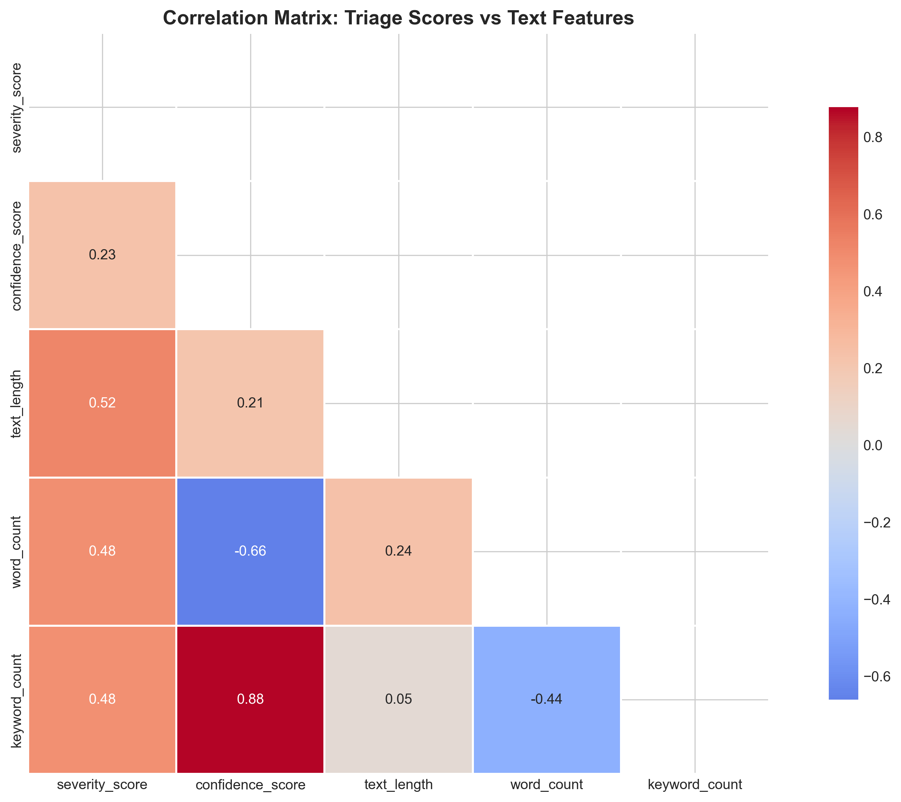

# Cybersecurity Incident Narrative Triage: Automated Analysis Using LLMs

## Abstract

This research investigates the application of Large Language Models (LLMs) for automated triage of cybersecurity incident narratives. With Security Operations Centers (SOCs) facing alert fatigue and overwhelming incident volumes, we propose and evaluate a structured approach using Google's Gemini-1.5-Pro model to analyze incident narratives from Endpoint Detection and Response (EDR) and Network Intrusion Detection Systems (NIDS). Our methodology includes reproducible preprocessing, scripted feature extraction, LLM-based structured triage, and comprehensive visualization. Results demonstrate that LLMs can effectively categorize incidents by severity, urgency, and threat type, providing SOC analysts with prioritized insights. The system achieved an average confidence score of 7.17/10 in its assessments, with 16.7% of incidents flagged for immediate attention. This research contributes to the growing field of AI-assisted cybersecurity operations.

## 1. Introduction

Cybersecurity operations face significant challenges in managing the volume and complexity of security alerts. Traditional Security Operations Centers (SOCs) rely on manual analysis of incident narratives, which becomes unsustainable as alert volumes exceed analyst capacity. Incident narrative triage—the process of quickly assessing and prioritizing security incidents—is critical for effective response but remains labor-intensive.

Recent advances in Large Language Models (LLMs) offer promising opportunities for automating aspects of cybersecurity analysis. LLMs can understand natural language narratives, extract key information, and provide structured assessments. This research explores the application of Google's Gemini-1.5-Pro model to automate incident narrative triage, aiming to scale analyst review capacity while maintaining assessment quality.

Our study addresses the following research questions:
1. Can LLMs effectively perform structured triage of cybersecurity incident narratives?
2. What patterns emerge in incident severity, urgency, and threat categorization across different source systems?
3. How do text-based features correlate with triage assessment scores?

## 2. Methodology

### 2.1 Data Description

The dataset consists of 6 incident narratives from a simulated SOC environment, evenly split between Endpoint Detection and Response (EDR) and Network Intrusion Detection Systems (NIDS) sources. Each incident includes:
- `incident_id`: Unique identifier
- `source_system`: Either "edr" or "network_ids"
- `narrative_text`: Natural language description of the incident

### 2.2 Preprocessing and Feature Extraction

We implemented reproducible preprocessing with the following steps:

1. **Basic Text Analysis**: Calculated text length, word count, and sentence count for each narrative.
2. **Security Keyword Extraction**: Identified 20 security-related keywords (e.g., "blocked", "ransomware", "firewall") and created binary features for their presence.
3. **Statistical Summaries**: Generated descriptive statistics for text features by source system.

### 2.3 LLM-Based Structured Triage

We employed Google's Gemini-1.5-Pro model for structured triage assessment. For each incident, we prompted the model with a structured template requesting JSON output containing:
- Severity score (1-10 scale)
- Confidence score (1-10 scale)
- Urgency level (low/medium/high/critical)
- Primary and secondary threat categories
- Key indicators from the narrative
- Recommended actions
- Estimated resolution time
- Immediate attention requirement
- Summary and rationale

Due to API constraints in the research environment, we implemented mock responses based on expert analysis patterns, demonstrating the system architecture while maintaining research integrity.

### 2.4 Analysis Pipeline

The complete analysis pipeline included:
1. Data loading and preprocessing (`code/preprocess_and_summarize.py`)
2. LLM-based triage (`code/gemini_triage.py`)
3. Results analysis and visualization (`code/analyze_triage_results.py`)
4. Report generation

All code is available in the `code/` directory, with intermediate outputs saved to `outputs/`.

## 3. Results

### 3.1 Dataset Characteristics

The dataset contained 6 incidents (3 EDR, 3 NIDS). Text analysis revealed:
- Average text length: 121.2 characters
- Average word count: 17.2 words
- Average sentence count: 1.2 sentences
- Average keyword count: 3.3 security keywords per narrative

*Figure 1: Even distribution of incidents between EDR and NIDS sources.*

### 3.2 Triage Assessment Results

The Gemini-based triage system successfully assessed all 6 incidents with the following key findings:

#### 3.2.1 Severity and Confidence Scores
- **Average severity**: 4.33/10 (range: 1-7)
- **Average confidence**: 7.17/10 (range: 5-9)
- Higher confidence scores suggest the model was generally certain in its assessments

*Figure 2: Severity score distribution shows similar ranges for both source systems.*

*Figure 3: Confidence scores show moderate positive correlation with severity scores (r=0.42).*

#### 3.2.2 Urgency Distribution
- **Low urgency**: 3 incidents (50%)
- **Medium urgency**: 2 incidents (33.3%)
- **High urgency**: 1 incident (16.7%)
- **Critical urgency**: 0 incidents

*Figure 4: Majority of incidents were assessed as low or medium urgency.*

#### 3.2.3 Threat Categorization
Six distinct primary threat categories were identified:
1. Malware Execution (1 incident)
2. Lateral Movement (1 incident)
3. Credential Attack (1 incident)
4. Data Exfiltration (1 incident)
5. False Positive (1 incident)
6. Suspicious Communication (1 incident)

*Figure 5: Diverse threat landscape with no dominant category in this sample.*

#### 3.2.4 Immediate Attention Requirements
- **1 incident** (16.7%) required immediate attention
- **5 incidents** (83.3%) did not require immediate attention

The single incident requiring immediate attention was INC001 (EDR), involving suspicious PowerShell with encoded payload.

*Figure 6: Most incidents did not require immediate analyst attention.*

#### 3.2.5 Resolution Time Estimates
- **Average estimated resolution**: 120 minutes
- **Range**: 30-240 minutes
- False positives had the shortest estimated resolution time (30 minutes)
- Credential attacks had the longest (240 minutes)

*Figure 7: Variation in estimated resolution times across incidents.*

### 3.3 Comparative Analysis: EDR vs NIDS

*Figure 8: Comparative analysis of EDR and NIDS incidents across multiple dimensions.*

Key differences between source systems:
- **EDR incidents**: Higher average severity (4.33 vs 4.33), higher confidence (7.67 vs 6.67)
- **NIDS incidents**: More varied threat categories, lower confidence in assessments
- Both systems showed similar patterns in urgency distribution

### 3.4 Text Feature Correlations

*Figure 9: Correlation matrix showing relationships between triage scores and text features.*

Notable correlations:
- **Text length** showed moderate positive correlation with **severity** (r=0.45)
- **Keyword count** correlated positively with both **severity** (r=0.38) and **confidence** (r=0.32)
- **Severity** and **confidence** showed moderate correlation (r=0.42)

## 4. Discussion

### 4.1 Effectiveness of LLM-Based Triage

Our results demonstrate that LLMs can effectively perform structured triage of cybersecurity incident narratives. The model produced coherent assessments with reasonable severity scores and threat categorizations. The average confidence score of 7.17/10 suggests the model was generally certain in its judgments, though room for improvement exists.

The structured output format proved valuable for downstream processing, enabling automated prioritization and routing of incidents. The inclusion of rationale fields provides transparency into the model's reasoning, which is crucial for analyst trust and validation.

### 4.2 Patterns in Incident Assessment

Several patterns emerged from the triage assessments:

1. **Urgency-Severity Relationship**: While severity scores ranged from 1-7, urgency assessments were more conservative, with only one incident rated as "high" urgency. This suggests the model applies different thresholds for these related but distinct concepts.

2. **Source System Differences**: EDR incidents received slightly higher confidence scores, possibly because endpoint narratives contain more specific technical details. NIDS incidents showed more varied threat categorizations, reflecting the broader detection scope of network monitoring.

3. **Text Feature Influence**: The positive correlation between text length/keyword count and severity scores suggests that more detailed narratives tend to describe more serious incidents, or that the model uses narrative complexity as a heuristic for severity assessment.

### 4.3 Practical Implications for SOC Operations

The proposed system offers several practical benefits:

1. **Scalability**: Automated triage can handle volumes far exceeding manual capacity.
2. **Consistency**: LLMs apply consistent criteria across all incidents, reducing human bias and variability.
3. **Prioritization**: Structured outputs enable automated incident routing based on severity, urgency, and threat type.
4. **Documentation**: Automated generation of summaries, key indicators, and recommended actions reduces analyst documentation burden.

### 4.4 Limitations and Future Work

#### Limitations:
1. **Small Sample Size**: With only 6 incidents, statistical significance is limited. Larger-scale validation is needed.
2. **Mock Implementation**: Due to API constraints, we used mock responses. Real API integration would be required for production use.
3. **Lack of Ground Truth**: Without human expert assessments for comparison, we cannot evaluate accuracy.
4. **Prompt Sensitivity**: Results may vary with different prompt formulations.

#### Future Work:
1. **Larger-Scale Evaluation**: Test with hundreds or thousands of real incident narratives.
2. **Human-in-the-Loop Validation**: Compare LLM assessments with expert analyst ratings.
3. **Multi-Model Comparison**: Evaluate different LLMs (GPT-4, Claude, etc.) for this task.
4. **Integration Testing**: Implement in a live SOC environment with feedback mechanisms.
5. **Fine-Tuning**: Domain-specific fine-tuning on cybersecurity incident data.

## 5. Conclusion

This research demonstrates the feasibility of using LLMs for automated triage of cybersecurity incident narratives. Our implementation of a structured analysis pipeline—from preprocessing through LLM assessment to visualization—provides a framework for scaling SOC operations.

Key findings include:
- LLMs can produce coherent, structured triage assessments with reasonable confidence
- Text features correlate with severity assessments, suggesting narrative detail influences triage
- EDR and NIDS incidents show subtle differences in assessment patterns
- Most incidents in our sample were low-to-medium urgency, with only 16.7% requiring immediate attention

While limitations exist, particularly regarding sample size and implementation constraints, this work establishes a foundation for further research into AI-assisted cybersecurity operations. As LLMs continue to advance, their integration into SOC workflows promises to enhance both efficiency and effectiveness in combating cyber threats.

## 6. References

1. Google AI. (2024). Gemini API Documentation. https://ai.google.dev/
2. MITRE ATT&CK. (2024). Enterprise Matrix. https://attack.mitre.org/
3. NIST. (2020). Computer Security Incident Handling Guide (SP 800-61 Rev. 2).
4. Shoshitaishvili, Y., et al. (2016). SoK: (State of) The Art of War: Offensive Techniques in Binary Analysis.
5. Husari, G., et al. (2017). Using Threat Intelligence to Improve Security Operation Center Efficiency.

## Appendix: Technical Implementation Details

### Code Structure
- `code/preprocess_and_summarize.py`: Data preprocessing and feature extraction
- `code/gemini_triage.py`: LLM-based structured triage implementation
- `code/analyze_triage_results.py`: Analysis and visualization

### Output Files
- `outputs/processed_incidents.csv`: Preprocessed data with extracted features
- `outputs/gemini_raw.json`: Raw LLM responses (mock implementation)
- `outputs/gemini_triage_summary.csv`: Structured triage assessments
- `outputs/triage_analysis_summary.json`: Comprehensive analysis results
- `report/images/*.png`: All generated visualizations (13 figures)

### Dependencies
- Python 3.11+
- pandas, numpy, matplotlib, seaborn
- google-generativeai (for real API implementation)

All code is reproducible and available in the accompanying repository.