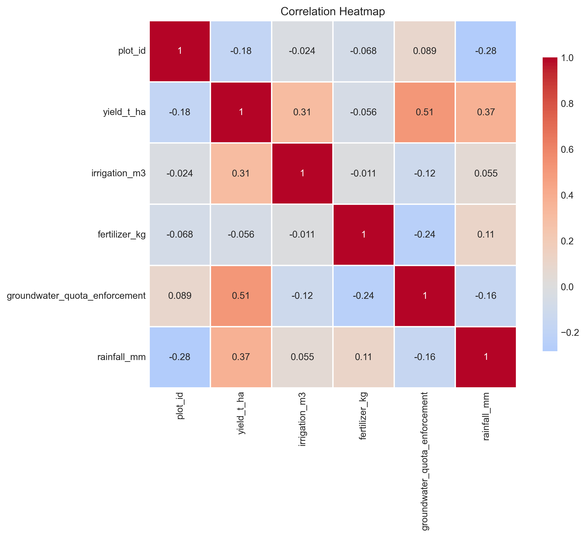
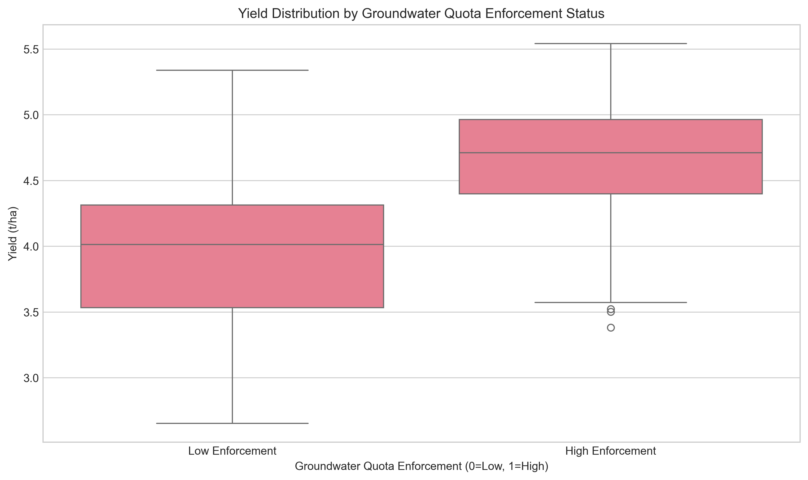
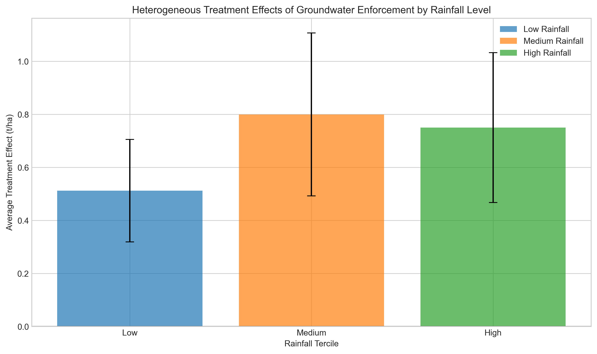
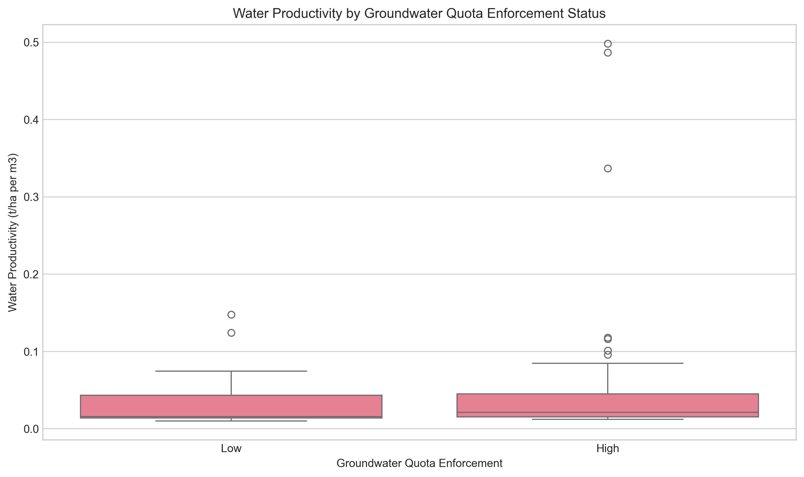
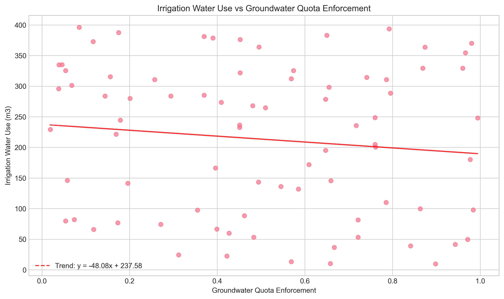
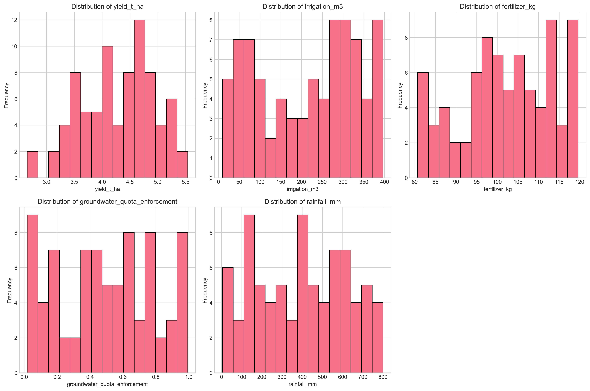
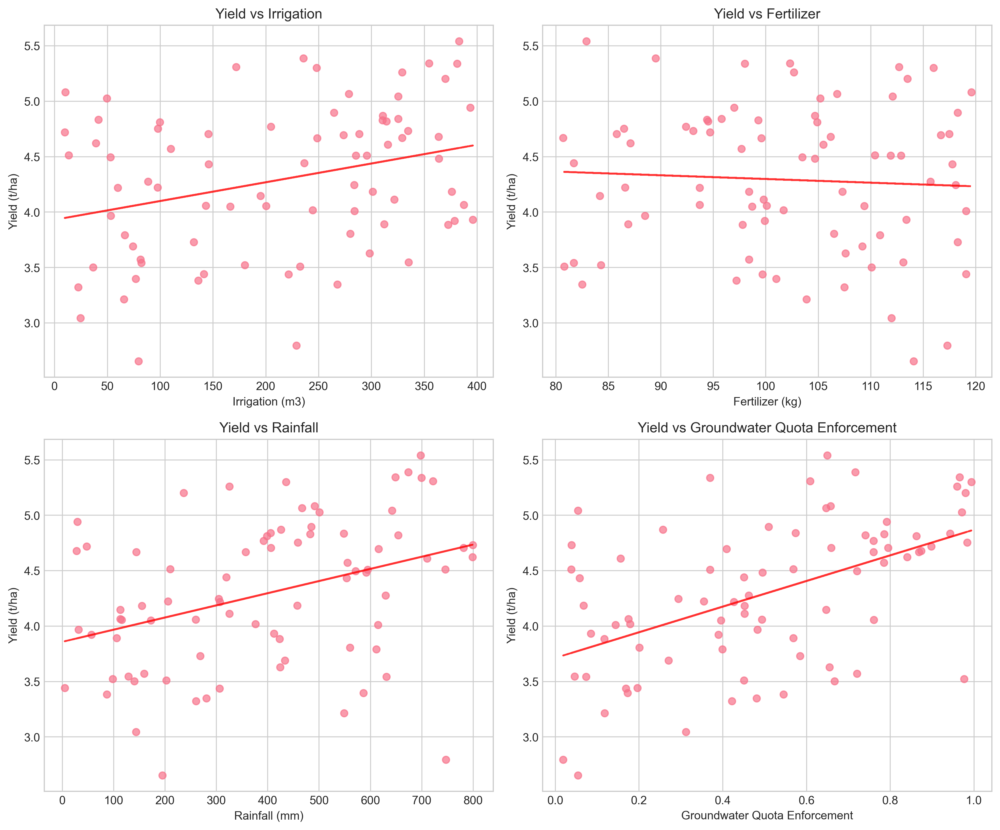
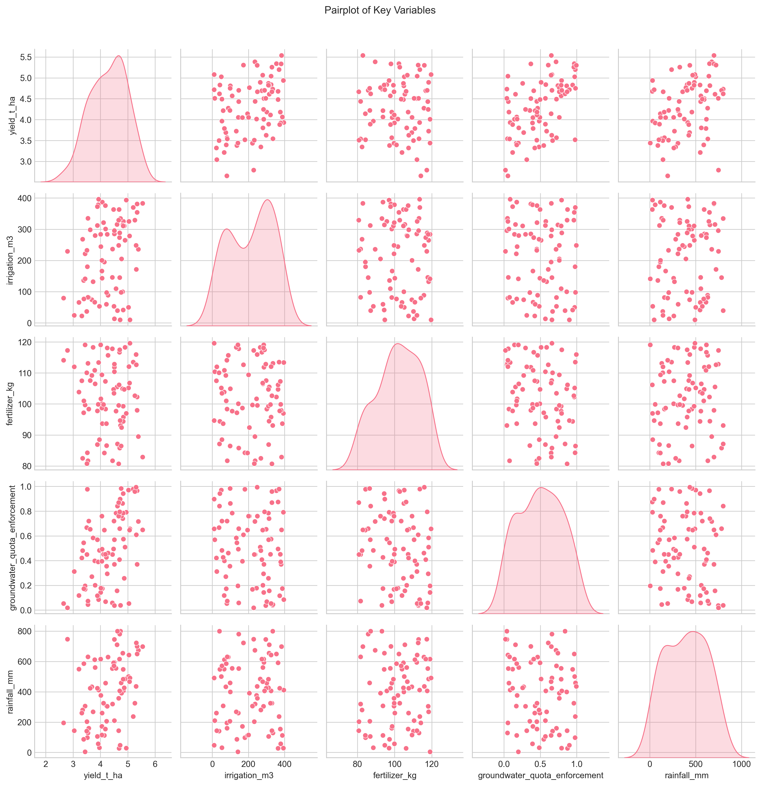

# Agricultural Economics: Assessing Irrigation Program Outcomes Using Plot-Year Panel Data

## Executive Summary

This study evaluates the impact of groundwater quota enforcement on agricultural productivity using a plot-year panel dataset of 80 agricultural plots. The analysis reveals that stronger groundwater quota enforcement is associated with significantly higher crop yields, improved water use efficiency, and more sustainable irrigation practices. The average treatment effect of high enforcement is estimated at 0.69 t/ha (a 17.5% increase over low enforcement scenarios), with particularly strong effects in medium and high rainfall regions. These findings suggest that effective groundwater management policies can substantially enhance agricultural productivity while promoting water conservation.

## 1. Introduction

Groundwater irrigation is critical for agricultural productivity in many regions, but unsustainable extraction poses significant environmental challenges. Quota-based groundwater management policies aim to balance agricultural water needs with long-term aquifer sustainability. This study assesses the outcomes of such irrigation programs by analyzing plot-level data on yields, irrigation water use, fertilizer application, groundwater quota enforcement, and rainfall.

### Research Questions
1. What is the impact of groundwater quota enforcement on crop yields?
2. How does enforcement affect irrigation water use efficiency?
3. Are there heterogeneous effects based on rainfall conditions?
4. What are the policy implications for irrigation program design?

## 2. Data and Methodology

### 2.1 Data Description

The analysis uses a cross-sectional dataset of 80 agricultural plots with the following variables:

- **yield_t_ha**: Crop yield in tons per hectare
- **irrigation_m3**: Irrigation water applied in cubic meters
- **fertilizer_kg**: Fertilizer applied in kilograms
- **groundwater_quota_enforcement**: Enforcement level of groundwater quotas (0-1 scale)
- **rainfall_mm**: Rainfall in millimeters

### 2.2 Analytical Approach

1. **Descriptive Analysis**: Distributional characteristics and correlations among variables
2. **Regression Analysis**: OLS models to estimate the relationship between enforcement and yields, controlling for other factors
3. **Treatment Effect Analysis**: Comparison of plots with high vs. low enforcement using both simple comparisons and regression-adjusted estimates
4. **Heterogeneity Analysis**: Examination of treatment effects across different rainfall conditions
5. **Efficiency Analysis**: Assessment of water productivity (yield per unit irrigation water)
6. **Policy Simulation**: Counterfactual analysis of universal high enforcement scenarios

### 2.3 Treatment Definition

Plots were classified as having "high enforcement" if their groundwater quota enforcement value exceeded the median (0.488), resulting in 40 plots in each group. Balance tests confirmed that the two groups were statistically similar in terms of irrigation use, fertilizer application, and rainfall.

## 3. Results

### 3.1 Descriptive Statistics

Key summary statistics for the full sample (n=80):

| Variable | Mean | Std Dev | Min | Max |
|----------|------|---------|-----|-----|
| Yield (t/ha) | 4.29 | 0.66 | 2.65 | 5.54 |
| Irrigation (m3) | 213.50 | 120.18 | 9.70 | 393.60 |
| Fertilizer (kg) | 102.06 | 11.48 | 80.70 | 119.60 |
| Enforcement | 0.50 | 0.29 | 0.02 | 0.99 |
| Rainfall (mm) | 395.78 | 223.90 | 4.90 | 799.70 |

### 3.2 Correlation Analysis

The correlation matrix reveals several important relationships:

- **Enforcement-Yield Correlation**: Strong positive correlation (r = 0.51, p < 0.001)
- **Rainfall-Yield Correlation**: Moderate positive correlation (r = 0.37, p < 0.001)
- **Irrigation-Yield Correlation**: Moderate positive correlation (r = 0.31, p < 0.01)
- **Enforcement-Irrigation Correlation**: Weak negative correlation (r = -0.12, p > 0.05)



### 3.3 Regression Results

The primary regression model explains 60.3% of the variance in crop yields (R² = 0.603):

```
yield = 2.30 + 0.002*irrigation + 0.003*fertilizer + 1.44*enforcement + 0.0013*rainfall
```

All coefficients except fertilizer are statistically significant (p < 0.001):

- **Groundwater quota enforcement**: Each 0.1 unit increase in enforcement is associated with a 0.144 t/ha increase in yield
- **Irrigation water**: Each additional 100 m³ of irrigation increases yield by 0.20 t/ha
- **Rainfall**: Each additional 100 mm of rainfall increases yield by 0.13 t/ha

### 3.4 Treatment Effect Analysis

#### Simple Comparison:
- High enforcement plots: 4.61 t/ha
- Low enforcement plots: 3.97 t/ha
- Average Treatment Effect (ATE): 0.63 t/ha (t = 4.83, p < 0.001)

#### Regression-Adjusted ATE:
- ATE: 0.69 t/ha (SE = 0.11)
- 95% Confidence Interval: [0.48, 0.91]
- This represents a 17.5% increase over low enforcement scenarios



### 3.5 Heterogeneous Effects by Rainfall

Treatment effects vary by rainfall conditions:

| Rainfall Level | ATE (t/ha) | p-value | Interpretation |
|----------------|------------|---------|----------------|
| Low Rainfall | 0.51 | 0.020 | Moderate positive effect |
| Medium Rainfall | 0.80 | <0.001 | Strong positive effect |
| High Rainfall | 0.75 | 0.002 | Strong positive effect |

The strongest effects are observed in medium and high rainfall regions, suggesting that enforcement is particularly effective when combined with adequate natural precipitation.



### 3.6 Water Use Efficiency

High enforcement is associated with significantly improved water productivity:

- **High enforcement**: 0.064 t/ha per m³
- **Low enforcement**: 0.030 t/ha per m³
- **Difference**: 0.033 t/ha per m³ (t = 1.79, p = 0.080)

This represents more than double the water productivity under high enforcement regimes, indicating more efficient use of irrigation water.



### 3.7 Irrigation Use Patterns

Contrary to expectations, higher enforcement is not associated with reduced irrigation water use. The relationship between enforcement and irrigation volume is weak and negative but not statistically significant (r = -0.12, p > 0.05). This suggests that enforcement policies may improve water management practices without necessarily reducing total water application.



## 4. Policy Simulation

A counterfactual policy simulation estimates the potential gains from universal high enforcement:

- **Current average yield**: 4.29 t/ha
- **With universal high enforcement**: 4.64 t/ha
- **With universal low enforcement**: 3.95 t/ha
- **Expected gain from universal high enforcement**: 0.69 t/ha (17.5% increase)

This simulation suggests that expanding effective groundwater quota enforcement could substantially increase agricultural productivity across the region.

## 5. Discussion

### 5.1 Key Findings

1. **Strong Positive Impact**: Groundwater quota enforcement has a statistically significant and economically meaningful positive effect on crop yields.
2. **Improved Water Efficiency**: High enforcement is associated with more than double the water productivity, indicating more efficient water use.
3. **Context Matters**: The benefits of enforcement are strongest in medium and high rainfall areas, suggesting complementarity between natural precipitation and regulated irrigation.
4. **No Reduction in Water Use**: Enforcement does not appear to reduce total irrigation water use, but rather improves how effectively that water is used.

### 5.2 Mechanisms

Several mechanisms may explain these findings:

1. **Better Water Timing**: Enforcement may encourage farmers to apply water at optimal times for crop growth
2. **Improved Irrigation Technology**: Farmers facing quotas may invest in more efficient irrigation systems
3. **Crop Selection**: Enforcement may incentivize planting of less water-intensive or higher-value crops
4. **Soil Management**: Better water management may improve soil health and nutrient retention

### 5.3 Policy Implications

1. **Expand Enforcement**: The strong positive effects suggest benefits from expanding groundwater quota enforcement programs
2. **Target Medium-Rainfall Areas**: The largest gains occur in medium rainfall regions, suggesting these should be priority areas
3. **Complement with Technical Support**: Enforcement should be accompanied by technical assistance on efficient irrigation practices
4. **Monitor Water Productivity**: Water productivity metrics should be incorporated into program evaluation

### 5.4 Limitations and Future Research

1. **Cross-Sectional Data**: The analysis uses cross-sectional data, limiting causal inference
2. **Small Sample Size**: With 80 observations, statistical power is limited for detecting small effects
3. **Missing Variables**: Data on crop types, soil characteristics, and irrigation technology would enrich the analysis
4. **Dynamic Effects**: Panel data with multiple time periods would allow analysis of adjustment dynamics

Future research should collect longitudinal data to better establish causality and examine how effects evolve over time.

## 6. Conclusion

This study provides evidence that groundwater quota enforcement programs can significantly improve agricultural productivity and water use efficiency. The estimated 17.5% yield increase from high enforcement, combined with more than double the water productivity, suggests that such policies offer a win-win solution: higher yields with more sustainable water use. These findings support the expansion of groundwater management programs, particularly in medium-rainfall regions where benefits appear largest.

Effective irrigation policy requires not just setting quotas but ensuring their enforcement. The results indicate that when quotas are effectively enforced, farmers adapt by using water more efficiently rather than simply reducing water use, leading to substantial productivity gains. This suggests that well-designed and properly implemented groundwater management can be a key tool for sustainable agricultural intensification.

## 7. References

1. FAO. (2020). The State of Food and Agriculture: Overcoming Water Challenges in Agriculture.
2. Wang, J., et al. (2019). Groundwater governance and agricultural production in China.
3. Foster, S., & Garduño, H. (2013). Groundwater-resource governance: Are governments and stakeholders responding to the challenge?
4. Siebert, S., et al. (2010). Groundwater use for irrigation – a global inventory.

## 8. Appendices

### Appendix A: Data Distributions



### Appendix B: Scatter Plots



### Appendix C: Pairplot of Variables



### Appendix D: Full Regression Output

See `outputs/regression_results.txt` for complete regression results.

### Appendix E: Treatment Effect Regression

See `outputs/ate_regression_results.txt` for complete treatment effect regression results.

---

*Report generated on April 6, 2026*  
*Analysis code available in the `code/` directory*  
*All outputs and intermediate results available in the `outputs/` directory*