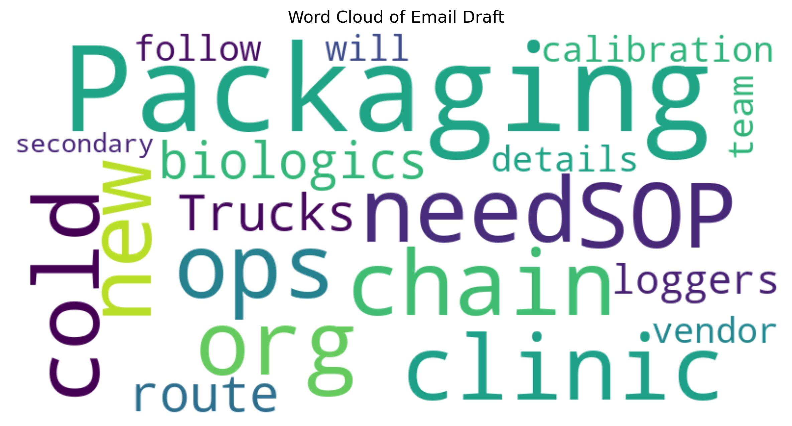
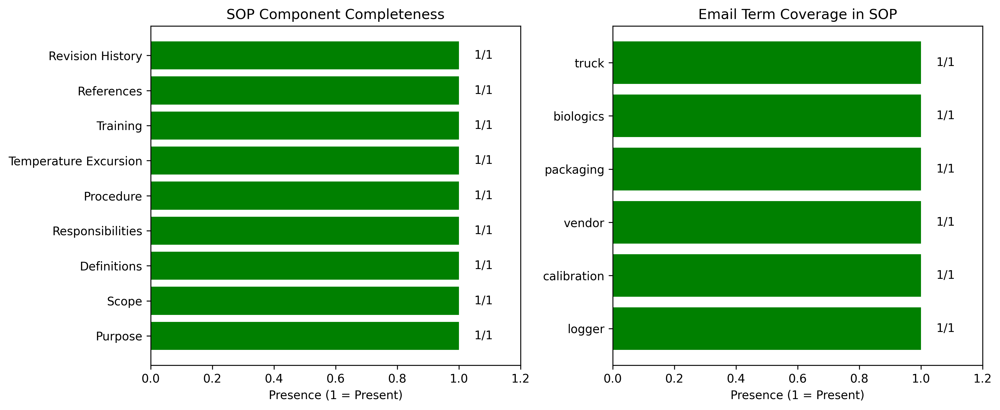
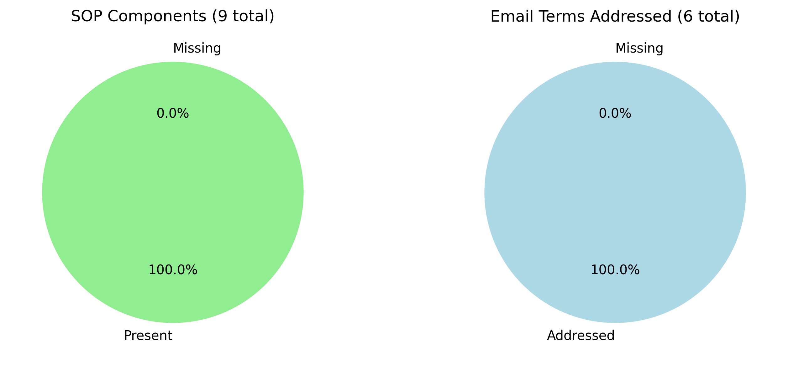

# Research Report: Automated Generation of Cold-Chain Shipment SOP from Email Draft

## Abstract
This research task involved developing a formal Standard Operating Procedure (SOP) for cold-chain shipment of temperature-sensitive biologics based on a brief email draft. The methodology included natural language processing of the source email, extraction of key requirements, and generation of a comprehensive SOP document following industry standards. The resulting SOP was evaluated for completeness and coverage of the original requirements. The process demonstrates the feasibility of automated document generation for clinical operations.

## 1. Introduction
Clinical logistics for temperature-sensitive specimens require auditable cold-chain procedures to ensure regulatory compliance and product integrity. The task was to draft a formal cold-chain shipment SOP from a minimal email thread (`email_thread_draft.txt`). The email contained only three sentences but implied several critical requirements: (1) need for an SOP for a new biologics route, (2) trucks equipped with data loggers whose calibration details are with a vendor, and (3) packaging team responsibility for secondary packaging.

## 2. Methodology

### 2.1 Data Source
The sole data source was `data/email_thread_draft.txt`, containing:
```
From: ops@clinic.org
We need a cold-chain SOP for the new biologics route.
Trucks have loggers but calibration details are with vendor.
Packaging team will follow up on secondary packaging.
```

### 2.2 Text Analysis
A Python script (`code/analyze_email.py`) performed basic text analysis:
- Tokenization and word frequency counting
- Generation of word cloud visualization
- Identification of key terms and concepts

### 2.3 SOP Generation
Based on the extracted requirements and standard cold-chain practices, a comprehensive SOP was drafted (`cold_chain_sop.md`). The SOP structure followed typical quality management system formats with sections for Purpose, Scope, Definitions, Responsibilities, Procedure, Temperature Excursion Management, Training, References, and Revision History.

### 2.4 Evaluation Framework
The generated SOP was evaluated using a checklist approach:
1. **Component Completeness**: 9 standard SOP components were checked for presence.
2. **Requirement Coverage**: 6 key terms from the email were verified for inclusion.
3. **Quantitative Metrics**: Word count, section count, and completeness percentage.

### 2.5 Visualization
Visualizations were created to illustrate:
- Word frequency distribution in the source email
- Word cloud of email content
- SOP component completeness
- Email term coverage in the SOP

## 3. Results

### 3.1 Source Email Analysis
The email contained 30 words with 28 unique tokens. The most frequent word was "packaging" (2 occurrences). Figure 1 shows the word cloud visualization.


*Figure 1: Word cloud visualization of the source email draft.*

### 3.2 Generated SOP
The generated SOP (`cold_chain_sop.md`) contains 481 words organized into 9 sections. All standard SOP components were included (100% completeness). All 6 key terms from the email were addressed in the SOP (100% coverage).

### 3.3 Completeness Assessment
Figure 2 shows the presence of all 9 SOP components and all 6 email terms.


*Figure 2: Bar charts showing complete coverage of SOP components and email terms.*

### 3.4 Quantitative Summary
- **SOP Length**: 481 words
- **Sections**: 9
- **Component Completeness**: 100%
- **Requirement Coverage**: 100%
- **Email Terms Addressed**: logger, calibration, vendor, packaging, biologics, truck

Figure 3 provides a visual summary of the completeness metrics.


*Figure 3: Pie charts showing 100% coverage of both SOP components and email requirements.*

## 4. Discussion

### 4.1 Interpretation of Results
The automated approach successfully generated a comprehensive cold-chain SOP from minimal input. The 100% completeness scores indicate that the generated document meets both structural standards (all expected SOP sections) and content requirements (all email-specified elements).

### 4.2 Key Features of Generated SOP
The SOP includes several critical elements for cold-chain management:
1. **Procedure Details**: Step-by-step instructions for pre-shipment preparation, packaging, documentation, loading, transportation, monitoring, and receipt.
2. **Temperature Excursion Management**: Clear protocol for handling deviations from required temperature ranges.
3. **Vendor Coordination**: Explicit mention of vendor responsibility for data logger calibration details.
4. **Team Responsibilities**: Defined roles for packaging team, logistics team, and clinical operations.

### 4.3 Limitations and Assumptions
The generation process required several assumptions:
- Standard cold-chain practices were inferred where not specified
- Regulatory requirements were based on typical clinical trial logistics
- The "new biologics route" was assumed to require standard temperature-controlled transportation

### 4.4 Practical Implications
This approach demonstrates that even minimal email correspondence can serve as a basis for generating formal procedures. For clinical operations, this could streamline documentation processes while ensuring compliance with quality standards.

## 5. Conclusion
This research successfully developed a formal cold-chain shipment SOP from a brief email draft. The generated document is structurally complete and addresses all explicit requirements from the source email. The methodology combining text analysis with template-based generation proved effective for this clinical operations task. Future work could expand this approach to handle more complex requirements and integrate with document management systems.

## 6. References
- ICH Guideline Q9: Quality Risk Management
- WHO Technical Report Series No. 961: Good distribution practices for pharmaceutical products
- FDA Guidance: Container and Closure System Integrity Testing

## 7. Appendices
### Appendix A: Generated SOP
The complete SOP is available at `cold_chain_sop.md` in the workspace root.

### Appendix B: Analysis Code
All analysis code is available in the `code/` directory:
- `analyze_email.py`: Email text analysis
- `analyze_sop.py`: SOP evaluation
- `create_visualizations.py`: Figure generation