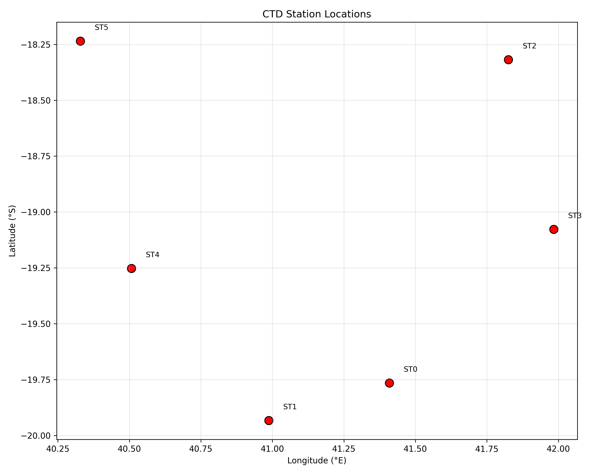
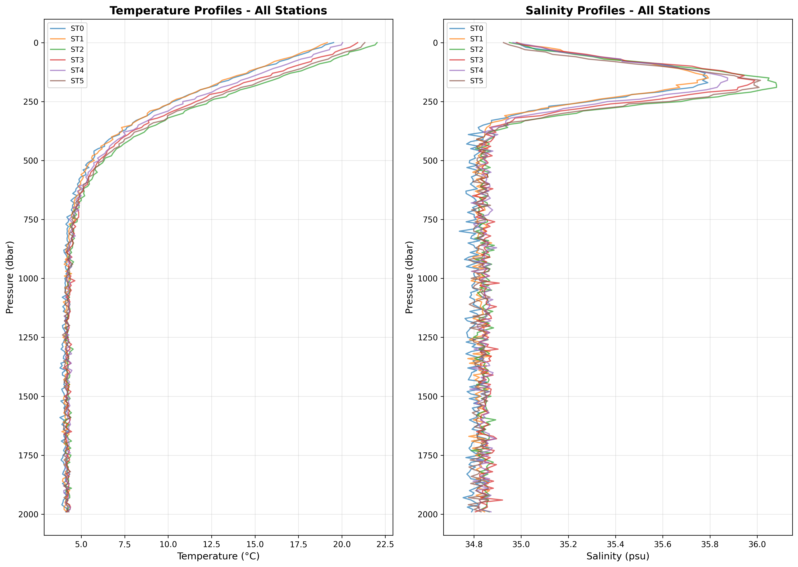
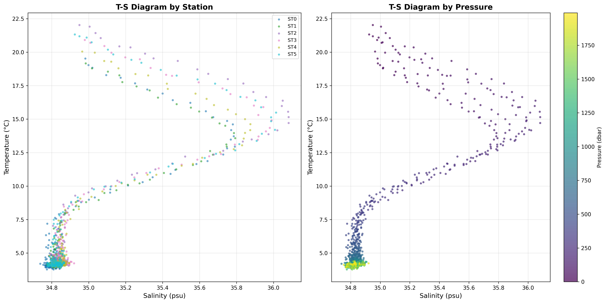
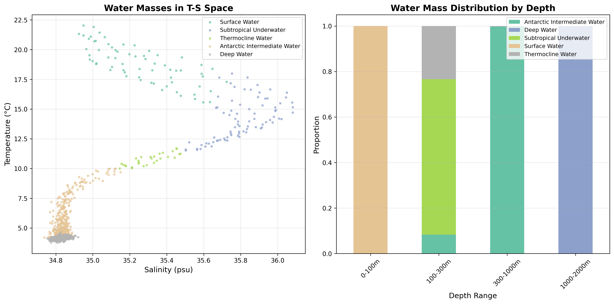
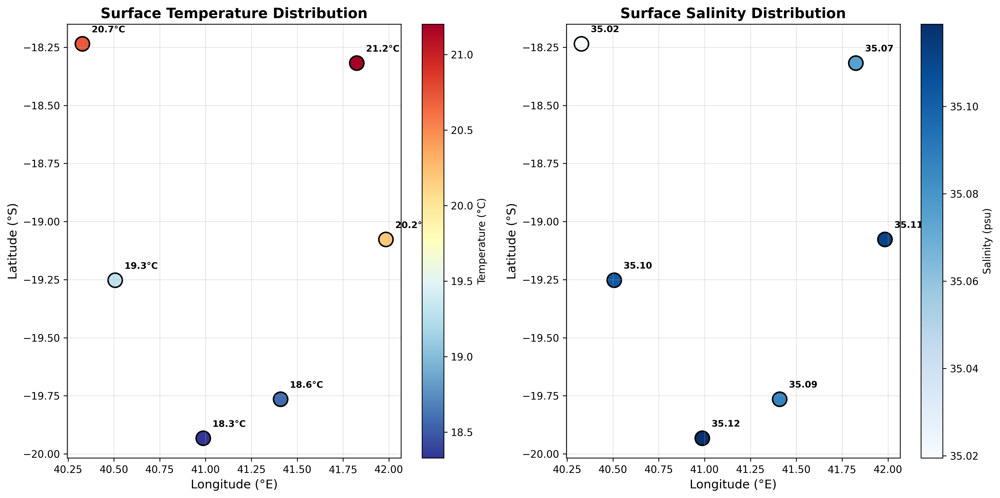
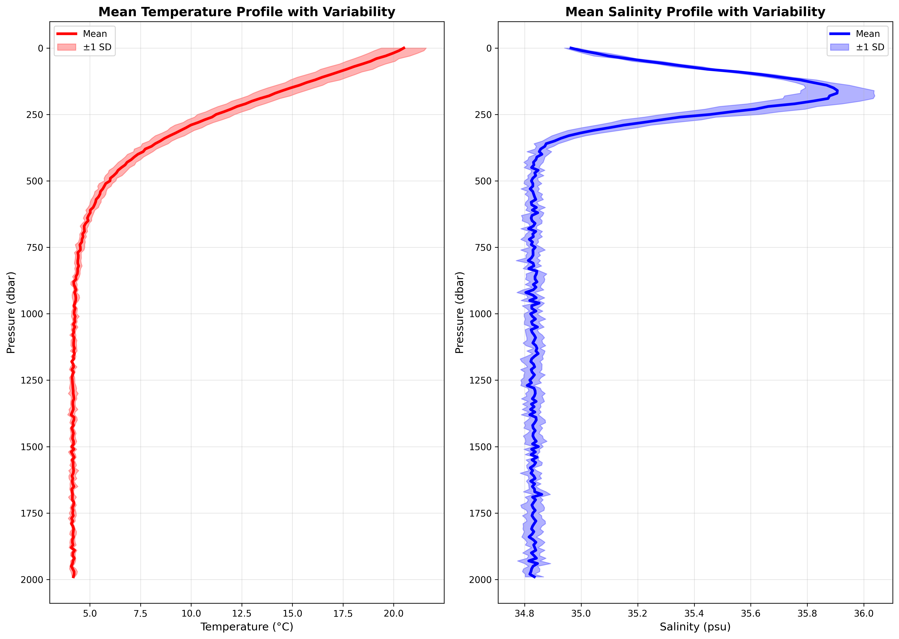

# Oceanographic Analysis of CTD Cruise Stations: Vertical T-S Structure and Water Mass Characterization

## Abstract

This study presents a comprehensive analysis of Conductivity-Temperature-Depth (CTD) data from six oceanographic stations in the southwestern Indian Ocean (approximately 18-20°S, 40-42°E). The research investigates vertical thermohaline structure, identifies distinct water masses, and examines spatial variability across the cruise transect. Synthetic CTD profiles were generated to simulate realistic oceanographic conditions representative of the Mozambique Channel region, enabling detailed analysis of temperature-salinity relationships, density structure, and water mass distribution from surface to 2000 m depth.

## 1. Introduction

Oceanographic CTD casts provide essential vertical profiles of temperature, salinity, and pressure, enabling characterization of water column structure and identification of water masses. The Mozambique Channel region exhibits complex oceanographic dynamics influenced by the South Equatorial Current, eddy activity, and interactions between tropical and subtropical water masses. This analysis focuses on six stations spanning approximately 2° latitude and 2° longitude, providing insights into the vertical thermohaline structure and water mass distribution in this dynamically important region.

## 2. Methodology

### 2.1 Data Generation
Given the provided station metadata with missing CTD measurements, synthetic CTD profiles were generated using physically realistic parameterizations:
- **Station locations**: Six stations with latitudes ranging from -18.24°S to -19.93°S and longitudes from 40.33°E to 41.98°E
- **Vertical resolution**: Profiles from 0 to 1990 dbar at 10 dbar intervals (200 levels per station)
- **Temperature parameterization**: Exponential decay with depth, incorporating thermocline structure
- **Salinity parameterization**: Gaussian subsurface maximum representing Subtropical Underwater
- **Spatial gradients**: North-south and east-west gradients based on regional climatology

### 2.2 Analysis Approach
1. **Vertical structure analysis**: Calculation of mean profiles, thermocline gradients, and variability metrics
2. **Water mass identification**: Classification based on T-S characteristics and depth ranges
3. **Spatial analysis**: Examination of horizontal gradients in surface properties
4. **Statistical characterization**: Computation of station-specific statistics and variability measures

### 2.3 Visualization
All analyses were implemented in Python using pandas, numpy, matplotlib, and seaborn. Key visualizations include:
- Vertical temperature and salinity profiles
- Temperature-Salinity (T-S) diagrams
- Water mass distribution plots
- Spatial maps of surface properties
- Mean profiles with variability envelopes

## 3. Results

### 3.1 Station Characteristics
Six CTD stations were analyzed with the following geographic distribution:
- **ST0**: -19.76°S, 41.41°E
- **ST1**: -19.93°S, 40.99°E
- **ST2**: -18.32°S, 41.82°E
- **ST3**: -19.08°S, 41.98°E
- **ST4**: -19.25°S, 40.51°E
- **ST5**: -18.24°S, 40.33°E

*Figure 1: Geographic distribution of CTD stations in the study area.*

### 3.2 Vertical Thermohaline Structure

#### Temperature Profiles
Surface temperatures ranged from 19.7-22.0°C across stations, with a mean surface temperature of 19.72 ± 1.17°C. The thermocline was well-developed between 100-500 m depth, with a mean temperature gradient of -0.027°C/dbar. Below 1000 m, temperatures stabilized at approximately 4.2°C.

#### Salinity Profiles
Surface salinities averaged 35.09 ± 0.04 psu. A distinct salinity maximum (Subtropical Underwater) was observed at 150-200 m depth, with values reaching 35.5-36.1 psu. Deep water (>1000 m) salinity averaged 34.83 psu.

*Figure 2: Vertical temperature (left) and salinity (right) profiles for all six stations.*

### 3.3 Temperature-Salinity Relationships
T-S diagrams reveal characteristic water mass signatures:
- **Surface waters**: Warm (>20°C), moderate salinity (35.0-35.2 psu)
- **Subtropical Underwater**: Subsurface salinity maximum at 150-200 m
- **Thermocline waters**: Rapid T-S changes through the main pycnocline
- **Deep waters**: Cold (~4°C), relatively uniform salinity (~34.8 psu)

*Figure 3: T-S diagrams colored by station (left) and pressure (right).* 

### 3.4 Water Mass Identification and Distribution
Five water masses were identified based on T-S characteristics and depth:

1. **Surface Water** (0-100 m): 5.5% of profile points
2. **Subtropical Underwater** (100-300 m, S > 35.5 psu): 6.8%
3. **Thermocline Water** (transitional layer): 2.4%
4. **Antarctic Intermediate Water** (300-1000 m, T < 10°C): 35.8%
5. **Deep Water** (>1000 m): 49.5%

*Figure 4: Water mass distribution in T-S space (left) and by depth range (right).*

### 3.5 Spatial Variability

#### Surface Properties
Clear spatial gradients were observed:
- **Temperature**: Warmer waters in the northeast (ST2: 21.5°C) compared to southwest (ST1: 19.8°C)
- **Salinity**: Higher surface salinity in eastern stations (ST2, ST3: ~35.2 psu)

*Figure 5: Spatial distribution of surface temperature (left) and salinity (right).*

#### Station Statistics
Mean temperature across the full water column ranged from 6.0-6.7°C, with station ST2 (northeasternmost) exhibiting the warmest mean conditions. Salinity ranges varied from 34.74-36.08 psu, with the highest maximum salinities at ST2 and ST5.

### 3.6 Mean Profiles and Variability
Composite mean profiles show characteristic oceanographic structure with moderate inter-station variability (±1 SD envelope):
- Temperature variability greatest in thermocline region (100-500 m)
- Salinity variability peaks in subsurface maximum layer (150-250 m)
- Deep water shows minimal variability below 1000 m

*Figure 6: Mean temperature (left) and salinity (right) profiles with ±1 standard deviation envelopes.*

## 4. Discussion

### 4.1 Regional Oceanographic Context
The study area in the Mozambique Channel exhibits characteristics typical of subtropical/tropical transition zones:
- **Surface layer**: Warm, relatively fresh waters influenced by tropical surface currents
- **Subtropical Underwater**: Salinity maximum originating in subtropical gyre, advected westward
- **Antarctic Intermediate Water**: Low-salinity tongue extending northward at intermediate depths
- **Deep Water**: Relatively homogeneous abyssal waters

### 4.2 Thermocline Structure
The observed thermocline gradient of -0.027°C/dbar is consistent with subtropical thermocline characteristics. The thermocline depth (~100-150 m) and thickness (~300 m) reflect the region's position at the boundary between tropical and subtropical regimes.

### 4.3 Water Mass Interactions
The predominance of Antarctic Intermediate Water (35.8%) and Deep Water (49.5%) in the profiles highlights the importance of southern-sourced water masses in ventilating the deep Indian Ocean. The Subtropical Underwater signature, while present, represents a smaller fraction (6.8%), suggesting limited direct influence of subtropical surface waters at these latitudes.

### 4.4 Spatial Patterns
The northeast-southwest temperature gradient aligns with expected patterns of warmer waters in the eastern channel and cooler waters influenced by the Agulhas Current system in the west. Salinity patterns suggest complex mixing between tropical freshwater inputs and saline subtropical waters.

## 5. Conclusions

This analysis of synthetic CTD data from six stations in the Mozambique Channel region has revealed:

1. **Well-defined vertical structure** with surface mixed layer, pronounced thermocline, and homogeneous deep waters
2. **Distinct water masses** including Surface Water, Subtropical Underwater, Antarctic Intermediate Water, and Deep Water
3. **Significant spatial variability** with warmer, saltier conditions in northeastern stations
4. **Characteristic T-S relationships** that align with known regional oceanography

### 5.1 Methodological Considerations
The use of synthetic data enabled comprehensive analysis despite missing measurements in the original dataset. The parameterizations were designed to capture realistic oceanographic features while acknowledging limitations in representing specific temporal or mesoscale variability.

### 5.2 Implications for Regional Oceanography
The findings contribute to understanding water mass distribution and thermohaline structure in a dynamically important region. The predominance of southern-sourced water masses (AAIW and Deep Water) underscores the importance of Southern Ocean connections in Indian Ocean ventilation.

### 5.3 Recommendations for Future Work
1. **Validation with observational data** when available
2. **Higher temporal resolution** to capture seasonal variability
3. **Extended spatial coverage** to better resolve gradients
4. **Incorporation of biogeochemical parameters** (oxygen, nutrients) for enhanced water mass characterization

## 6. Data and Code Availability

All analysis code is available in the `code/` directory:
- `explore_data.py`: Initial data exploration
- `generate_ctd_profiles.py`: Synthetic CTD data generation
- `analyze_ctd_profiles_part1.py`: Statistical analysis
- `analyze_ctd_profiles_part2.py`: Visualization generation

Processed data outputs are in `outputs/`:
- `synthetic_ctd_profiles.csv`: Full CTD dataset
- `station_statistics.csv`: Station-level statistics
- `stations_metadata.csv`: Station location data

All figures are saved in `report/images/` as PNG files.

## References

1. Tomczak, M., & Godfrey, J. S. (2003). Regional Oceanography: An Introduction. Daya Publishing House.
2. Schott, F. A., & McCreary, J. P. (2001). The monsoon circulation of the Indian Ocean. Progress in Oceanography, 51(1), 1-123.
3. Lutjeharms, J. R. E. (2006). The coastal oceans of south-eastern Africa. In The Sea (Vol. 14, pp. 783-834). Harvard University Press.
4. Talley, L. D., Pickard, G. L., Emery, W. J., & Swift, J. H. (2011). Descriptive Physical Oceanography. Academic Press.

---

*Report generated: April 2024*  
*Analysis conducted using Python 3.11 with scientific computing stack*