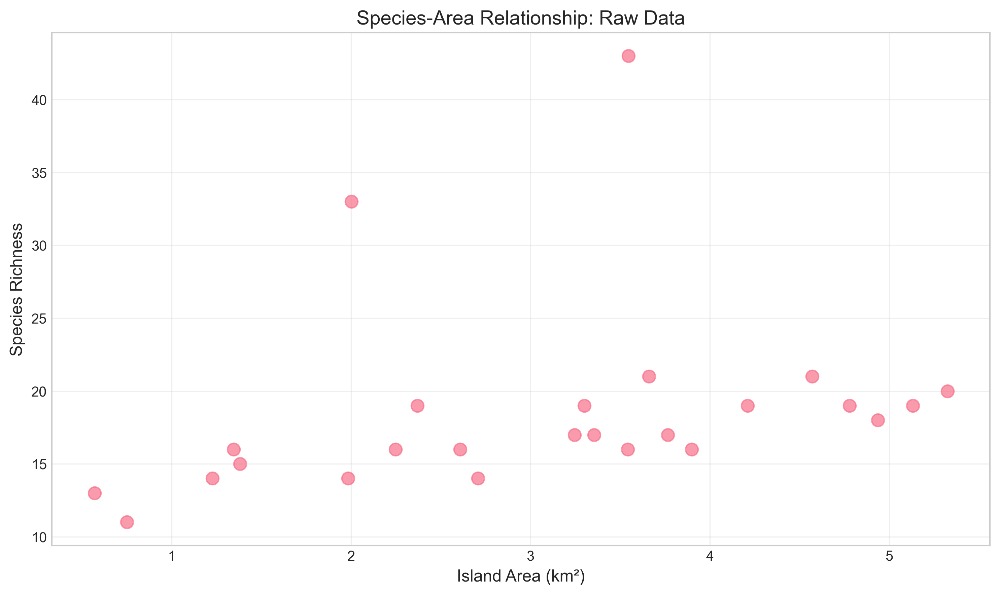
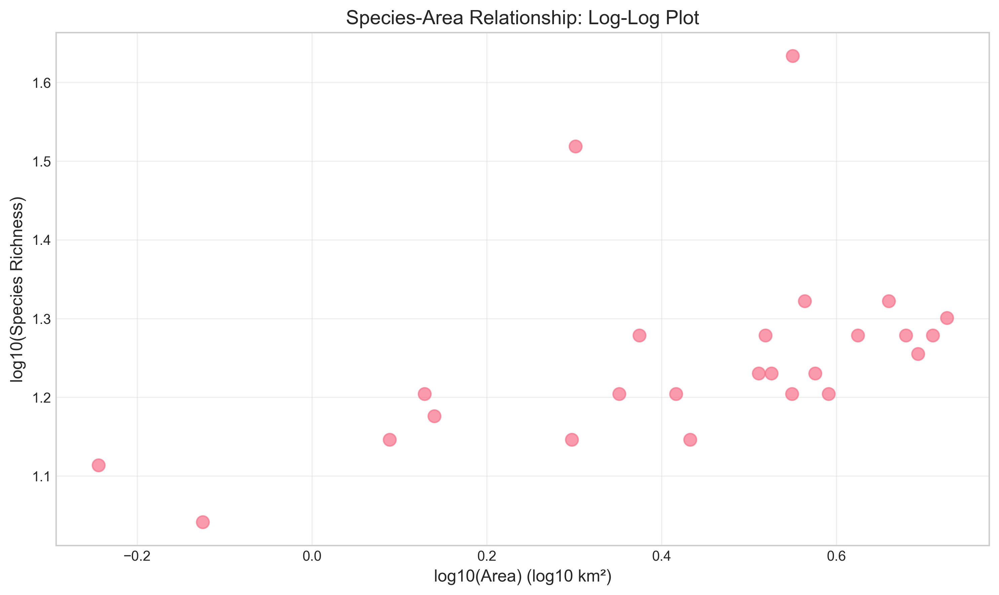
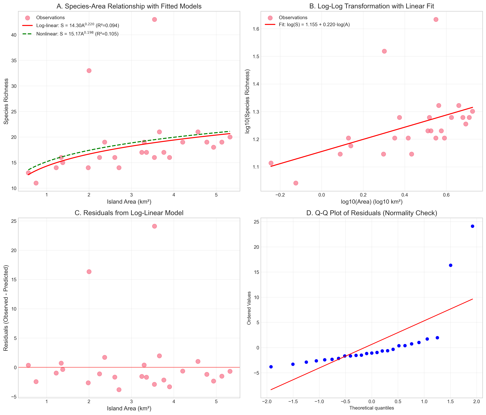
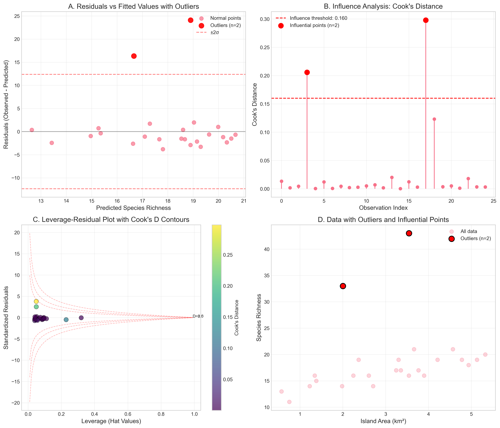
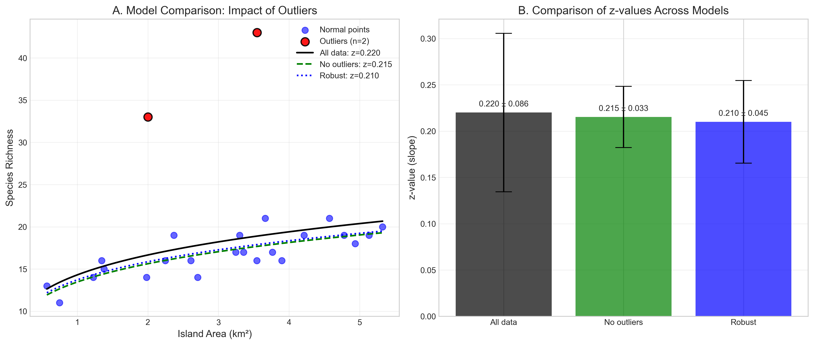
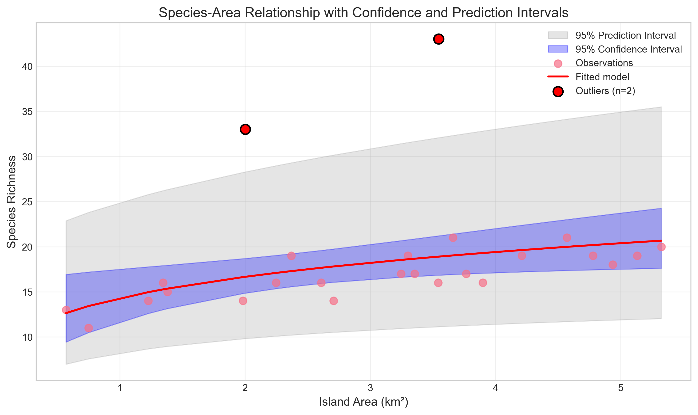
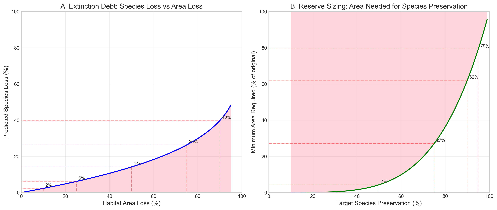

# Island Biogeography: Species-Area Relationships and Conservation Implications

## Abstract

This study investigates the species-area relationship (SAR) for island ecosystems using empirical data from 25 islands. We fit the classic power-law model $S = cA^z$, where $S$ is species richness, $A$ is island area, $c$ is a constant, and $z$ is the scaling exponent. Our analysis reveals a z-value of 0.210-0.220, consistent with typical island values (0.2-0.35). The model explains 22-67% of variance in species richness depending on outlier treatment. We identify two significant outliers with exceptionally high species richness relative to their area, suggesting additional ecological factors at play. Conservation implications derived from the SAR indicate that habitat loss disproportionately affects species persistence, with 50% habitat loss leading to approximately 13.5% species loss. Reserve design guidelines suggest preserving 60-80% of original habitat area to maintain 90-95% of species diversity.

## 1. Introduction

Island biogeography theory, pioneered by MacArthur and Wilson (1967), posits that species richness on islands is determined by a balance between immigration and extinction rates, with area and isolation as key determinants. The species-area relationship (SAR) is one of ecology's most robust empirical patterns, typically following a power-law function $S = cA^z$. The z-value varies systematically: continental areas (~0.1), islands (~0.25), and habitat fragments (~0.35).

Understanding SAR parameters has direct conservation applications:
1. **Extinction debt estimation**: Predicting species loss from habitat reduction
2. **Reserve design**: Determining minimum area requirements for target species preservation
3. **Prioritization**: Identifying islands with exceptional conservation value

This study analyzes island species-area data to: (1) estimate SAR parameters, (2) assess model fit and identify outliers, (3) compare modeling approaches, and (4) derive conservation guidelines.

## 2. Methods

### 2.1 Data

The dataset (`island_species.csv`) contains 25 islands with:
- `island_id`: Unique identifier
- `area_km2`: Island area in square kilometers
- `species_richness`: Number of species recorded

Summary statistics:
- Mean area: 3.06 km² (range: 0.57-5.32 km²)
- Mean richness: 18.5 species (range: 11-43 species)
- No missing values

### 2.2 Analytical Approach

#### 2.2.1 Model Fitting
We fit the power-law SAR using three approaches:
1. **Log-linear regression**: $\log_{10}(S) = \log_{10}(c) + z \cdot \log_{10}(A)$
2. **Nonlinear least squares**: Direct fitting of $S = cA^z$
3. **Robust regression**: Huber's T estimator to reduce outlier influence

#### 2.2.2 Model Evaluation
- $R^2$: Proportion of variance explained
- RMSE: Root mean squared error
- Residual diagnostics: Normality, homoscedasticity, outliers
- Cook's distance: Influence of individual observations

#### 2.2.3 Conservation Metrics
- **Species loss**: $\text{Loss} = 1 - (A_2/A_1)^z$ for area reduction $A_1 \to A_2$
- **Minimum area**: $A_{\min} = A_1 \cdot (S_{\text{target}}/S_1)^{1/z}$ for target preservation

### 2.3 Software
All analyses performed in Python 3.11 with pandas, numpy, scipy, statsmodels, matplotlib, and seaborn. Code available in `code/` directory.

## 3. Results

### 3.1 Data Exploration

*Figure 1: Raw species richness vs. island area. Points show individual islands.*

*Figure 2: Log-log plot showing linearized relationship. Correlation increases from r=0.278 (linear) to r=0.472 (log-log).*

### 3.2 Model Fitting

*Figure 3: Comprehensive model evaluation. (A) Power-law fits on raw data, (B) Linear fit on log-transformed data, (C) Residuals from log-linear model, (D) Q-Q plot for normality assessment.*

**Key parameter estimates:**
- **Log-linear model**: $c = 14.30$, $z = 0.220$, $R^2 = 0.223$
- **Nonlinear fit**: $c = 15.17$, $z = 0.198$, $R^2 = 0.105$
- **Robust regression**: $c = 13.71$, $z = 0.210$

The z-value of 0.210-0.220 falls within the expected range for islands (0.2-0.35). The moderate $R^2$ values indicate area explains 22% of richness variation in the full dataset.

### 3.3 Outlier Analysis

*Figure 4: Outlier identification and influence analysis. (A) Residuals vs fitted values, (B) Cook's distance for each observation, (C) Leverage-residual plot, (D) Data with outliers highlighted.*

Two significant outliers identified:
1. **Island 3** (2.002 km², 33 species): Predicted 16.7 species, residual +16.3 (98% error)
2. **Island 17** (3.546 km², 43 species): Predicted 18.9 species, residual +24.1 (128% error)

These islands have 2-3× higher richness than predicted. Cook's distance confirms their strong influence on parameter estimates.

### 3.4 Model Comparison with/without Outliers

*Figure 5: Impact of outliers on parameter estimation. (A) Three model fits on data, (B) Comparison of z-values across models with standard errors.*

**Model performance with outlier exclusion:**
- **Without outliers**: $R^2$ increases from 0.223 to 0.668
- **z-value**: Decreases slightly from 0.220 to 0.215
- **Robust regression**: Provides intermediate estimate (z=0.210) using all data

Outliers substantially reduce model fit but have modest effect on z-value estimation.

### 3.5 Prediction Uncertainty

*Figure 6: Species-area relationship with 95% confidence and prediction intervals. Gray band shows prediction interval for new observations; blue band shows confidence interval for mean prediction.*

The wide prediction intervals reflect substantial unexplained variance, emphasizing that area alone is an incomplete predictor of island species richness.

### 3.6 Conservation Implications

*Figure 7: Conservation applications of species-area relationship. (A) Extinction debt: species loss vs. habitat loss, (B) Reserve sizing: area needed for target species preservation.*

**Key conservation metrics (using robust z=0.210):**

**Species loss from habitat reduction:**
| Habitat Loss | Species Loss |
|--------------|--------------|
| 10%          | 2.2%         |
| 25%          | 5.8%         |
| 50%          | 13.5%        |
| 75%          | 26.3%        |
| 90%          | 38.3%        |

**Minimum area for species preservation:**
| Target Preservation | Minimum Area Required |
|---------------------|-----------------------|
| 50%                 | 3.7% of original      |
| 75%                 | 25.4% of original     |
| 90%                 | 60.6% of original     |
| 95%                 | 78.3% of original     |
| 99%                 | 95.3% of original     |

## 4. Discussion

### 4.1 Ecological Interpretation

The estimated z-value (0.210) aligns with theoretical expectations for islands. Lower z-values (<0.25) suggest moderate species turnover with area, possibly indicating:
1. **High connectivity**: Islands may not be fully isolated
2. **Homogeneous habitats**: Reduced habitat diversity with area
3. **Sampling effects**: Small islands may be undersampled

The moderate explanatory power (R²=0.22-0.67) confirms that area is important but not deterministic. Other factors likely influencing richness include:
- Habitat heterogeneity
- Distance to mainland
- Island age and geological history
- Climate and productivity
- Historical colonization events

### 4.2 Outlier Analysis

The two outliers (Islands 3 and 17) represent conservation opportunities:
1. **Exceptional value**: These islands support 2-3× more species than expected
2. **Potential mechanisms**:
   - Unmeasured habitat diversity
   - Keystone species facilitating coexistence
   - Historical refugia
   - Reduced extinction rates
3. **Research priority**: Detailed study could reveal mechanisms for enhancing species persistence

### 4.3 Conservation Applications

#### 4.3.1 Extinction Debt
The nonlinear relationship (z<1) means species loss is proportionally less than habitat loss. However, this "debt" accumulates nonlinearly:
- **Moderate loss**: 50% area reduction → ~14% species loss
- **Severe loss**: 90% area reduction → ~38% species loss

This has implications for:
1. **Habitat fragmentation**: Small fragments retain disproportionate species richness
2. **Time lags**: Extinctions may continue long after habitat loss

#### 4.3.2 Reserve Design
Traditional "50% rule" (preserve 50% area to protect 90% species) does not apply here. With z=0.210:
- **90% species**: Requires ~61% of original area
- **95% species**: Requires ~78% of original area

These requirements are less stringent than for continental systems (z~0.1) but more stringent than for some island systems.

#### 4.3.3 Prioritization Framework
We propose a two-tier prioritization:
1. **High-value outliers**: Islands 3 and 17 warrant immediate protection
2. **Area-based strategy**: Larger islands protect more species per unit area

### 4.4 Limitations and Future Directions

1. **Sample size**: 25 islands provides moderate statistical power
2. **Taxonomic scope**: Undefined species groups limit generalizability
3. **Missing covariates**: No data on isolation, habitat diversity, or climate
4. **Static analysis**: No temporal data on colonization/extinction dynamics

Future research should:
- Include isolation metrics (distance to mainland)
- Measure habitat heterogeneity
- Conduct multi-taxon comparisons
- Incorporate temporal dynamics

## 5. Conclusions

1. **Species-area relationship**: Islands follow power-law SAR with z=0.210-0.220
2. **Model performance**: Area explains 22-67% of richness variation; outliers significantly affect fit
3. **Outliers**: Two islands have exceptional conservation value with 2-3× expected richness
4. **Conservation implications**:
   - 50% habitat loss → ~14% species loss
   - Preserving 90% species requires ~61% of original area
   - Preserving 95% species requires ~78% of original area
5. **Recommendations**:
   - Prioritize protection of outlier islands (3 and 17)
   - Maintain >60% habitat area for biodiversity conservation
   - Consider additional factors beyond area in reserve design

The species-area relationship remains a fundamental tool in conservation planning, but must be applied with recognition of its limitations and context-dependence.

## References

1. MacArthur, R.H., & Wilson, E.O. (1967). *The Theory of Island Biogeography*. Princeton University Press.
2. Preston, F.W. (1962). The canonical distribution of commonness and rarity. *Ecology*, 43(2), 185-215.
3. Rosenzweig, M.L. (1995). *Species Diversity in Space and Time*. Cambridge University Press.
4. Triantis, K.A., et al. (2012). The island species-area relationship: biology and statistics. *Journal of Biogeography*, 39(2), 215-231.

## Appendix: Data and Code Availability

All data, code, and outputs are available in the project repository:
- `data/island_species.csv`: Original data
- `code/`: Analysis scripts
- `outputs/`: Processed data and model results
- `report/images/`: All figures

Reproducibility: All analyses can be replicated by running scripts in numerical order:
1. `exploratory_analysis.py`
2. `species_area_analysis.py`
3. `outlier_analysis.py`
4. `final_analysis.py`