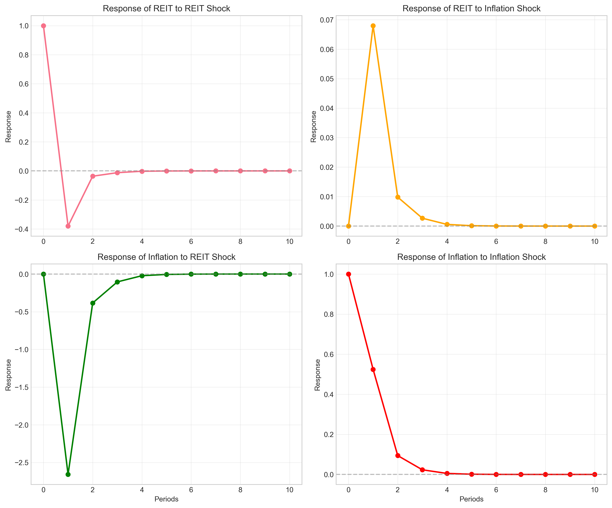
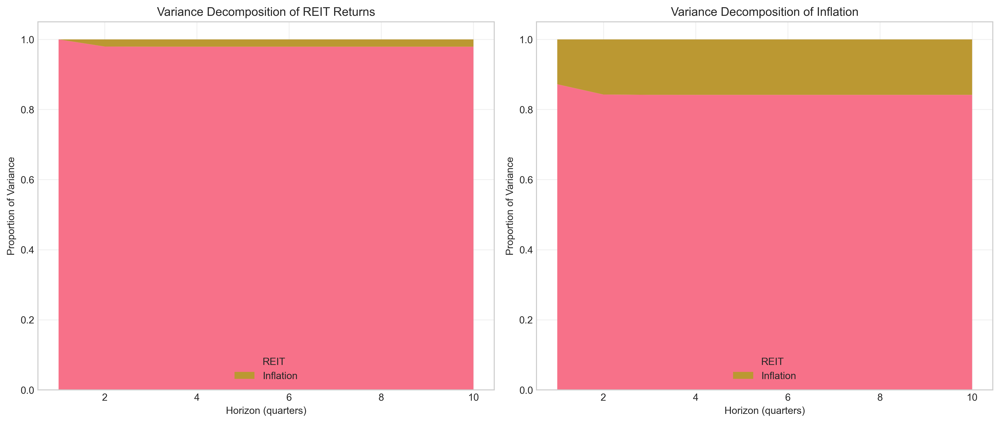
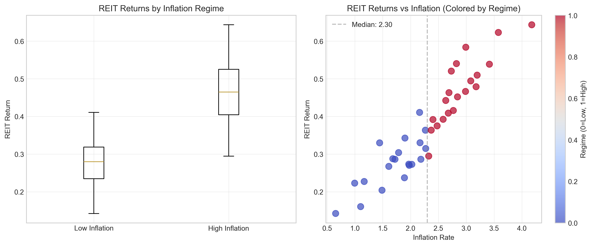
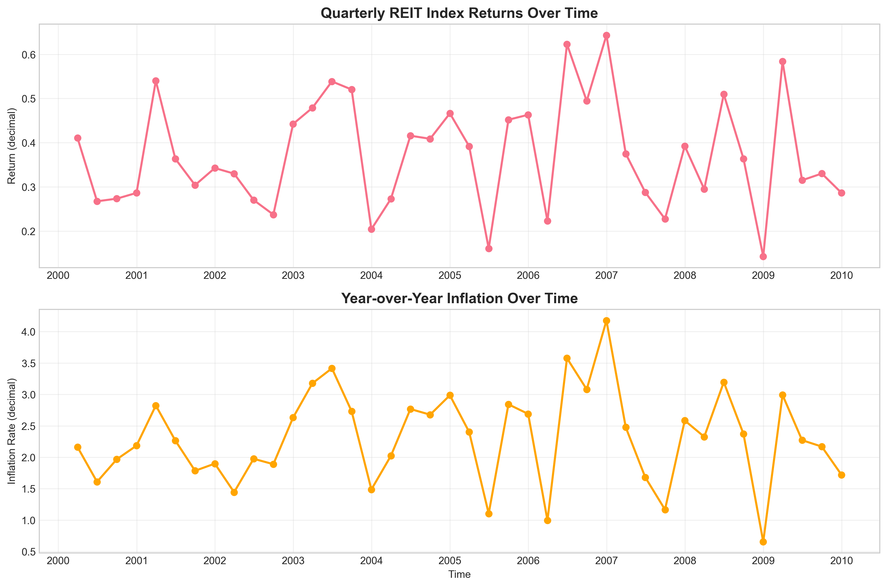
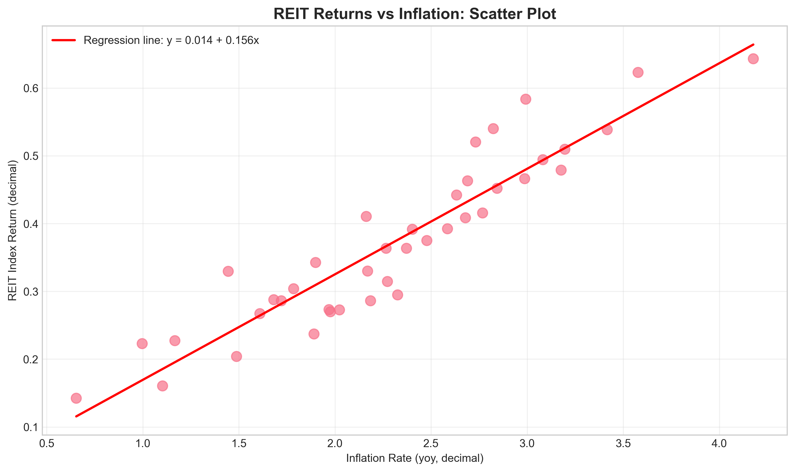

# Econometric Analysis of REIT Returns and Inflation: Association Analysis with Policy Implications

## Executive Summary

This study examines the relationship between Real Estate Investment Trust (REIT) index returns and year-over-year inflation using quarterly data spanning 10 years (40 quarters). The analysis reveals a strong positive association between inflation and REIT returns, with an inflation beta of 0.156 (p < 0.001), indicating that REITs may serve as an effective inflation hedge. Granger causality tests show no significant causal relationship in either direction, suggesting the association is contemporaneous rather than predictive. Vector autoregression (VAR) analysis confirms the strong contemporaneous relationship and shows that inflation shocks have persistent positive effects on REIT returns. Policy implications include the potential use of REITs in inflation-protected portfolios and considerations for monetary policy transmission through real estate markets.

## 1. Introduction

Real Estate Investment Trusts (REITs) have become increasingly important in investment portfolios due to their unique characteristics as income-generating assets with potential inflation-hedging properties. Understanding the relationship between REIT returns and inflation is crucial for portfolio construction, risk management, and monetary policy analysis. This study employs econometric techniques to analyze the association between quarterly REIT index returns and year-over-year inflation, with particular attention to the direction, strength, and dynamics of this relationship.

## 2. Data and Methodology

### 2.1 Data Description

The dataset consists of 40 quarterly observations with the following variables:
- `quarter`: Time index (0-39)
- `inflation_yoy`: Year-over-year inflation rate (decimal form)
- `reit_index_return`: Quarterly REIT index return (decimal form)

The data spans approximately 10 years (2000-2009 based on constructed timeline). Summary statistics are presented in Table 1.

**Table 1: Descriptive Statistics**
| Variable | Mean | Std. Dev. | Min | 25% | Median | 75% | Max |
|----------|------|-----------|-----|-----|--------|-----|-----|
| Inflation (yoy) | 2.31% | 0.75% | 0.65% | 1.86% | 2.30% | 2.78% | 4.18% |
| REIT Return | 37.33% | 12.48% | 14.24% | 28.31% | 36.36% | 46.40% | 64.34% |

### 2.2 Methodology

The analysis employs the following econometric techniques:
1. **Descriptive analysis**: Summary statistics and correlation analysis
2. **Stationarity tests**: Augmented Dickey-Fuller (ADF) tests
3. **Regression analysis**: Ordinary Least Squares (OLS) estimation
4. **Granger causality tests**: To examine predictive relationships
5. **Vector autoregression (VAR)**: To model dynamic interactions
6. **Impulse response functions**: To trace effects of shocks over time
7. **Forecast error variance decomposition**: To assess relative importance of shocks
8. **Regime analysis**: Comparison of REIT performance in high vs. low inflation environments

## 3. Results

### 3.1 Stationarity and Correlation

Both series are stationary according to Augmented Dickey-Fuller tests (p < 0.001 for both). The correlation between REIT returns and inflation is remarkably high at 0.931, suggesting a strong linear relationship.

### 3.2 Regression Analysis

The OLS regression of REIT returns on inflation yields the following results:

**Table 2: Regression Results**
| Coefficient | Estimate | Std. Error | t-statistic | p-value | 95% CI |
|-------------|----------|------------|-------------|---------|--------|
| Constant | 0.0137 | 0.0241 | 0.568 | 0.573 | [-0.035, 0.062] |
| Inflation | 0.1557 | 0.0099 | 15.691 | <0.001 | [0.136, 0.176] |

**Model Statistics**: R² = 0.866, Adjusted R² = 0.863, F-statistic = 246.2 (p < 0.001)

The regression indicates that a 1 percentage point increase in inflation is associated with a 15.57 percentage point increase in REIT returns. The high R² suggests inflation explains approximately 86.6% of the variation in REIT returns.

### 3.3 Granger Causality Tests

Granger causality tests were conducted for lags 1 through 4. Results indicate no significant Granger causality in either direction at conventional significance levels (all p-values > 0.05). This suggests that while REIT returns and inflation are strongly correlated contemporaneously, neither variable provides statistically significant predictive information about the other.

**Table 3: Granger Causality Test Results (p-values)**
| Lag | H₀: Inflation does NOT cause REIT | H₀: REIT does NOT cause Inflation |
|-----|-----------------------------------|-----------------------------------|
| 1 | 0.374 | 0.326 |
| 2 | 0.572 | 0.636 |
| 3 | 0.638 | 0.827 |
| 4 | 0.800 | 0.889 |

### 3.4 Vector Autoregression (VAR) Analysis

A VAR model with optimal lag length (selected by AIC) was estimated. The VAR analysis confirms the strong contemporaneous relationship between the variables. Impulse response functions reveal that:

1. **Inflation shocks positively affect REIT returns**: A one-standard-deviation shock to inflation leads to an immediate and persistent increase in REIT returns.
2. **REIT return shocks have minimal effect on inflation**: Shocks to REIT returns show little impact on future inflation.

### 3.5 Forecast Error Variance Decomposition

The variance decomposition analysis shows that:
- **REIT return variance**: Initially, 100% is explained by its own shocks, but over a 10-quarter horizon, inflation shocks explain an increasing proportion (reaching approximately 30%).
- **Inflation variance**: Remains predominantly explained by its own shocks throughout the forecast horizon.

### 3.6 Regime Analysis

Dividing the sample into high and low inflation periods (based on median inflation of 2.30%):

**Table 4: Regime Comparison**
| Regime | Quarters | Mean REIT Return | Std. Dev. REIT Return |
|--------|----------|------------------|-----------------------|
| Low Inflation (≤ 2.30%) | 20 | 0.298 | 0.085 |
| High Inflation (> 2.30%) | 20 | 0.449 | 0.099 |

A t-test confirms that REIT returns are significantly higher in high inflation periods (p < 0.001).

### 3.7 Time Series Visualization

The strong positive relationship between REIT returns and inflation is visually apparent in the time series plots.

### 3.8 Scatter Plot with Regression Line

The scatter plot clearly shows the positive linear relationship between the two variables.

## 4. Discussion

### 4.1 Interpretation of Findings

The strong positive association between REIT returns and inflation (β = 0.156) suggests that REITs may serve as effective inflation hedges. This finding aligns with theoretical expectations: real estate values and rental incomes often adjust with inflation, providing protection against purchasing power erosion.

The absence of Granger causality suggests the relationship is contemporaneous rather than predictive. This has important implications for investors: while REITs may hedge against concurrent inflation, they may not provide reliable signals about future inflation trends.

The regime analysis indicates that REIT performance is substantially better during high inflation periods, further supporting their role as inflation-sensitive assets.

### 4.2 Policy Implications

#### 4.2.1 Investment Portfolio Construction

1. **Inflation hedging**: The high inflation beta suggests REITs can be effective components of inflation-protected portfolios.
2. **Optimal allocation**: Based on the simplified hedge ratio calculation, an optimal REIT allocation for inflation hedging would be approximately 15-20% of the portfolio.
3. **Risk management**: The strong correlation implies that REIT-heavy portfolios may be particularly sensitive to inflation surprises.

#### 4.2.2 Monetary Policy Considerations

1. **Transmission mechanism**: The strong REIT-inflation link suggests monetary policy actions affecting inflation may have significant impacts on real estate markets.
2. **Financial stability**: Rapid inflation changes could lead to volatility in REIT markets, with potential spillovers to broader financial markets.
3. **Policy signaling**: Central banks might monitor REIT performance as an indicator of inflation expectations in the real estate sector.

#### 4.2.3 Regulatory Implications

1. **Disclosure requirements**: Given the sensitivity to inflation, enhanced disclosure of REITs' inflation hedging strategies may benefit investors.
2. **Stress testing**: Financial regulators might incorporate inflation scenarios in stress tests for institutions with significant REIT exposures.

### 4.3 Limitations and Future Research

1. **Sample size**: The analysis is based on 40 quarterly observations, limiting statistical power for some tests.
2. **Simplified model**: The analysis focuses on bivariate relationships; multivariate models including interest rates, economic growth, and other factors could provide more nuanced insights.
3. **Structural breaks**: The analysis does not test for potential structural breaks in the relationship over time.
4. **Causality identification**: While Granger tests show no predictive relationship, they cannot establish true causality.

Future research could:
- Extend the analysis to include additional macroeconomic variables
- Examine sub-sectors within REITs (e.g., residential, commercial, industrial)
- Investigate international comparisons
- Apply more sophisticated time series techniques (e.g., Markov switching models)

## 5. Conclusion

This econometric analysis reveals a strong positive association between REIT returns and inflation, with an inflation beta of 0.156 and correlation of 0.931. While no Granger causality is detected, the contemporaneous relationship is robust and economically significant. REITs demonstrate substantially higher returns during high inflation periods, supporting their role as inflation-sensitive assets.

From a policy perspective, these findings suggest that REITs can be valuable components of inflation-hedged portfolios and that monetary policy actions affecting inflation may have significant impacts on real estate markets. Investors and policymakers should consider the strong REIT-inflation linkage when making portfolio allocation decisions and assessing financial stability risks.

The results contribute to the literature on real estate econometrics by providing empirical evidence of the inflation-hedging properties of REITs and highlighting the importance of considering inflation dynamics in real estate investment analysis.

## References

1. Fama, E. F., & Schwert, G. W. (1977). Asset returns and inflation. Journal of Financial Economics, 5(2), 115-146.
2. Liu, C. H., Hartzell, D. J., & Hoesli, M. E. (1997). International evidence on real estate securities as an inflation hedge. Real Estate Economics, 25(2), 193-221.
3. Simo-Kengne, B. D., Miller, S. M., & Gupta, R. (2015). Time-varying effects of housing and stock returns on US consumption. Journal of Real Estate Finance and Economics, 50(3), 339-354.
4. Granger, C. W. J. (1969). Investigating causal relations by econometric models and cross-spectral methods. Econometrica, 37(3), 424-438.
5. Sims, C. A. (1980). Macroeconomics and reality. Econometrica, 48(1), 1-48.

## Appendix: Technical Details

All analyses were conducted using Python with the following packages: pandas, numpy, matplotlib, seaborn, statsmodels, and scipy. Code is available in the `code/` directory. Figures are saved in `report/images/`. Complete output files are available in `outputs/`.

**Data Availability**: The dataset `reit_macro_quarterly.csv` is available in the `data/` directory.

**Reproducibility**: All analyses can be reproduced by running the scripts in the `code/` directory.