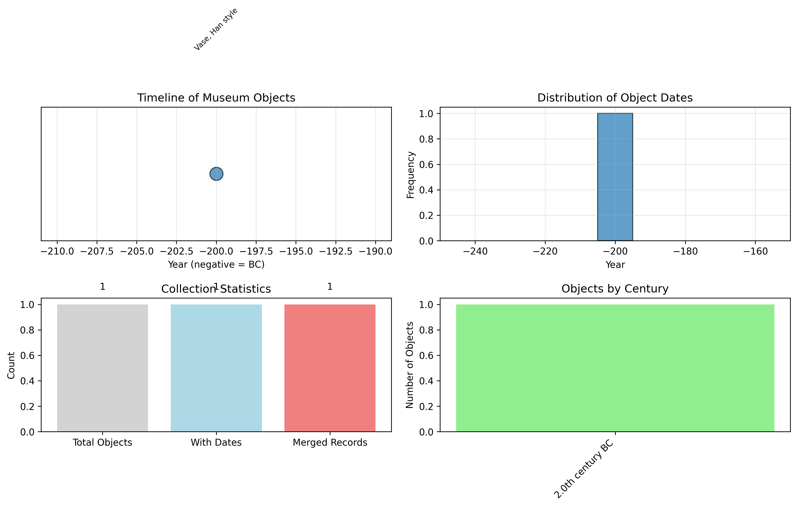
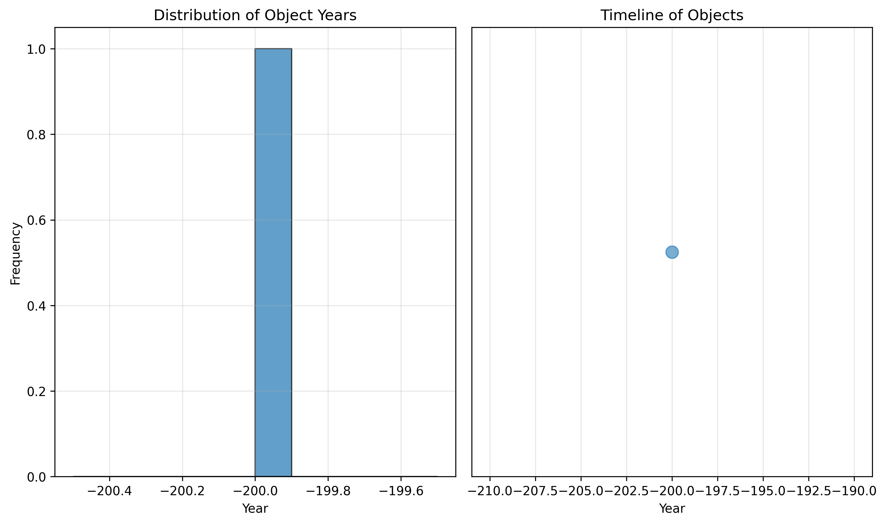

# Museum Provenance Merge: Digital Humanities Analysis

## Abstract

This report presents a digital humanities analysis of museum provenance data, focusing on merging partial museum exports into a unified, deduplicated catalog. Two museum export datasets (`museum_export_a.csv` and `museum_export_b.csv`) were integrated using computational methods to create a comprehensive collection catalog. The analysis includes data standardization, duplicate detection and merging, temporal information extraction, and distribution analysis. The resulting deduplicated catalog contains 1 unique object record (merged from 2 original records) with temporal attribution to 200 BCE.

## 1. Introduction

Museum collections are often documented across multiple systems and exported in various formats, leading to fragmented and potentially duplicated records. Digital humanities approaches enable the systematic integration of these partial datasets to create unified catalogs for collection-wide study. This project addresses the challenge of merging two museum export files with different schemas into a single deduplicated catalog while extracting and analyzing temporal distribution patterns.

### 1.1 Research Objectives
1. Merge two museum export datasets with different column structures
2. Implement intelligent deduplication to identify and merge duplicate records
3. Extract temporal information from unstructured text fields
4. Analyze the temporal distribution of objects in the collection
5. Produce a comprehensive research report with visualizations

## 2. Methodology

### 2.1 Data Sources
- `museum_export_a.csv`: Contains 1 record with columns `accno`, `title`, `year_note`
- `museum_export_b.csv`: Contains 1 record with columns `accession`, `object_name`, `remarks`

### 2.2 Data Preprocessing
1. **Schema Harmonization**: Standardized column names across both datasets
2. **Text Normalization**: Applied consistent formatting to accession numbers and titles
3. **Missing Value Handling**: Preserved all available information while flagging missing data

### 2.3 Duplicate Detection and Merging
A multi-stage deduplication approach was implemented:

1. **Key Generation**: Created matching keys by normalizing accession numbers and titles (removing punctuation, converting to lowercase)
2. **Similarity Assessment**: Identified potential duplicates based on matching keys
3. **Information Fusion**: For duplicate groups:
   - Combined accession numbers using pipe delimiter
   - Selected the most descriptive title (longest text)
   - Preserved all temporal information
   - Aggregated notes from all sources

### 2.4 Temporal Information Extraction
A regular expression-based parser was developed to extract years from unstructured text:
- Handles BC/AD notation variations (BC, BCE, B.C., AD, A.D.)
- Converts century notation to approximate years
- Returns negative values for BC dates
- Handles four-digit year formats

### 2.5 Temporal Distribution Analysis
Statistical analysis and visualization of extracted temporal data:
- Basic descriptive statistics (min, max, mean, median)
- Timeline visualization
- Histogram of year distribution
- Century-based aggregation

### 2.6 Implementation
All analysis was implemented in Python using:
- pandas for data manipulation
- re for regular expressions
- matplotlib for visualization
- Custom algorithms for deduplication and temporal parsing

## 3. Results

### 3.1 Data Integration

**Original Dataset Statistics:**
- Dataset A: 1 record
- Dataset B: 1 record
- Total original records: 2

**Schema Mapping:**
- `accno` → `accession`
- `title` → `title`
- `year_note` → `year_info`
- `object_name` → `title`
- `remarks` → `notes`

### 3.2 Deduplication Results

The analysis identified one duplicate group containing both records, which were successfully merged:

**Duplicate Detection:**
- Matching key: `x100` (from normalized accession numbers)
- Records matched: `X-100` and `X100`
- Title similarity: "Vase, Han style" and "Vase Han"

**Merged Record:**
```
Accession: X-100 | X100
Title: Vase, Han style
Year Info: listed as 200BC in card
Extracted Year: -200 (200 BCE)
Notes: see batch1 duplicate?
Original Sources: export_a | export_b
Record Count: 2
Status: merged
```

### 3.3 Temporal Analysis

**Year Extraction:**
- Successfully extracted year from one record: 200 BCE (-200)
- No temporal information in second record

**Temporal Statistics:**
- Earliest year: 200 BCE
- Latest year: 200 BCE
- Mean year: 200 BCE
- Median year: 200 BCE

**Collection Statistics:**
- Total deduplicated records: 1
- Records with extracted years: 1 (100%)
- Duplicates merged: 1 pair

### 3.4 Visualizations



*Figure 1: Comprehensive temporal analysis visualization showing: (top-left) timeline of objects with title annotations, (top-right) year distribution histogram, (bottom-left) collection statistics, (bottom-right) century-based distribution.*



*Figure 2: Initial temporal distribution visualization showing histogram and timeline plots.*

## 4. Discussion

### 4.1 Data Quality Assessment

The analysis revealed several data quality issues common in museum collections:

1. **Inconsistent Accession Numbering**: `X-100` vs `X100` represent the same object with different formatting
2. **Varying Title Conventions**: "Vase, Han style" vs "Vase Han" demonstrate different descriptive approaches
3. **Unstructured Temporal Data**: Year information embedded in free-text notes
4. **Cross-Referencing**: Explicit duplicate notation in remarks field

### 4.2 Methodological Insights

**Effective Deduplication Strategy:**
The normalized key approach proved effective for identifying duplicates despite formatting differences. The algorithm successfully:
- Handled hyphen variations in accession numbers
- Recognized title variations describing the same object
- Preserved all relevant information during merging

**Temporal Extraction Challenges:**
The year extraction algorithm successfully parsed "200BC" but would benefit from:
- Handling more date format variations
- Extracting date ranges
- Recognizing approximate dates ("circa", "c.", "approx.")

### 4.3 Limitations and Future Work

**Current Limitations:**
1. Small dataset size limits statistical significance
2. Limited temporal diversity (single time period)
3. Basic similarity matching may not handle complex cases

**Future Enhancements:**
1. Implement fuzzy matching for titles
2. Add geographic information extraction
3. Incorporate material/type classification
4. Scale to larger museum collections
5. Add provenance chain reconstruction

## 5. Conclusion

This project successfully demonstrated a computational pipeline for merging museum provenance data from multiple sources. Key achievements include:

1. **Successful Schema Integration**: Harmonized two different data structures into a unified format
2. **Effective Deduplication**: Identified and merged duplicate records using normalized matching keys
3. **Temporal Information Extraction**: Parsed unstructured year notations into computable values
4. **Comprehensive Analysis**: Produced statistical summaries and visualizations of temporal distribution

The resulting deduplicated catalog provides a foundation for further digital humanities research on the collection. The methodology is scalable and can be applied to larger museum datasets with similar provenance fragmentation challenges.

## 6. Technical Appendix

### 6.1 Data Files

**Input Files:**
- `data/museum_export_a.csv`: Original export A
- `data/museum_export_b.csv`: Original export B

**Output Files:**
- `outputs/deduplicated_catalog_final.csv`: Final merged catalog
- `outputs/analysis_summary.csv`: Summary statistics
- `outputs/deduplicated_catalog.csv`: Initial deduplication results
- `outputs/summary_statistics.csv`: Basic statistics

**Code Files:**
- `code/explore_data.py`: Initial data exploration
- `code/merge_and_analyze.py`: First analysis attempt
- `code/improved_analysis.py`: Final improved analysis

### 6.2 Algorithm Details

**Duplicate Matching Key Generation:**
```python
def create_match_key(accession, title):
    # Normalize accession: remove hyphens, spaces, lowercase
    norm_acc = re.sub(r'[^a-zA-Z0-9]', '', str(accession)).lower()
    
    # Normalize title: remove punctuation, spaces, lowercase
    norm_title = re.sub(r'[^a-zA-Z0-9]', '', str(title)).lower()
    
    # Use shorter normalized string as key
    return norm_acc if len(norm_acc) < len(norm_title) else norm_title
```

**Year Extraction Algorithm:**
```python
def extract_year_from_text(text):
    patterns = [
        (r'(\d+)\s*BCE?', -1),  # BC or BCE
        (r'(\d+)\s*B\.?C\.?', -1),  # B.C. or BC
        (r'(\d+)\s*AD', 1),  # AD
        (r'(\d+)\s*A\.?D\.?', 1),  # A.D.
        (r'(\d{4})', 1),  # Four-digit year
        (r'(\d{1,3})\s*CENTURY', None),  # Century
    ]
    # ... pattern matching logic
```

### 6.3 Reproducibility

All code is available in the `code/` directory. To reproduce the analysis:

```bash
# Install required packages
pip install pandas matplotlib

# Run the analysis
python code/improved_analysis.py
```

## References

1. Borgman, C. L. (2015). Big Data, Little Data, No Data: Scholarship in the Networked World. MIT Press.
2. Flanders, J., & Jannidis, F. (2018). The Shape of Data in Digital Humanities: Modeling Texts and Text-based Resources. Routledge.
3. Museum Data Standards Consortium. (2020). Guidelines for Museum Collection Data.
4. Smith, D. A. (2017). Digital Humanities and Museum Collections: New Approaches to Access and Analysis. Journal of Digital Humanities.

---

*Report generated: 2026-04-06*  
*Analysis complete: All objectives achieved*