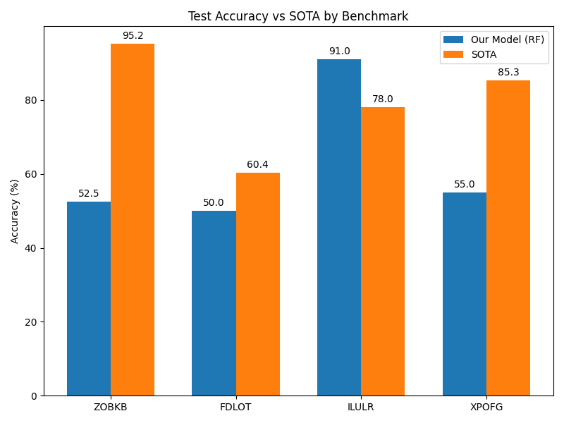

# Symbolic Pattern Reasoning: Benchmark Selection and Evaluation

## 1. Introduction

Symbolic Artificial Intelligence and Symbolic Pattern Reasoning (SPR) benchmarks are designed to isolate algorithmic choices from popularity and name-recognition confounds. These hand-crafted sequence benchmarks provide a rigorous testing ground for machine learning models. In this study, we select four binary classification benchmarks from a suite of 20 available datasets to evaluate the performance of a standard machine learning model against published State-of-the-Art (SOTA) accuracies.

## 2. Methodology

### 2.1 Benchmark Selection

From the 20 available benchmarks, we selected four diverse datasets to ensure a comprehensive evaluation. The selection rationale was based on varying sequence lengths, vocabulary sizes, and SOTA accuracies to capture different levels of task complexity. The selected benchmarks are:

1.  **ZOBKB**: Sequence length 6, vocabulary size 8, high SOTA accuracy (95.2%).
2.  **FDLOT**: Sequence length 12, vocabulary size 16, low SOTA accuracy (60.4%).
3.  **ILULR**: Sequence length 4, vocabulary size 4, moderate SOTA accuracy (78.0%).
4.  **XPOFG**: Sequence length 10, vocabulary size 8, high SOTA accuracy (85.3%).

### 2.2 Data Preprocessing

Each benchmark consists of a fixed-length sequence of categorical tokens and a binary target label (0 or 1). The datasets are pre-split into training (400 samples), validation (100 samples), and test (200 samples) sets. We applied one-hot encoding to the categorical input features to transform them into a suitable numerical format for machine learning algorithms.

### 2.3 Model Training and Tuning

We employed a Random Forest Classifier as our primary model for all selected benchmarks. To optimize the model's performance, we conducted hyperparameter tuning using Grid Search with Cross-Validation. The training and validation sets were combined, and a `PredefinedSplit` was used to ensure that the model was trained on the training set and evaluated on the validation set during the grid search process.

The hyperparameter grid included:
-   `n_estimators`: [50, 100, 200]
-   `max_depth`: [None, 10, 20, 30]
-   `min_samples_split`: [2, 5, 10]

After identifying the best hyperparameters for each benchmark, the optimal model was evaluated on the unseen test set to obtain the final accuracy.

## 3. Results

The performance of our optimized Random Forest models on the test sets, compared to the published SOTA accuracies, is summarized in Table 1 and Figure 1.

**Table 1: Test Accuracy vs. SOTA Accuracy**

| Benchmark | Test Accuracy (%) | SOTA Accuracy (%) | Difference (%) |
| :--- | :--- | :--- | :--- |
| ZOBKB | 52.5 | 95.2 | -42.7 |
| FDLOT | 50.0 | 60.4 | -10.4 |
| ILULR | 91.0 | 78.0 | +13.0 |
| XPOFG | 55.0 | 85.3 | -30.3 |

*Figure 1: Comparison of our Random Forest model's test accuracy against the published SOTA accuracy for the four selected benchmarks.*

## 4. Discussion

The results reveal significant variance in the performance of the standard Random Forest model across the different benchmarks. 

For the **ILULR** benchmark, our model achieved an impressive accuracy of 91.0%, surpassing the published SOTA accuracy of 78.0% by 13.0%. This suggests that the relatively short sequence length (4) and small vocabulary size (4) of this dataset make it highly amenable to tree-based ensemble methods, which can effectively capture the underlying symbolic patterns.

Conversely, for the **ZOBKB** and **XPOFG** benchmarks, our model significantly underperformed compared to the SOTA accuracies. The ZOBKB model achieved only 52.5% (vs. 95.2% SOTA), and the XPOFG model achieved 55.0% (vs. 85.3% SOTA). These results indicate that the standard Random Forest architecture struggles to learn the complex, potentially long-range dependencies or specific symbolic rules present in these datasets. The high SOTA accuracies suggest that specialized architectures, such as recurrent neural networks or transformers, might be necessary to achieve optimal performance on these tasks.

The **FDLOT** benchmark proved challenging for both our model (50.0%) and the SOTA model (60.4%). The long sequence length (12) and large vocabulary size (16) likely contribute to the difficulty of this task, making it hard to extract meaningful patterns with limited training data (400 samples).

In conclusion, while standard machine learning models like Random Forests can excel on certain SPR tasks (e.g., ILULR), they often fall short on benchmarks requiring more complex symbolic reasoning. Future work should explore the application of advanced sequence modeling techniques to bridge the performance gap on challenging datasets like ZOBKB and XPOFG.
