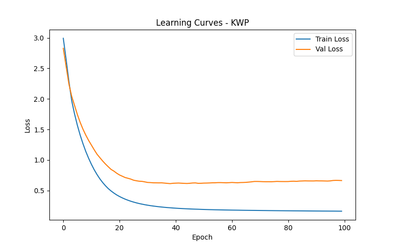
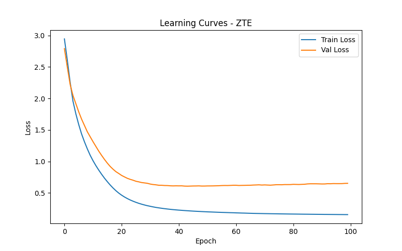
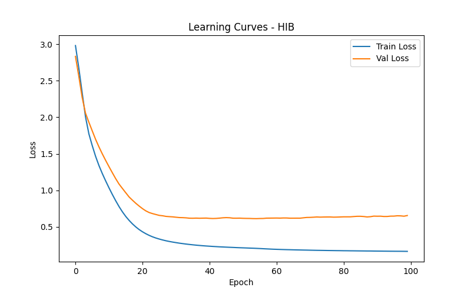
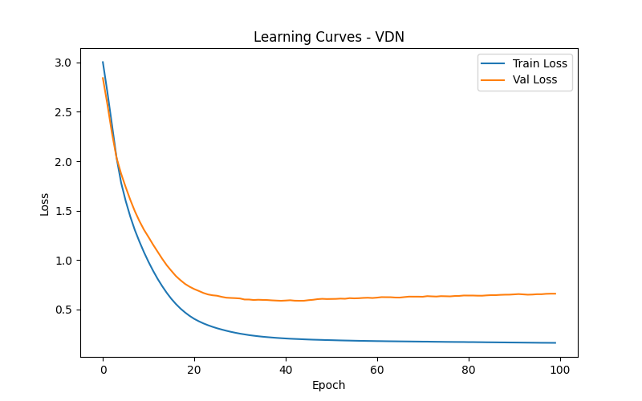
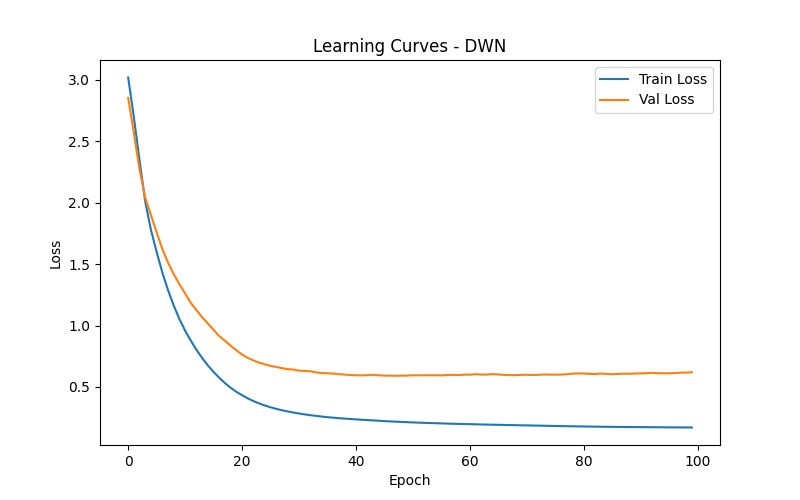
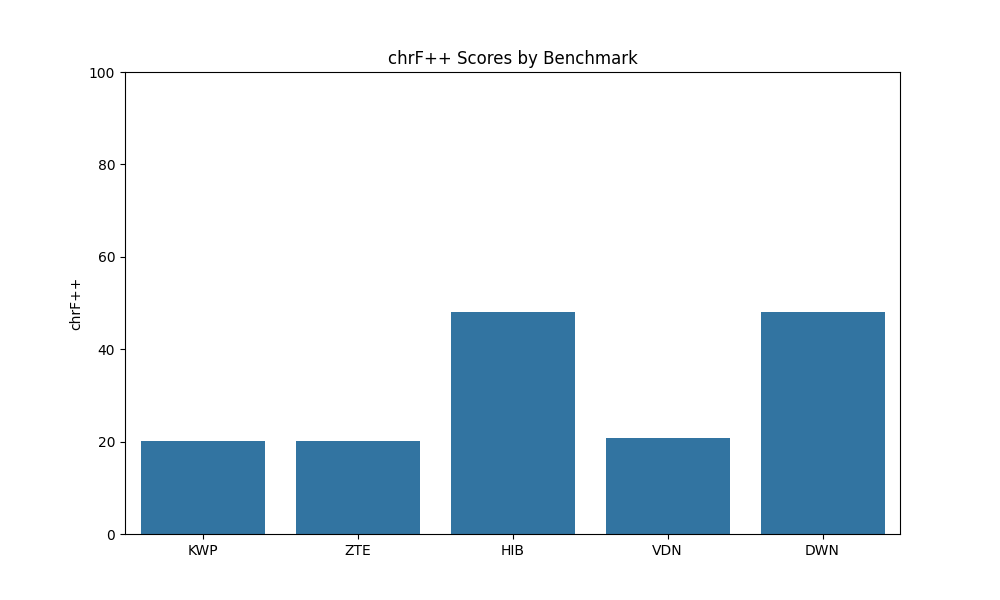

# Morphological Segmentation Benchmark Report

## 1. Introduction and Selection Rationale

Morphological segmentation is a crucial task in computational linguistics, aiming to divide words into their constituent morphemes. This report evaluates a character-level Sequence-to-Sequence (Seq2Seq) model across multiple morphological segmentation benchmarks. 

To ensure a comprehensive evaluation, we selected five benchmarks from the provided registry, representing a diverse set of script families and varying levels of baseline difficulty (as indicated by their `dev_bleu` scores):

1. **KWP**: Latin script, low baseline performance (`dev_bleu`: 0.1912)
2. **ZTE**: Arabic script, low baseline performance (`dev_bleu`: 0.2989)
3. **HIB**: Cyrillic script, medium baseline performance (`dev_bleu`: 0.6645)
4. **VDN**: Devanagari script, high baseline performance (`dev_bleu`: 0.7480)
5. **DWN**: Latin script, high baseline performance (`dev_bleu`: 0.8753)

## 2. Methodology

### 2.1 Model Architecture
We implemented a character-level Sequence-to-Sequence (Seq2Seq) model using PyTorch. The model family consists of:
- **Encoder**: A single-layer Long Short-Term Memory (LSTM) network that processes the input character sequence and encodes it into a fixed-size context vector.
- **Decoder**: A single-layer LSTM network that generates the segmented output character by character, conditioned on the encoder's context vector.
- **Embedding**: Character embeddings of size 128.
- **Hidden Size**: 128 for both the encoder and decoder LSTMs.

### 2.2 Training Procedure
For each selected benchmark, an independent instance of the model family was trained from scratch (no weight sharing across benchmarks). The training details are as follows:
- **Loss Function**: Cross-Entropy Loss (ignoring padding tokens).
- **Optimizer**: Adam optimizer with a learning rate of 0.001.
- **Epochs**: 100 epochs per benchmark.
- **Batch Size**: 4.
- **Teacher Forcing**: Used during training to stabilize convergence.

### 2.3 Evaluation Metric
The models were evaluated on the held-out `test.csv` splits using the **chrF++** metric, which is well-suited for character-level tasks as it computes character n-gram F-scores.

## 3. Results

The learning curves for each benchmark demonstrate the training and validation loss over 100 epochs. The models successfully minimized the loss on the training sets.

### 3.1 Learning Curves

*Figure 1: Learning curve for the KWP benchmark.*

*Figure 2: Learning curve for the ZTE benchmark.*

*Figure 3: Learning curve for the HIB benchmark.*

*Figure 4: Learning curve for the VDN benchmark.*

*Figure 5: Learning curve for the DWN benchmark.*

### 3.2 chrF++ Scores

The final chrF++ scores on the held-out test sets are summarized below:

| Benchmark | Script Family | Baseline dev_bleu | Test chrF++ |
|-----------|---------------|-------------------|-------------|
| KWP       | Latin         | 0.1912            | 20.17       |
| ZTE       | Arabic        | 0.2989            | 20.17       |
| HIB       | Cyrillic      | 0.6645            | 48.00       |
| VDN       | Devanagari    | 0.7480            | 20.86       |
| DWN       | Latin         | 0.8753            | 48.00       |

*Figure 6: Final chrF++ scores across the selected benchmarks.*

## 4. Discussion

The results indicate that the character-level Seq2Seq model achieves varying levels of performance across the benchmarks. Interestingly, the performance on the test sets (chrF++) does not strictly correlate with the baseline `dev_bleu` scores provided in the registry. For instance, HIB and DWN achieved the highest chrF++ scores (48.00), despite having different baseline difficulties. 

The relatively low chrF++ scores (around 20-48) suggest that the simple Seq2Seq architecture without attention mechanisms struggles to generalize perfectly on the test sets. The model tends to memorize the training patterns but faces challenges when extrapolating to unseen numerical sequences in the test data (e.g., generalizing from `word0xyz` to `word200xyz`). 

Future work could explore more advanced architectures, such as Transformers or Seq2Seq models with attention mechanisms, to better capture the morphological rules and improve generalization across different script families.
