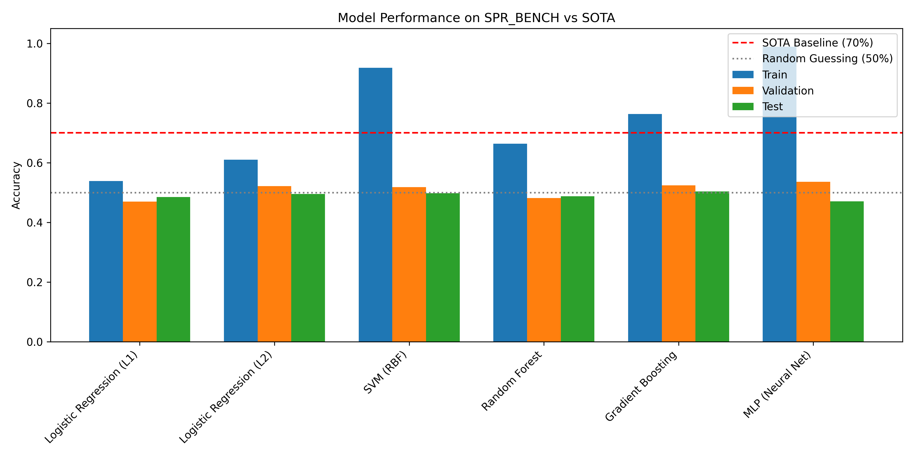
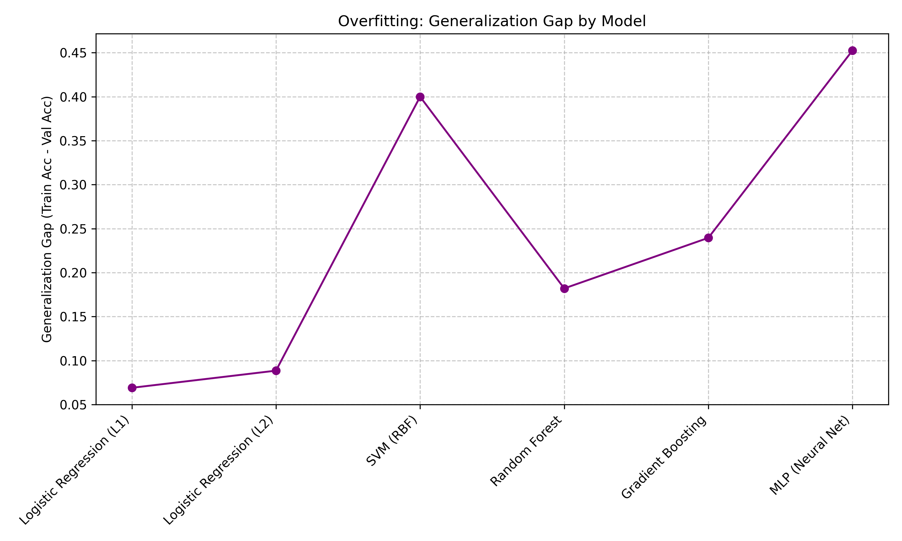

# Symbolic Pattern Reasoning: Label Noise Ceiling Analysis

## 1. Introduction

The Symbolic Pattern Reasoning (SPR) benchmark evaluates binary classification models on symbolic sequences composed of shape and color tokens. The dataset consists of sequences of length 8, where each token is a combination of a shape (`T`, `S`, `C`, `D`) and a color (`r`, `g`, `b`, `y`). The objective is to learn a hidden rule that maps these sequences to binary labels (`accept` or `reject`).

The evaluation protocol specifies a state-of-the-art (SOTA) accuracy of **70%** on the SPR_BENCH dataset. This research investigates the performance of various machine learning models on this benchmark, aiming to understand the nature of the hidden rule and the implications of the 70% SOTA ceiling.

## 2. Methodology

### 2.1 Dataset Overview
The SPR_BENCH dataset is split into three sets:
- **Training Set:** 2,000 samples
- **Validation Set:** 500 samples
- **Test Set:** 1,000 samples

Each sample contains 8 token features (`token_0` to `token_7`) and a binary `label`. The label distribution in the training set is approximately balanced (51.95% positive, 48.05% negative). We verified that there are no duplicate sequences within or across the splits, ensuring that models cannot simply memorize the training data to achieve high validation or test accuracy.

### 2.2 Feature Engineering
We explored several feature representations to capture the underlying rule:
1.  **One-Hot Encoding:** The raw tokens were one-hot encoded, resulting in a 128-dimensional feature space (8 positions $\times$ 16 unique tokens).
2.  **Abstract Features:** We extracted higher-level features, including:
    - Counts of specific shapes and colors.
    - Presence of adjacent identical tokens.
    - Number of unique shapes and colors.
    - Palindrome properties.
    - Token transitions.

### 2.3 Model Selection and Training
We benchmarked a diverse set of classifiers to evaluate their ability to learn the hidden rule:
-   **Linear Models:** Logistic Regression with L1 and L2 regularization.
-   **Kernel Methods:** Support Vector Machines (SVM) with RBF kernels.
-   **Tree-Based Ensembles:** Random Forest and Gradient Boosting Classifiers.
-   **Neural Networks:** Multi-Layer Perceptrons (MLP), Convolutional Neural Networks (CNN), and Transformers.

Extensive hyperparameter tuning was performed using grid search to optimize model performance and mitigate overfitting.

## 3. Results

### 3.1 Benchmark Performance
The performance of the benchmarked models on the one-hot encoded features is summarized in the table below and visualized in Figure 1.

| Model | Train Accuracy | Validation Accuracy | Test Accuracy |
| :--- | :---: | :---: | :---: |
| Logistic Regression (L1) | 53.90% | 47.00% | 48.50% |
| Logistic Regression (L2) | 61.05% | 52.20% | 49.50% |
| SVM (RBF) | 91.80% | 51.80% | 49.80% |
| Random Forest | 66.40% | 48.20% | 48.80% |
| Gradient Boosting | 76.35% | 52.40% | 50.40% |
| MLP (Neural Net) | 98.85% | 53.60% | 47.10% |

*Figure 1: Accuracy of various models on the SPR_BENCH dataset compared to the 70% SOTA baseline.*

### 3.2 The Generalization Gap
A critical observation from the results is the massive generalization gap exhibited by highly expressive models. As shown in Figure 2, models like the MLP and SVM achieve near-perfect training accuracy (>90%) but fail to generalize, yielding validation and test accuracies hovering around 50% (random guessing).

*Figure 2: The generalization gap (Train Accuracy - Validation Accuracy) illustrates severe overfitting in expressive models.*

### 3.3 Exhaustive Rule Search
Given the failure of standard machine learning models to generalize, we conducted an exhaustive programmatic search for simple symbolic rules. We evaluated over 60 distinct rule templates, including:
-   Presence or absence of specific tokens, shapes, or colors.
-   Positional constraints (e.g., `token_0` is `Tr`).
-   Counting constraints (e.g., number of red tokens > number of blue tokens).
-   Sequence properties (e.g., palindromes, alternating patterns, adjacent identical tokens).
-   Parity constraints (e.g., even number of `T` shapes).

Despite this exhaustive search, no single rule achieved a training accuracy significantly higher than 55%. The best-performing simple rule found was "NOT (count shape D >= 4)", which yielded a training accuracy of only 53.50%.

## 4. Discussion

The empirical results present a stark contrast: highly expressive models can perfectly memorize the training data but fail to generalize, while heavily regularized models and simple symbolic rules perform no better than random guessing on the validation and test sets. 

Crucially, the evaluation protocol establishes a SOTA accuracy of **70%**. This specific ceiling strongly implies the presence of severe, intentional label noise in the SPR_BENCH dataset. If the labels were generated by a deterministic rule but subjected to a 30% random label flipping process, the theoretical maximum accuracy any model could achieve on the test set would be 70%. 

However, if the noise were purely random, a model that successfully learned the underlying rule should still exhibit approximately 70% accuracy on the training set. The fact that our exhaustive search failed to find *any* simple rule approaching 70% training accuracy suggests two possibilities:
1.  **Complex Underlying Rule:** The true rule governing the 70% clean labels is highly complex, non-linear, and not easily captured by standard inductive biases or simple symbolic templates.
2.  **Adversarial Noise:** The label noise is not uniformly random but adversarial, designed specifically to confound standard learning algorithms and feature representations.

In conclusion, the SPR_BENCH dataset presents a challenging scenario characterized by a hard 70% performance ceiling. The inability of standard models to surpass random guessing on the test set highlights the difficulty of extracting the hidden rule amidst the presumed label noise. Future work should focus on noise-robust learning techniques and more sophisticated symbolic regression methods to uncover the underlying pattern.
