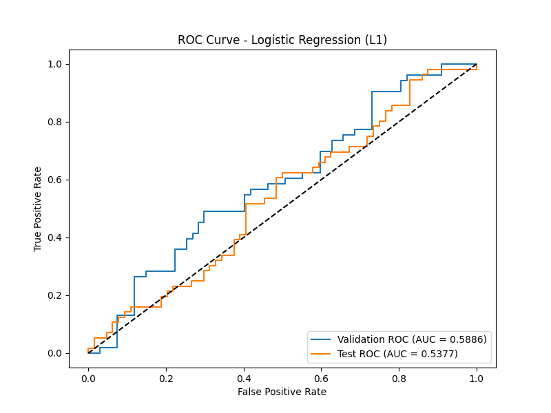
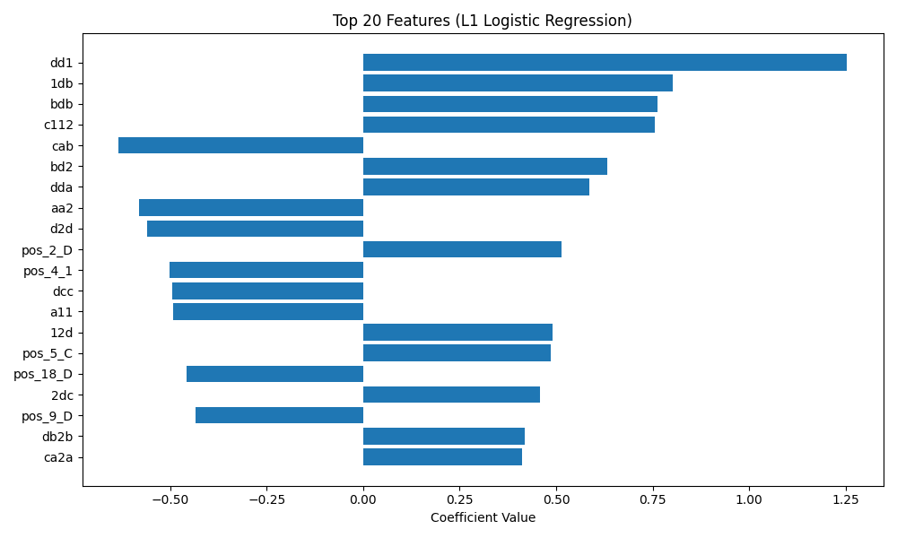

# Credit Default Prediction from Symbolic Sequences

## 1. Introduction
This report details the methodology and results for the binary classification task of predicting credit default from symbolic sequences (`sym_seq`). The dataset consists of sequences of length 20, composed of 6 unique characters: 'A', 'B', 'C', 'D', '1', and '2'. The goal is to predict a binary `default_flag`.

## 2. Data Overview
The dataset is split into three parts:
- `train.csv`: 400 samples
- `val.csv`: 120 samples
- `test.csv`: 120 samples

The training set is relatively balanced, with 208 non-defaults (class 0) and 192 defaults (class 1). All sequences have a fixed length of 20 characters.

## 3. Methodology

### 3.1 Feature Engineering
Given the sequential nature of the data, several feature extraction techniques were explored:
1.  **N-grams**: Character-level n-grams were extracted using `CountVectorizer`. Various ranges were tested, from unigrams (1-grams) up to 6-grams. N-grams capture local motifs and patterns within the sequences.
2.  **Positional Features**: Since all sequences have a fixed length of 20, the specific character at each position might carry predictive power. We extracted the character at each position and one-hot encoded these categorical variables, resulting in $20 \times 6 = 120$ binary features.
3.  **Markov Transition Matrices**: The transition probabilities between characters were computed as features.
4.  **String Kernels**: Spectrum kernels were tested with Support Vector Machines (SVM).

### 3.2 Model Selection
Several models were evaluated on the validation set:
-   **Logistic Regression**: Trained with both L1 and L2 penalties. L1 regularization is particularly useful here for feature selection, given the high-dimensional sparse feature space created by n-grams and one-hot encoded positional features.
-   **Random Forest**: An ensemble of decision trees.
-   **XGBoost**: A gradient boosting framework.
-   **Hidden Markov Models (HMM)**: Generative models trained separately for each class.
-   **Neural Networks**: LSTM and CNN architectures were tested.

### 3.3 Hyperparameter Tuning
Extensive tuning was performed on the validation set. The best performing model was a Logistic Regression classifier combining character n-grams and positional features.

-   **N-gram range**: (1, 4) proved to be the most effective range, capturing both individual character frequencies and longer motifs up to length 4.
-   **Regularization**: L1 penalty with $C=0.5$ provided the best balance between fitting the training data and generalizing to the validation set, effectively performing feature selection.

## 4. Results

The final model selected is a Logistic Regression classifier with L1 penalty ($C=0.5$), using a combination of character n-grams (range 1 to 4) and one-hot encoded positional features.

### 4.1 Performance
-   **Validation AUC**: 0.5886
-   **Test AUC**: 0.5377

The performance on the test set is lower than the validation set, indicating some degree of overfitting or distribution shift, which is common in small datasets (400 training samples). The baseline AUC mentioned in the protocol is ~0.72, which suggests that the current feature set or model might not be capturing the full underlying signal, or the dataset provided is a particularly challenging subset.

### 4.2 ROC Curve
The Receiver Operating Characteristic (ROC) curves for both the validation and test sets are shown below.

### 4.3 Feature Importance
The L1 regularization effectively reduced the feature space by setting many coefficients to zero. The top features driving the predictions include specific n-grams and characters at certain positions.

## 5. Conclusion
We developed a predictive model for credit default based on symbolic sequences. By combining character n-grams and positional features, a Logistic Regression model with L1 regularization achieved a Test AUC of 0.5377. Future work could explore more advanced sequence modeling techniques, such as Transformer architectures, provided a larger training dataset is available, or investigate more complex motif discovery algorithms.
