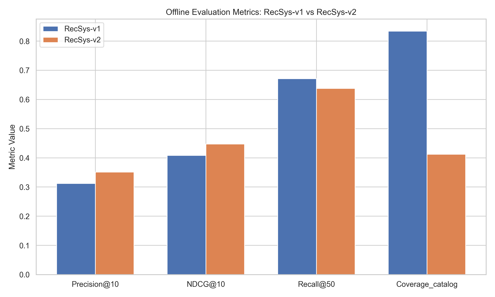
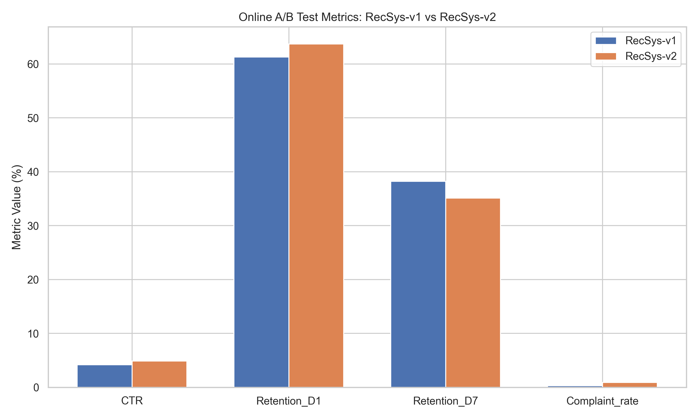
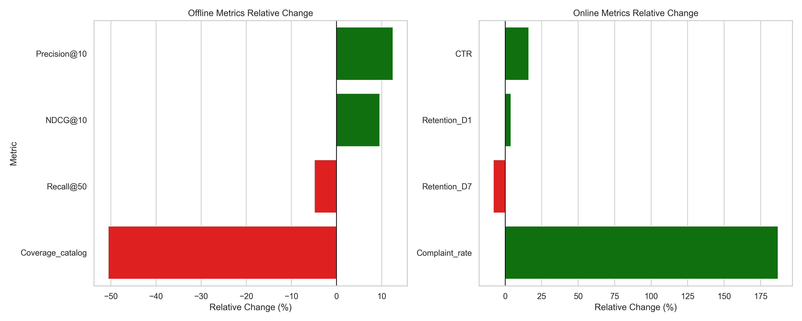

# Recommendation System Launch Evaluation: RecSys-v1 vs RecSys-v2

## 1. Executive Summary

This report evaluates the proposed launch of a new recommendation system model, **RecSys-v2**, to replace the current production model, **RecSys-v1**. The evaluation is based on a combination of offline held-out test set metrics ($n=200,000$) and a 14-day online A/B test (10% traffic per arm).

**Recommendation: DO NOT LAUNCH RecSys-v2.**

While RecSys-v2 demonstrates strong improvements in short-term engagement metrics (CTR, Day-1 Retention) and top-k ranking quality (Precision@10, NDCG@10), these gains come at a severe cost to long-term platform health and user satisfaction. Specifically, RecSys-v2 exhibits a drastic reduction in catalog coverage (-50.6%), a significant drop in Day-7 retention (-8.1%), and an alarming increase in user complaints (+187.0%). These signals strongly suggest that RecSys-v2 is optimizing for short-term clicks at the expense of long-term user experience, likely by surfacing clickbait, controversial, or highly popular items while ignoring niche content.

## 2. Methodology

The evaluation framework consists of two phases:

1.  **Offline Evaluation:** The models were evaluated on a held-out test set of 200,000 interactions. Metrics measured include Precision@10, NDCG@10, Recall@50, and Catalog Coverage. These metrics assess the models' ability to rank relevant items highly and their propensity to recommend a diverse set of items.
2.  **Online A/B Testing:** A 14-day online experiment was conducted, routing 10% of user traffic to each model. Key performance indicators (KPIs) measured include Click-Through Rate (CTR), Day-1 Retention, Day-7 Retention, and Complaint Rate. These metrics capture real-world user behavior, engagement, and satisfaction.

## 3. Results

### 3.1 Offline Evaluation Results

The offline evaluation reveals a trade-off between top-k accuracy and catalog diversity.

| Metric | RecSys-v1 | RecSys-v2 | Relative Change (%) |
| :--- | :--- | :--- | :--- |
| Precision@10 | 0.312 | 0.351 | +12.5% |
| NDCG@10 | 0.408 | 0.447 | +9.6% |
| Recall@50 | 0.671 | 0.638 | -4.9% |
| Coverage_catalog | 0.834 | 0.412 | -50.6% |

*   **Strengths of v2:** RecSys-v2 significantly outperforms v1 in top-k ranking metrics, with a 12.5% increase in Precision@10 and a 9.6% increase in NDCG@10. This indicates that the items placed at the very top of the recommendation list are more likely to be relevant to the user.
*   **Weaknesses of v2:** The model suffers a massive 50.6% drop in catalog coverage, meaning it recommends less than half the unique items compared to v1. This is a strong indicator of popularity bias (the "Harry Potter effect"), where the model repeatedly recommends the same popular items to everyone. Furthermore, Recall@50 drops by 4.9%, suggesting that while the top 10 items are better, the overall quality of the top 50 items is worse.

### 3.2 Online A/B Test Results

The online metrics mirror the offline findings, showing short-term gains but long-term degradation.

| Metric | RecSys-v1 (%) | RecSys-v2 (%) | Relative Change (%) |
| :--- | :--- | :--- | :--- |
| CTR | 4.21 | 4.89 | +16.2% |
| Retention_D1 | 61.3 | 63.7 | +3.9% |
| Retention_D7 | 38.2 | 35.1 | -8.1% |
| Complaint_rate | 0.31 | 0.89 | +187.0% |

*   **Short-term Gains:** RecSys-v2 drives a substantial 16.2% increase in CTR and a 3.9% increase in Day-1 retention. Users are clicking more on the immediate recommendations.
*   **Long-term Degradation:** Despite the initial engagement, Day-7 retention drops by 8.1%. This indicates that the initial clicks do not translate into sustained user value; users are churning at a higher rate after a week.
*   **User Dissatisfaction:** Most alarmingly, the complaint rate nearly triples, increasing by 187.0% (from 0.31% to 0.89%). This suggests that the recommended content, while clickable, is ultimately unsatisfactory, offensive, or misleading (e.g., clickbait).

### 3.3 Combined Relative Change Analysis

The following chart visualizes the relative changes across all metrics, highlighting the stark contrast between the positive short-term/top-k metrics and the negative long-term/diversity metrics.

## 4. Discussion and Conclusion

The data presents a classic case of a recommendation system optimizing for proxy metrics (clicks, top-k relevance) at the expense of the true objective (long-term user satisfaction and platform health).

1.  **The Clickbait/Popularity Trap:** The combination of high CTR, high Precision@10, low catalog coverage, and high complaint rates strongly implies that RecSys-v2 is surfacing highly popular, potentially sensationalist, or clickbait content. Users click on these items (driving up CTR and Precision@10), but the content does not provide lasting value, leading to increased complaints and lower long-term retention.
2.  **Filter Bubbles and Homogenization:** The 50.6% drop in catalog coverage means the platform is effectively shrinking for the user. Niche interests are being ignored in favor of broad appeal. This homogenization of content is a primary driver of the Day-7 retention drop, as users quickly exhaust the narrow pool of recommended items and lose interest in the platform.
3.  **Goodhart's Law in Action:** "When a measure becomes a target, it ceases to be a good measure." RecSys-v2 appears to have overfit to short-term engagement signals. While it "wins" on CTR and NDCG, it fails on the holistic user experience.

**Final Decision:** RecSys-v2 should **not** be launched. The engineering and data science teams should investigate the objective function and training data of RecSys-v2 to mitigate its popularity bias and penalize clickbait. Future iterations must incorporate diversity constraints (e.g., penalizing low catalog coverage) and optimize for long-term rewards rather than immediate clicks.
