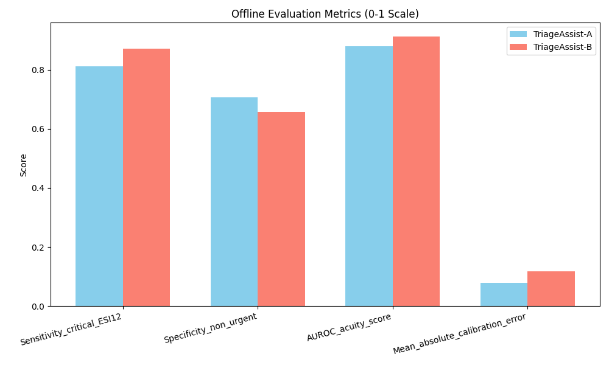
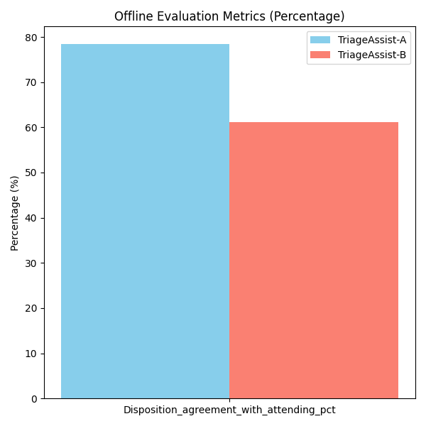
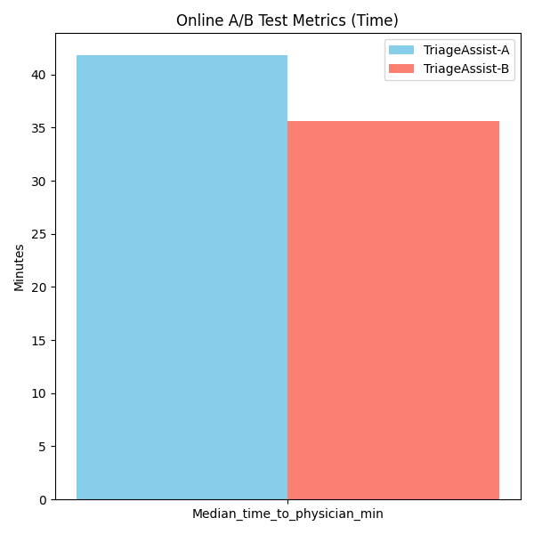
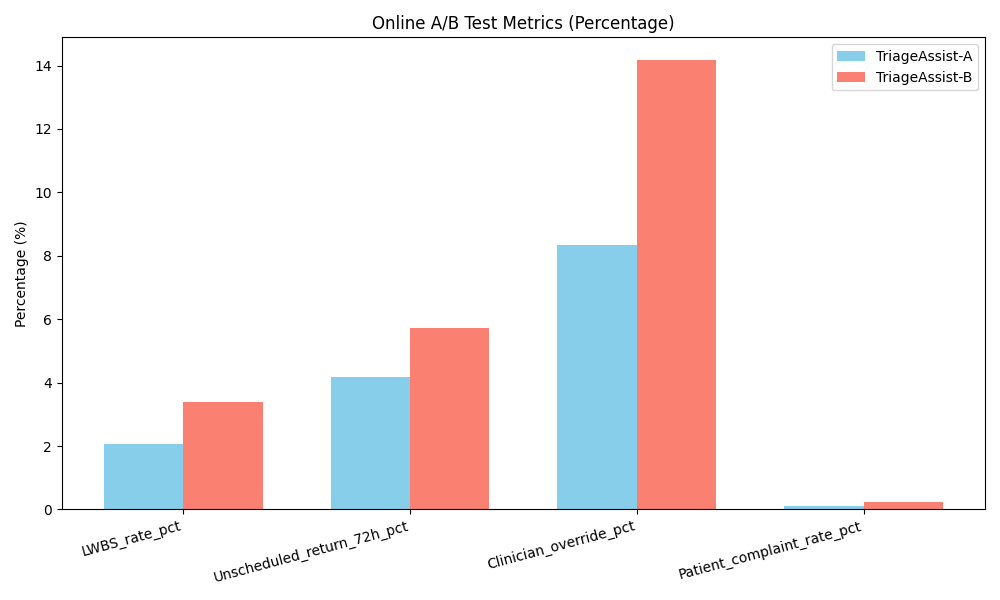
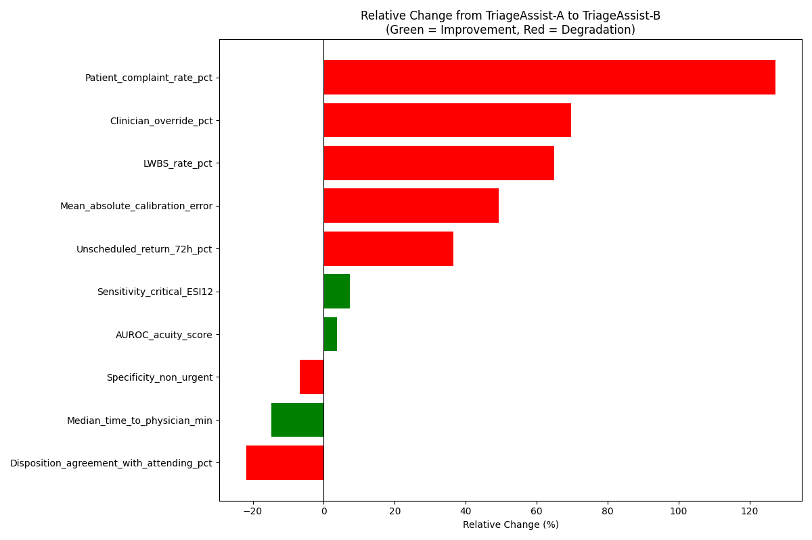

# Evaluation of TriageAssist-B vs. TriageAssist-A for Emergency Department Triage

## Executive Summary
This report presents the evaluation of a new candidate Emergency Department (ED) triage model, **TriageAssist-B**, compared to the current production model, **TriageAssist-A**. The evaluation consists of an offline retrospective analysis on a held-out test set (n=8,000) and a 14-day randomized online pilot deployment. 

While TriageAssist-B demonstrates improved sensitivity for critical patients and reduces the median time to physician, it exhibits significant degradations across multiple safety, operational, and user-acceptance metrics. Notably, clinician overrides, Left Without Being Seen (LWBS) rates, unscheduled returns, and patient complaints all increased substantially during the online pilot. Based on these findings, we **do not recommend** expanding TriageAssist-B at this time.

## Methodology

The evaluation was conducted in two phases:

1.  **Offline Evaluation:** A retrospective chart-review analysis was performed on a held-out test set of 8,000 patient encounters. Metrics evaluated include sensitivity for critical patients (ESI levels 1 and 2), specificity for non-urgent patients, Area Under the Receiver Operating Characteristic curve (AUROC) for the acuity score, mean absolute calibration error, and disposition agreement with the attending physician.
2.  **Online A/B Test Pilot:** A 14-day pilot was conducted across the same hospital sites, randomized by shift. During this period, either TriageAssist-A or TriageAssist-B was active. Operational and clinical metrics were tracked, including median time to physician, LWBS rate, 72-hour unscheduled return rate, clinician override rate, and patient complaint rate.

## Results

### Offline Evaluation

The offline evaluation reveals a mixed performance profile for TriageAssist-B.

*   **Improvements:** TriageAssist-B shows a 7.3% relative improvement in sensitivity for critical patients (ESI 1/2), increasing from 0.812 to 0.871. The overall AUROC for the acuity score also improved slightly by 3.7% (0.881 to 0.914).
*   **Degradations:** The model's specificity for non-urgent patients decreased by 6.8% (0.706 to 0.658). More concerningly, the mean absolute calibration error increased by 49.4% (0.079 to 0.118), indicating the model's predicted probabilities are less reliable. Furthermore, the disposition agreement with attending physicians dropped significantly by 21.9% (78.4% to 61.2%).

### Online A/B Test Pilot

The 14-day online pilot highlighted severe operational and clinical issues with TriageAssist-B, despite one positive outcome.

*   **Improvements:** The median time to physician decreased by 14.8%, dropping from 41.8 minutes to 35.6 minutes.
*   **Degradations:** All other tracked metrics worsened significantly under TriageAssist-B:
    *   **Clinician Overrides:** Increased by 69.8% (from 8.35% to 14.18%), corroborating the offline finding of reduced agreement with attending physicians.
    *   **LWBS Rate:** Increased by 64.9% (from 2.05% to 3.38%).
    *   **Unscheduled Returns (72h):** Increased by 36.6% (from 4.18% to 5.71%), a critical safety indicator suggesting inappropriate initial triage or discharge.
    *   **Patient Complaints:** Increased by 127.3% (from 0.11% to 0.25%).

### Summary of Relative Changes

The following chart summarizes the relative changes across all metrics, color-coded by clinical desirability (Green = Improvement, Red = Degradation).

## Discussion

The data suggests that TriageAssist-B is likely **over-triaging** patients. The increase in sensitivity for critical patients comes at the cost of decreased specificity for non-urgent patients. This over-triage behavior explains several downstream effects observed in the online pilot:

1.  **Reduced Time to Physician:** By classifying more patients as higher acuity, the median time to physician decreases because higher-acuity patients are prioritized.
2.  **Increased Overrides and Disagreement:** Clinicians are recognizing the over-triage and overriding the model's recommendations more frequently (14.18% vs 8.35%), which aligns with the lower disposition agreement seen offline.
3.  **Increased LWBS and Complaints:** While higher-acuity patients are seen faster, lower-acuity patients are likely experiencing significantly longer wait times as they are continually deprioritized. This leads to higher frustration, resulting in increased LWBS rates and patient complaints.
4.  **Increased Unscheduled Returns:** The degradation in calibration and overall accuracy (despite higher AUROC, the calibration is worse) may be leading to inappropriate care pathways or premature discharges for some patient cohorts, resulting in higher 72-hour return rates.

## Conclusion and Recommendation

While TriageAssist-B successfully identifies critical patients more often and reduces the median time to physician, the systemic negative impacts on ED operations, clinician trust, and patient safety are too severe to ignore. The significant increases in clinician overrides, LWBS rates, and unscheduled returns indicate that the model is not ready for broader clinical use.

**Recommendation:** Do not expand TriageAssist-B. The informatics and data science teams should investigate the calibration issues and the over-triage behavior before considering any future deployments of this model version. TriageAssist-A should remain the production model.
