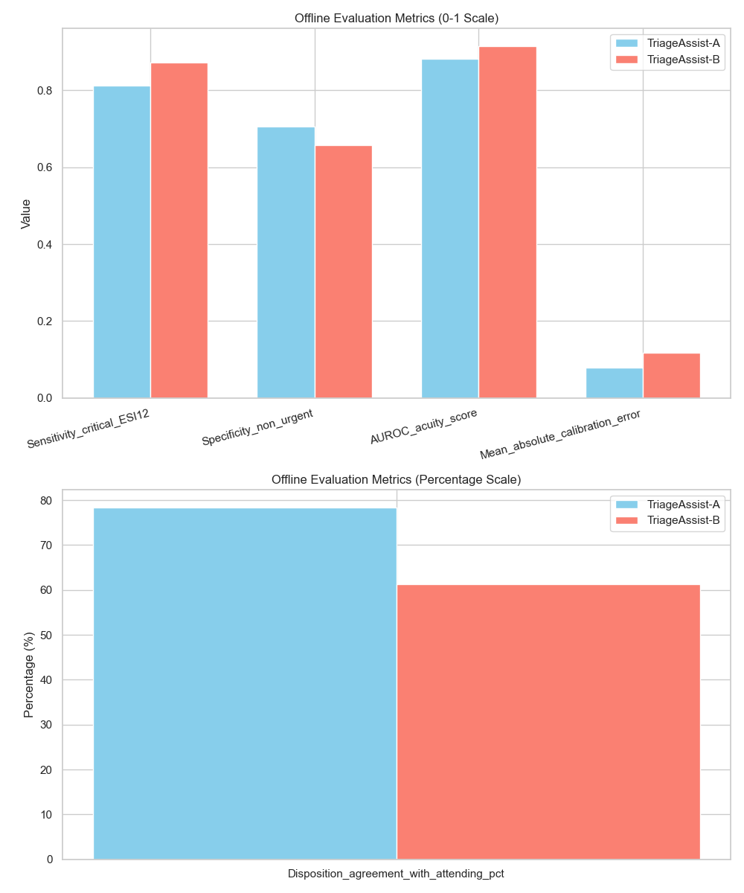
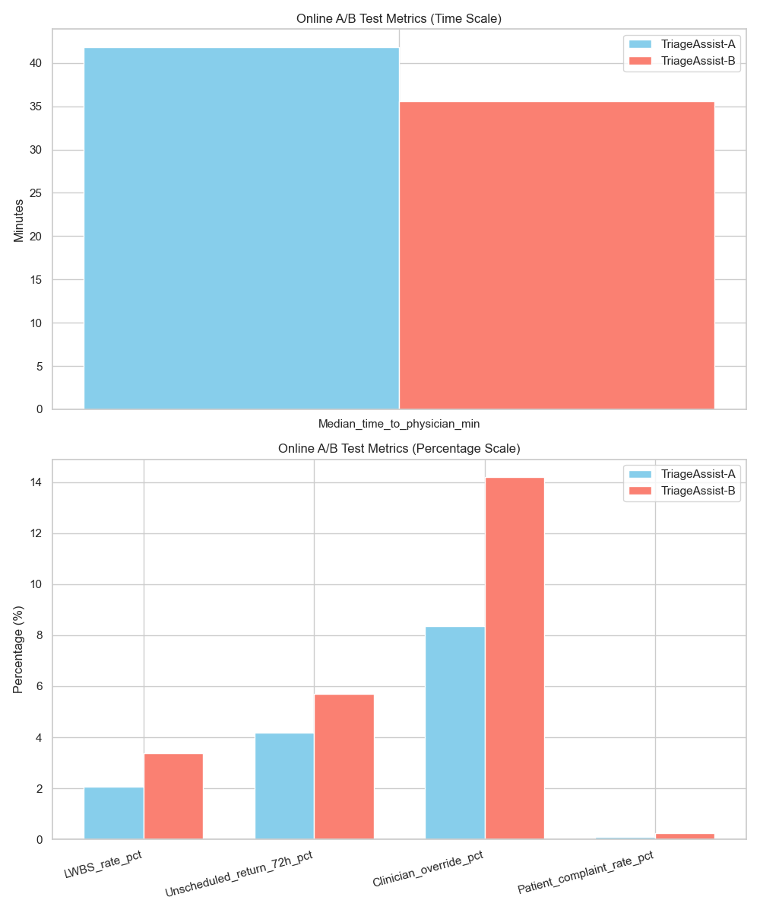
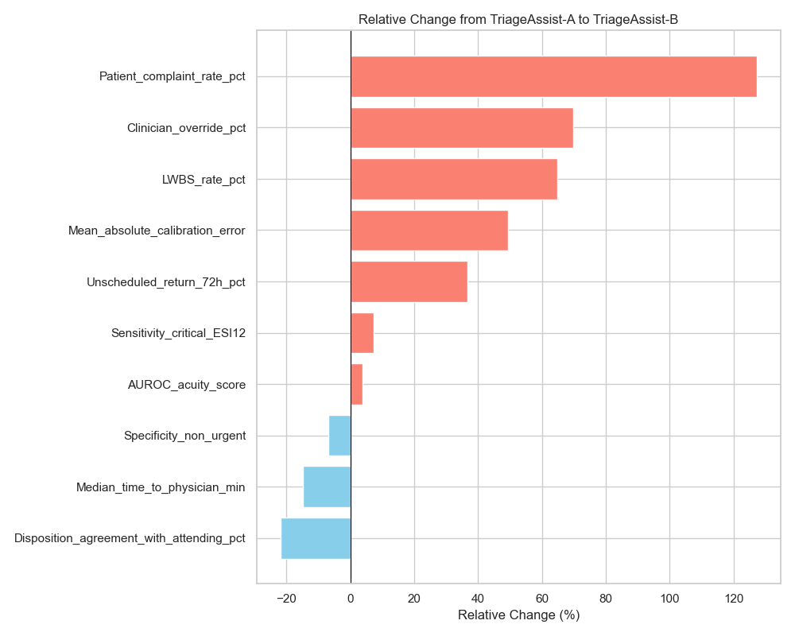

# Evaluation of TriageAssist-B: Offline and Online Pilot Analysis

## Executive Summary
This report evaluates the performance of a new candidate emergency department (ED) triage model, **TriageAssist-B**, compared to the production model, **TriageAssist-A**. The evaluation consists of an offline retrospective analysis on a held-out test set ($n=8,000$) and a 14-day randomized-by-shift online pilot deployment. 

While TriageAssist-B demonstrated improvements in certain offline discriminative metrics (e.g., AUROC and sensitivity for critical patients), it exhibited significant miscalibration. During the online pilot, this miscalibration translated into severe operational degradation, including increased Left Without Being Seen (LWBS) rates, higher 72-hour unscheduled returns, increased clinician overrides, and a surge in patient complaints. Based on these findings, we strongly recommend **against** expanding TriageAssist-B. The model requires recalibration and further refinement before any broader deployment.

## 1. Introduction
Emergency Department (ED) triage is a critical process that determines the priority of patient care based on clinical acuity. The current production model, TriageAssist-A, has been operational across hospital sites. A new candidate model, TriageAssist-B, was developed with the goal of improving triage accuracy, particularly for high-acuity patients. 

To assess the viability of replacing TriageAssist-A with TriageAssist-B, a comprehensive evaluation was conducted in two phases:
1. **Offline Evaluation:** A retrospective chart-review analysis on a held-out test set of 8,000 encounters to assess discriminative performance, calibration, and agreement with attending physicians.
2. **Online Pilot:** A 14-day A/B test randomized by shift to measure real-world operational and clinical outcomes.

## 2. Methodology

### 2.1 Offline Evaluation
The offline evaluation utilized a held-out test set of 8,000 historical ED encounters. Ground truth labels were derived from retrospective chart reviews. The metrics evaluated included:
- **Sensitivity (Critical ESI 1/2):** The model's ability to correctly identify high-acuity patients (Emergency Severity Index 1 or 2).
- **Specificity (Non-urgent):** The model's ability to correctly identify low-acuity patients.
- **AUROC (Acuity Score):** The overall discriminative power of the model's continuous acuity score.
- **Mean Absolute Calibration Error:** The average difference between predicted probabilities and observed frequencies of acuity levels.
- **Disposition Agreement with Attending (%):** The concordance between the model's recommended disposition and the final attending physician's decision.

### 2.2 Online Pilot
A 14-day online A/B test was conducted, randomizing the active triage model by shift. Operational and clinical metrics were tracked to assess the real-world impact of the models:
- **Median Time to Physician (minutes):** The median duration from patient arrival to initial physician assessment.
- **LWBS Rate (%):** The percentage of patients who Left Without Being Seen by a provider.
- **Unscheduled Return 72h (%):** The percentage of discharged patients who unexpectedly returned to the ED within 72 hours.
- **Clinician Override (%):** The frequency with which triage nurses or physicians manually overrode the model's recommendation.
- **Patient Complaint Rate (%):** The rate of formal patient complaints filed during the shift.

## 3. Results

### 3.1 Offline Evaluation Results
The offline evaluation presented a mixed picture of TriageAssist-B's performance. 

*Figure 1: Comparison of offline evaluation metrics between TriageAssist-A and TriageAssist-B.*

TriageAssist-B showed improved discriminative ability for high-acuity patients. Sensitivity for critical ESI 1/2 patients increased from 0.812 to 0.871 (+7.3%), and the overall AUROC improved from 0.881 to 0.914 (+3.7%). 

However, these gains came at a significant cost to calibration and agreement. Specificity for non-urgent patients dropped from 0.706 to 0.658 (-6.8%). More alarmingly, the Mean Absolute Calibration Error worsened by 49.4% (from 0.079 to 0.118), indicating that the model's predicted probabilities were less reliable. Consequently, the disposition agreement with attending physicians plummeted from 78.4% to 61.2% (-21.9%).

### 3.2 Online Pilot Results
The online pilot revealed severe operational issues associated with TriageAssist-B.

*Figure 2: Comparison of online operational and clinical metrics during the 14-day pilot.*

While the median time to physician decreased from 41.8 minutes to 35.6 minutes (-14.8%), all other operational metrics deteriorated significantly under TriageAssist-B:
- **LWBS Rate:** Increased from 2.05% to 3.38% (a relative increase of 64.9%).
- **Unscheduled Returns (72h):** Increased from 4.18% to 5.71% (+36.6%).
- **Clinician Overrides:** Surged from 8.35% to 14.18% (+69.8%).
- **Patient Complaints:** More than doubled, rising from 0.11% to 0.25% (+127.3%).

### 3.3 Relative Change Analysis
Figure 3 summarizes the relative percentage changes across all metrics, highlighting the stark contrast between the offline discriminative improvements and the online operational failures.

*Figure 3: Relative percentage change from TriageAssist-A to TriageAssist-B across all evaluated metrics.*

## 4. Discussion

The evaluation of TriageAssist-B highlights a classic pitfall in clinical machine learning: the disconnect between offline discriminative metrics (like AUROC) and real-world operational impact.

**The Over-Triage Hypothesis:**
The data strongly suggests that TriageAssist-B is systematically over-triaging patients. The offline increase in sensitivity for critical patients, coupled with the decrease in specificity for non-urgent patients, indicates a lower threshold for assigning high acuity. This over-triage explains the single positive online metric: the median time to physician decreased because a larger cohort of patients was likely flagged as high priority, expediting their initial assessment.

**Operational Bottlenecks and Resource Starvation:**
However, ED resources are finite. By over-triaging, TriageAssist-B likely created a bottleneck. While "critical" patients were seen faster, the artificially inflated high-acuity queue likely starved lower-acuity patients of resources, leading to drastically increased wait times for the remainder of the ED population. This resource starvation directly explains the 64.9% surge in the Left Without Being Seen (LWBS) rate and the 127.3% increase in patient complaints.

**Clinical Trust and Safety:**
The severe miscalibration (49.4% worse calibration error) eroded clinical trust. Clinicians recognized the model's inaccurate recommendations, leading to a 69.8% increase in manual overrides and a massive drop in agreement with attending physicians. Furthermore, the 36.6% increase in 72-hour unscheduled returns suggests that the model's miscalibration may have negatively impacted downstream disposition decisions, potentially leading to unsafe discharges.

## 5. Conclusion and Recommendation

While TriageAssist-B achieves a higher AUROC and better sensitivity for critical patients in a retrospective setting, its poor calibration leads to systemic over-triage. In a live ED environment, this behavior causes severe resource misallocation, resulting in higher LWBS rates, increased patient complaints, and potential safety risks (unscheduled returns).

**Recommendation:** We strongly recommend **against** the expansion or continued use of TriageAssist-B in its current state. The model must be rolled back to TriageAssist-A. Future iterations of the model must prioritize calibration and operational fairness alongside discriminative performance before any further clinical piloting is considered.
