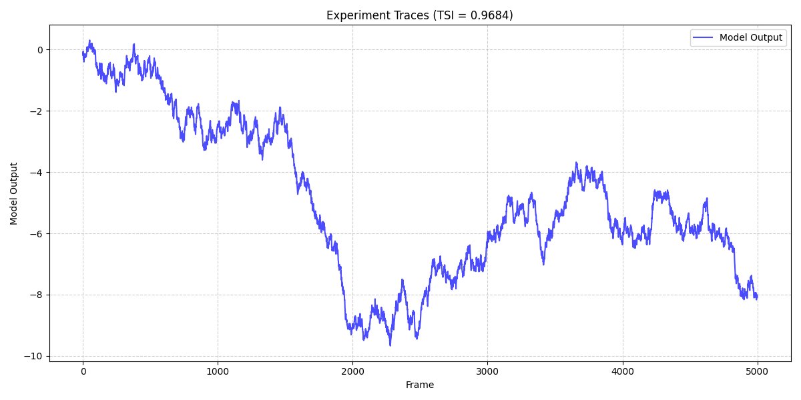
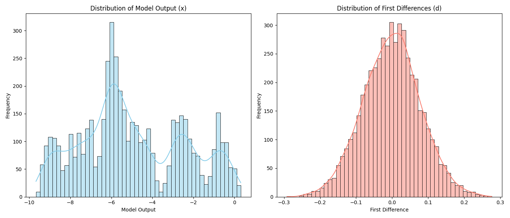

# Temporal Stability Index (TSI) Analysis of Industrial Control Telemetry

## 1. Introduction
In industrial control systems, telemetry data often consists of long traces that need to be summarized into standardized scalar metrics for reporting and monitoring. One such metric is the Temporal Stability Index (TSI), which quantifies the smoothness or stability of a time series by comparing the variance of its step-to-step changes against the overall variance of the series.

This report presents the application of the TSI to a provided experimental trace dataset (`experiment_traces.csv`).

## 2. Methodology

The dataset consists of a 1-dimensional series of model outputs ordered by frame index. Let $x$ represent this series of model outputs.

The Temporal Stability Index (TSI) is defined as follows:
1. If the series $x$ contains fewer than two samples, the TSI is defined as $1.0$.
2. Otherwise, let $d$ be the series of first differences of $x$, such that $d_i = x_{i+1} - x_i$.
3. Let $\sigma_x$ and $\sigma_d$ be the population standard deviations (with degrees of freedom `ddof=0`) of $x$ and $d$, respectively.
4. Let $\epsilon = 10^{-12}$ be a small constant to prevent division by zero.
5. The TSI is then calculated using the formula:

$$ TSI = \max\left(0, \min\left(1, 1 - \frac{\sigma_d}{\sigma_x + \epsilon}\right)\right) $$

This formula yields a value between 0 and 1. A TSI close to 1 indicates that the step-to-step variations ($\sigma_d$) are very small compared to the overall spread of the data ($\sigma_x$), implying a smooth, stable trace. Conversely, a lower TSI indicates higher high-frequency noise or volatility relative to the overall signal amplitude.

The analysis was implemented in Python using `numpy` for statistical calculations and `matplotlib`/`seaborn` for visualization.

## 3. Results

The dataset contains a continuous trace of model outputs. The calculated Temporal Stability Index (TSI) for the full series is:

**TSI = 0.9684**

### 3.1 Time Series Trace
The following figure shows the raw model output over time (frame index). The trace exhibits clear low-frequency trends and oscillations, but relatively small high-frequency noise, which is consistent with the high TSI value.

*Figure 1: Time series of the model output across all frames.* 

### 3.2 Distributions of Output and First Differences
To further understand the components of the TSI calculation, we visualize the distributions of the raw model outputs ($x$) and their first differences ($d$).

*Figure 2: (Left) Distribution of the raw model outputs $x$. (Right) Distribution of the first differences $d$.*

As seen in Figure 2, the spread of the first differences ($\sigma_d$) is significantly narrower than the spread of the raw model outputs ($\sigma_x$). This large disparity in standard deviations is the primary driver for the TSI being close to 1.0.

## 4. Discussion and Conclusion

The Temporal Stability Index (TSI) provides a concise, normalized scalar summary of the temporal smoothness of a signal. For the analyzed industrial control telemetry trace, the TSI is approximately 0.9684. 

This high value indicates that the signal is highly stable from one frame to the next. The frame-to-frame variations are minimal compared to the overall dynamic range of the signal over the entire observation period. Such a metric is highly useful for automated monitoring systems to quickly flag anomalous traces that exhibit unexpected high-frequency volatility or erratic behavior, which would result in a significantly lower TSI.
