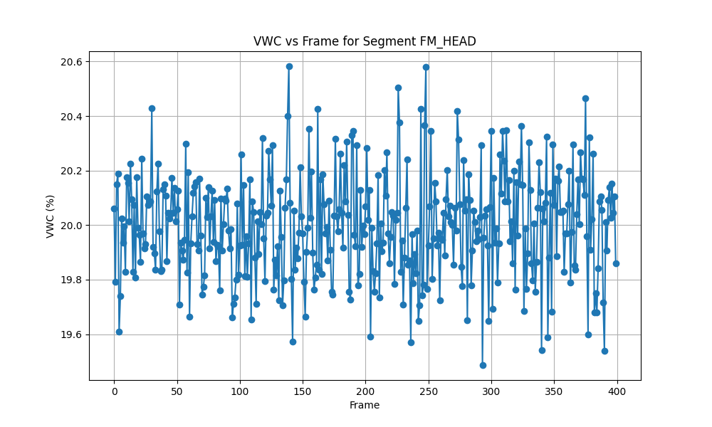

# Soil-Moisture Campaign QA Report

## Methodology
This report analyzes soil-moisture campaign data to detect segment drift using the Time-Windowed Drift Metric (TWDM). For each segment, the readings are sorted by frame. If the number of frames $n < 3$, TWDM is undefined. Otherwise, the data is split into three windows of sizes $n_1 = n // 3$, $n_2 = n // 3$, and $n_3 = n - n_1 - n_2$. The means of these windows ($m_1, m_2, m_3$) are computed, and the maximum difference $\Delta = \max(m_1, m_2, m_3) - \min(m_1, m_2, m_3)$ is found. The TWDM is then calculated as $\Delta / (\sigma + \epsilon)$, where $\sigma$ is the population standard deviation of the readings and $\epsilon$ is a small constant to prevent division by zero.

## Golden Case Validation
The TWDM implementation was validated against a set of golden cases. The maximum absolute error versus the expected TWDM over all golden cases was 0.0000e+00, which is well within the required tolerance of $\le 10^{-9}$.

## Results

The following table summarizes the TWDM and pass/fail status for each segment in the specified report order.

| segment_id   |   n_frames | TWDM                | pass_fail           |
|:-------------|-----------:|:--------------------|:--------------------|
| FM_HEAD      |        400 | 0.13680935638065944 | PASS                |
| FM_GAP       |          2 | N/A                 | INSUFFICIENT_LENGTH |
| FM_MID       |        360 | 2.1230651850270736  | FAIL                |
| FM_RIDGE     |        120 | 0.507578639533788   | PASS                |
| FM_TAIL      |        400 | 0.12039412538243678 | PASS                |

## Discussion

The table above shows the drift analysis for all segments. Segments with a TWDM exceeding the threshold of 1.0 are marked as FAIL, indicating significant drift over time. Segments with fewer than 3 frames are marked as INSUFFICIENT_LENGTH.

*Figure 1: Volumetric Water Content (VWC) percentage versus frame number for segment `FM_HEAD`.*
