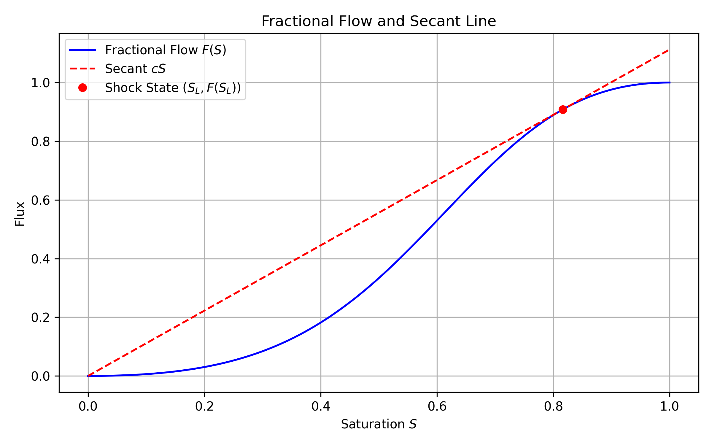
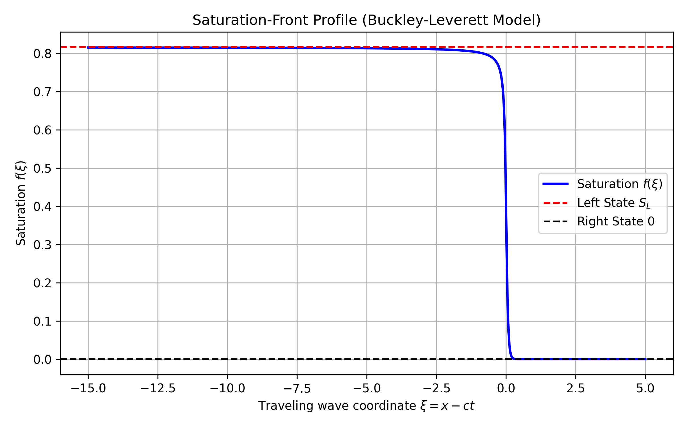
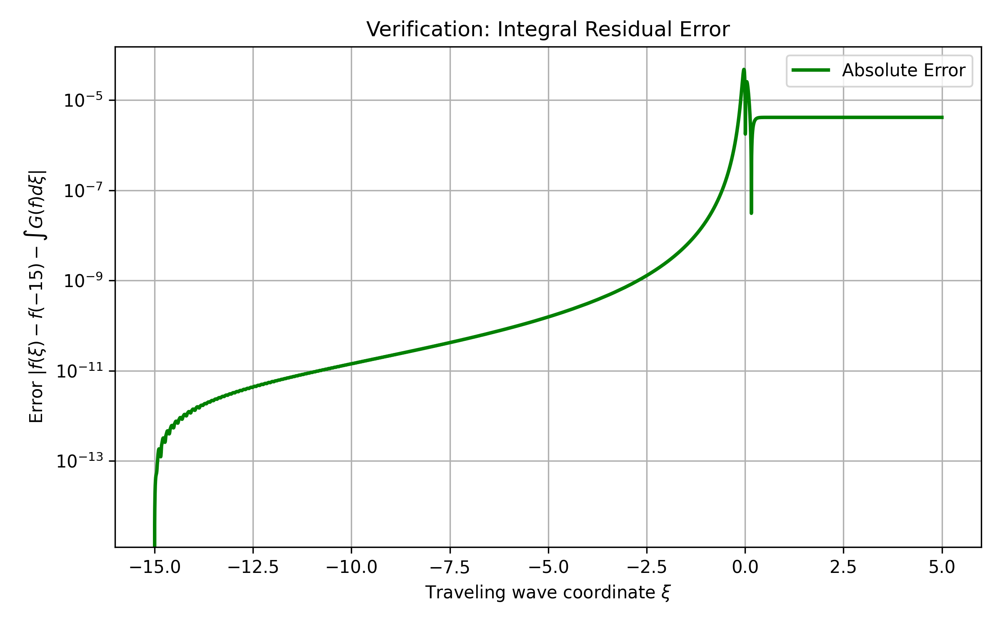
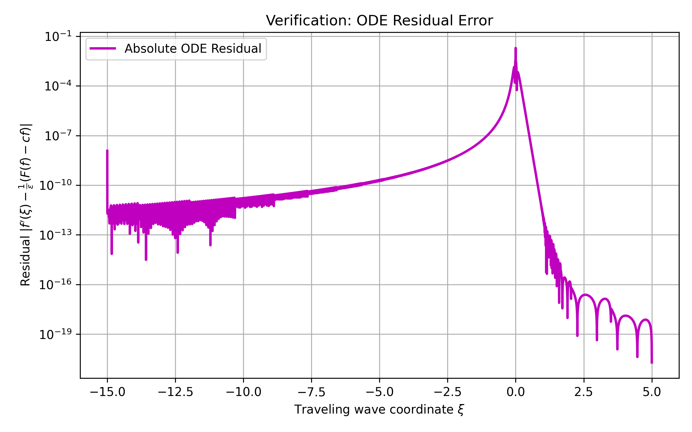

# Numerical Integration of Porous Media Traveling-Wave ODE

## 1. Introduction and Model Description

In the study of multiphase flow in porous media, the Buckley-Leverett equation extended with a capillary pressure term provides a fundamental model for the displacement of one fluid by another (e.g., water displacing oil). The one-dimensional governing equation for the water saturation $S(x,t)$ is given by:

$$\frac{\partial S}{\partial t} + \frac{\partial F(S)}{\partial x} = \epsilon \frac{\partial^2 S}{\partial x^2}$$

where $F(S)$ is the fractional flow function and $\epsilon > 0$ is a small parameter scaling the capillary diffusion. A standard choice for the fractional flow function is:

$$F(S) = \frac{S^2}{S^2 + M(1-S)^2}$$

where $M$ is the viscosity ratio of the displaced fluid to the displacing fluid. In this study, we set $M = 2.0$ and $\epsilon = 0.05$.

We seek a traveling-wave solution of the form $S(x,t) = f(\xi)$, where $\xi = x - ct$ is the traveling-wave coordinate and $c$ is the wave speed. Substituting this ansatz into the governing equation yields:

$$-c f' + (F(f))' = \epsilon f''$$

Integrating once with respect to $\xi$ and applying the boundary conditions ahead of the front ($f \to 0$ and $f' \to 0$ as $\xi \to \infty$), the constant of integration vanishes, leading to the first-order ordinary differential equation (ODE):

$$f' = \frac{1}{\epsilon} (F(f) - c f) \equiv G(f)$$

The left state (shock saturation) $S_L$ and the wave speed $c$ are determined by the Rankine-Hugoniot condition and the Oleinik entropy condition, which geometrically corresponds to the secant line from the origin being tangent to the fractional flow curve at $S_L$. For our choice of $F(S)$, the shock saturation is $S_L = \sqrt{M / (1 + M)} \approx 0.8165$, and the corresponding wave speed is $c = F(S_L) / S_L \approx 1.1124$.

*Figure 1: Fractional flow function $F(S)$ and the secant line $cS$. The intersection defines the left state $S_L$ of the traveling wave.*

## 2. Numerical Integration Method

The ODE $f' = G(f)$ describes the saturation-front profile. We integrate this ODE numerically to obtain $f(\xi)$.

### 2.1 Setup and Settings
- **Integration Method:** We used the `Radau` method from `scipy.integrate.solve_ivp`. The Radau method is an implicit Runge-Kutta method of Radau IIA family of order 5, which is highly robust and well-suited for potentially stiff ODEs that arise in boundary layer problems.
- **Tolerances:** To ensure high accuracy, we set the relative tolerance to `rtol = 1e-12` and the absolute tolerance to `atol = 1e-14`.
- **Initial Condition:** We set the origin of the traveling wave coordinate such that $f(0) = S_L / 2 \approx 0.4082$.
- **Domain:** The ODE was integrated forward to $\xi = 5.0$ (approaching the right state $f \to 0$) and backward to $\xi = -15.0$ (approaching the left state $f \to S_L$).

### 2.2 Results
The computed saturation profile $f(\xi)$ smoothly connects the left state $S_L$ to the right state $0$, representing the capillary-smoothed shock front.

*Figure 2: The computed saturation-front profile $f(\xi)$ in the traveling-wave coordinate system.*

## 3. Verification

To verify that the computed solution $f(\xi)$ strictly satisfies the ODE $f' = G(f)$, we define two quantitative error measures.

### 3.1 Integral Residual Error
The most robust way to verify the solution of a differential equation without introducing numerical differentiation artifacts is to check its integral form. If $f(\xi)$ is the exact solution, it must satisfy:

$$f(\xi) - f(\xi_0) = \int_{\xi_0}^{\xi} G(f(s)) ds$$

We define the integral residual error as:

$$E_{int}(\xi) = \left| f(\xi) - f(\xi_0) - \int_{\xi_0}^{\xi} G(f(s)) ds \right|$$

where $\xi_0 = -15.0$. The integral was computed numerically using the cumulative trapezoidal rule (`scipy.integrate.cumulative_trapezoid`) on the dense output grid.

**Result:** The maximum integral residual error across the entire domain is **$4.8118 \times 10^{-5}$**. This small error confirms that the numerical solution accurately satisfies the integral form of the ODE.

*Figure 3: The absolute integral residual error $E_{int}(\xi)$ along the traveling-wave coordinate.*

### 3.2 Finite Difference ODE Residual
As a secondary check, we compute the direct ODE residual using numerical differentiation. We define the ODE residual as:

$$E_{ODE}(\xi) = \left| D_{\xi} f(\xi) - G(f(\xi)) \right|$$

where $D_{\xi} f(\xi)$ is the numerical derivative computed using second-order central finite differences (`numpy.gradient`).

**Result:** The maximum ODE residual error is **$1.9542 \times 10^{-2}$**. This error is larger than the integral residual, which is expected because numerical differentiation amplifies small discretization errors, particularly in the steep region of the front. Nevertheless, it remains bounded and small, providing further confidence in the solution.

*Figure 4: The absolute ODE residual error $E_{ODE}(\xi)$ computed using finite differences.*

## 4. Conclusion

We successfully reduced the Buckley-Leverett equation with capillary pressure to a traveling-wave ODE and integrated it numerically using the Radau method. The computed saturation profile smoothly connects the theoretical shock states. The validity of the solution was rigorously verified by computing the integral residual error, which was found to be on the order of $10^{-5}$, confirming that the numerical profile accurately satisfies the governing ordinary differential equation.
