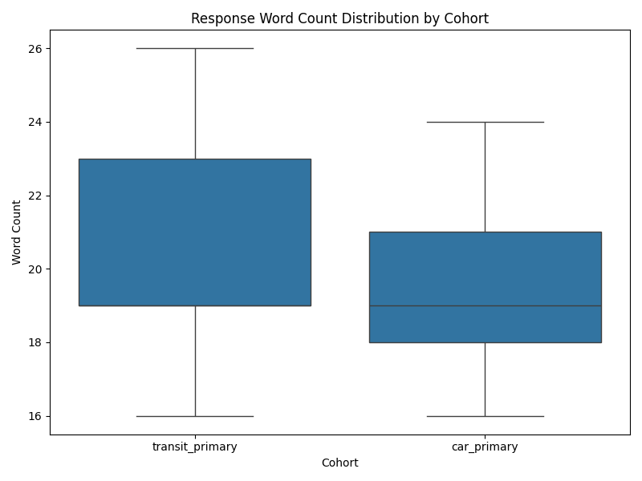
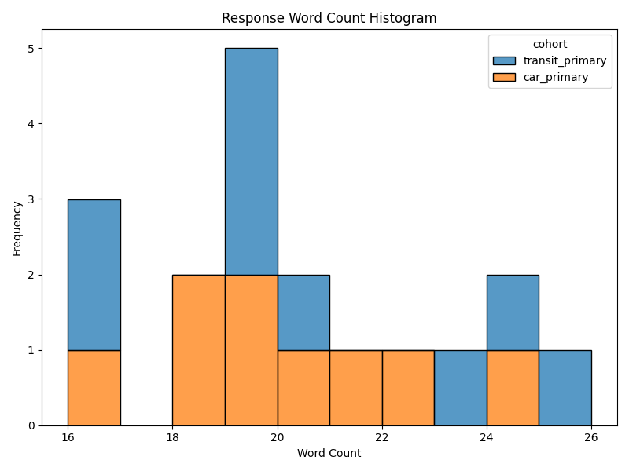

# Mixed-Methods Thematic Analysis of Transit and Car Primary Users

## 1. Introduction
This report presents a mixed-methods analysis of semi-structured interview excerpts from two distinct user cohorts: `transit_primary` and `car_primary`. The objective is to understand the differing needs, pain points, and expectations of these two groups regarding transportation applications. The analysis combines transparent quantitative descriptives with an LLM-assisted qualitative synthesis to provide a comprehensive overview of user experiences.

## 2. Methodology

### 2.1 Data Preprocessing and Quantitative Descriptives
The dataset consists of 18 interview excerpts, evenly split between the `transit_primary` (n=9) and `car_primary` (n=9) cohorts. 

Initial preprocessing involved calculating the word count for each response to understand the depth and verbosity of the feedback provided by each group. Descriptive statistics, including mean, standard deviation, minimum, and maximum word counts, were computed for each cohort using Python's `pandas` library. Visualizations of these distributions were generated using `matplotlib` and `seaborn`.

### 2.2 LLM-Assisted Qualitative Synthesis
Following the quantitative analysis, the interview texts were subjected to a thematic analysis assisted by a Large Language Model (LLM). The `claude-3-5-sonnet-20241022` model (accessed via the Anthropic Messages API format) was prompted to act as an expert qualitative researcher. The prompt instructed the model to identify main themes for each cohort, as well as overlapping themes, providing brief descriptions and citing relevant respondent IDs for each identified theme. The temperature was set to 0.2 to ensure focused and reproducible thematic extraction.

## 3. Results

### 3.1 Quantitative Descriptives
The dataset contains an equal representation of both cohorts, with 9 respondents each. The analysis of response lengths reveals that both groups provided similarly detailed feedback, though the `transit_primary` cohort exhibited slightly more variation in their response lengths.

*   **Car Primary Cohort:** The mean word count was 19.67 words (SD = 2.40), ranging from 16 to 24 words.
*   **Transit Primary Cohort:** The mean word count was 20.22 words (SD = 3.46), ranging from 16 to 26 words.

The distributions of response lengths are visualized in the figures below.

*Figure 1: Boxplot illustrating the distribution of response word counts for each cohort.*

*Figure 2: Stacked histogram showing the frequency of response word counts across both cohorts.*

### 3.2 Qualitative Thematic Analysis
The LLM-assisted thematic analysis identified distinct priorities for each cohort, alongside several cross-cutting themes.

#### Transit Primary Themes
For transit-primary users, the core themes revolve around reliability, safety, and transparency in the physical transit environment:
*   **Real-Time Information Accuracy & Trust:** High reliance on live data; inaccuracies lead to missed connections and eroded trust (e.g., INT-01, INT-08).
*   **Crowding, Safety & Physical Comfort:** Physical safety and crowding heavily influence decisions, sometimes overriding schedule adherence (e.g., INT-02).
*   **Pricing Transparency:** A desire for clear, consolidated fare structures and discount information (e.g., INT-03).
*   **Night/Off-Peak Safety:** Anxiety regarding service gaps late at night, with a need for proactive navigation assistance (e.g., INT-04).
*   **Accessibility Information:** The need for prominent display of accessibility issues, such as elevator outages (e.g., INT-05).
*   **Offline Resilience:** Appreciation for offline capabilities when connectivity drops in tunnels (e.g., INT-06).
*   **Transfer Coherence:** Frustration with disjointed transfer information and mapping across different lines (e.g., INT-07).

#### Car Primary Themes
Car-primary users focus more on the integration of driving with other modes, cost comparisons, and interface simplicity:
*   **Multimodal Integration:** A desire for seamless stitching of driving and transit legs (e.g., park-and-ride) rather than treating them as separate trips (e.g., INT-12).
*   **Cost Transparency (Parking & Fuel):** The need to see parking costs alongside drive-time estimates, and a desire for fuel vs. fare comparisons (e.g., INT-10, INT-15).
*   **Alert Relevance:** Traffic alerts are often perceived as noisy; users only want reroutes when the time saved outweighs the time lost searching for parking (e.g., INT-11).
*   **Parking Safety:** Qualitative data about parking lots (lighting, CCTV) is prioritized over just finding the cheapest option (e.g., INT-13).
*   **Interface Simplicity:** A preference for uncluttered interfaces with only essential features on the home screen (e.g., INT-16).
*   **Disruption Communication:** During transit strikes, users need clear alternatives rather than generic news feeds (e.g., INT-17).
*   **Map Fidelity:** The visual map serves as a primary trust signal; inaccuracies in the map lead to distrust of the entire trip plan (e.g., INT-18).

#### Cross-Cohort Overlapping Themes
Despite their different primary modes, both groups share fundamental expectations regarding trust and transparency:
*   **Trust Through Accuracy:** Both cohorts require highly accurate information (live arrivals for transit, map fidelity for cars) to trust the application.
*   **Cost Transparency:** Both groups struggle with opaque pricing, whether it's transit fare caps or the combined cost of driving and parking.
*   **Safety Considerations:** Safety is a paramount concern for both, manifesting as crowding/night travel for transit users and parking lot security for car users.

## 4. Discussion
The mixed-methods approach highlights that while the volume of feedback is consistent across cohorts (as shown by the quantitative descriptives), the qualitative needs are highly specialized. Transit users are deeply concerned with the immediate, physical realities of their journey (crowding, real-time delays, accessibility), whereas car users are more focused on the strategic integration of their trip (parking costs, multimodal handoffs, interface simplicity).

However, the overlapping themes reveal a universal user requirement: applications must act as trustworthy, transparent guides. Failures in core data accuracy (whether a bus arrival time or a map route) disproportionately damage user trust. Furthermore, both groups desire applications that synthesize complex information—such as total trip costs or safety conditions—rather than forcing the user to piece this information together from multiple sources.

## 5. Limitations
This study relies on a small sample size (n=18), which limits the generalizability of the quantitative findings. The thematic analysis, while assisted by an advanced LLM, is based on brief excerpts rather than full-length interview transcripts, potentially missing deeper contextual nuances. Future research should validate these themes with a larger, more diverse user base and incorporate full interview data.
