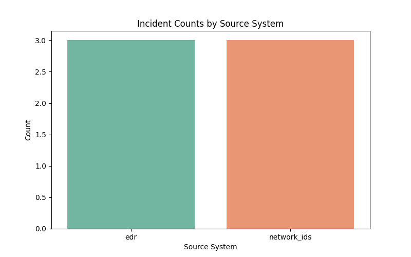
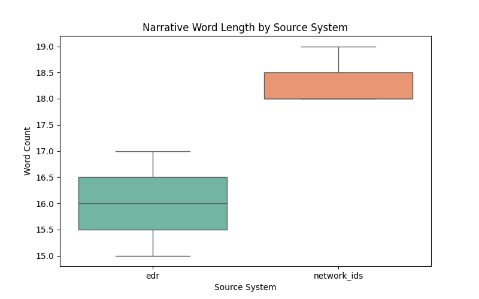

# CyberSecurity Incident Narrative Triage Report

## 1. Introduction

Security Operations Center (SOC) teams are frequently inundated with alerts from various security sensors. Efficient triage requires quickly understanding the context of an alert and determining the appropriate response. This report analyzes a synthetic dataset of short incident narratives to demonstrate a structured triage process. The dataset includes narratives from two primary source systems: Endpoint Detection and Response (EDR) and Network Intrusion Detection Systems (Network IDS). 

The objective of this analysis is to:
1.  Perform reproducible preprocessing and compute quantitative summaries of the incident narratives.
2.  Utilize a Large Language Model (LLM) to propose a structured triage label set, summarize recurring patterns, and contrast the characteristics of alerts originating from EDR versus Network IDS.
3.  Visualize the quantitative findings to support the triage process.

## 2. Methodology

### 2.1 Data Preprocessing and Quantitative Summaries

The dataset, `incident_narratives.csv`, contains six incident records with three fields: `incident_id`, `source_system`, and `narrative_text`. Preprocessing and quantitative analysis were performed using Python with the `pandas` library.

The following quantitative metrics were computed:
*   **Narrative Length:** Both character count and word count were calculated for each narrative.
*   **Keyword Frequencies:** A predefined list of keywords relevant to incident response actions and threat types was established: `['blocked', 'reset', 'disabled', 'sinkhole', 'closed', 'enabled', 'powershell', 'smb', 'logins', 'dns', 'ransomware', 'tls']`. The presence of these keywords (case-insensitive) was counted for each narrative.
*   **Aggregated Summaries:** The data was grouped by `source_system` to calculate the mean narrative length and the total count of each keyword per source system.

### 2.2 LLM-Assisted Structured Triage

To assist with structured triage, the `google/gemini-2.5-pro` model was utilized via the OpenRouter API. The model was provided with the computed quantitative summaries and the raw narrative text. The prompt instructed the LLM to:
1.  Propose a compact label set (e.g., coarse tactic categories or priority buckets) and assign a label to each Incident ID.
2.  Summarize recurring patterns in the narratives.
3.  Contrast what tends to show up more under 'edr' vs 'network_ids', acknowledging the small sample size.

The model was explicitly constrained to base its interpretations solely on the provided text and summaries, without inventing Indicators of Compromise (IOCs) or quantitative claims. The raw JSON response from the API call was saved for reproducibility.

## 3. Results

### 3.1 Quantitative Summaries

The dataset consists of 6 incidents, evenly split between the two source systems: 3 from EDR and 3 from Network IDS.

The analysis of narrative length revealed that EDR narratives tend to be slightly longer on average than Network IDS narratives, both in terms of character count and word count.

*   **EDR:** Mean Character Length = 136.33, Mean Word Length = 19.33
*   **Network IDS:** Mean Character Length = 131.33, Mean Word Length = 18.67

Keyword frequency analysis highlighted distinct patterns associated with each source system:

*   **EDR Keywords:** `blocked` (1), `disabled` (1), `closed` (1), `powershell` (1), `logins` (1), `ransomware` (1)
*   **Network IDS Keywords:** `reset` (1), `sinkhole` (1), `enabled` (1), `smb` (1), `dns` (1), `tls` (1)

### 3.2 LLM Triage Summary

Based on the LLM analysis of the narratives and quantitative data, the following structured triage was proposed:

#### 3.2.1 Triage Labels

A three-tier priority label set was proposed:

*   **Contained Threat (High Priority):** An active threat was detected and a containment action was taken, but the host or account requires immediate follow-up (e.g., re-imaging, investigation).
*   **Contained Anomaly (Medium Priority):** Suspicious activity was detected and contained at the network or host level. The activity is anomalous but may not be an active compromise. Requires review and potential tuning.
*   **Informational / Resolved:** The alert was determined to be a false positive or explained by sanctioned activity. The case is closed but serves as documentation.

**Assignments:**
*   **INC001 (EDR):** Contained Anomaly (Medium Priority) - Suspicious PowerShell blocked.
*   **INC002 (Network IDS):** Contained Anomaly (Medium Priority) - Unusual SMB traffic reset.
*   **INC003 (EDR):** Contained Threat (High Priority) - Repeated failed logins, account disabled, device queued for reimage.
*   **INC004 (Network IDS):** Contained Anomaly (Medium Priority) - DNS tunneling-like query spike sinkholed.
*   **INC005 (EDR):** Informational / Resolved - Ransomware false positive closed.
*   **INC006 (Network IDS):** Informational / Resolved - TLS to new domain, WAF challenge enabled, linked to change window.

#### 3.2.2 Recurring Patterns

The narratives exhibit several recurring patterns:
*   **Automated Mitigation:** Most incidents describe an automated or immediate initial response action (e.g., "blocked," "reset," "disabled," "sinkhole applied," "WAF challenge enabled").
*   **Follow-up Actions:** Several narratives indicate a need for further human review or action (e.g., "end user notified," "firewall rule review requested," "device queued for reimage").
*   **Contextual Resolution:** Some alerts are resolved by correlating them with broader context, such as a "backup indexer" (false positive) or a "change window" (sanctioned activity).

#### 3.2.3 EDR vs. Network IDS Contrast

While acknowledging the very small sample size (N=6), distinct differences emerge between the two source systems:

*   **Focus of Activity:** EDR narratives focus on host-level activities (processes, logins, file extensions), whereas Network IDS narratives focus on network-level activities (protocols, connections, domains).
*   **Mitigation Actions:** EDR actions are host-centric (blocking processes, disabling accounts), while Network IDS actions are network-centric (resetting connections, sinkholing traffic, enabling WAF challenges).
*   **Keywords:** The keyword analysis supports this distinction, with EDR associated with terms like `powershell`, `logins`, and `ransomware`, and Network IDS associated with `smb`, `dns`, and `tls`.

## 4. Discussion

The combination of quantitative summaries and LLM-assisted analysis provides a structured approach to incident triage. The quantitative metrics offer a transparent, objective baseline, while the LLM provides contextual interpretation and categorization.

The proposed label set (Contained Threat, Contained Anomaly, Informational/Resolved) effectively categorizes the incidents based on their severity and required follow-up actions. This structured approach can help SOC analysts prioritize their workflow and ensure that critical incidents receive immediate attention.

The contrast between EDR and Network IDS alerts highlights the complementary nature of these security sensors. EDR provides deep visibility into host-level activities, while Network IDS provides broad visibility into network traffic. Effective incident response requires correlating data from both sources to build a complete picture of an attack.

## 5. Limitations

The primary limitation of this analysis is the extremely small sample size (N=6). The findings, particularly the contrast between EDR and Network IDS, are tentative and should not be generalized to larger datasets without further validation. Additionally, the LLM analysis is based on a synthetic dataset and may not fully capture the complexity and nuance of real-world incident narratives. The use of a specific LLM model (`google/gemini-2.5-pro`) may also introduce biases or limitations inherent to that model.
