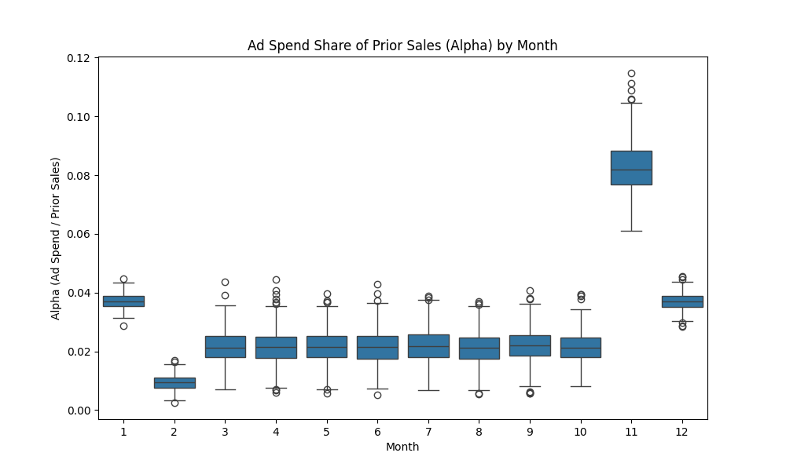
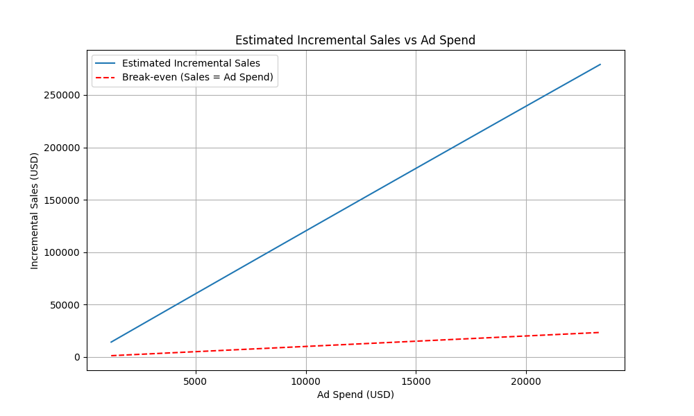

# Retail Analytics: Ad Spend and Store Sales Analysis

## 1. Introduction

This report analyzes a longitudinal store panel dataset to evaluate the effectiveness of advertising spend on store sales and to support monthly advertising budget decisions for the upcoming year. The dataset contains monthly records for 200 stores over three years, including sales revenue, advertising spend, foot traffic, local population, competitor count, and holiday indicators.

The current advertising budget policy, **RET-ADV-ROLL**, ties each store's monthly online ad budget to a fixed share of its prior-month same-store sales. We first examine the implementation of this policy and then estimate the causal impact of advertising spend on sales revenue to inform future budget planning.

## 2. Data Overview and Policy Analysis

The dataset consists of 7,200 observations (200 stores $\times$ 36 months). Key variables include:
- `sales_revenue_usd`: Monthly sales revenue.
- `ad_spend_usd`: Monthly advertising spend.
- `prior_sales`: Sales revenue from the previous month (calculated).
- Covariates: `is_holiday_month`, `foot_traffic`, `local_population`, `competitor_count`.

### 2.1. Analysis of Policy RET-ADV-ROLL

The policy dictates that ad spend is a share of prior-month sales. We calculated the ratio $\alpha = \text{Ad Spend} / \text{Prior Sales}$ for each store-month. The analysis reveals that $\alpha$ varies significantly by month but is relatively consistent across stores within a given month. 

As shown in the figure above, the ad spend share ($\alpha$) is highest in November (approx. 8.2%) and January/December (approx. 3.7%), likely reflecting increased marketing efforts around the holiday season and year-end. During other months, the share remains relatively stable at around 2.1%.

## 3. Methodology

To estimate the causal effect of advertising spend on sales revenue, we employ a fixed-effects regression model. The policy RET-ADV-ROLL creates a deterministic relationship between ad spend and prior sales within each month. By controlling for prior sales and month fixed effects, we can isolate the variation in ad spend and estimate its impact on current sales.

The primary model is specified as follows:

$$ \text{Sales}_{i,t} = \beta_0 + \beta_1 \text{AdSpend}_{i,t} + \beta_2 \text{PriorSales}_{i,t} + \gamma_t + \delta_i + \theta X_{i,t} + \epsilon_{i,t} $$

Where:
- $\text{Sales}_{i,t}$ is the sales revenue for store $i$ in month $t$.
- $\text{AdSpend}_{i,t}$ is the advertising spend.
- $\text{PriorSales}_{i,t}$ is the sales revenue in month $t-1$.
- $\gamma_t$ represents month fixed effects to control for seasonality.
- $\delta_i$ represents store fixed effects to control for time-invariant store characteristics.
- $X_{i,t}$ includes time-varying covariates: holiday indicator, foot traffic, local population, and competitor count.

## 4. Results

### 4.1. Impact of Advertising Spend on Sales

The regression results indicate a strong, positive, and statistically significant relationship between advertising spend and sales revenue. 

- **Estimated Coefficient ($\beta_1$)**: 11.99 (p < 0.001)
- **95% Confidence Interval**: [11.83, 12.15]

This means that, on average, every additional dollar spent on advertising generates approximately $11.99 in incremental sales revenue, holding other factors constant.

### 4.2. Return on Investment (ROI)

The Return on Investment (ROI) for advertising spend can be calculated as:

$$ \text{ROI} = \frac{\text{Incremental Sales} - \text{Ad Spend}}{\text{Ad Spend}} = \beta_1 - 1 $$

Based on our estimate, the **ROI is approximately 10.99** (or 1099%). This exceptionally high ROI suggests that the current advertising budget is highly effective and likely underfunded.

### 4.3. Non-linear Effects and Diminishing Returns

To check for diminishing returns to advertising, we introduced a quadratic term for ad spend into the model. 

- **Linear term**: 12.08 (p < 0.001)
- **Quadratic term**: -0.000006 (p = 0.4036)

The quadratic term is not statistically significant, indicating that within the observed range of ad spend in the dataset, there is no evidence of diminishing returns. The relationship between ad spend and incremental sales remains linear.

The figure above illustrates the estimated incremental sales across the observed range of ad spend. The blue line (incremental sales) is consistently and significantly above the red dashed line (break-even point), reinforcing the high profitability of the advertising spend.

## 5. Discussion and Recommendations

### 5.1. Findings
1. **High Effectiveness**: Advertising spend has a substantial and highly significant positive impact on store sales, with an estimated ROI of nearly 1100%.
2. **No Diminishing Returns Observed**: Within the current spending levels, there is no evidence that the effectiveness of advertising decreases as spend increases.
3. **Policy Implementation**: The RET-ADV-ROLL policy is implemented with month-specific multipliers, allocating higher shares of prior sales to ad budgets during peak holiday seasons (November, December, January).

### 5.2. Recommendations for Budget Planning
Given the exceptionally high ROI and the lack of diminishing returns within the current data range, the primary recommendation is to **increase the advertising budget**.

- **Increase the Multiplier ($\alpha$)**: The company should consider increasing the baseline share of prior sales allocated to advertising across all months. 
- **Test and Learn**: Since we do not observe diminishing returns in the current data, it is unknown at what spending level the ROI will begin to decline. The company should implement a phased increase in the ad budget, perhaps testing higher multipliers in a randomly selected subset of stores, to identify the optimal spending level where marginal revenue equals marginal cost.
- **Re-evaluate Seasonality**: While increasing spend during the holidays (Nov-Jan) makes sense, the high overall ROI suggests that increasing spend during the "off-season" months could also yield significant returns. The company should test increasing the multiplier during these months as well.
