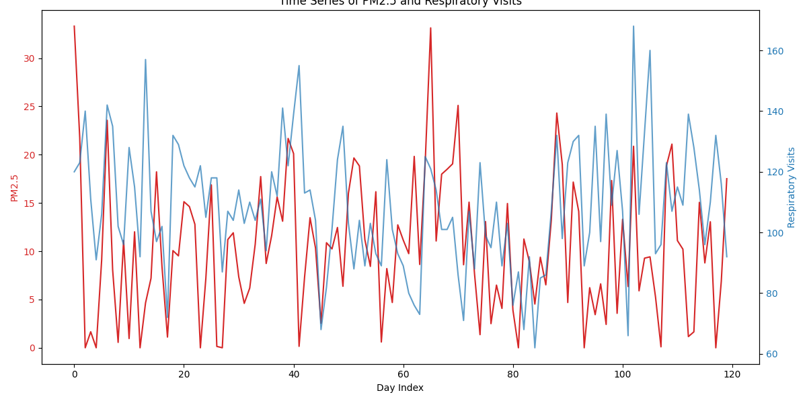
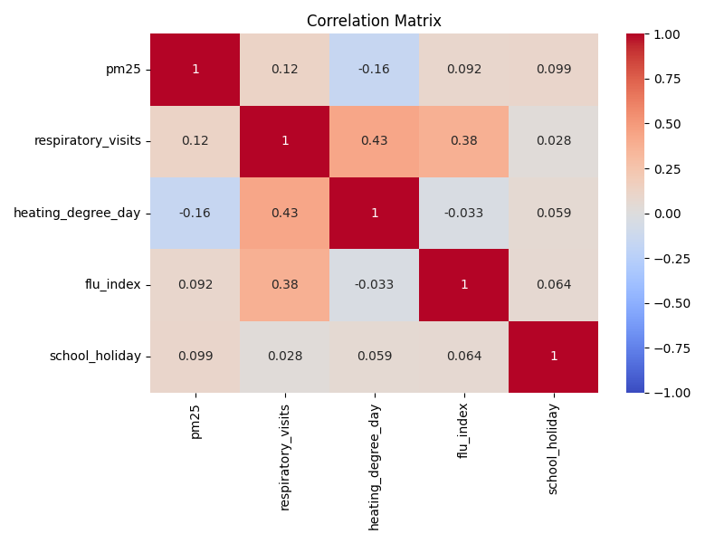
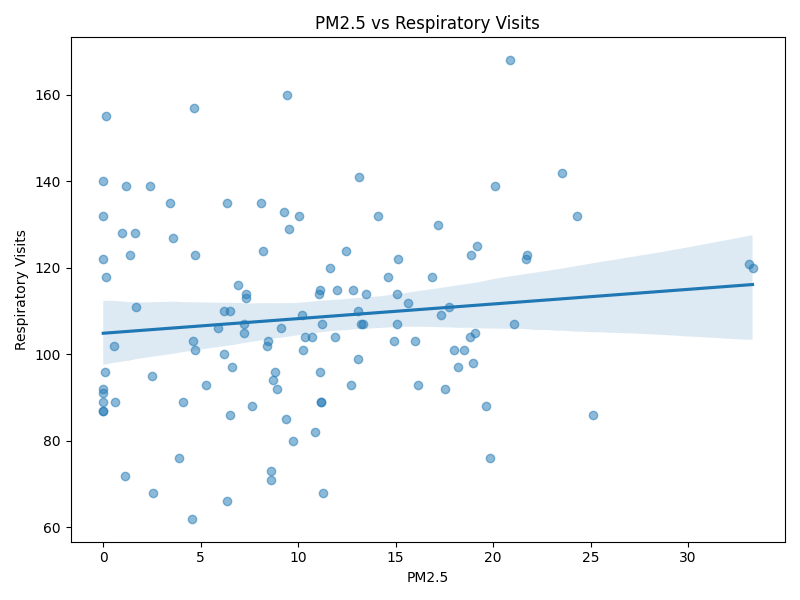
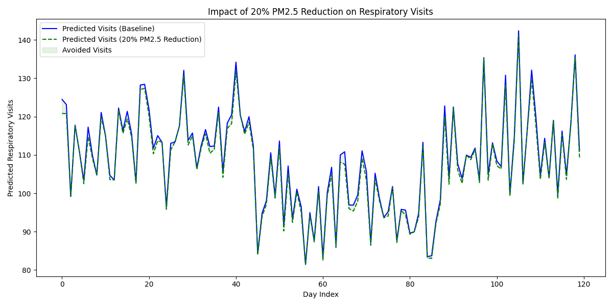

# Impact of Air Pollution on Respiratory Clinic Visits: A Daily Panel Analysis

## 1. Introduction
Air pollution, particularly fine particulate matter (PM2.5), is a well-established risk factor for respiratory diseases. Understanding the short-term impact of PM2.5 fluctuations on healthcare utilization is crucial for public health planning and environmental policy. This report analyzes a daily panel dataset to quantify the relationship between daily PM2.5 concentrations and respiratory clinic visits, controlling for relevant meteorological and social factors. The findings aim to support evidence-based air quality policy discussions.

## 2. Data and Methodology

### 2.1 Data Description
The analysis utilizes a daily panel dataset (`daily_panel.csv`) consisting of 120 observations. The dataset includes the following variables:
*   `day_index`: A sequential index representing the day of observation.
*   `pm25`: Daily average concentration of PM2.5.
*   `respiratory_visits`: Daily count of clinic visits for respiratory issues.
*   `heating_degree_day`: A measure of cold weather severity, which often correlates with both increased heating emissions and respiratory susceptibility.
*   `flu_index`: An index representing the prevalence of influenza, a major confounder for respiratory visits.
*   `school_holiday`: A binary indicator for school holidays, which can affect transmission dynamics and healthcare-seeking behavior.

### 2.2 Exploratory Data Analysis
Initial exploratory data analysis (EDA) was conducted to understand the distribution and relationships between variables. 

*Figure 1: Time series plot showing the daily fluctuations of PM2.5 concentrations and respiratory clinic visits over the 120-day period.*

Figure 1 illustrates the temporal dynamics of both PM2.5 and respiratory visits. There appear to be periods where peaks in PM2.5 are followed by or coincide with increased respiratory visits.

*Figure 2: Correlation matrix of the variables in the dataset.*

Figure 2 shows the pairwise correlations. `respiratory_visits` has a positive correlation with `pm25`, `heating_degree_day`, and `flu_index`. 

*Figure 3: Scatter plot of PM2.5 concentrations versus respiratory clinic visits.*

Figure 3 displays a positive association between PM2.5 levels and the number of respiratory visits, though there is considerable variance.

### 2.3 Statistical Modeling
Given that the dependent variable, `respiratory_visits`, is count data (mean = 108.38, variance = 425.77), Poisson and Negative Binomial regression models are appropriate. The variance significantly exceeds the mean, indicating overdispersion. Therefore, a Negative Binomial regression model is theoretically preferred. However, we also estimate a Poisson model with robust standard errors (HC0) to ensure the robustness of our findings, as Poisson with robust standard errors can consistently estimate the conditional mean even in the presence of overdispersion.

The model specification is:
$$ \log(E[\text{Respiratory Visits}_t]) = \beta_0 + \beta_1 \text{PM2.5}_t + \beta_2 \text{Heating Degree Day}_t + \beta_3 \text{Flu Index}_t + \beta_4 \text{School Holiday}_t $$

## 3. Results

### 3.1 Regression Results
Both the Poisson model (with robust standard errors) and the Negative Binomial model yielded consistent results regarding the direction and significance of the main predictors.

**Table 1: Negative Binomial Regression Results**

| Variable | Coefficient | Std. Error | z-statistic | p-value |
| :--- | :--- | :--- | :--- | :--- |
| Intercept | 4.3553 | 0.043 | 100.698 | < 0.001 |
| PM2.5 | 0.0044 | 0.002 | 2.275 | 0.023 |
| Heating Degree Day | 0.0304 | 0.005 | 6.538 | < 0.001 |
| Flu Index | 0.3735 | 0.071 | 5.233 | < 0.001 |
| School Holiday | -0.0476 | 0.077 | -0.617 | 0.538 |
| Alpha (Dispersion) | 0.0134 | 0.003 | 4.556 | < 0.001 |

The coefficient for PM2.5 is positive and statistically significant (p = 0.023). A one-unit increase in PM2.5 is associated with an approximately 0.44% increase in expected daily respiratory clinic visits ($e^{0.0044} - 1 \approx 0.0044$). 

Control variables also behave as expected: colder days (higher heating degree days) and higher flu prevalence are strongly and significantly associated with increased respiratory visits. The school holiday indicator is not statistically significant in the Negative Binomial model.

### 3.2 Policy Counterfactual Analysis
To translate these statistical findings into actionable policy insights, we simulated a counterfactual scenario: What would be the impact on respiratory clinic visits if daily PM2.5 concentrations were reduced by 20% across the entire observation period?

Using the fitted Poisson model (preferred for policy simulations when robust SEs are used, as it avoids relying on the specific variance assumption of the NB model for point predictions), we predicted the daily visits under the baseline (observed PM2.5) and the counterfactual (PM2.5 reduced by 20%) scenarios.

*   **Total avoided visits:** Over the 120-day period, a 20% reduction in PM2.5 would have resulted in an estimated **121.48 fewer respiratory clinic visits**.
*   **Percentage reduction:** This corresponds to a **0.93% reduction** in total respiratory visits during this period.

*Figure 4: Predicted respiratory visits under the baseline scenario versus a counterfactual scenario with a 20% reduction in PM2.5. The shaded area represents the avoided visits.*

## 4. Discussion and Conclusion
This analysis provides empirical evidence of a significant short-term association between ambient PM2.5 concentrations and respiratory healthcare utilization. Even after controlling for strong seasonal confounders like temperature (heating degree days) and influenza prevalence, PM2.5 remains a significant predictor of clinic visits.

The policy simulation demonstrates that achievable reductions in air pollution can yield tangible public health benefits. While a ~1% reduction in total visits might seem modest in percentage terms, it translates to over 120 avoided clinic visits in just 120 days for the population served by these clinics. Scaled up to a larger population or a longer time horizon, the reduction in healthcare burden and associated costs would be substantial.

These findings support the implementation of stricter air quality regulations and targeted interventions to reduce particulate matter emissions, particularly during periods of high baseline risk (e.g., winter months with high heating demand). Future research could explore lagged effects of PM2.5 exposure and potential non-linearities in the dose-response relationship to further refine these estimates.
