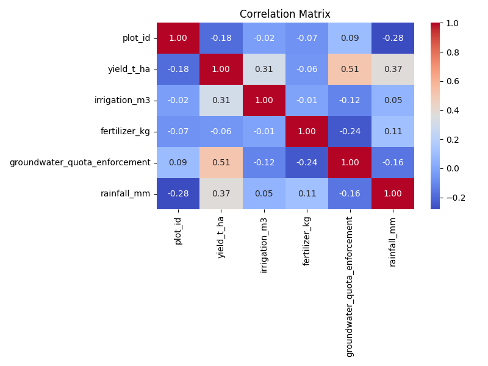
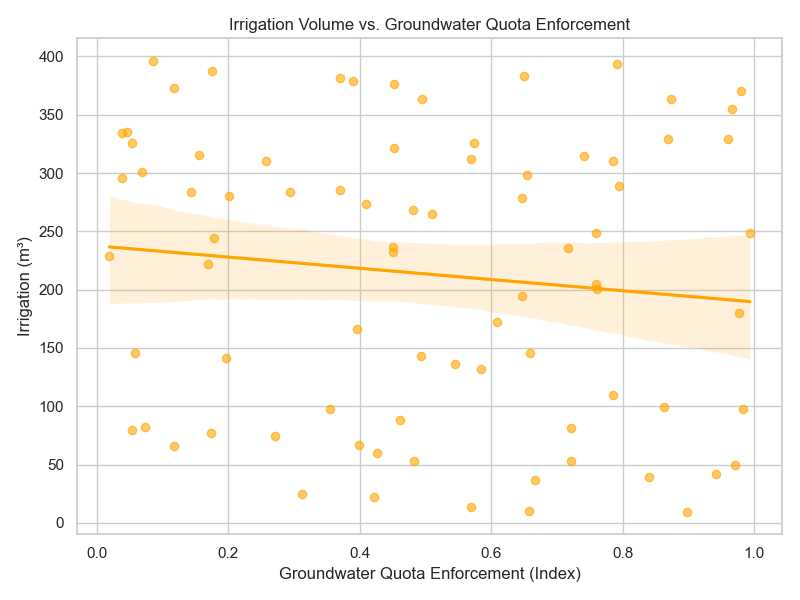
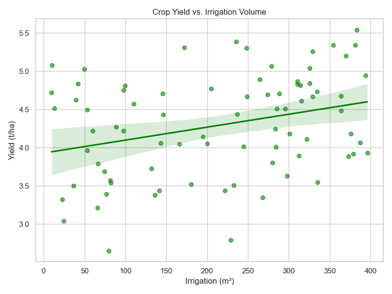
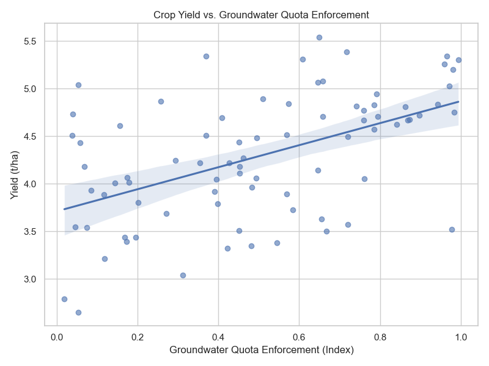

# Assessing the Impact of Groundwater Quota Enforcement on Irrigation and Crop Yields

## 1. Introduction
The sustainable management of groundwater resources is critical for long-term agricultural productivity, especially in regions prone to water scarcity. This report analyzes a plot-year panel dataset to assess the outcomes of a groundwater quota enforcement program. We examine how the enforcement of these quotas affects irrigation volumes and crop yields, controlling for other inputs such as fertilizer use and rainfall.

## 2. Data and Methodology
The dataset `field_year_panel.csv` contains 80 observations of agricultural plots. The key variables include:
- `yield_t_ha`: Crop yield in tons per hectare.
- `irrigation_m3`: Volume of irrigation water applied in cubic meters.
- `fertilizer_kg`: Amount of fertilizer applied in kilograms.
- `groundwater_quota_enforcement`: An index representing the strictness of groundwater quota enforcement (ranging from 0 to 1).
- `rainfall_mm`: Annual rainfall in millimeters.

We employ Ordinary Least Squares (OLS) regression models to estimate the relationships between these variables. Specifically, we model:
1. The effect of quota enforcement on irrigation volume.
2. The determinants of crop yield, including enforcement, irrigation, fertilizer, and rainfall.

## 3. Results

### 3.1. Summary Statistics and Correlations
The correlation matrix (Figure 1) shows a positive correlation between yield and both irrigation (0.31) and rainfall (0.37). Interestingly, groundwater quota enforcement is strongly positively correlated with yield (0.51) but weakly negatively correlated with irrigation volume (-0.12).

*Figure 1: Correlation matrix of key variables.*

### 3.2. Impact on Irrigation Volume
We regressed `irrigation_m3` on `groundwater_quota_enforcement` and `rainfall_mm`. The results indicate that groundwater quota enforcement has a negative but statistically insignificant effect on total irrigation volume (coefficient = -45.65, p = 0.334). 

*Figure 2: Irrigation volume versus groundwater quota enforcement.*

As shown in Figure 2, there is no strong downward trend in water use as enforcement increases. This suggests that the enforcement program did not lead to a significant reduction in the overall quantity of water applied by farmers.

### 3.3. Impact on Crop Yield
We estimated an OLS model with `yield_t_ha` as the dependent variable, controlling for enforcement, irrigation, fertilizer, and rainfall. The model explains approximately 60.3% of the variance in crop yield (R-squared = 0.603).

- **Irrigation and Rainfall:** Both irrigation volume (coef = 0.0020, p < 0.001) and rainfall (coef = 0.0013, p < 0.001) have significant positive effects on yield, as expected. Figure 3 illustrates the positive relationship between irrigation and yield.
- **Groundwater Quota Enforcement:** Surprisingly, the enforcement index has a highly significant positive effect on crop yield (coef = 1.44, p < 0.001). Figure 4 highlights this strong positive relationship.
- **Fertilizer:** The effect of fertilizer is positive but not statistically significant in this sample (p = 0.475).

*Figure 3: Crop yield versus irrigation volume.*

*Figure 4: Crop yield versus groundwater quota enforcement.*

## 4. Discussion and Conclusion
The analysis reveals a nuanced outcome of the groundwater quota enforcement program. While the policy did not significantly reduce the total volume of irrigation water used, it was associated with a substantial increase in crop yields. 

This paradox suggests that the enforcement program may have incentivized farmers to increase their water use efficiency rather than simply cutting back on water volume. By optimizing when and how water is applied—perhaps through better timing, maintenance of irrigation equipment, or adoption of complementary management practices—farmers were able to achieve higher yields with roughly the same amount of water. The quota enforcement may have acted as a signal that prompted farmers to treat water as a more valuable resource, leading to improved agricultural practices.

Future research should investigate the specific mechanisms driving this efficiency gain, such as the adoption of water-saving technologies or changes in crop management practices induced by the policy.