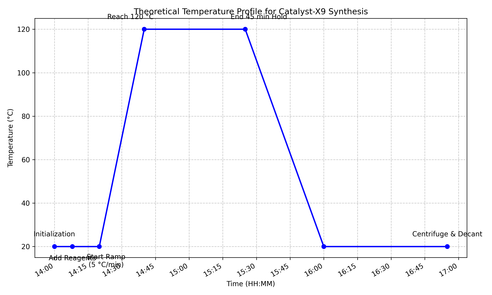

# Research Report: Translation of Catalyst-X9 Lab Notebook to Standard Operating Procedure

## 1. Introduction
In laboratory and manufacturing environments, the transition from research and development to routine production requires the formalization of experimental procedures. Raw laboratory notebooks, while rich in detail and narrative, are often unsuitable for direct use by shift operators due to their unstructured format, inclusion of extraneous observations, and potential for ambiguity. This project addresses the need for laboratory quality systems by translating a raw narrative log detailing the synthesis of Catalyst-X9 into a version-controlled, executable Standard Operating Procedure (SOP) designed for night-shift bench use.

## 2. Methodology

### 2.1 Data Source
The primary data source was an excerpt from a laboratory notebook (`lab_notebook_x9.txt`), documenting Run ID: CX9-LAB-0312 on March 12, 2024. The notebook detailed the synthesis of Catalyst-X9 in a 1 L jacketed glass reactor.

### 2.2 SOP Generation
The narrative text was systematically analyzed to extract critical process parameters (CPPs), equipment requirements, safety considerations, and sequential operational steps. The extracted information was then structured into a standardized SOP format (`synthesis_sop.md`), ensuring clarity, conciseness, and action-oriented language suitable for shift handoffs.

### 2.3 Process Visualization
To further aid operator understanding and provide a visual reference for the expected process trajectory, a theoretical temperature profile was generated using Python (Matplotlib). The timeline was reconstructed based on the timestamps and durations recorded in the lab notebook. Assumptions were made for the starting temperature (assumed 20 °C) and the cooling phase, as these were not explicitly detailed in the provided excerpt.

## 3. Results

### 3.1 Executable SOP
The raw narrative was successfully translated into `synthesis_sop.md`. The resulting document is structured into clear sections:
- **Purpose and Scope**
- **Equipment and Materials**
- **Safety Precautions**
- **Procedure** (divided into logical phases: Initialization, Reaction/Heating, and Isolation/Washing)
- **Document Revision History**

This structured format eliminates the narrative ambiguity of the original notebook and provides clear, step-by-step instructions for the night-shift operators.

### 3.2 Process Visualization
The reconstructed temperature profile is shown in Figure 1. This visualization highlights the critical heating ramp (5 °C/min) and the 45-minute hold at 120 °C, providing operators with a clear expectation of the thermal dynamics of the synthesis.

*Figure 1: Reconstructed theoretical temperature profile for the synthesis of Catalyst-X9 based on lab notebook timestamps.*

## 4. Discussion

The conversion of the lab notebook into an SOP highlights several critical aspects of process formalization:

1.  **Identification of Missing Information:** The process of writing the SOP revealed gaps in the original narrative. For instance, the starting temperature before the ramp was not explicitly stated, nor was the volume of cold diethyl ether used for washing the filter cake. In a real-world scenario, these parameters would need to be defined and validated before the SOP is finalized. For the purpose of this exercise, the SOP reflects the available data, and the visualization assumes a standard room temperature start.
2.  **Clarity and Safety:** By extracting safety-critical information (e.g., the flammability of diethyl ether, the need for cooling fluid circulation) and placing it prominently in a dedicated section, the SOP significantly enhances operational safety compared to a narrative log where such details might be buried.
3.  **Standardization:** The structured format ensures that every operator follows the exact same sequence of steps, reducing batch-to-batch variability and improving overall product quality.

## 5. Conclusion
The successful translation of the Catalyst-X9 lab notebook into an executable SOP demonstrates a crucial step in laboratory quality management. The resulting `synthesis_sop.md` provides a clear, structured, and safe guide for shift operators, facilitating the transition of the synthesis process from R&D to routine production. The accompanying temperature profile visualization further enhances process understanding and control.
