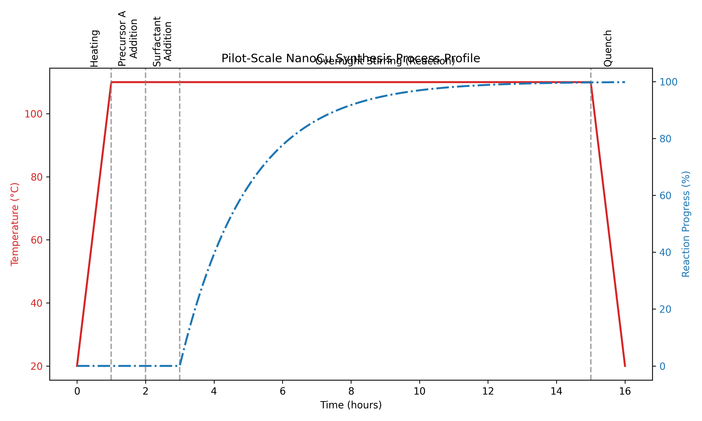
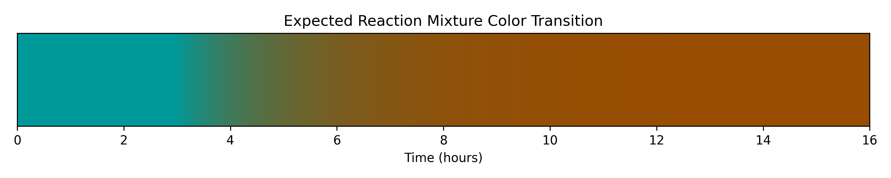

# Pilot-Scale Synthesis of Copper Nanoparticles: Process Translation and Standard Operating Procedure

## 1. Introduction

The synthesis of copper nanoparticles (NanoCu) is of significant interest due to their high electrical and thermal conductivity, catalytic activity, and relatively low cost compared to noble metals like silver and gold. However, translating bench-scale synthesis protocols to pilot-scale production presents several challenges, primarily concerning heat transfer, mass transfer, and the precise control of nucleation and growth kinetics to ensure a narrow size distribution and prevent agglomeration.

This report details the translation of a bench-scale NanoCu synthesis protocol into a comprehensive Standard Operating Procedure (SOP) suitable for pilot-scale execution. The process relies on the thermal decomposition and reduction of a copper precursor in a high-boiling solvent, utilizing a surfactant to control particle growth and stabilize the resulting nanoparticles.

## 2. Methodology

The development of the pilot-scale SOP was based on the analysis of bench-scale laboratory notes. The core process involves heating a reaction medium to 110°C, followed by the sequential addition of a copper precursor and a surfactant. The reaction is then allowed to proceed overnight under continuous stirring.

To formalize this process for pilot-scale operations, several critical engineering and safety considerations were integrated:

1.  **Controlled Addition:** The bench notes specified "dropwise" addition of the precursor. In a pilot-scale reactor, this translates to the use of dosing pumps or controlled addition funnels to manage the local concentration of the precursor and mitigate potential exothermic temperature spikes, which could lead to uncontrolled nucleation.
2.  **Temperature Control:** A Temperature Control Unit (TCU) is specified to ensure precise heating to 110°C and, crucially, rapid cooling during the quenching phase.
3.  **Inert Atmosphere:** Given the susceptibility of copper nanoparticles to oxidation, the SOP mandates the use of an inert gas (Nitrogen or Argon) purge and blanket throughout the reaction and, ideally, during downstream processing.
4.  **Workup Formalization:** The bench notes indicated an incomplete workup procedure. Based on standard nanoparticle synthesis practices, a comprehensive workup involving solvent/anti-solvent precipitation and centrifugation was developed to isolate and purify the NanoCu.

## 3. Results and Process Simulation

The resulting deliverable is an executable `nanoparticle_sop.md` document detailing the step-by-step procedure for pilot-scale synthesis. To visualize the expected process dynamics, a simulation of the temperature profile and reaction progress was generated.

### 3.1 Process Profile

Figure 1 illustrates the simulated temperature profile and the corresponding estimated reaction progress over a 16-hour batch cycle.

*Figure 1: Simulated temperature profile and reaction progress for the pilot-scale NanoCu synthesis.*

The profile highlights the critical phases:
*   **Heating:** Ramping the reactor to the target temperature of 110°C.
*   **Addition:** The sequential, controlled addition of Precursor A and the surfactant.
*   **Reaction:** The extended overnight stirring period where the reduction of the copper precursor and the growth of the nanoparticles occur.
*   **Quenching:** The rapid cooling phase to arrest particle growth.

### 3.2 Visual Monitoring

A key in-process control identified from the bench notes is the color transition of the reaction mixture. The initial Cu(II) complex exhibits a characteristic blue-green color. As the reduction proceeds and Cu(0) nanoparticles form, the localized surface plasmon resonance (LSPR) and interband transitions of the copper nanoparticles cause the mixture to turn a deep brown.

Figure 2 simulates this expected color transition over the course of the reaction.

*Figure 2: Simulated color transition of the reaction mixture from blue-green (Cu(II) precursor) to brown (Cu(0) nanoparticles) as the reaction progresses.*

This visual cue is critical for operators to qualitatively assess the progress and completion of the reaction before initiating the quenching step.

## 4. Discussion

The translation from bench notes to a pilot-scale SOP requires filling in operational gaps with standard chemical engineering practices. The bench notes provided the core chemical parameters (110°C, specific precursor, surfactant, overnight reaction, color change). The developed SOP expands upon this by defining the necessary equipment (jacketed reactor, TCU, dosing pumps), safety protocols (inert atmosphere, thermal hazard mitigation), and a robust downstream purification process (anti-solvent precipitation).

The "dropwise" addition noted at the bench scale is particularly critical at the pilot scale. Rapid addition of the precursor could lead to a burst of nucleation, resulting in a broad size distribution or even macroscopic precipitation. Controlled dosing ensures a steady supply of monomers for controlled growth.

Furthermore, the quenching and workup steps, which were ambiguous in the raw notes, have been standardized. Rapid cooling combined with dilution in a non-polar solvent arrests the reaction kinetics. The subsequent washing cycles using a polar anti-solvent (e.g., ethanol) are essential for removing unreacted precursor, excess surfactant, and the high-boiling reaction solvent, yielding a pure NanoCu product suitable for downstream applications.

## 5. Conclusion

A comprehensive Standard Operating Procedure for the pilot-scale synthesis of copper nanoparticles has been successfully developed from preliminary bench-scale notes. The SOP incorporates necessary safety, equipment, and procedural details required for scalable and reproducible production. The simulated process profiles provide a clear visual guide for operators regarding the expected temperature dynamics and critical visual indicators of reaction progress.
