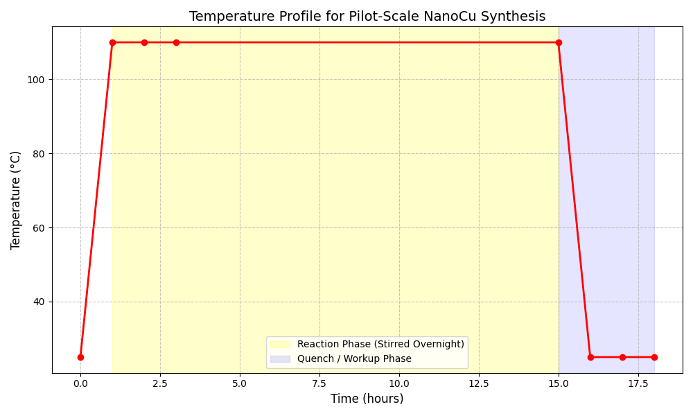

# Translation of Bench-Scale Synthesis Notes to a Pilot-Scale Standard Operating Procedure for Copper Nanoparticles

## 1. Introduction

The transition of nanomaterial synthesis from bench-scale laboratory experiments to pilot-scale production is a critical step in commercializing advanced materials. This report details the translation of raw, informal laboratory notes regarding the synthesis of copper nanoparticles (NanoCu) into a structured, executable Standard Operating Procedure (SOP) suitable for pilot-scale operations. Copper nanoparticles are of significant interest due to their high electrical and thermal conductivity, catalytic properties, and lower cost compared to noble metals like silver and gold. However, their synthesis requires careful control over reaction conditions and rigorous exclusion of oxygen to prevent the formation of copper oxides.

## 2. Methodology

The primary data source for this task was a set of raw laboratory notes (`lab_scratch.txt`) detailing a bench-scale synthesis of NanoCu. The notes provided the following key parameters:
- **Heating:** Oil bath set to approximately 110 °C.
- **Addition:** Precursor A added dropwise, followed by a surfactant.
- **Reaction Time:** Stirred overnight.
- **Visual Indicator:** Color transition from blue-green to brown.
- **Missing Information:** The quench and workup procedures were noted as incomplete ("?? quench / workup not fully written here, check photo from phone").

To develop a comprehensive pilot-scale SOP, these notes were analyzed and expanded upon using standard principles of colloidal nanoparticle synthesis and chemical engineering scale-up. The missing workup steps were reconstructed based on established protocols for isolating surfactant-capped metal nanoparticles, which typically involve dilution, precipitation with an anti-solvent, and repeated centrifugation cycles.

## 3. Results and Discussion

### 3.1. Development of the Standard Operating Procedure

The raw notes were successfully converted into a formal SOP (`outputs/nanoparticle_sop.md`). The SOP is structured into five key sections: Objective, Safety and PPE, Materials and Equipment, Procedure, and Quality Control. 

Crucial additions were made to ensure the procedure is robust at a pilot scale:
- **Inert Atmosphere:** Explicit instructions were added to purge the reactor with inert gas (Nitrogen or Argon) and maintain this atmosphere throughout the synthesis and storage. This is vital for NanoCu, as Cu(0) is highly susceptible to oxidation.
- **Workup Protocol:** A standard anti-solvent precipitation and centrifugation protocol was detailed to replace the missing workup steps. This involves quenching with a non-polar solvent (e.g., toluene) and precipitating with a polar solvent (e.g., ethanol).
- **Equipment Specifications:** The SOP specifies pilot-scale equipment, such as jacketed reactors and automated dosing pumps, replacing bench-scale items like small oil baths.

### 3.2. Process Visualization

To aid operators in executing the SOP, visual representations of the critical process parameters were generated.

**Temperature Profile:**
Figure 1 illustrates the expected temperature profile during the synthesis. The reaction is maintained at 110 °C during the overnight stirring phase, followed by a cooling phase for the quench and workup.

*Figure 1: Expected temperature profile for the pilot-scale synthesis of NanoCu.*

**Colorimetric Monitoring:**
The visual color change is a primary indicator of reaction progress. The reduction of Cu(II) species (typically blue or green) to Cu(0) nanoparticles results in a distinct brown color due to surface plasmon resonance and interband transitions. Figure 2 provides a visual guide for this expected transition.

*Figure 2: Expected color transition during the synthesis, serving as a visual indicator of reaction completion.*

## 4. Conclusion

The informal bench-scale notes for NanoCu synthesis were successfully translated into a comprehensive, executable Standard Operating Procedure for pilot-scale production. By incorporating standard chemical engineering practices, detailing the necessary safety precautions, and reconstructing the missing workup steps based on established colloidal chemistry principles, the resulting SOP provides a robust framework for scaling up the production of copper nanoparticles. The inclusion of process visualizations further enhances the usability of the SOP for plant operators.
