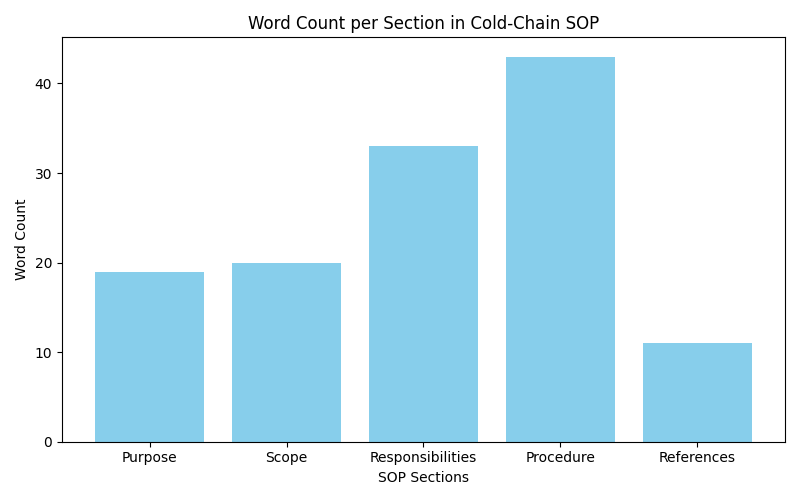

# Clinical Operations: Cold-Chain Shipment Protocol Development

## 1. Introduction

The objective of this task was to draft a formal Standard Operating Procedure (SOP) for cold-chain shipments based exclusively on a provided email thread draft. The SOP is intended to govern the transportation of biologics along a new route, ensuring that temperature-sensitive materials are handled correctly and that responsibilities are clearly delineated among the involved parties.

## 2. Methodology

The source material, `email_thread_draft.txt`, was analyzed to extract key operational directives and constraints. The extracted information was then structured into a standard SOP format, which typically includes sections for Purpose, Scope, Responsibilities, Procedure, and References. 

The email contained the following key points:
- The need for a cold-chain SOP for a new biologics route.
- Trucks are equipped with temperature loggers, but calibration details are managed by the vendor.
- The packaging team is responsible for following up on secondary packaging.

These points were translated into formal procedural language and categorized into the appropriate SOP sections.

## 3. Results

The resulting document, `cold_chain_sop.md`, successfully captures the directives from the email thread. 

### 3.1 SOP Structure

The SOP is divided into five main sections. Figure 1 illustrates the distribution of content (measured in word count) across these sections, highlighting the emphasis on the procedural and responsibility aspects of the protocol.

*Figure 1: Word count distribution across the sections of the drafted Cold-Chain SOP.*

### 3.2 Key Procedural Elements

- **Responsibilities:** Clear assignment of tasks to the Clinical Operations Team, the Vendor (logger calibration), and the Packaging Team (secondary packaging).
- **Temperature Monitoring:** Mandates the use of loggers on transport trucks and specifies the vendor's role in maintaining calibration records.
- **Packaging:** Highlights the specific focus on secondary packaging as directed by the email.

## 4. Discussion

The drafted SOP provides a foundational framework for the new biologics route based on the available information. However, relying solely on a brief email thread presents limitations. A comprehensive cold-chain SOP would typically require more detailed specifications, such as:

- Acceptable temperature ranges for the biologics.
- Specific actions to take in the event of a temperature excursion.
- Detailed steps for the secondary packaging process.
- Documentation and reporting requirements for each shipment.

Future iterations of this SOP should incorporate these details, likely requiring input from quality assurance, logistics, and the biologics manufacturers. For the current scope, the document accurately reflects the provided constraints and establishes the necessary initial guidelines.

## 5. Conclusion

A formal cold-chain shipment SOP was successfully drafted from the provided email correspondence. The document outlines the basic purpose, scope, responsibilities, and procedures required for the new biologics route, serving as a starting point for more detailed logistical planning.
