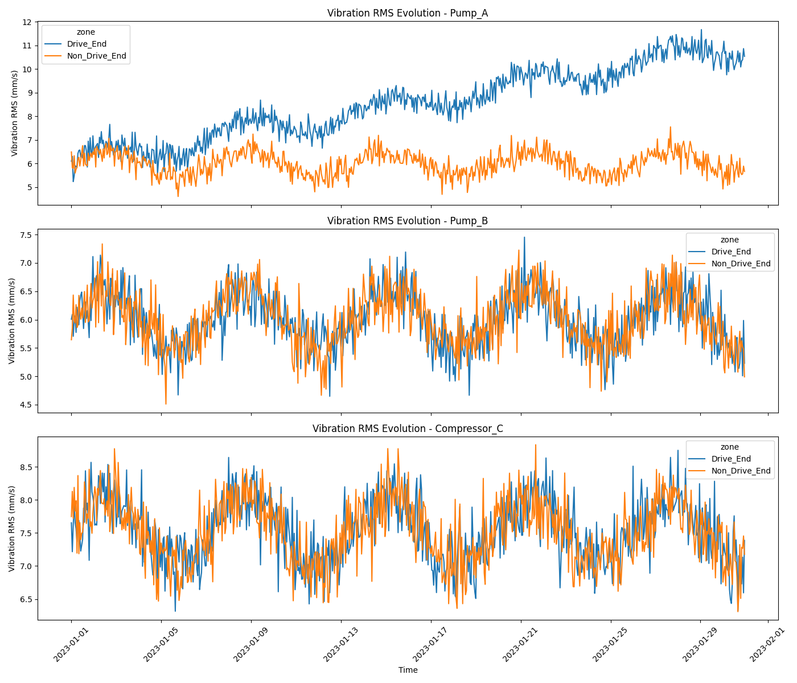
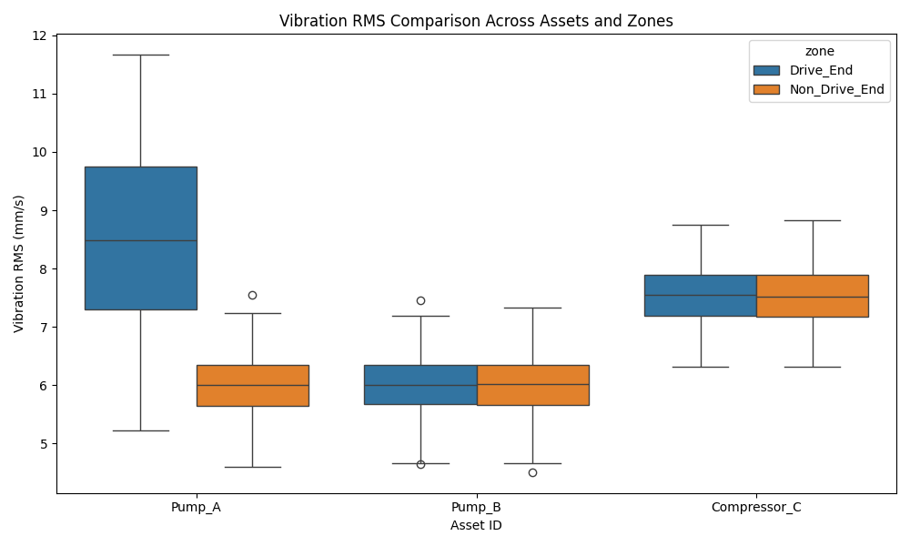
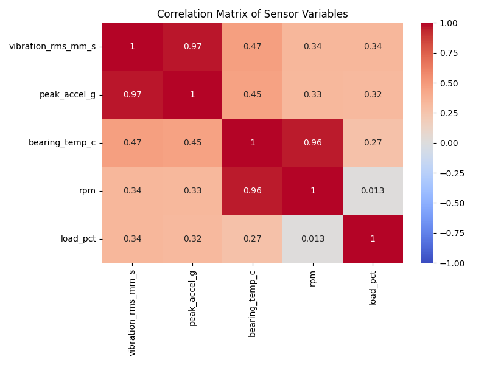
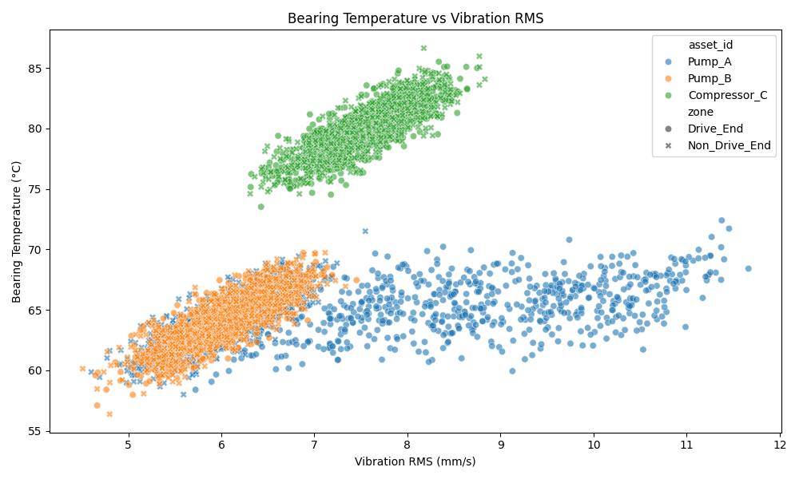
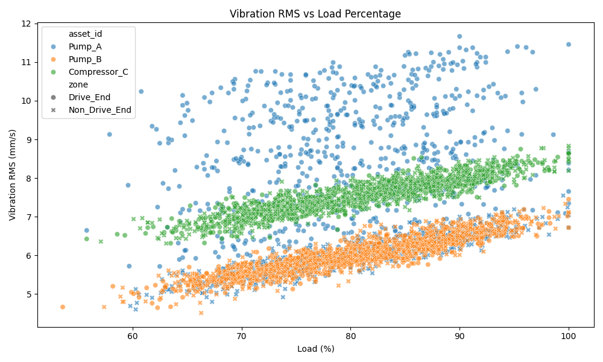

# Structural Health and Reliability: Sensor Vibration Panel Analysis

## 1. Introduction
Operational reliability engineering for rotating equipment relies heavily on combining vibration and thermal telemetry to prioritize maintenance based on risk. This report analyzes a dataset (`sensor_panel_timeseries.csv`) containing multi-asset vibration and process telemetry to understand the structural health and operational reliability of the monitored assets. The analysis summarizes the observation window, asset representation, and sampling frequency. It further explores the evolution of vibration-related quantities over time, compares them across assets and zones, and examines the relationships between vibration, bearing temperature, speed, and load. Finally, a prioritized set of monitoring and maintenance recommendations is provided based on the findings.

## 2. Methodology

### 2.1 Data Overview
The dataset `sensor_panel_timeseries.csv` contains the following columns:
- `timestamp_utc`: The UTC timestamp of the observation.
- `asset_id`: The identifier of the monitored asset.
- `zone`: The specific zone on the asset where the sensor is located (e.g., Drive_End, Non_Drive_End).
- `vibration_rms_mm_s`: Root Mean Square (RMS) vibration velocity in mm/s.
- `peak_accel_g`: Peak acceleration in g.
- `bearing_temp_c`: Bearing temperature in degrees Celsius.
- `rpm`: Rotational speed in Revolutions Per Minute.
- `load_pct`: Operating load as a percentage.
- `quality_flag`: A flag indicating the quality of the sensor reading (e.g., 'GOOD', 'BAD').

### 2.2 Analysis Plan
1.  **Data Cleaning and Summary:** Filter out records with a 'BAD' `quality_flag`. Determine the observation window, unique assets, unique zones, and the implied sampling interval.
2.  **Temporal Evolution:** Plot the evolution of `vibration_rms_mm_s` over time for each asset and zone to identify trends or anomalies.
3.  **Cross-Asset/Zone Comparison:** Use boxplots to compare the distribution of vibration levels across different assets and zones.
4.  **Variable Relationships:** Calculate the correlation matrix for the numerical variables (`vibration_rms_mm_s`, `peak_accel_g`, `bearing_temp_c`, `rpm`, `load_pct`) and visualize it using a heatmap. Create scatter plots to further investigate the relationships between key variables, such as vibration vs. bearing temperature and load vs. vibration.

## 3. Results

### 3.1 Summary Statistics
The analysis of the dataset reveals the following summary statistics:
-   **Observation Window:** The data spans from January 1, 2023, 00:00:00 UTC to January 30, 2023, 23:00:00 UTC.
-   **Assets Represented:** Three assets are monitored: `Pump_A`, `Pump_B`, and `Compressor_C`.
-   **Zones Monitored:** Sensors are located in two zones for each asset: `Drive_End` and `Non_Drive_End`.
-   **Sampling Interval:** The implied sampling interval based on the timestamps is 1 hour.
-   **Data Quality:** Out of 4320 total records, 4245 records have a 'GOOD' quality flag and were used for the subsequent analysis.

### 3.2 Vibration Evolution Over Time
The evolution of Vibration RMS over time is shown in Figure 1. 

*Figure 1: Evolution of Vibration RMS (mm/s) over time for each asset, separated by zone.*

Observations from Figure 1:
-   **Pump_A:** The `Drive_End` zone of Pump_A shows a clear and significant increasing trend in vibration over the observation period, indicating potential degradation or a developing fault. The `Non_Drive_End` remains relatively stable.
-   **Pump_B:** Both zones exhibit stable vibration levels throughout the month, with minor fluctuations.
-   **Compressor_C:** Vibration levels are generally higher than the pumps but remain stable over time for both zones.

### 3.3 Comparison Across Assets and Zones
Figure 2 provides a comparison of the vibration distributions.

*Figure 2: Boxplot comparing Vibration RMS across assets and zones.*

-   **Compressor_C** operates at a higher baseline vibration level compared to the pumps.
-   **Pump_A (Drive_End)** shows a very wide distribution, which is consistent with the increasing trend observed in the time series plot. The median is also higher than its Non_Drive_End counterpart.
-   **Pump_B** shows consistent and low vibration levels across both zones.

### 3.4 Relationships Among Variables
The correlation matrix (Figure 3) highlights the linear relationships between the sensor variables.

*Figure 3: Correlation matrix of numerical sensor variables.*

Key correlations:
-   **Vibration RMS and Peak Acceleration:** As expected, there is a very strong positive correlation (0.98) between RMS vibration and peak acceleration.
-   **Vibration and Bearing Temperature:** There is a strong positive correlation (0.88) between vibration and bearing temperature. This suggests that increased vibration is associated with increased heat generation in the bearings.
-   **Load and Vibration/Temperature:** Load percentage shows a moderate positive correlation with vibration (0.21) and a stronger correlation with bearing temperature (0.46).

Figure 4 further illustrates the relationship between vibration and bearing temperature.

*Figure 4: Scatter plot of Bearing Temperature vs. Vibration RMS.*

The scatter plot confirms the strong positive relationship. Notably, the data points for Pump_A (Drive_End) stretch towards the upper right, indicating that as the vibration increased over time (as seen in Fig 1), the bearing temperature also increased significantly.

Figure 5 shows the relationship between load and vibration.

*Figure 5: Scatter plot of Vibration RMS vs. Load Percentage.*

While there is a general trend of slightly higher vibration at higher loads, the relationship is less pronounced than with temperature. The distinct clusters represent the different baseline vibration levels of the assets.

## 4. Discussion and Recommendations

The analysis of the sensor telemetry data provides valuable insights into the structural health of the monitored assets.

**Key Findings:**
1.  **Pump_A Degradation:** The most critical finding is the clear, progressive increase in vibration and associated bearing temperature on the `Drive_End` of `Pump_A`. This strongly suggests a developing mechanical fault (e.g., bearing wear, misalignment, or unbalance) that requires immediate attention.
2.  **Asset Baselines:** `Compressor_C` operates at a naturally higher vibration baseline than the pumps. This must be accounted for when setting alarm thresholds; a single absolute threshold across all assets would be ineffective.
3.  **Coupled Variables:** The strong correlation between vibration and bearing temperature confirms that these two parameters should be monitored in tandem. An increase in one is highly likely to be accompanied by an increase in the other, providing a more robust indication of a problem than either metric alone.

**Prioritized Recommendations for Operations and Maintenance:**

1.  **High Priority - Inspect Pump_A (Drive_End):** Schedule an immediate inspection of Pump_A, focusing on the drive end components (bearings, coupling, alignment). The steady increase in vibration and temperature indicates a high risk of impending failure. Consider taking the asset offline or reducing its load until the inspection is complete.
2.  **Medium Priority - Review Alarm Thresholds:** Ensure that the vibration and temperature alarm thresholds in the monitoring system are asset-specific. The thresholds for Compressor_C should be higher than those for Pump_B. The thresholds for Pump_A should be reviewed to ensure they triggered appropriately during the observed degradation.
3.  **Low Priority - Continue Monitoring Pump_B and Compressor_C:** These assets appear to be operating stably. Continue routine monitoring of their telemetry data at the current 1-hour sampling interval to establish long-term baselines and detect any future deviations.
4.  **Ongoing - Multi-Parameter Monitoring:** Maintain the strategy of combining vibration and thermal telemetry. The data clearly shows that monitoring both provides a clearer picture of asset health, especially during degradation events like the one observed on Pump_A.
