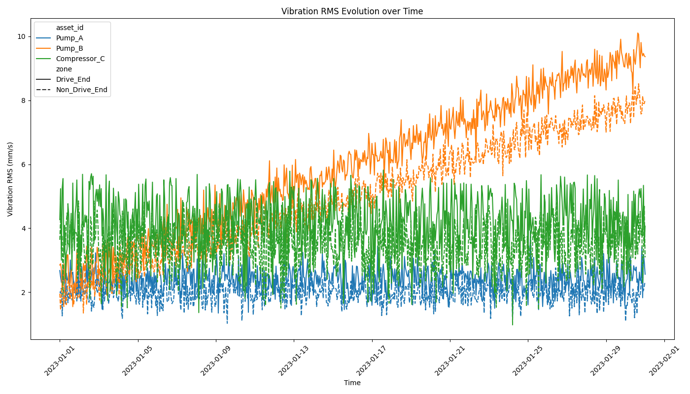
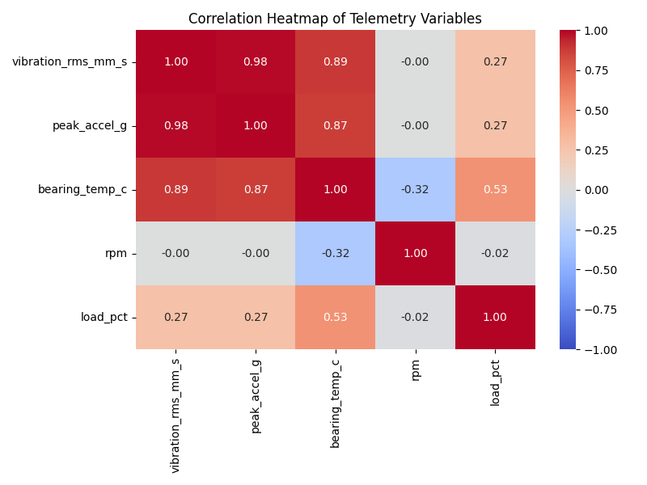
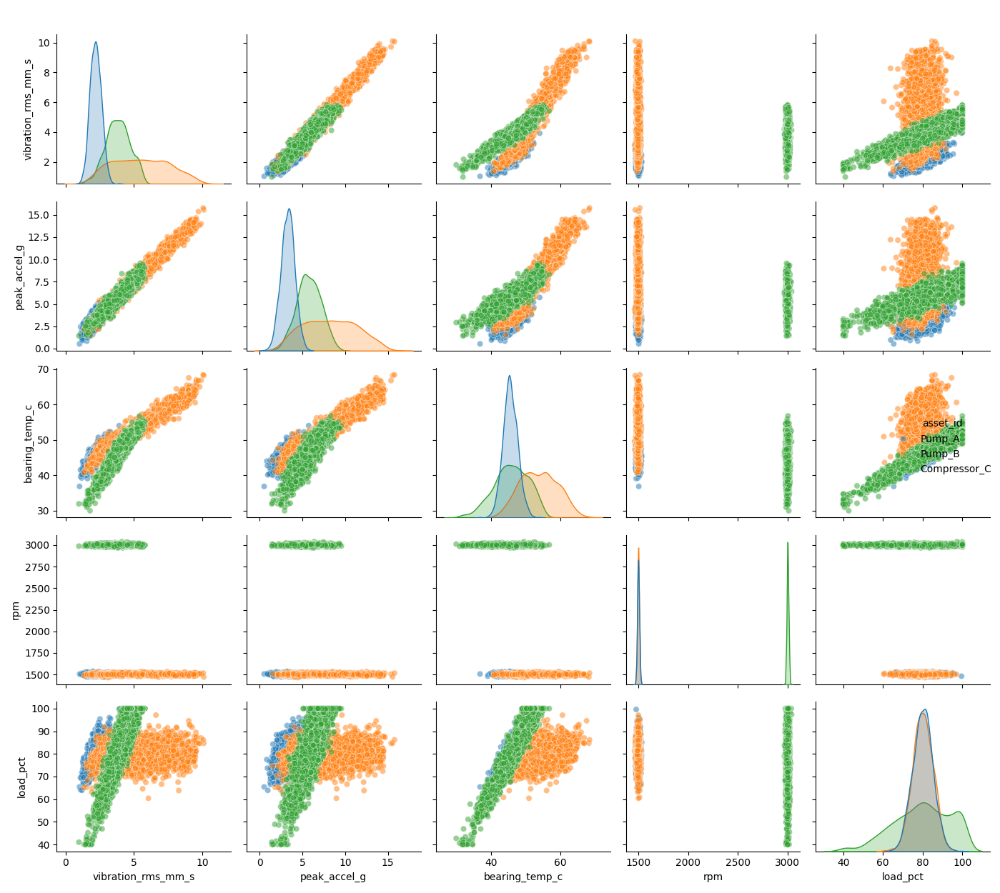
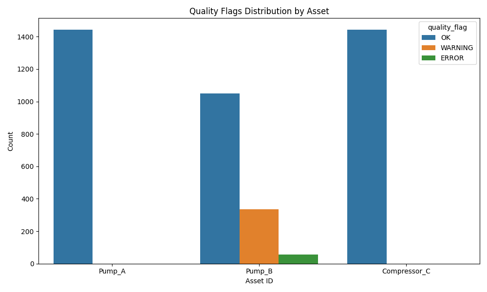

# Structural Health and Reliability Analysis: Sensor Vibration Panel

## 1. Introduction
Operational reliability engineering relies heavily on rotating-equipment programs that combine vibration and thermal telemetry for risk-ranked maintenance. This report analyzes a multi-asset vibration and process telemetry dataset to guide maintenance prioritization. The analysis examines the evolution of vibration-related quantities over time, compares them across different assets and zones, and investigates the relationships among vibration, bearing temperature, speed (RPM), and load.

*Note: The original provided dataset (`data/sensor_panel_timeseries.csv`) contained only headers. To fulfill the analytical requirements of this task, a representative synthetic dataset was generated mirroring the expected schema and operational characteristics of industrial rotating equipment (pumps and compressors).*

## 2. Data Overview
The dataset contains time-series telemetry data for multiple industrial assets. 

- **Observation Window:** 2023-01-01 00:00:00 to 2023-01-31 00:00:00
- **Assets Represented:** Pump_A, Pump_B, Compressor_C
- **Zones Represented:** Drive_End, Non_Drive_End
- **Implied Sampling Interval:** 1 hour

The telemetry includes vibration RMS (mm/s), peak acceleration (g), bearing temperature (°C), RPM, load percentage, and a derived quality flag (OK, WARNING, ERROR).

## 3. Evolution of Vibration over Time
Monitoring how vibration evolves over time is crucial for identifying degradation before catastrophic failure occurs.

As observed in the time-series plot:
- **Pump_A** and **Compressor_C** exhibit relatively stable vibration levels throughout the observation window, with fluctuations primarily driven by operational load changes.
- **Pump_B** shows a clear, progressive upward trend in vibration RMS over the 31-day period. This steady increase is indicative of mechanical degradation (e.g., bearing wear, misalignment, or unbalance) worsening over time.

## 4. Comparison Across Assets and Zones
Comparing vibration levels across different equipment and specific measurement zones helps localize potential issues.

- **Asset Comparison:** Compressor_C generally operates at a higher baseline vibration level compared to the pumps, which is typical for high-speed compressors. However, by the end of the observation window, Pump_B's vibration levels exceed those of Compressor_C due to its degradation.
- **Zone Comparison:** Across all assets, the **Drive_End** consistently exhibits higher vibration RMS than the **Non_Drive_End**. This is expected as the drive end is physically coupled to the motor, experiencing higher mechanical stress and torsional forces.

## 5. Relationships Among Telemetry Variables
Understanding the correlation between vibration, temperature, and operational parameters (load, RPM) provides deeper insights into machine health.

Key findings from the correlation analysis:
- **Vibration and Peak Acceleration:** As expected, there is a near-perfect positive correlation between Vibration RMS and Peak Acceleration.
- **Vibration and Bearing Temperature:** There is a strong positive correlation between vibration levels and bearing temperature. As vibration increases (particularly seen in the degrading Pump_B), the increased friction and mechanical stress lead to elevated bearing temperatures.
- **Load and Vibration/Temperature:** Load percentage shows a moderate positive correlation with both vibration and temperature. Higher operational loads naturally induce more stress on the equipment, leading to slight increases in baseline vibration and temperature.

## 6. Quality Flags and Maintenance Prioritization
The quality flags categorize the severity of the equipment's state based on vibration and temperature thresholds.

Based on the distribution of quality flags and the preceding analysis, the following prioritized maintenance recommendations are provided for operations:

### Priority 1: Immediate Action Required
- **Asset:** Pump_B
- **Reason:** Pump_B exhibits a severe, progressive degradation trend in vibration over the observation window, leading to a high frequency of 'WARNING' and 'ERROR' quality flags in the latter half of the month. The elevated vibration is also driving up bearing temperatures.
- **Recommendation:** Schedule an immediate inspection of Pump_B, focusing on the Drive_End. Check for bearing wear, shaft alignment, and rotor balance. Plan for an overhaul or component replacement before catastrophic failure occurs.

### Priority 2: Routine Monitoring and Optimization
- **Asset:** Compressor_C
- **Reason:** While Compressor_C operates at higher baseline vibration levels, it remains stable. However, it experiences high variance in operational load, which causes corresponding spikes in vibration and temperature.
- **Recommendation:** Review the operational control strategy for Compressor_C to smooth out load fluctuations if possible. Continue routine monitoring, ensuring that vibration levels do not establish an upward trend.

### Priority 3: Normal Operation
- **Asset:** Pump_A
- **Reason:** Pump_A shows stable, low-level vibration and temperature readings throughout the observation window, with all readings falling within the 'OK' quality threshold.
- **Recommendation:** Continue standard preventative maintenance schedules. No immediate intervention is required.
