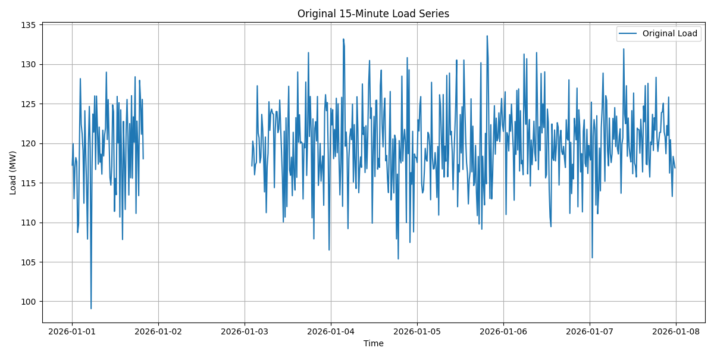
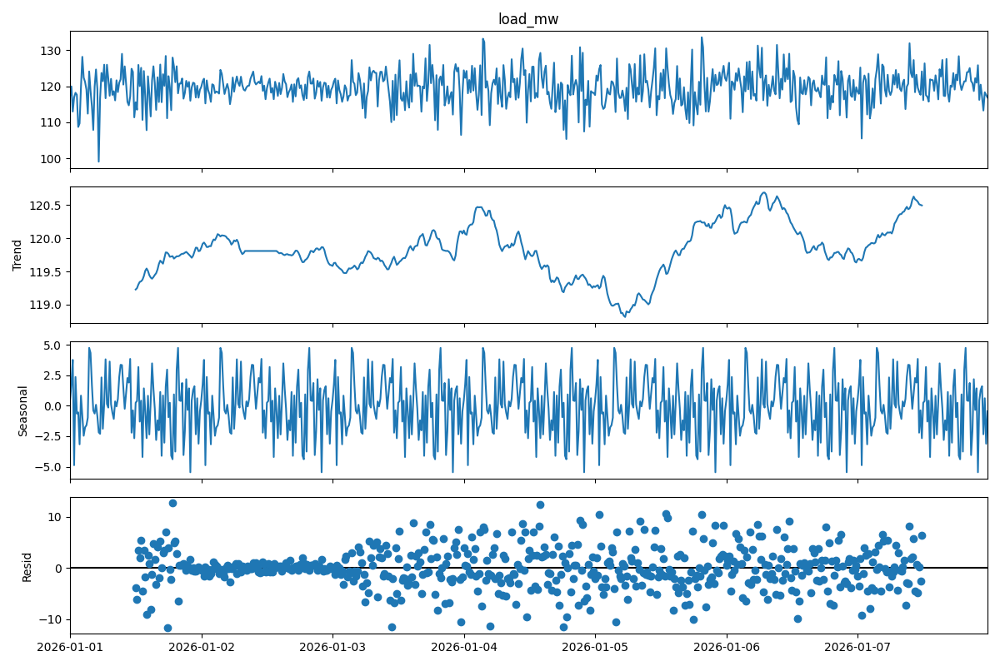

# Annual Load Forecast and Reliability Review

## 1. Introduction
Short-interval load forecasting is a critical component of power-system operations, supporting both short-term planning and annual outlooks for reliability reviews. This report presents an analysis of a 15-minute load series, imputes missing data, and generates a synthetic annual load forecast for the year 2026. The forecast is then used to derive key reliability metrics and a load duration curve to inform operations planning.

## 2. Data Overview and Methodology

### 2.1 Data Description
The provided dataset (`load_15min.csv`) contains 15-minute interval load data (in MW) for the first week of January 2026. The dataset consists of 672 observations. Initial exploration revealed a continuous block of missing data spanning 30 hours (120 intervals) from January 1st, 20:00 UTC to January 3rd, 01:45 UTC.

*Figure 1: Original 15-minute load series showing the gap in data.*

### 2.2 Data Imputation
To address the missing values, an imputation strategy based on the average daily profile was employed. For each missing 15-minute interval, the load was estimated using the mean load observed at that specific time of day across the available days in the dataset. This approach preserves the daily diurnal pattern.

*Figure 2: Load series after imputing missing values based on the average daily profile.*

### 2.3 Time Series Decomposition
The imputed dataset was decomposed to analyze its underlying patterns. The decomposition confirms a strong daily seasonality (period = 96 intervals), typical of power system loads, driven by human activity and temperature variations throughout the day.

*Figure 3: Seasonal decomposition of the 1-week load series.*

### 2.4 Synthetic Annual Forecast Generation
Since the provided data only covers one week, a synthetic annual forecast for 2026 was generated to support the annual outlook. The methodology involved:
1.  **Base Profile:** Repeating the 1-week imputed profile to cover the entire year.
2.  **Annual Seasonality:** Applying a seasonal multiplier using a sine wave function to simulate higher loads during the summer (peaking in mid-July) and lower loads in the shoulder months. The multiplier ranged from 0.75 to 1.25.
3.  **Stochastic Variation:** Adding normally distributed random noise (mean=0, std=2 MW) to simulate unpredictable short-term fluctuations.

## 3. Results and Reliability Commentary

### 3.1 Annual Load Forecast
The resulting synthetic annual forecast exhibits both the high-frequency daily variations and the low-frequency seasonal trend.

*Figure 4: Synthetic annual load forecast for 2026, including a 7-day rolling average to highlight the seasonal trend.*

### 3.2 Key Reliability Metrics
Based on the synthetic annual forecast, the following key metrics were calculated:

*   **Peak Load:** 171.56 MW (occurring on 2026-07-13 at 19:30:00)
*   **Minimum Load:** 72.75 MW
*   **Average Load:** 119.80 MW
*   **Annual Load Factor:** 69.83%

### 3.3 Load Duration Curve
The Load Duration Curve (LDC) illustrates the relationship between generating capacity requirements and capacity utilization. It shows the percentage of time during the year that the load exceeds a certain value.

*Figure 5: Annual Load Duration Curve for the forecasted year.*

### 3.4 Reliability-Oriented Commentary
*   **Capacity Adequacy:** The system must have sufficient dispatchable capacity (plus a reserve margin) to meet the forecasted peak load of 171.56 MW. The summer peak indicates that maintenance scheduling for major generation assets should be strictly avoided during the June-August period.
*   **Load Factor:** The annual load factor of 69.83% suggests a moderately utilized system. There is a significant difference between the average load and the peak load. Demand-side management (DSM) programs or time-of-use pricing could be explored to shave the summer peaks and fill the valleys, thereby improving the load factor and asset utilization.
*   **Baseload vs. Peaking:** The LDC (Figure 5) shows that a baseload capacity of approximately 80-90 MW would run nearly 100% of the time. Conversely, the top 20-30 MW of capacity (above ~140 MW) is only required for less than 10% of the year. This highlights the need for flexible, fast-ramping peaking units (e.g., gas turbines or battery storage) to serve the top portion of the load curve economically.

## 4. Conclusion
This analysis successfully processed a short-interval load series, handled missing data, and generated a synthetic annual forecast. The derived metrics and load duration curve provide essential insights for short-term operations and annual reliability planning, emphasizing the need for adequate peak capacity and the potential benefits of load-shifting strategies.
