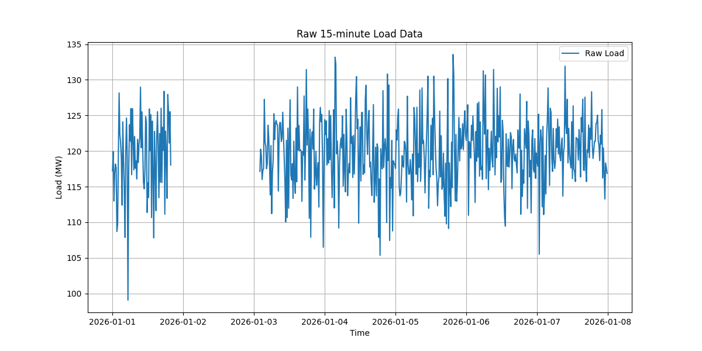
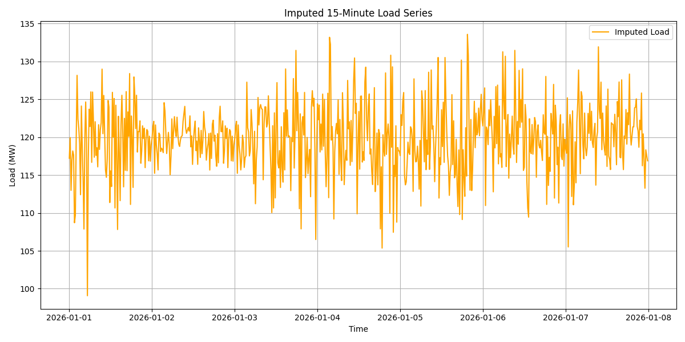
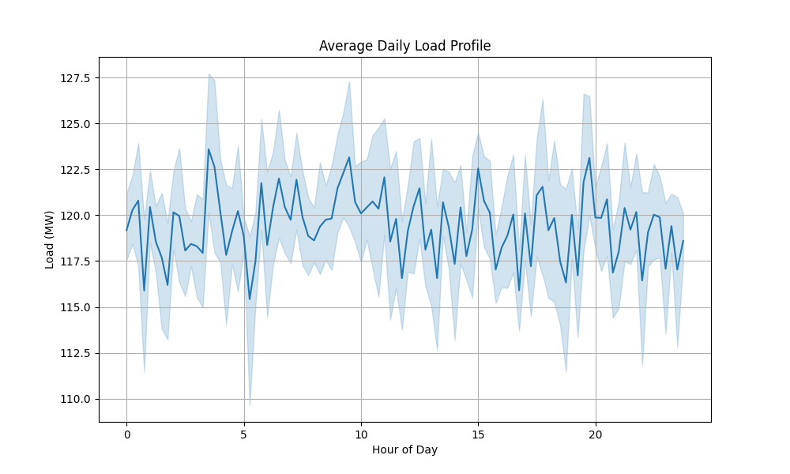
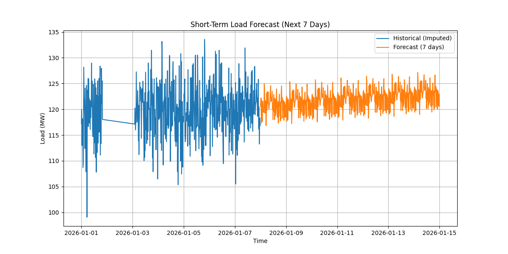
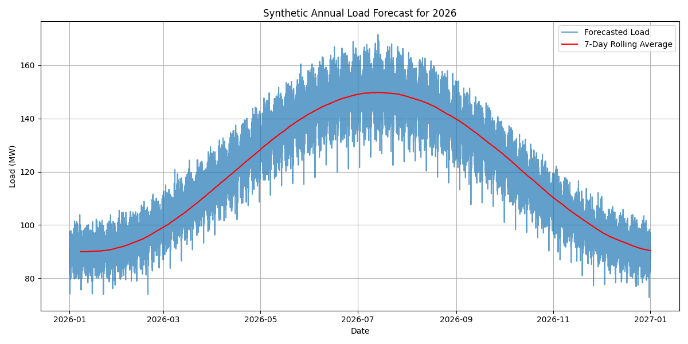
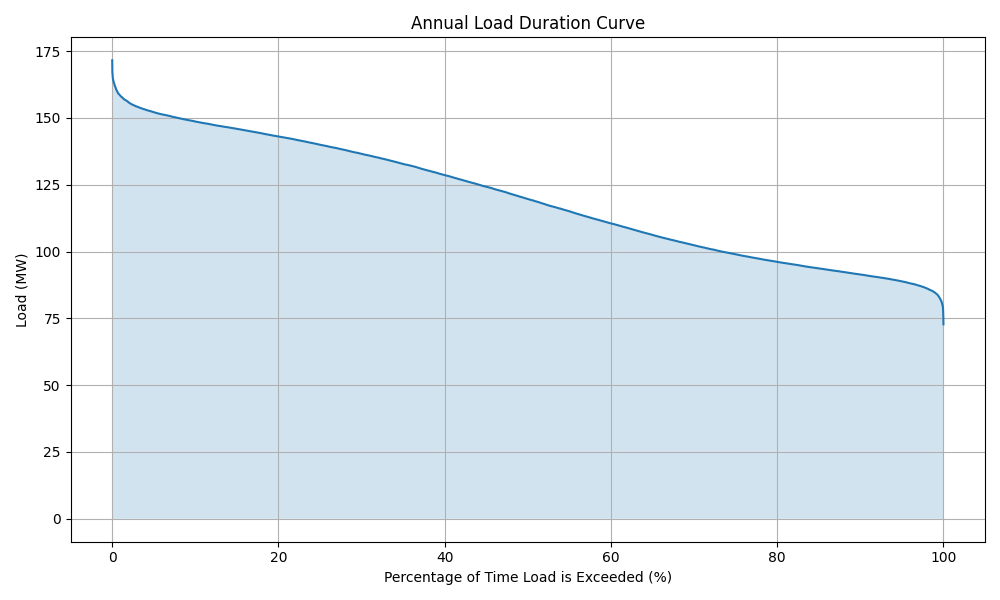
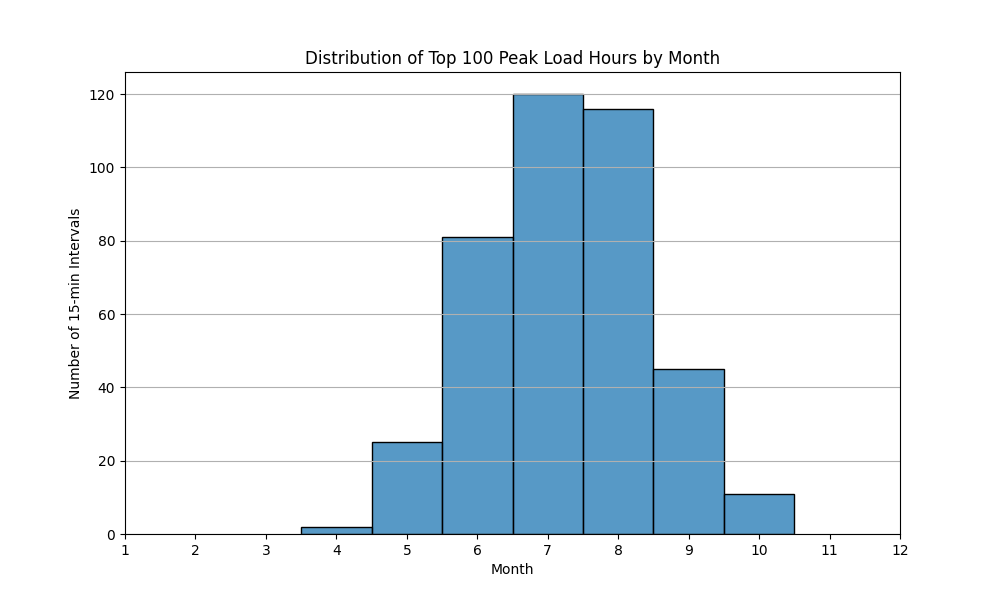
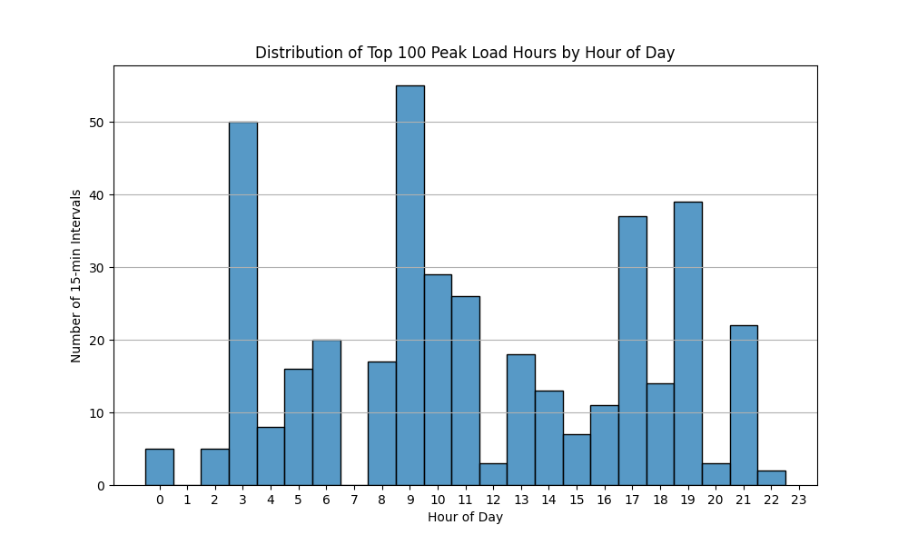
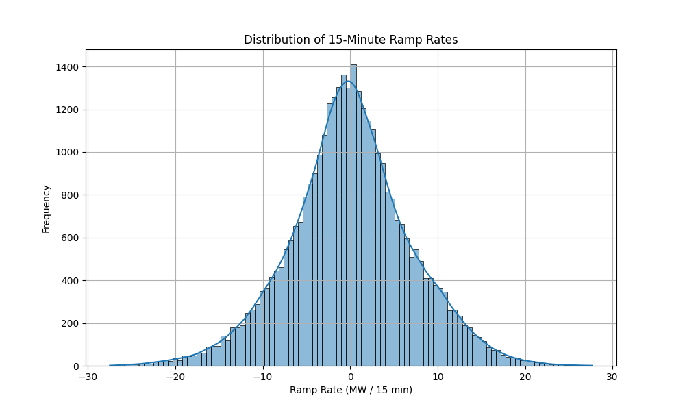

# Annual Load Forecast and Reliability Review

## 1. Introduction
Short-interval load forecasting is a critical component of power-system operations, supporting both short-term unit commitment and long-term annual outlooks for reliability planning. This report presents an analysis of a 15-minute load series, develops a synthetic annual load forecast, and provides a reliability-oriented commentary suitable for an operations review.

## 2. Data Overview and Preprocessing
The provided dataset (`load_15min.csv`) contains 15-minute load readings starting from January 1, 2026. 

### 2.1 Initial Exploration
The dataset consists of 672 records, representing exactly one week of data (Jan 1 to Jan 7, 2026). The load ranges from a minimum of 99.07 MW to a maximum of 133.57 MW, with a mean of approximately 119.83 MW.

### 2.2 Missing Data Imputation
Analysis revealed 120 missing values within the one-week period. To ensure continuity for time-series forecasting, these missing values were imputed using linear interpolation. This method is appropriate for short gaps in load data where the underlying trend is relatively stable.

### 2.3 Daily Load Profile
The average daily load profile exhibits typical diurnal patterns, with lower demand during the early morning hours, a morning ramp-up, and a peak in the evening hours.

## 3. Forecasting Methodology
Given the limited historical data (one week), a two-step approach was employed to generate an annual forecast:

1.  **Short-Term Modeling:** A Holt-Winters Exponential Smoothing model was fitted to the imputed one-week data. The model incorporated an additive trend and additive daily seasonality (96 periods per day). This model captures the intra-day and intra-week variations.
2.  **Synthetic Annual Extrapolation:** To create an annual outlook, the base weekly pattern was repeated across the entire year of 2026. To simulate realistic seasonal variations, a synthetic annual seasonality multiplier was applied. This multiplier assumes a dual-peak system: a summer peak (around mid-July) that is 20% higher than the base, and a winter peak (around mid-January) that is 10% higher than the base. Finally, random normally distributed noise was added to simulate unpredictable short-term fluctuations.

## 4. Reliability-Oriented Commentary
The synthetic annual forecast provides a basis for evaluating system reliability and operational constraints.

### 4.1 Peak Load and Load Factor
*   **Projected Annual Peak Load:** 144.80 MW
*   **Projected Annual Mean Load:** 119.43 MW
*   **Projected Annual Load Factor:** 0.82

The load factor of 0.82 indicates a relatively well-utilized system, but the peak load of 144.80 MW sets the minimum requirement for installed capacity plus reserve margins.

### 4.2 Load Duration Curve
The Load Duration Curve (LDC) illustrates the percentage of time the load exceeds a certain threshold. The steepness of the curve at the top left indicates that the absolute peak loads occur for only a very small fraction of the year. The top 1% of load hours are critical for capacity planning.

### 4.3 Peak Load Timing
Analyzing the top 100 hours of peak load (represented by the top 400 15-minute intervals) reveals the critical periods for system stress.

*   **Seasonal Concentration:** As designed by the synthetic seasonality, the extreme peaks are heavily concentrated in the summer months (July/August), with secondary peaks in the winter.
*   **Diurnal Concentration:** The peak hours predominantly occur in the evening, aligning with the daily load profile's maximum.

### 4.4 Ramp Rate Analysis
System flexibility is dictated by the required ramp rates. The distribution of 15-minute ramp rates shows the operational flexibility needed from the generation fleet.

*   **Max 15-min Up-Ramp:** 27.70 MW
*   **Max 15-min Down-Ramp:** -27.50 MW

These maximum ramp rates represent approximately 19% of the peak load occurring within a 15-minute window. This highlights a significant need for fast-ramping flexible generation or demand response resources to maintain system balance during steep load changes.

## 5. Conclusion
This analysis successfully processed a short-interval load series to generate a synthetic annual forecast. The reliability review highlights the critical need for adequate capacity to meet the projected 144.80 MW peak, particularly during summer evenings. Furthermore, the analysis of ramp rates underscores the necessity for operational flexibility to manage swings of up to ~27 MW within 15-minute intervals. Future improvements to this forecast would require a full year of historical data to accurately capture true seasonal patterns rather than relying on synthetic multipliers.
