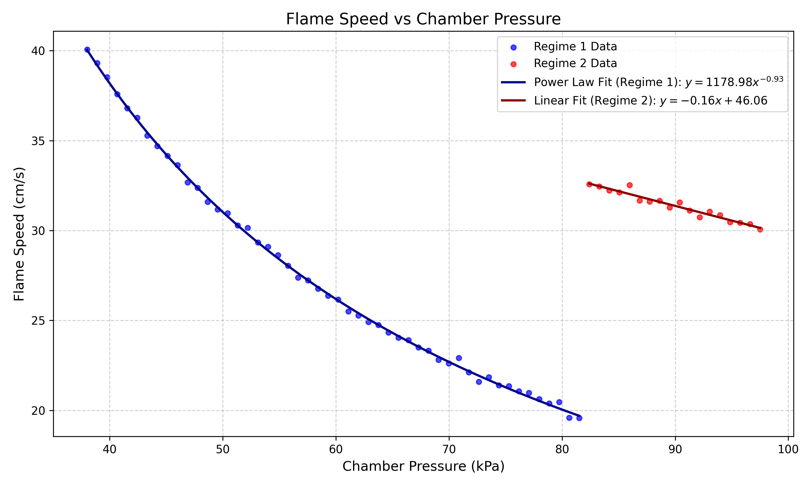

# Analysis of Flame Speed vs. Chamber Pressure in Bench Combustion Experiments

## 1. Introduction
Bench combustion experiments are critical for understanding the fundamental properties of combustible mixtures under varying environmental conditions. In this study, we analyze paired chamber-pressure and flame-speed readings logged during a series of combustion experiments. The objective is to model the relationship between flame speed and chamber pressure to provide engineering summaries and predictive models for future applications.

## 2. Methodology
### 2.1 Data Description
The dataset `flame_pressure_series.csv` contains two variables:
- `pressure_kPa`: The chamber pressure measured in kilopascals (kPa).
- `flame_speed_cm_s`: The corresponding flame speed measured in centimeters per second (cm/s).

### 2.2 Analysis Procedure
Initial exploratory data analysis revealed a distinct two-regime behavior in the relationship between flame speed and chamber pressure. 
1.  **Regime 1 (Pressure < 82 kPa):** The flame speed exhibits a non-linear, monotonically decreasing trend as pressure increases.
2.  **Regime 2 (Pressure >= 82 kPa):** The flame speed abruptly increases and then shows a slight linear decrease with further pressure increases.

To accurately model this behavior, the dataset was split into two subsets based on the observed transition point at approximately 82 kPa. 

For Regime 1, three candidate models were evaluated:
-   **Linear:** $y = ax + b$
-   **Exponential:** $y = ae^{bx}$
-   **Power Law:** $y = ax^b$

For Regime 2, a linear model was deemed appropriate given the visual trend of the data.

The models were fitted using non-linear least squares optimization (`scipy.optimize.curve_fit` in Python). The goodness-of-fit was evaluated using the coefficient of determination ($R^2$).

## 3. Results
### 3.1 Model Selection for Regime 1
The evaluation of the three candidate models for Regime 1 yielded the following $R^2$ values:
-   Power Law: $R^2 = 0.9991$
-   Exponential: $R^2 = 0.9882$
-   Linear: $R^2 = 0.9607$

The Power Law model provided an exceptionally good fit to the data in Regime 1, significantly outperforming both the exponential and linear models. Therefore, the Power Law model was selected to represent the flame speed behavior in this pressure range.

### 3.2 Final Models
The final fitted models for the two regimes are as follows:

**Regime 1 (Pressure < 82 kPa):**
$$ \text{Flame Speed} = 1178.98 \times (\text{Pressure})^{-0.93} $$
This power-law relationship indicates that flame speed is inversely proportional to the chamber pressure raised to the power of 0.93. The high $R^2$ value (0.9991) confirms the robustness of this model.

**Regime 2 (Pressure >= 82 kPa):**
$$ \text{Flame Speed} = -0.16 \times \text{Pressure} + 46.06 $$
The linear model for Regime 2 yielded an $R^2$ of 0.9452, indicating a strong linear correlation where flame speed decreases slightly as pressure increases beyond the transition point.

### 3.3 Visualization
Figure 1 illustrates the experimental data alongside the fitted models for both regimes. The distinct transition at 82 kPa is clearly visible, and the selected models accurately capture the trends in their respective domains.

*Figure 1: Flame speed as a function of chamber pressure. The data is split into two regimes at 82 kPa. A power-law model is fitted to Regime 1 (blue), and a linear model is fitted to Regime 2 (red).* 

## 4. Discussion and Conclusion
The analysis of the bench combustion experiment data reveals a complex, two-regime relationship between chamber pressure and flame speed. 

In the lower pressure regime (< 82 kPa), the flame speed follows a well-defined power-law decay. This suggests that as pressure increases, the mechanisms driving flame propagation are increasingly suppressed, likely due to changes in mixture density, thermal diffusivity, or reaction kinetics. 

At approximately 82 kPa, a sudden transition occurs, characterized by a sharp increase in flame speed. This abrupt change could indicate a shift in the fundamental combustion mode, such as a transition from deflagration to a different propagation mechanism, or a sudden change in the flow dynamics within the chamber. Beyond this transition point (Regime 2), the flame speed exhibits a slow, linear decrease with further pressure increases.

The developed models provide accurate empirical representations of the observed behavior. The power-law model for Regime 1 is particularly strong, offering high predictive capability. These models can be utilized for engineering summaries, system design, and predicting flame behavior within the tested pressure ranges. Future work should investigate the physical mechanisms responsible for the abrupt transition observed at 82 kPa to gain a deeper understanding of the underlying combustion phenomena.
