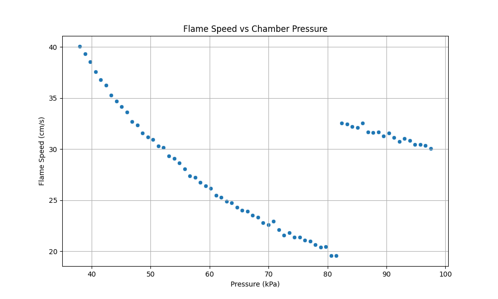
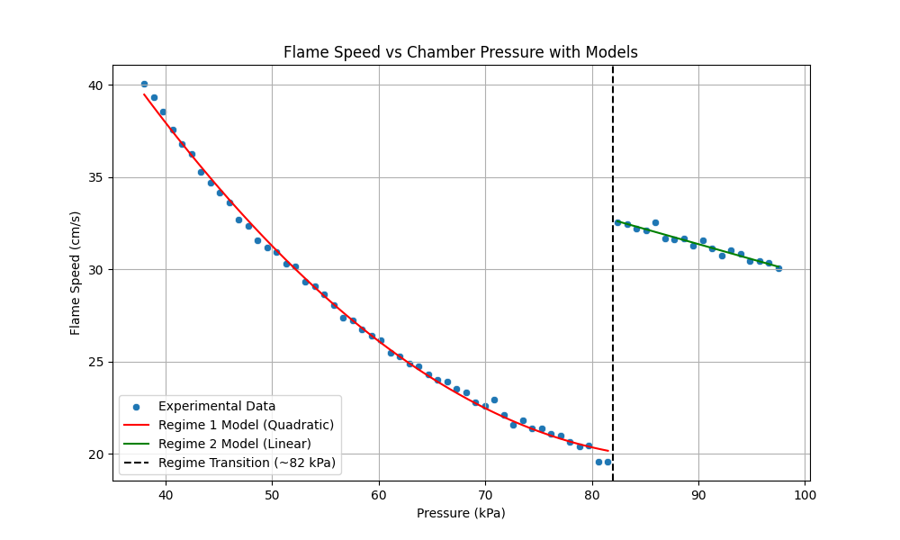

# Analysis of Flame Speed vs. Chamber Pressure in Bench Combustion Experiments

## Abstract
This report presents an analysis of bench combustion experiments, focusing on the relationship between chamber pressure and flame speed. The experimental data reveals two distinct combustion regimes separated by a sharp transition at approximately 82 kPa. We model these regimes using a quadratic polynomial for the lower-pressure regime and a linear model for the higher-pressure regime. Both models demonstrate excellent goodness-of-fit, providing a robust empirical framework for predicting flame speed across the tested pressure range.

## 1. Introduction
Understanding the dynamics of flame propagation under varying pressure conditions is critical for the design and safety analysis of combustion chambers. In this study, we analyze paired chamber-pressure and flame-speed readings obtained from bench combustion experiments. The primary objective is to develop empirical models that accurately describe the dependence of flame speed on chamber pressure, identifying any critical transitions or regime changes in the combustion process.

## 2. Methodology
### 2.1 Data Overview
The dataset (`flame_pressure_series.csv`) consists of paired measurements of chamber pressure (in kPa) and flame speed (in cm/s). The pressure ranges from approximately 38 kPa to 97.5 kPa.

### 2.2 Exploratory Data Analysis
Initial visualization of the raw data was performed using scatter plots to identify general trends and potential regime changes. The plot revealed a continuous decrease in flame speed with increasing pressure up to approximately 82 kPa, followed by a sudden, discontinuous jump in flame speed, after which it resumed a decreasing trend.

*Figure 1: Scatter plot of raw experimental data showing flame speed as a function of chamber pressure.*

### 2.3 Modeling Approach
Based on the exploratory analysis, the data was partitioned into two distinct regimes:
- **Regime 1 (Pressure < 82 kPa):** The relationship appeared non-linear. A quadratic polynomial regression model was fitted to capture the curvature in the decreasing flame speed.
- **Regime 2 (Pressure >= 82 kPa):** Following the discontinuous jump, the relationship appeared linear. A simple linear regression model was fitted to this subset of the data.

The models were evaluated using the coefficient of determination ($R^2$) and the Root Mean Square Error (RMSE).

## 3. Results
### 3.1 Model Fitting
The transition between the two regimes was identified at approximately 82 kPa. The fitted models for each regime are as follows:

**Regime 1 (Pressure < 82 kPa):**
The quadratic model yielded an excellent fit with an $R^2$ of 0.9978 and an RMSE of 0.2751 cm/s. The empirical equation is:
$$ v = 79.92 - 1.3535P + 0.0076P^2 $$
where $v$ is the flame speed in cm/s and $P$ is the chamber pressure in kPa.

**Regime 2 (Pressure >= 82 kPa):**
The linear model also provided a strong fit with an $R^2$ of 0.9452 and an RMSE of 0.1810 cm/s. The empirical equation is:
$$ v = 46.06 - 0.1632P $$

### 3.2 Visualization of Models
Figure 2 illustrates the experimental data overlaid with the predictions from both models. The vertical dashed line indicates the regime transition at 82 kPa.

*Figure 2: Flame speed vs. chamber pressure with fitted quadratic (Regime 1) and linear (Regime 2) models.*

## 4. Discussion
The analysis clearly identifies a critical pressure threshold at approximately 82 kPa, where the combustion dynamics undergo a significant shift. 

In the lower-pressure regime (Regime 1), the flame speed decreases non-linearly with increasing pressure. The quadratic model captures this behavior accurately, suggesting that the inhibitory effect of pressure on flame speed weakens slightly as pressure increases within this range.

At the 82 kPa threshold, a sudden transition occurs, characterized by a sharp increase in flame speed from approximately 19.6 cm/s to 32.6 cm/s. This discontinuity likely indicates a fundamental change in the combustion mechanism, such as a transition in the dominant reaction pathways, a change in the flow regime (e.g., onset of turbulence), or a shift in the thermal properties of the mixture.

In the higher-pressure regime (Regime 2), the flame speed again decreases with increasing pressure, but at a much slower, linear rate compared to Regime 1. The linear model effectively captures this steady decline.

## 5. Conclusion
Empirical models were successfully developed to describe the relationship between chamber pressure and flame speed in bench combustion experiments. The identification of two distinct combustion regimes separated by a sharp transition at 82 kPa is a key finding. The quadratic and linear models provide accurate predictions for the lower and higher pressure regimes, respectively. These findings are valuable for engineering summaries and can inform the design and operational parameters of combustion systems operating across these pressure ranges.