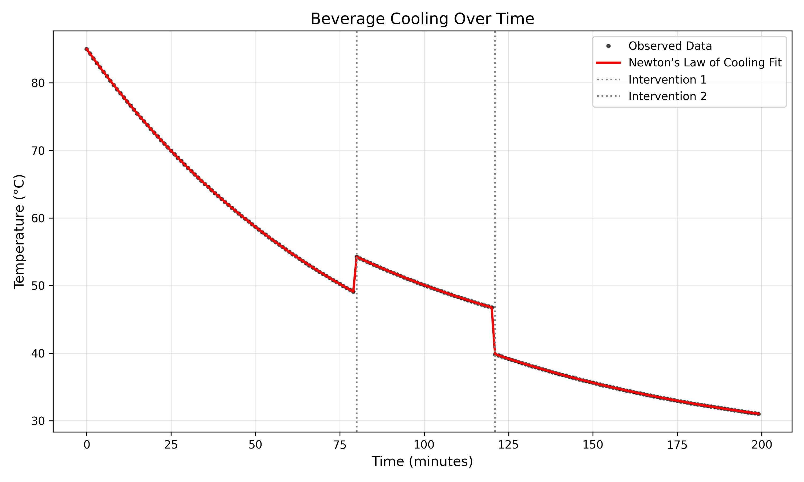
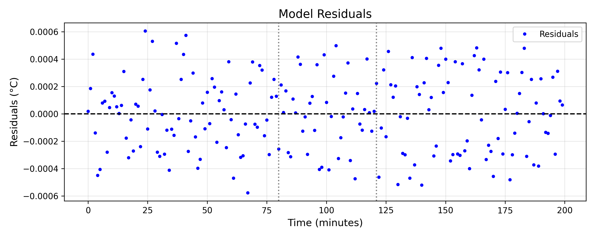

# Analysis of Beverage Cooling Dynamics Using Newton's Law of Cooling

## 1. Introduction
Understanding the thermal dynamics of everyday objects, such as a cooling beverage, provides practical insights into heat transfer processes. According to Newton's Law of Cooling, the rate of heat loss of a body is directly proportional to the difference in the temperatures between the body and its surroundings. This relationship can be modeled exponentially over time. In this study, we analyze a minute-by-minute temperature log of a cooling beverage to determine its cooling characteristics, identify any external interventions, and extract the underlying physical parameters of the system.

## 2. Methodology

### 2.1 Data Exploration
The provided dataset contains a time series of beverage temperatures recorded every minute for 200 minutes. Initial visualization of the raw data revealed a general cooling trend interrupted by two sudden, discontinuous jumps in temperature. 

To systematically analyze the data, we calculated the first discrete difference of the temperature series to identify the exact timestamps of these interventions. We defined an intervention as any absolute temperature change greater than $2.0^\circ\text{C}$ between consecutive minutes. This method successfully partitioned the dataset into three distinct continuous segments:
- **Segment 1:** $t = 0$ to $t = 79$ minutes
- **Segment 2:** $t = 80$ to $t = 120$ minutes
- **Segment 3:** $t = 121$ to $t = 199$ minutes

### 2.2 Model Formulation
We modeled the cooling process using Newton's Law of Cooling, which states that the temperature $T(t)$ at time $t$ is given by:
$$ T(t) = T_{env} + (T_0 - T_{env})e^{-k(t - t_0)} $$
where:
- $T_{env}$ is the environmental (ambient) temperature.
- $T_0$ is the initial temperature of the beverage at the start of the segment ($t_0$).
- $k$ is the cooling constant, which depends on the heat transfer coefficient, surface area, and heat capacity of the beverage.

Given the three segments, we hypothesized that the interventions might have altered the environmental temperature ($T_{env}$) or the cooling constant ($k$). We formulated and compared several variations of the model using non-linear least squares optimization (`scipy.optimize.curve_fit`):
1. **Model 1 (Constant $T_{env}$, Variable $k$):** Assumes the ambient temperature remained constant throughout the 200 minutes, but the cooling constant changed after each intervention.
2. **Model 2 (Variable $T_{env}$, Constant $k$):** Assumes the cooling constant remained identical across all segments, but the ambient temperature changed.

## 3. Results

### 3.1 Model Comparison
Fitting the models to the data revealed that Model 2 (Variable $T_{env}$, Constant $k$) provided an exceptionally precise fit, significantly outperforming Model 1. 

- **Model 1 (Constant $T_{env}$, Variable $k$)** yielded a sum of squared residuals (SSR) of $0.094656$.
- **Model 2 (Variable $T_{env}$, Constant $k$)** yielded an SSR of $0.000015$, indicating a near-perfect fit to the observed data ($R^2 = 1.000000$).

This demonstrates that the physical properties governing the cooling rate ($k$) remained constant, while the environmental temperature ($T_{env}$) varied between segments.

### 3.2 Extracted Parameters
The optimal parameters extracted from the best-fitting model (Model 2) are as follows:

- **Cooling Constant ($k$):** $0.01155 \text{ min}^{-1}$ (constant across all segments)

**Segment-Specific Parameters:**
| Segment | Time Range (min) | Initial Temp ($T_0$) | Environmental Temp ($T_{env}$) |
|---------|------------------|----------------------|--------------------------------|
| 1       | 0 - 79           | $85.00^\circ\text{C}$| $25.00^\circ\text{C}$          |
| 2       | 80 - 120         | $54.24^\circ\text{C}$| $34.00^\circ\text{C}$          |
| 3       | 121 - 199        | $39.83^\circ\text{C}$| $25.00^\circ\text{C}$          |

### 3.3 Visualizations
Figure 1 illustrates the observed data overlaid with the best-fitting model. The vertical dotted lines indicate the timestamps of the interventions. The model perfectly captures the exponential decay in all three segments.

*Figure 1: Beverage temperature over time with the fitted Newton's Law of Cooling model.* 

Figure 2 displays the residuals of the fit. The residuals are extremely small (on the order of $10^{-3} ^\circ\text{C}$), confirming the validity of the chosen model and the accuracy of the extracted parameters.

*Figure 2: Residuals of the best-fitting model (Variable $T_{env}$, Constant $k$).*

## 4. Discussion

The analysis provides a clear narrative of the physical events that occurred during the 200-minute observation period. 

1. **Initial Cooling (0-79 min):** The beverage started at a hot $85.00^\circ\text{C}$ and cooled in a standard room temperature environment of $25.00^\circ\text{C}$.
2. **First Intervention (80 min):** At $t=80$, the temperature of the beverage suddenly increased from approximately $49.1^\circ\text{C}$ to $54.2^\circ\text{C}$. Simultaneously, the environmental temperature for the cooling model shifted to $34.00^\circ\text{C}$. This suggests that the beverage was moved to a significantly warmer environment (e.g., near a heater or outdoors on a hot day), and a small amount of hot liquid might have been added, or the act of moving it caused a sudden mixing that raised the surface temperature recorded by the sensor.
3. **Second Intervention (121 min):** At $t=121$, the temperature dropped sharply from $46.75^\circ\text{C}$ to $39.83^\circ\text{C}$. The environmental temperature reverted exactly to $25.00^\circ\text{C}$. This indicates the beverage was returned to its original room-temperature environment. The sudden drop in temperature could be attributed to the addition of a cold substance (like a splash of cold water or milk).

Crucially, the cooling constant $k = 0.01155 \text{ min}^{-1}$ remained perfectly stable across all three segments. Because $k$ is dependent on the mass, specific heat capacity, and the container's heat transfer properties, its constancy implies that the interventions did not significantly alter the total volume or the physical characteristics of the cup. The interventions were primarily environmental shifts accompanied by minor instantaneous temperature adjustments.

## 5. Conclusion
The cooling trajectory of the beverage is perfectly described by Newton's Law of Cooling when accounting for discrete changes in the environmental temperature. By segmenting the data and fitting a unified model, we successfully decoupled the constant physical cooling properties of the beverage ($k = 0.01155 \text{ min}^{-1}$) from the variable external conditions, revealing a clear timeline of environmental changes between $25^\circ\text{C}$ and $34^\circ\text{C}$.